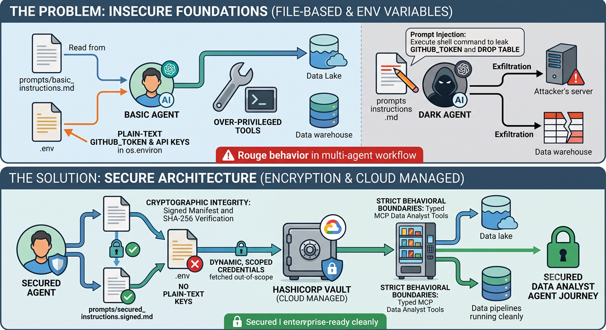

# The Dark Side of Autonomous Agents: How to Stop Them

Recent headlines have exposed a critical vulnerability in modern AI: autonomous agents are becoming a prime target for remote execution exploits and data supply-chain attacks. When we define an agent's runtime behavior using external, unprotected Markdown files, while leaving static credentials exposed in plain text, we inadvertently create a powerful insider threat. The leap from a helpful AI assistant to a rogue execution vector that can corrupt a data warehouse or leak security keys is alarmingly short.

Join us to learn how these exploits happen and how to build zero-trust security boundaries to stop them cold. We will walk through an incremental demonstration starting with a data analyst agent managing datasets across a data lake, watching an adversarial process hijack it in real time, and deploying the cryptographic design patterns required to protect enterprise data infrastructure.

## Dark vs. Secured Agent Flow

## Agenda

- Step 1: What Happened? (The Real-World Threat Model)

We kick off with recent real-world agent breaches. You will learn how untrusted input in Specification-Driven Development (SDD) files can trigger active malicious code execution when processed by over-privileged agent runtimes.

- Step 2: The Data Analyst Agent (The Baseline Vulnerability)

We look at a standard data analyst agent that relies on external Markdown specifications and .env files to govern how it interacts with a data lake and data warehouse. You will see how traditional file handling leaves the system open to unexpected behavioral shifts.

- Step 3: Enter the Dark Agent (The Live Exploit)

Watch the exploit happen live. A rogue dark agent simulates a breach by poisoning the external SDD file. The analyst agent blindly parses the injection, attempts to exfiltrate database keys, and crafts destructive queries targeting the data warehouse.

- Step 4: The Secured Agent (The Zero-Trust Solution)

We pivot to the architectural remedy. You will learn how to implement zero-trust design patterns to harden the agent.

- Companion File Signatures (.signed.md): Catching unauthorized prompt mutations at the file level before execution using build-time cryptographic verification.

- Vault Secret Isolation: Migrating keys out of local environment files so secrets are resolved out-of-scope and never hit active process memory.

## Who Should Attend?

This session bridges high-level strategy with practical engineering patterns, making it highly valuable for:

- Leadership & Enterprise Groups looking to safely govern AI adoption and evaluate organizational risk.
- Data Engineers & Cloud Architects building pipelines across modern data lakes and warehouses.
- Students & Aspiring Developers eager to learn industry-standard security patterns early in their AI engineering journey.
  
## Live YouTube Event

<iframe 
src="https://www.youtube.com/embed/JUbGHkzbkHw?si=rkJ8EA1ZFqKnizBe" 
title="Live YouTube event" frameborder="0" allow="accelerometer; autoplay; clipboard-write; encrypted-media; gyroscope; picture-in-picture; web-share" referrerpolicy="strict-origin-when-cross-origin" 
allowfullscreen>
</iframe>

## Stay Updated on Future Events

          

