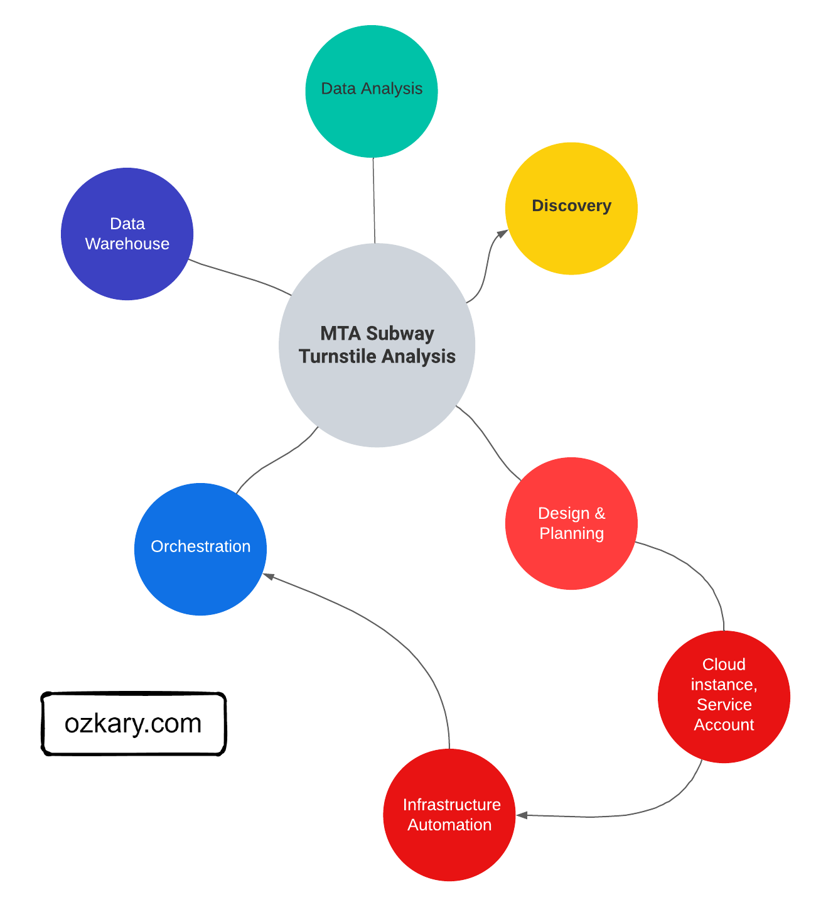
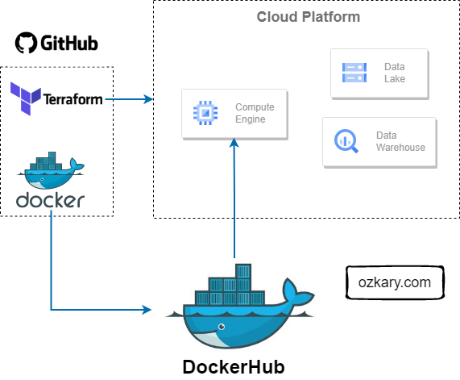

Now that we have completed the discovery step and the scope of work on a project is clearly defined, we move on to the design and planning step. The design and planning phase of a data engineering project is crucial for laying the foundation of a successful system. It involves defining the system architecture, designing data pipelines, implementing source control practices, ensuring continuous integration and deployment (CI/CD), and leveraging tools like Docker and Terraform for infrastructure automation.

### Data Engineering Design

A data engineering design is the actual plan to build the technical solution. It includes the system architecture, data integration, flow and pipeline orchestration, the data storage platform, transformation and management, data processing and analytics tooling. This is the area where we need to clearly define the different technologies that should be used for each area. 

#### System Architecture

The system architecture is a high-level design of the solution, its components and how they integrate with each other. This often includes the data sources, data ingestion resources, workflow and data orchestration resources and frameworks, storage resources, data services for data transformation and continuous data ingestion and validation, and data analysis and visualization tooling.

#### Data Pipelines 

A data pipeline refers to a series of connected tasks that handles the extract, transform and load (ETL) as well as the extract, load and transform (ELT)  operations and integration from a source to a target storage like a data lake or data warehouse. Properly designed pipelines ensure data integrity, quality, and consistency throughout the system.

The use of ETL or ELT depends on the design. For some solutions, a flow task may transform the data prior to loading it into storage. This approach tends to increase the amount of python code and hardware resources used by the hosting environment. For the ELT process, the transformation may be done using SQL code and the data warehouse resources, which often tend to perform great for big data scenarios.

#### Data Orchestration

Data orchestration refers to the automation, management and coordination of the data pipeline tasks. It involves the scheduling, workflows, monitoring and recovery of those tasks. The orchestration ensures the execution of those tasks, and it takes care of error handling, retry and the alerting of problems in the pipeline.

### Source Control and Deployment

Source control is an essential practice for managing code and configuration files. Utilizing version control systems allows teams to collaborate effectively, track changes, and revert to previous states if necessary. It is important to properly define the tooling that should be used for source control and deployments automation. The area of source code should include the Python code, Terraform, Docker configuration as well as any deployment automation scripts.

#### Source Control

Client side source control systems such as Git help in tracking and maintaining the source code for our projects. Cloud side systems such as GitHub should be used to enable the team to push their code and configuration changes to a remote repository, so it can be shared with other team members.

#### Continuous Integration and Continuous Delivery (CI/CD)

 A remote code repository like GitHub also provides deployment automation pipelines that enable us to push changes to other environments for testing and finally production releases.  

Continuous Integration (CI) is the practice to continuously integrate the code changes into the central repository, so it can be built and tested to validate the latest change and provide feedback in case of problems. Continuous Deployment (CD) is the practice to automate the deployment of the latest code builds to other environments like staging and production.

#### Docker Containers and Docker Hub

When deploying a new build, we need to also deploy the environment dependencies to avoid any run-time errors. Docker containers enable us to automate the management of the application by creating a self-contained environment with the build and its dependencies. A data pipeline can be built and imported into a container image, which should contain everything needed for the pipeline to reliably execute.

Docker Hub is a container registry which allows us to push our pipeline images into a cloud repository. The goal is to provide the ability to download those images from the repository as part of the new environment provisioning process.

#### Terraform for Cloud Infrastructure

Terraform is an Infrastructure as Code (IaC) tool that enables us to manage cloud resources across multiple cloud providers. By creating resource definition scripts and tracking them under version control, we can automate the creation, modification and deletion of resources. Terraform tracks the state of the infrastructure, so when changes are made, they can be applied to the environments as part of a CI/CD process. 

## Data Analysis and Visualization Tools

The selection of an analytical and visualization tool is very important in any data engineering projects. These tools like Looker, Power Builder among others enable business to gain insights from their data by visualizing the information on easy to read dashboards. By selecting the right tool for the job, organizations can transform complex data into actionable insights, empowering users across the business to uncover valuable information and drive strategic outcomes.

## Summary

The design and planning phase of a data engineering project sets the stage for success. From designing the system architecture and data pipelines to implementing source control, CI/CD, Docker, and infrastructure automation with Terraform, every aspect contributes to efficient and reliable deployment. Infrastructure automation, in particular, plays a critical role by simplifying provisioning, ensuring consistency, and enabling scalability, ultimately leading to a robust and manageable data engineering system. 

## Exercise - Infrastructure Planning and Automation

Now that we have laid a design foundation, we should dive into a hands-on exercise to build the infrastructure where we can host our solution.

> 👉 [Data Engineering Process Fundamentals - Design and Planning Exercise](//www.ozkary.dev/data-engineering-process-fundamentals- Design-Planning-exercise)

Thanks for reading.

Send question or comment at Twitter @ozkary

👍 Originally published by [ozkary.com](https://www.ozkary.com)