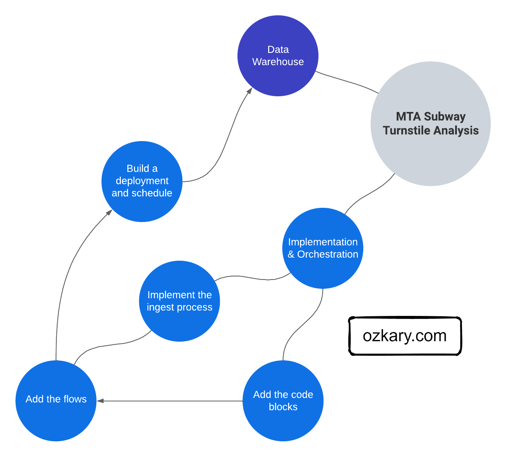

Once we have gained an understanding of data pipelines and their orchestration, along with the various programming options and technical tools at our disposal, we can proceed with the implementation and configuration of our own data pipeline. We have the flexibility to adopt either a code-centric approach, leveraging languages like Python, or a low-code approach, utilizing tools such as Azure Data Factory. This allows us to evaluate and compare the effectiveness of each approach based on our team's expertise and the operational responsibilities involved. Before diving into the implementation, let's first review our pipeline process to ensure a clear roadmap for our journey ahead.

## Data Flow Process


Our basic data flow can be defined as the following:

- Perform an HTTP Get request to download the CSV file for the selected week
- Compress the text file and upload in chunks to the data lake container

After the file is copied to our data lake, the data transformation service picks up the file, identifies new data and inserts into the Data Warehouse. We will take a look at the process on the Data WareHouse and Transformation services. 

> 👉 Since a new file is available weekly, This data integration project fits into the batch processing model. For real-time scenarios, we should use a data streaming technologies like [Apache Kafka](https://kafka.apache.org/) with [Apache Spark](https://spark.apache.org/) 


### Initial Data Load

When there are requirements to load previous data, we need to first run a batch process to load all the previous months of data. Moving forward, the process will target a specific date for when the file becomes available. The process will not allow for the download of future data files, so an attempt to pass future dates will not be allowed.```

### Weekly Automation

Since the files are available on a weekly basis, we use a batch processing approach to process those files. For that, we create a scheduled job on our automation tool. This trigger should run on the day that the file is available, so a dynamic parameter can be created based on the current date value. The code can then parse this date and resolve the file name format to download the corresponding file.

### Monitor the jobs

It is very important to be able to monitor and create alerts in case there are failures. This should allow the teams to identify and address the problems quickly. Therefore, it is important that we select a code-centric framework of a platform that provides integrated monitor and alert system.

## Programming Language and Tooling

A code-centric data pipeline refers to a high coding effort using a programming language, supporting libraries and cloud platform that can enable us to quickly implement our pipelines and collect telemetry to monitor our jobs. In our case, Python provides a versatile and powerful programming language for building data pipelines, with various frameworks available to streamline the process. Three popular options for Python-based data pipelines are Prefect, Apache Airflow, and Apache Spark. 

- [Apache Airflow](https://airflow.apache.org/), on the other hand, is a robust platform for creating, scheduling, and monitoring complex workflows. It uses Directed Acyclic Graphs (DAGs) to define pipelines and supports a rich set of operators for different data processing tasks.

- [Apache Spark](https://spark.apache.org/) is a distributed data processing engine that provides high-speed data processing capabilities. It supports complex transformations, real-time streaming, and advanced analytics, making it suitable for large-scale data processing.

- [Prefect](https://www.prefect.io/) is a modern workflow management system that enables easy task scheduling, dependency management, and error handling. It emphasizes code-driven workflows and offers a user-friendly interface.

When choosing between these options, we should consider factors such as the complexity of the pipeline, scalability requirements, ease of use, and integration with other tools and systems. Each framework has its strengths and use cases, so selecting the most suitable one depends on your specific project needs.

## Pipeline Implementation Requirements

## Explain the Code


## How to Run It




## Summary

When it comes to writing a data pipeline and orchestration using Python, there are several options to consider. Apache Spark provides a powerful distributed processing framework for large-scale data processing and is a good choice for batch processing and handling big data. Apache Airflow offers a flexible and scalable solution for workflow orchestration, allowing you to schedule and monitor your data pipeline tasks. Prefect provides a code-centric approach to building workflows, allowing you to define complex data pipelines using Python code. Lastly, Azure Data Factory offers a low-code solution for data integration and orchestration, providing a visual interface to configure and manage your data workflows. Choosing the right option depends on your team's expertise, operational requirements, and the specific needs of your data pipeline. Evaluating these options can help you determine the best fit for your project and ensure efficient data pipeline implementation and orchestration.

## Next - ???

????.


> 👉 [Data Engineering Process Fundamentals - Pipeline and Orchestration Exercise](//www.ozkary.dev/data-engineering-process-fundamentals-pipeline-orchestration-exercise/)

Thanks for reading.

Send question or comment at Twitter @ozkary

👍 Originally published by [ozkary.com](https://www.ozkary.com)