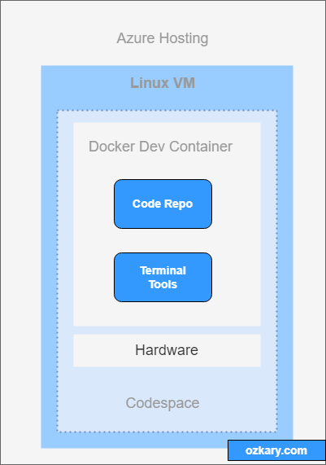
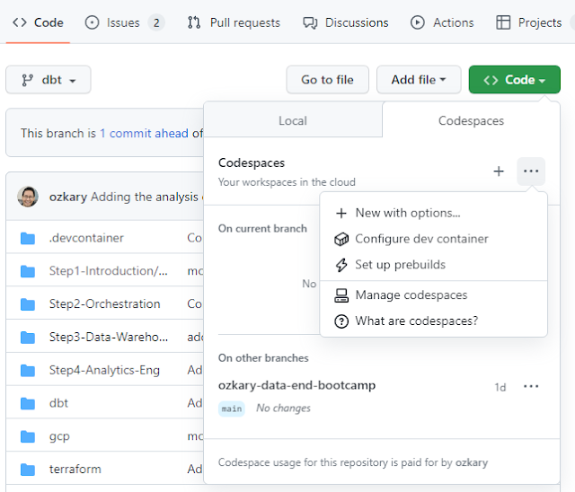
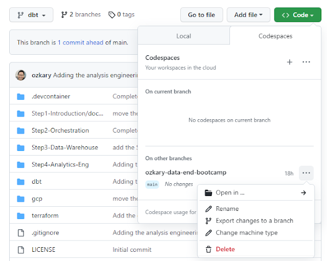
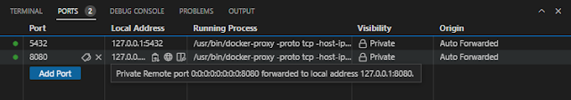

As Software Engineers, we usually work with multiple projects in parallel. This forces us to configure our work stations with multiple software development tools, which eventually leaves our workstation performing poorly. To overcome this problem, we often use virtual machine (VM) instances that run in our workstations or a cloud provider like Azure. Setting up those VMs also introduces some overhead into our software development process. As engineers, we want to be able to accelerate this process by using a remote development environment provider like GitHub Codespaces.

### What is GitHub Codespaces?

GitHub Codespaces is a cloud hosted development environment that is associated to a GitHub repository. Each environment or Dev Container is cloud hosted in a Docker container with the core dependencies that are required for that project. The container is hosted on a VM running Ubuntu Linux. The hardware is also configurable. It starts with a minimum of 2 cores, 8 GB of RAMs and 32 GB of storage, which should be a good foundation to run small projects. In addition, the hardware resources can be increased up to 32 cores, 64 GB RAM and 128 GB of storage which matches a very good workstation configuration.

> 👍 There are monthly quotas for using the remote environments of 120 hrs for personal accounts, and 180 hrs for the PRO account.

### How to use Codespaces?

Codespaces leverages the Secure Shell (SSH) protocol, which provides a secure channel between client and server.  This protocol is used to provide remote access to resources like VMs that are hosted on cloud platforms. This protocol makes it possible for browsers and IDE tools like VS Code to connect remotely and manage the projects.

When using the browser, the VS Code Browser IDE is loaded. We can also use a local installation of VS Code or any IDE that support SSH. The development process works the same way as if running locally with the exception that the files are hosted remotely, and we can also use a terminal window to execute build commands within the VM space.

### How to start a project with GitHub Codespaces

We can start a Codespaces environment right from GitHub. Open a repo on GitHub and click on the Code tab and then click the Code button from the toolbar. This opens up the options to create a new Codespaces, connect to an existent one, or even configure your Codespaces resources, more on this later. 

> 👍 You can use this repo if you do not have one https://github.com/ozkary/Data-Engineering-Bootcamp

When you add a new environment, GitHub essentially provisions a VM on Azure. It loads a Docker image with some of the dependencies of your project. For example, if your code is .Net Core or a TypeScript with React project, a Docker image with those dependencies is built and provisioned into the VM.

> 👍 The Docker images are preconfigured. We can also build a custom image to meet specific requirements.

Once the environment is provisioned, we can open the project using any of the options listed on the image below. I prefer to use my local VS Code instance, as I often have all the tools needed to work on my projects. Once the project is open on VS Code, the project connection is cached, and we only need to open VS Code again to load the remote project. The browser feature is also very useful, so do take it for a spin and see how you like it.

### Use a Terminal to Manage the Project

When the project is open remotely, we can run common activities like adding additional dependencies, building and debugging the project. Since the environment is running on Ubuntu, we can open a terminal window on VS Code. This enables us to run the CLI commands that we need in order to manage our project. 

In the case of Web projects, we can run the project remotely using our browser. Even though the project runs remotely on the VM, port forwarding is used for secured remote access, so we can open our local browser and load the app. We can see the forwarded ports for our application on the ports tab of VS Code.

### Managing your Codespaces Instance

In some cases, we may see some performance issue on our remote environment. If this is the case, we need to inspect the current instance configuration and if possible upgrade the resources. Since this is an Ubuntu instance, we can use the terminal to run commands like lscpu to check the current configuration like cpu’s and memory. We can also use the Codespaces command toolbar and change the machine type, which provides a quick shortcut to change the machine type or configure the container. 

The Dev Container can also be customized by making changes to the devcontainer.json file. Additional customization can be done by building a custom Docker image to meet specific development environment requirements.

> 👍 When the Dev Container is changed, the VM requires a re-start, which is done automatically

### Summary

By leveraging the use of remote managed development environments, software engineers can save time by not having to work on a development environment configuration, we can instead use GitHub Codespaces to quickly provision Dev Containers that get us up and running in a short time, thus allowing us to focus on our development tasks instead of environment managing tasks.

Thanks for reading.

Send question or comment at Twitter @ozkary
Originally published by ozkary.com