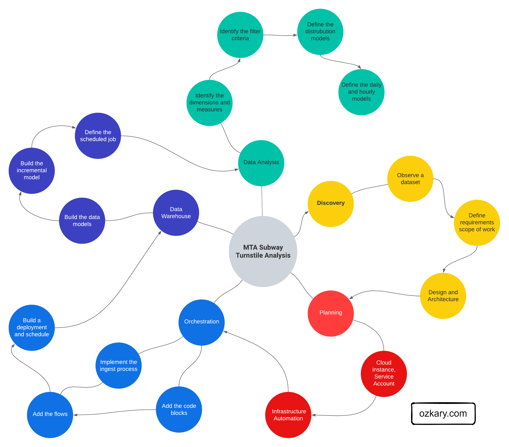

## Introduction 

Data Engineering is changing constantly. From cloud data platforms and pipeline automation to data streaming and visualizations tools, new innovations are impacting that way we build today’s data and analytical solutions. 

In this series of Data Engineering Process Fundamentals, we explore the Data Engineering Process (DEP) with key concepts, principles and relevant technologies, and explain how they are being used to help us deliver the solution. We discuss concepts and take on a real use case where we execute an end-to-end process from downloading data to visualizing the results. 

### Data Engineering Process

A Data Engineering Process follows a series of steps that should be executed to properly understand the problem statement, scope of work, design and architecture that should be used to create the solution. Some of these steps include the following:

> 👍 Note: Follow each link for more details

- Discovery
  - Problem Statement
  - Data Analysis
  - Scope of Work
- Design and Planning
  - Design Approach
  - Architecture
  - Cloud Engineering
- Data Orchestration and Operations
  - Pipeline Orchestration
    - Batch Processing
  - Workflow Automation
  - Deployment, Schedules and Monitoring
- Data Warehouse and Modeling
  - Data modeling
  - Data Warehouse Design
  - Continuous Integration
- Data Analysis and Visualization
  - Analyze the data
  - Visualization Concepts
  - Create a Dashboard
    - Provide answers to the problem statement
- Streaming Data
  - Data Warehouse Integration
  - Real-time dashboard
  
## Concepts 

### What is Data Engineering?

Data Engineering is the practice of designing and building solutions by integrating, transforming and consolidating various data sources into a centralized and structured system, Data Warehouse, at scale, so the data becomes available for building analytics solutions.

### What is a Data Engineering Process?

A Data Engineering Process (DEP) is the sequence of steps that engineers should follow in order to build a testable, robust and scalable solution. This process starts really early on with a problem statement to understand what the team is trying to solve. It is then followed with data analysis and requirements discovery, which leads to a design and architecture approach, in which the different applicable technologies are identified.

### Operational and Analytical data

Operational data is often generated by applications, and it is stored in transactional databases like SQL Server, CosmosDB, Firebase and others. This is the data that is created after an application saves a user transaction like contact information, a purchase or other activities that are available from the application. This system is not design to support Big Data query scenarios, so the reporting system should not be overloading its resources with large queries.

Analytical data is the transaction data that has been processed and optimized for analytical and visualization purposes. This data is often processed via Data Lakes and stored on Data Warehouse.

### Data Pipelines and Orchestration

Data Pipelines are used to orchestrate and automate workflows to move and process the transactional into Data Lakes and Data Warehouse. The pipelines execute repeatable Extract Transform and Load (ETL) or Extract Load and Transform (ELT) processes that can be triggered by a schedule or a data event. 

### Data Lakes

A Data Lake is an optimized storage system for Big Data scenarios. The primary function is to store the data in its raw format without any transformation. This can include structure data like CSV files, unstructured data like JSON and XML documents, or column-base data like parquet files.

### Data Warehouse

A Data Warehouse is a centralized storage system that stores integrated data from multiple sources. This system stores historical data in relational tables with an optimized schema, which enables the data analysis process. This system can also integrate external resources like CSV and parquet files that are stored on Data Lakes as external tables. The system is designed to host and serve Big Data scenarios. It is not meant to be used as a transactional system. 

### Data Batch Processing

Batch Processing is a method often used to run high-volume, repetitive data jobs. It is usually scheduled during certain time windows that do not impact the application operations, as these processes are often used to export the data from transactional systems.  A batch job is an automated software task that may include one or more workflows. These workflows can often run without supervision, and they are monitored by other tools to ensure that the process is not failing. 

### Streaming Data

Streaming Data is a data source that sends messages with small content but with high volume of messages in real-time. This data often comes from Internet-of-things (IoT) devices, manufacturing equipment or social media sources, often producing a high volume of information per second. This information is often captured in aggregated time windows and then store in a Data Warehouse, so it can be combined with other analytical data. It can also be sent to monitoring and/or real-time systems to show the current system KPI or any type of variance in the system.

## Next Step

Now that we are familiar with the high level process, let's talk about the discovery step in details.

> 👉[Data Engineering Process Fundamentals - Discovery](//ozkary.dev/data-engineering-process-foundamentals-discovery)

Thanks for reading.

Send question or comment at Twitter @ozkary
Originally published by [ozkary.com](https://www.ozkary.com)