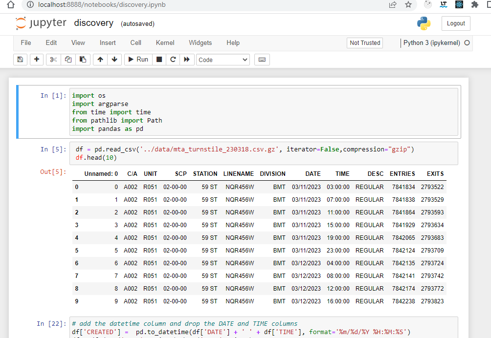
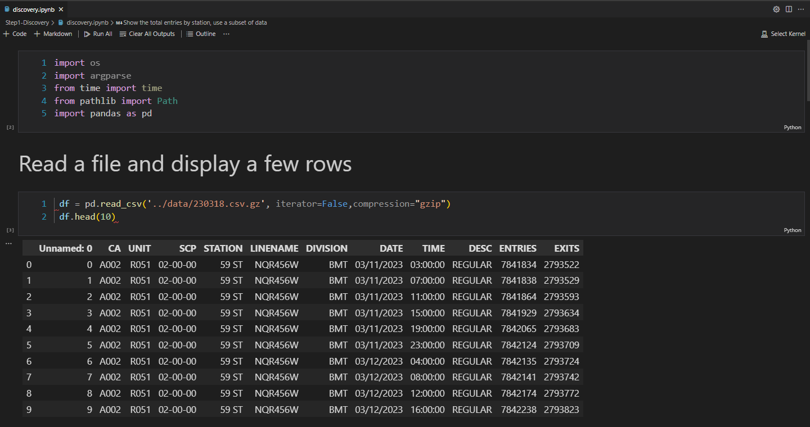

# Data Engineering Process - Discovery Exercise

In this discovery exercise lab, we review a problem statement and do the analysis to define the scope of work and requirements. Preliminary data analysis must be done by downloading some sample files with Python and running some queries using Jupyter Notebook. 

## Problem Statement

In the city of New York, commuters use the Metropolitan Transportation Authority (MTA) subway system for transportation. There are millions of people that use this system every day; therefore, businesses around the subway stations would like to be able to use Geofencing advertisement to target those commuters or possible consumers and attract them to their business locations at peak hours of the day.

Geofencing is a location based technology service in which mobile devices’ electronic signal is tracked as it enters or leaves a virtual boundary (geo-fence) on a geographical location. Businesses around those locations would like to use this technology to increase their sales.


The MTA subway system has stations around the city. All the stations are equipped with turnstiles or gates which tracks as each person enters or leaves the station. MTA provides this information in CSV files, which can be imported into a data warehouse to enable the analytical process to identify patterns that can enable these businesses to understand how to best target consumers.

## Analytical Approach

### Dataset Criteria

We are using the MTA Turnstile data for 2023. Using this data, we can investigate the following criteria:

- Stations with the high number of exits by day and hours
- Stations with high number of entries by day and hours

Exits indicates that commuters are arriving to those locations. Entries indicate that commuters are departing from those locations.

### Data Analysis Criteria

The data can be grouped into stations, date and time of the day. This data is audited in blocks of fours hours apart. This means that there are intervals of 8am to 12pm as an example. We analyze the data into those time block intervals to help us identify the best times both in the morning and afternoon for each station location. This should allow businesses to target a particular geo-fence that is close to their business.

 In the discovery process, we take a look at the data that is available for our analysis. We are using the MTA turnstiles information which is available at this location:

 👉 [New York Metropolitan Transportantion Authority Turnstile Data](http://web.mta.info/developers/turnstile.html)

We can download a single file to take a look at the data structure and make the following observations about the data:

### Observations

- It is available in weekly batches every Sunday
- The information is audited in blocks of fours hours apart
- The date and time field are on different columns
- The cumulative entries are on the ENTRIES field
- The cumulative exits are on the EXITS field
- This data is audited in blocks of fours hours apart


### Field Description

| Name | Description |
| --- | --- |
C/A      | Control Area (A002) (Booth)
UNIT     | Remote Unit for a station (R051)
SCP      | Subunit Channel Position represents an specific address for a device (02-00-00)
STATION  | Represents the station name the device is located at
LINENAME | Represents all train lines that can be boarded at this station. Normally lines are represented by one character.  LINENAME 456NQR repersents train server for 4, 5, 6, N, Q, and R trains.
DIVISION | Represents the Line originally the station belonged to BMT, IRT, or IND   
DATE     | Represents the date (MM-DD-YY)
TIME     | Represents the time (hh:mm:ss) for a scheduled audit event
DESc     | Represent the "REGULAR" scheduled audit event (Normally occurs every 4 hours). Audits may occur more that 4 hours due to planning, or troubleshooting activities. Additionally, there may be a "RECOVR AUD" entry: This refers to missed audit that was recovered. 
ENTRIES  | The cumulative entry register value for a device
EXIST    | The cumulative exit register value for a device

### Data Example

The data below shows the entry/exit register values for one turnstile at control area (A002) from 09/27/14 at 00:00 hours to 09/29/14 at 00:00 hours


|C/A|UNIT|SCP|STATION|LINENAME|DIVISION|DATE|TIME|DESC|ENTRIES|EXITS|
| --- | --- | --- | --- | --- | --- | --- | --- | --- | --- | --- |
A002|R051|02-00-00|LEXINGTON AVE|456NQR|BMT|09-27-14|00:00:00|REGULAR|0004800073|0001629137|
A002|R051|02-00-00|LEXINGTON AVE|456NQR|BMT|09-27-14|04:00:00|REGULAR|0004800125|0001629149|
A002|R051|02-00-00|LEXINGTON AVE|456NQR|BMT|09-27-14|08:00:00|REGULAR|0004800146|0001629162|


### Conclusions

Based on observations, the following conclusions can be made:

- Merge the DATE and TIME columns and create a date time column, CREATED
- The STATION column is a location dimension
- The CREATED column is the datetime dimension to enable the morning and afternoon timeframes
- The ENTRIES column  is the measure for entries
- The EXITS column is the measure for exits
- A gate can be identified by using the C/A, SCP and UNIT columns

### Requirements

These observations can be used to define technical requirements that can enable us to deliver a successful project.

- Define the infrastructure requirements to host the technology
  - Automate the provisioning of the resources using Terraform
  - Deploy the technology on a cloud platform
- Define the data orchestration process
  - On the original pipeline, load the initial data for 2023
  - Create a data pipeline that runs every week after a new file has been published
  - Copy the unstructured CSV files into a Data Lake
- Define a well-structured and optimized model on a Data Warehouse
  - Keep the source code for the models under source control
  - Copy the data into the Data Warehouse
  - Allow access to the Data Warehouse, so visualization tools can consume the data.
- Create Data Analysis dashboard with the following information  
  - Data Analysis dashboard
  - Identify the time slots for morning and afternoon analysis
  - Look at the distribution by stations
  - Look at the daily models
  - Look at the time slot models


## How to Run it!

### Requirements

<p>👉 <a target="_python" href="https://github.com/ozkary/data-engineering-mta-turnstile/wiki/Configure-Python-Dependencies">
Install Python, Pandas and Jupyter notebook
</a></p>

<p>👉 <a href="https://github.com/ozkary/data-engineering-mta-turnstile/tree/main/Step1-Discovery" target="_python">Clone this repo or copy the files from this folder
</a></p>

### Follow these steps to run the analysis

- Download a file to look at the data
  - This should create a gz file under the ../data folder

```
$ python3 mta_discovery.py --url http://web.mta.info/developers/data/nyct/turnstile/turnstile_230318.txt
```
Run the Jupyter notebook (dicovery.ipynb) to do some analysis on the data. 

- Load the Jupyter notebook to do analysis
  - First start the Jupyter server from the terminal by typing
  
```bash
$ jupyter notebook
```
  - See the URL on the terminal and click it to load it on the browser
    - Click the discovery.ipynb file link
  - Or open the file with VSCode and enter the URL when prompted from a kernel url
  - Run every cell from the top down as this is required to load the dependencies

The following images show Jupyter notebook loaded on the browser or directly from VSCode.

#### Jupyter Notebook loaded on the browser


<p></p>



#### #### Using VSCode to load the data and create charts



#### Show the total entries by station using a subset of data using VSCode


# Next Step

> 👉 [Data Engineering Process Fundamentals - Design and Planning](//www.ozkary.dev/data-engineering-process-fundamentals-design-planning)


Thanks for reading.

Send question or comment at Twitter @ozkary
Originally published by [ozkary.com](https://www.ozkary.com)