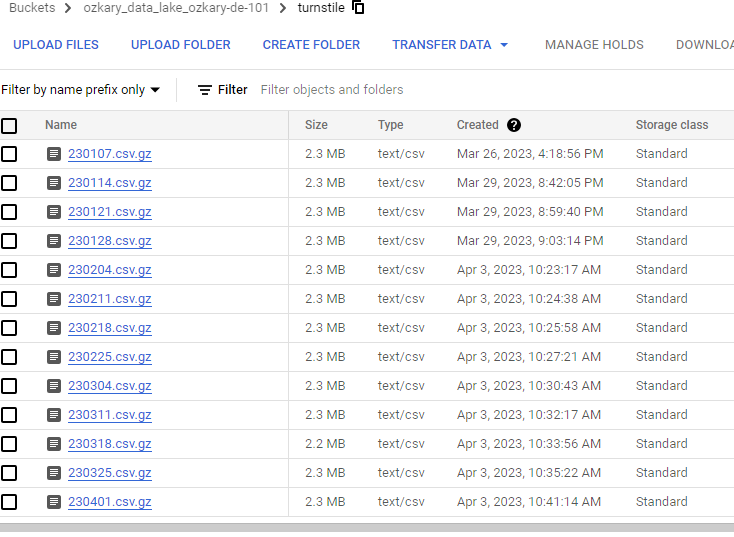
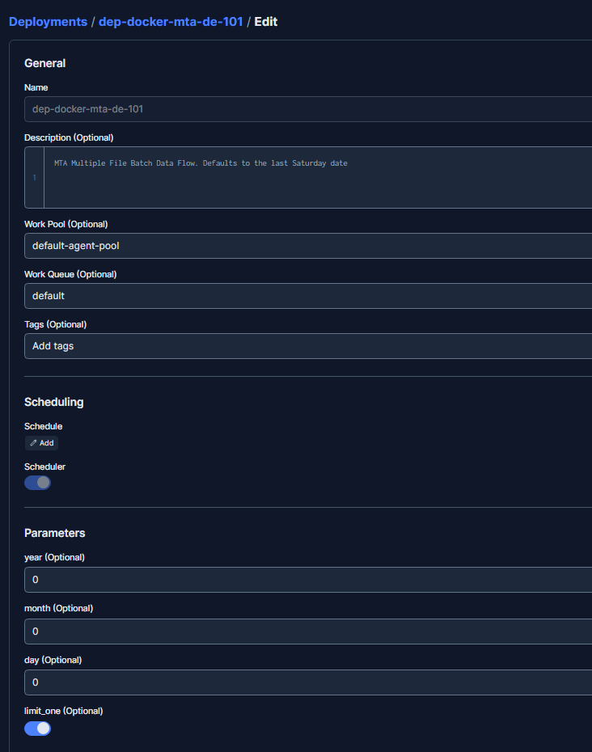
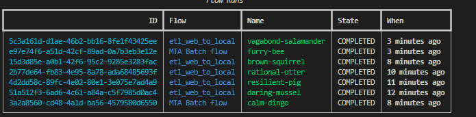
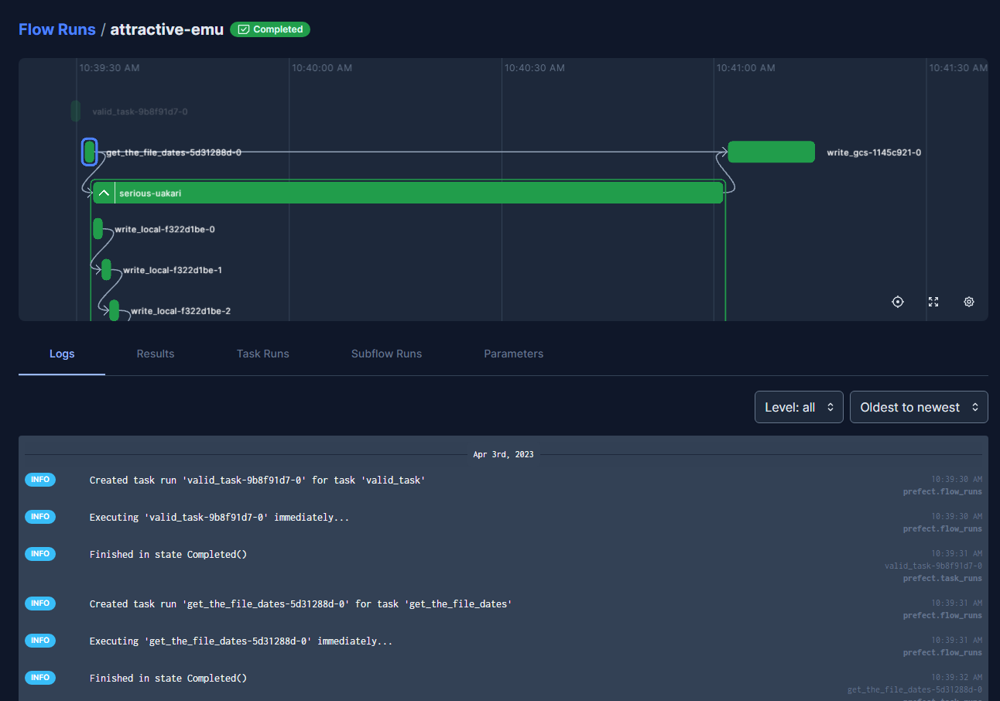
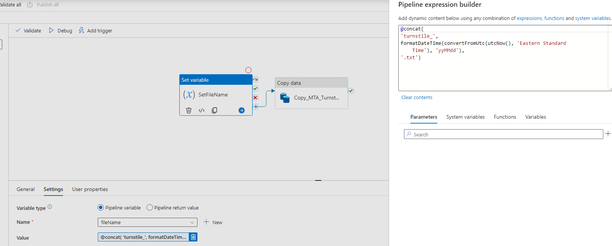

Once we have gained an understanding of data pipelines and their orchestration, along with the various programming options and technical tools at our disposal, we can proceed with the implementation and configuration of our own data pipeline. We have the flexibility to adopt either a code-centric approach, leveraging languages like Python, or a low-code approach, utilizing tools such as Azure Data Factory. This allows us to evaluate and compare the effectiveness of each approach based on our team's expertise and the operational responsibilities involved. Before diving into the implementation, let's first review our pipeline process to ensure a clear road map for our journey ahead.

## Data Flow Process


Our basic data flow can be defined as the following:

- Define the date when a new CSV becomes available
- Perform an HTTP Get request to download the CSV file for the selected date
  -  Example: http://web.mta.info/developers/data/nyct/turnstile/turnstile_230318.txt
- Compress the text file and upload in chunks to the data lake container

After the file is copied to our data lake, the data transformation service picks up the file, identifies new data and inserts into the Data Warehouse. We will take a look at the process on the Data WareHouse and Transformation services on the next step of the process. 

> 👉 Since a new file is available weekly, This data integration project fits into the batch processing model. For real-time scenarios, we should use a data streaming technologies like [Apache Kafka](https://kafka.apache.org/) with [Apache Spark](https://spark.apache.org/) 


### Initial Data Load

When there are requirements to load previous data, we need to first run a batch process to load all the previous months of data. Since the file are available weekly, we need to write code that can accept a date range, identify all the past Saturdays, and copy each file into our data lake. The process can be executed in parallel processes by running different years or months (if only one year is selected) in each process. This way multiple threads can be used to copy the data, which should reduce the processing time.

Moving forward, the process will target a specific date for when the file becomes available. The process will not allow for the download of future data files, so an attempt to pass future dates will not be allowed.



### Weekly Automation

Since the files are available on a weekly basis, we use a batch processing approach to process those files. For that, we create a scheduled job on our automation tool. This trigger should run on the day that the file is available, so a dynamic parameter can be created based on the current date value. The code can then parse this date and resolve the file name format to download the corresponding file.

### Monitor the jobs

It is very important to be able to monitor and create alerts in case there are failures. This should allow the teams to identify and address the problems quickly. Therefore, it is important that we select a code-centric framework of a platform that provides integrated monitor and alert system.

## Programming Language and Tooling

A code-centric data pipeline refers to a high coding effort using a programming language, supporting libraries and cloud platform that can enable us to quickly implement our pipelines and collect telemetry to monitor our jobs. In our case, Python provides a versatile and powerful programming language for building data pipelines, with various frameworks available to streamline the process. Three popular options for Python-based data pipelines are Prefect, Apache Airflow, and Apache Spark. 

- [Apache Airflow](https://airflow.apache.org/) is a robust platform for creating, scheduling, and monitoring complex workflows. It uses Directed Acyclic Graphs (DAGs) to define pipelines and supports a rich set of operators for different data processing tasks.

- [Apache Spark](https://spark.apache.org/) is a distributed data processing engine that provides high-speed data processing capabilities. It supports complex transformations, real-time streaming, and advanced analytics, making it suitable for large-scale data processing.

- [Prefect](https://www.prefect.io/) is a modern workflow management system that enables easy task scheduling, dependency management, and error handling. It emphasizes code-driven workflows and offers a user-friendly interface.

For low-code efforts, [Azure Data Factory](https://azure.microsoft.com/en-us/products/data-factory/) is a cloud-based data integration service provided by Microsoft. It offers a visual interface for building and orchestrating data pipelines, making it suitable for users with less coding experience.

> 👉 There are several platforms for low-code solutions. Some of them provide a total enterprise turn-key solution to build the entire pipeline and orchestration. These platforms, however, come at a higher financial cost.

When choosing between these options, we should consider factors such as the complexity of the pipeline, scalability requirements, ease of use, and integration with other tools and systems. Each framework has its strengths and use cases, so selecting the most suitable one depends on your specific project needs.

## Pipeline Implementation Requirements

For our example, we will take on a code-centric approach and use Python as our programming language. In addition, we use the Prefect libraries and cloud services to manage the orchestration. After we are done with the code-centric approach, we take a look at using a low-code approach with Azure Data Factory, so we can compare between the two different approaches. 

Before we get started, we need to setup our environment with all the necessary dependencies.

### Requirements

- Docker and Docker Hub
    - [Install Docker](https://github.com/ozkary/data-engineering-mta-turnstile/wiki/Configure-Docker)
    - [Create a Docker Hub Account](https://hub.docker.com/)
- Prefect dependencies and cloud account
  - Install the Prefect Python library dependencies
  - [Create a Prefect Cloud account](https://www.prefect.io/)
- Data Lake for storage
  - Make sure to have the storage account and access ready

<p>👉 <a href="https://github.com/ozkary/data-engineering-mta-turnstile/tree/main/Step3-Orchestration/" target="_pipeline">Clone this repo or copy the files from this folder
</a></p>

### Prefect Configuration
- Install the Python libraries using the requirements file from the repo
  
```bash
$ cd Step3-Orchestration
$ pip install -r prefect-requirements.txt
```

- Make sure to run the terraform script to build the VM, Data lake and BigQuery resources as shown on the Design and Planning exercise
- Copy the GCP credentials file to follow this format

```bash
$ cd ~ && mkdir -p ~/.gcp/
$ cp <path to JSON file> ~/.gcp/credentials.json
```

#### Create the PREFECT Cloud Account

> 👉 Login to Prefect Cloud, API keys can be created from the user profile configuration (click your profile picture)

- From a terminal, login with Prefect cloud to host the blocks, deployments, and dashboards on the Cloud
```bash
$ prefect cloud login  
# or use an API key to login instead
# prefect cloud login -k API_KEY_FROM_PREFECT 
```  
The login creates a key file ~/.prefect/profiles.toml which the framework looks for to authenticate the pipeline.

- Install the Prefect code blocks dependencies and run the "block ls" command to check that there are none installed

```bash
$ prefect block register -m prefect_gcp
$ prefect block ls
```

### List of resources that are needed 

 These are the resource names that are used by the code. 

- Data lake name
    - mta_data_lake
- Prefect Account block name
    - blk-gcp-svc-acc
- Prefect GCS (storage) block name
    - blk-gcs_name
- Prefect Deployments
    - dep-docker-mta    
- Docker container name after pushing to Docker Hub
    - ozkary/prefect:mta-de-101

## Review the Code

After setting up all the dependencies, we can move forward to look at the actual code. We can start by reviewing the  code blocks or components. We can then view the actual pipeline code, and how it is wired, so we can enable the flow telemetry in our pipeline.

### Code Blocks or Components

> 👉 Blocks are a secured and reusable components which can manage a single technical concern and can be used by our applications

#### Credentials Component

Since we need secured access to cloud resources, we first need to create a credentials component to store the cloud key file. We can then use this component in other areas of the code whenever we need to do a cloud operation. The save operation done by the code pushes the component to the cloud, so it is centralized.

```python
import argparse
import os
from pathlib import Path
from prefect_gcp import GcpCredentials

# insert your own service_account_file path or service_account_info dictionary from the json file
# IMPORTANT - do not store credentials in a publicly available repository!

def main(params) -> None:
    """entry point to create the prefect block for GCP service account"""
    gcp_file_path = params.file_path
    account_block_name = params.gcp_acc_block_name
    
    file_handle = Path(gcp_file_path) #.read_text()
    print(file_handle.read_text())
    if file_handle.exists() :
        content = file_handle.read_text()

        if content :
            credentials_block = GcpCredentials(
                service_account_info=content     # set the file credential
            )
            credentials_block.save(account_block_name, overwrite=True)
            print('block was saved')
    else:
        print(F'{gcp_file_path} not found')

    os.system('prefect block ls')
            
if __name__ == '__main__':
    parser = argparse.ArgumentParser(description='Create a reusable Credential block')

    parser.add_argument('--file_path', required=True, help='key file path for the service account')
    parser.add_argument('--gcp_acc_block_name', required=True, help='prefect block name to hold the service account setting')
        
    args = parser.parse_args()

    main(args)

```

#### Cloud Storage Component

The cloud storage component enables us to reuse the credentials component, so applications can be authenticated and authorize to access it. This component also has support to upload files to the storage container, thus simplifying our code. Similar to the credential component, this component is saved on the cloud.

```python
import argparse
from prefect_gcp import GcpCredentials
from prefect_gcp.cloud_storage import GcsBucket

# insert your own service_account_file path or service_account_info dictionary from the json file
# IMPORTANT - do not store credentials in a publicly available repository!

def main(params) -> None:
    """entry point to create the prefect block for GCS"""    
    account_block_name = params.gcp_acc_block_name
    gcs_bucket_name = params.gcs_bucket_name
    gcs_block_name = params.gcs_block_name
    
    credentials = GcpCredentials.load(account_block_name)
    if credentials :
        bucket_block = GcsBucket(
            gcp_credentials=credentials,
            bucket=gcs_bucket_name  # insert your  GCS bucket name
        )
        # save the bucket
        bucket_block.save(gcs_block_name, overwrite=True)

if __name__ == '__main__':
    parser = argparse.ArgumentParser(description='Ingest CSV data to storage')
    
    parser.add_argument('--gcp_acc_block_name', required=True, help='prefect block name which holds the service account')
    parser.add_argument('--gcs_bucket_name', required=True, help='GCS bucket name')
    parser.add_argument('--gcs_block_name', required=True, help='GCS block name')
        
    args = parser.parse_args()

    main(args)

```

#### Docker Container Component

Since we are running our pipeline on a Docker container, we also want to write a component which can manage that technical concern. This allow us to pull the Docker image from Docker Hub when we are ready to deploy and run the pipeline. We will learn more about deployments as we create our Docker deployment definition.

```python

import argparse
from prefect.infrastructure.docker import DockerContainer

def main(params) -> None:
    """Create a Docker prefect block"""
    block_name = params.block_name
    image_name = params.image_name

    # alternative to creating DockerContainer block in the UI
    docker_block = DockerContainer(
        image=image_name,  # insert your image here
        image_pull_policy="ALWAYS",
        auto_remove=True,
    )

    docker_block.save(block_name, overwrite=True)


if __name__ == '__main__':
    parser = argparse.ArgumentParser(description='Create a reusable Docker image block from Docker Hub')

    parser.add_argument('--block_name', required=True, help='Prefect block name')    
    parser.add_argument('--image_name', required=True, help='Docker image name used when the image was build')    
        
    args = parser.parse_args()

    main(args)

```

### Deployments

Cloud deployments are used to deploy and manage pipelines in a production environment. Deployments provide a centralized way to run and monitor pipelines across multiple execution environments, such as local machines, cloud-based infrastructure, and on-premises clusters. 

#### Docker Deployment

With a deployment definition, we can associate a Docker image that is hosted on Docker Hub with a deployment. This enables us to automate the deployment of this image to other environments when we are ready to run the pipeline. The code below associates a Docker component with a deployment definition from the cloud. It also defines the main flow entry point (main_flow) from the etl_web_to_gcs.py file, so it can be easily executed as a scheduled task from the terminal.

```python

import argparse
import sys
import os
from prefect.deployments import Deployment
from prefect.infrastructure.docker import DockerContainer
sys.path.append(os.path.join(os.path.dirname(__file__), '..', 'flows'))
from etl_web_to_gcs import main_flow

def main(params) -> None:
    """Create a prefect deployment"""
    block_name = params.block_name
    deploy_name = params.deploy_name

    # use the prefect block name for the container
    docker_block = DockerContainer.load(block_name)

    docker_dep = Deployment.build_from_flow(
        flow=main_flow,
        name=deploy_name,
        infrastructure=docker_block
    )
    docker_dep.apply()

if __name__ == '__main__':
    parser = argparse.ArgumentParser(description='Create a reusable prefect deployment script')

    parser.add_argument('--block_name', required=True, help='Prefect Docker block name')    
    parser.add_argument('--deploy_name', required=True, help='Prefect deployment name')    
        
    args = parser.parse_args()

    main(args)

```
#### GitHub Deployment

In cases when a Docker image is not used, we can also use a deployment definition using GitHub. This allows us to download the code to other environments in which dependencies will need to be installed prior to running the code. The build_from_flow operation is used to define which file and what entry point (function) of that file to use. In this example, we are using the etl_web_to_gcs.py file and the function main_flow.

```python

import argparse
from prefect.deployments import Deployment
from etl_web_to_gcs import main_flow
from prefect.filesystems import GitHub 

def main(params) -> None:
    """Create a prefect deployment with github"""
    block_name = params.block_name
    deploy_name = params.deploy_name
    github_path = params.github_path    

    github_block = GitHub.load(block_name)

    deployment = Deployment.build_from_flow(
          flow=main_flow,
          name=deploy_name,
          storage=github_block,
          entrypoint=f"{github_path}/etl_web_to_gcs.py:main_flow")

    deployment.apply()


if __name__ == '__main__':
    parser = argparse.ArgumentParser(description='Create a reusable prefect deployment script')

    parser.add_argument('--block_name', required=True, help='Github block name')    
    parser.add_argument('--deploy_name', required=True, help='Prefect deployment name')    
    parser.add_argument('--github_path', required=True, help='Github folder path where the pipeline file is located')    
        
    args = parser.parse_args()

    main(args)

```
### Pipeline Flows and Tasks

A pipeline is implemented by defining flows and tasks, which are defined using Python, CSharp code or other languages. Flows are composed of multiple tasks and define the sequence and dependencies between them. Flows use the @flow function decorator or attributes, which is specific to the Python library being used (Prefect), and it is used to mark a function as a flow. The decorator also allows us to define the flow's name, description, and other attributes like number of retries in case of failures.

Tasks are defined by the @task function decorator or attribute. Tasks are individual units of work that can be combined to form a data pipeline. They represent the different steps or operations that need to be performed within a workflow. Each task is responsible for executing a specific action or computation.

In our example, we have the main_flow function which uses another flow (etl_web_to_local) to handle the file download from the Web to a local storage. The main flow also uses tasks to handle the input validation and file name formatting to make sure the values are only for the specific dates the new CSV file is available for download. Finally, there is task to write a compressed CSV file to the data lake using our components.

By putting together flows and tasks that handle a specific workflow, we build a pipeline that enables us to download files into our data lake. At the same time, by using those function decorators, we are enabling the Prefect framework to call its internal class to track telemetry information for each flow and task in our pipeline, which enable us to monitor and track failures at a specific point in the pipeline. Let's see what our pipeline implementation looks like:

```python
import argparse
from pathlib import Path
import os
import pandas as pd
from prefect import flow, task
from prefect_gcp.cloud_storage import GcsBucket
from typing import List
# from prefect.tasks import task_input_hash
from settings import get_block_name, get_min_date, get_max_date, get_prefix, get_url
from datetime import timedelta, date

@task(name="write_gcs", description='Write file gcs', log_prints=False)
def write_gcs(local_path: Path, file_name: str, prefix: str) -> None:
    
    """
        Upload local parquet file to GCS
        Args:
            path: File location
            prefix: the folder location on storage

    """    
    block_name = get_block_name()
    gcs_path = f'{prefix}/{file_name}.csv.gz'
    print(f'{block_name} {local_path} {gcs_path}')
    
    gcs_block = GcsBucket.load(block_name)        
    gcs_block.upload_from_path(from_path=local_path, to_path=gcs_path)
    
    return

@task(name='write_local', description='Writes the file into a local folder')
def write_local(df: pd.DataFrame, folder: str, file_path: Path) -> Path:
    """
        Write DataFrame out locally as csv file
        Args:
            df: dataframe chunk
            folder: the download data folder
            file_name: the local file name
    """

    path = Path(folder)
    if not os.path.exists(path):
        path.mkdir(parents=True, exist_ok=True)

    df = df.rename(columns={'C/A': 'CA'})            
    df = df.rename(columns=lambda x: x.strip().replace(' ', ''))    
    # df = df.rename_axis('row_no').reset_index()

    if not os.path.isfile(file_path):
        df.to_csv(file_path, compression="gzip")
        # df.to_parquet(file_path, compression="gzip", engine='fastparquet')
        print('new file', flush=True)
    else:  
        df.to_csv(file_path, header=None, compression="gzip", mode="a")          
        # df.to_parquet(file_path, compression="gzip", engine='fastparquet', append=True) 
        print('chunk appended', flush=True)
        
    return file_path

@flow(name='etl_web_to_local', description='Download MTA File in chunks')
def etl_web_to_local(name: str, prefix: str) -> Path:
    """
       Download a file    
       Args:            
            name : the file name  
            prefix: the file prefix          
   
    """    

    # skip an existent file
    path = f"../../data/"
    file_path = Path(f"{path}/{name}.csv.gz")
    if os.path.exists(file_path):            
            print(f'{name} already processed')
            return file_path

    url = get_url()
    file_url = f'{url}/{prefix}_{name}.txt'
    print(file_url)
    # os.system(f'wget {url} -O {name}.csv')
    # return

    df_iter = pd.read_csv(file_url, iterator=True, chunksize=5000)     
    if df_iter:              
        for df in df_iter:
            try:                                                
                write_local(df, path, file_path)
            except StopIteration as ex:
                print(f"Finished reading file {ex}")
                break
            except Exception as ex:
                print(f"Error found {ex}")
                return
                
        print(f"file was downloaded {file_path}")                
    else:
        print("dataframe failed")

    return file_path

@task(name='get_file_date', description='Resolves the last file drop date')    
def get_file_date(curr_date: date = date.today()) -> str:    
    if curr_date.weekday() != 5:
        days_to_sat = (curr_date.weekday() - 5) % 7
        curr_date = curr_date - timedelta(days=days_to_sat)
        
    year_tag = str(curr_date.year)[2:4]
    file_name = f'{year_tag}{curr_date.month:02}{curr_date.day:02}'
    return file_name


@task(name='get_the_file_dates', description='Downloads the file in chunks')
def get_the_file_dates(year: int, month: int, day: int = 1, limit: bool = True ) -> List[str]:
    """
        Process all the Sundays of the month
        Args:
            year : the selected year
            month : the selected month 
            day:  the file day
    """
    date_list = []        
    curr_date = date(year, month, day)    
    while curr_date.month == month and curr_date <= date.today():   
        # print(f'Current date {curr_date}')     
        if curr_date.weekday() == 5:
            # add the date filename format yyMMdd
            year_tag = str(curr_date.year)[2:4]
            file_name = f'{year_tag}{curr_date.month:02}{curr_date.day:02}'
            date_list.append(file_name)            
            curr_date = curr_date + timedelta(days=7)
            if limit:
                 break
        else:
            # find next week
            days_to_sat = (5 - curr_date.weekday()) % 7
            curr_date = curr_date + timedelta(days=days_to_sat)
    return date_list
                              

@task(name='valid_task', description='Validate the tasks input parameter')
def valid_task(year: int, month: int, day: int = 1) -> bool:
    """
        Validates the input parameters for the request
         Args:
            year : the selected year
            month : the selected month   
            day: file day
    """    
    isValid = False
    if month > 0 and month < 13:        
        curr_date = date(year, month, day)         
        min_date = get_min_date()
        max_date = get_max_date()
        isValid =  curr_date >= min_date and curr_date < max_date and curr_date <= date.today()

    print(f'task request status {isValid} input {year}-{month}')
    return isValid


@flow (name="MTA Batch flow", description="MTA Multiple File Batch Data Flow. Defaults to the last Saturday date")
def main_flow(year: int = 0 , month: int = 0, day: int = 0, limit_one: bool = True) -> None:
    """
        Entry point to download the data
    """        
    try:
        # if no params provided, resolve to the last saturday  
        file_list: List[str] = []
        if (year == 0):
            file_dt = get_file_date()
            file_list.append(file_dt)
        elif valid_task(year, month, day):                
            file_list = get_the_file_dates(year, month, day, limit_one)                    
        
        prefix = get_prefix()        
        for file_name in file_list:        
            print(file_name)
            local_file_path = etl_web_to_local(file_name, prefix)        
            write_gcs(local_file_path, file_name, prefix)
                    
    except Exception as ex:
        print(f"error found {ex}")

```

#### Function Decorators

In some programming languages, we can create function decorators or attributes that enables to enhance a specific function without altering its purpose. In Python, this can be done by defining a class with a ```__call__``` method, which allows instances of the class to be callable like functions. Within the ```__call__``` method, logic can be implemented to track telemetry data and then return the original function unchanged. Here's an example of a simple telemetry function decorator class:

```python
class TelemetryDecorator:
    def __init__(self, tracking_type):
        self.tracking_type = tracking_type

    def __call__(self, func):
        def wrapped_func(*args, **kwargs):
            # Track telemetry data here
            print(f"Tracking {self.tracking_type} for function {func.__name__}")
            
            # Call the original function with its parameters
            return func(*args, **kwargs)
        
        return wrapped_func

# Usage example:
@TelemetryDecorator(tracking_type="performance")
def my_task(x, y):
    return x + y

result = my_task(3, 5)

```

## How to Run It

After installing the pre-requisites and reviewing the code, we are ready to run our pipeline and set up our orchestration by configuring our components, deployment image and scheduling the runs. 

### Install the code blocks or components for our credentials and data lake access

We should first authenticate our terminal with the cloud instance. This should enable us to call other APIs to register our components. We next register the block dependencies. From the blocks folder, we register our components by running the Python scripts. We then run a "block ls" command to see the components that have been registered.

> 👍 Components are a secured way to download credentials and secrets that are used by your applications.

```bash
$ prefect cloud login
$ prefect block register -m prefect_gcp
$ cd ./blocks
$ python3 gcp_acc_block.py --file_path=~/.gcp/credentials.json --gcp_acc_block_name=blk-gcp-svc-acc
$ python3 gcs_block.py --gcp_acc_block_name=blk-gcp-svc-acc --gcs_bucket_name=mta_data_lake --gcs_block_name=blk-gcs-name
$ prefect block ls
```

### Create a docker image and push to Docker Hub

We are adding our Python script in a Docker container, so we can create and push the image (ozkary/prefect:mta-de-101) to Docker Hub. This should enable us to later create a deployment definition and refer to that image, so we can download it from a centralized hub location to one or more environments.

> 👉 Make sure to run the Docker build command where the Docker file is located or use -f with the file path. Ensure Docker is also running.

```
$ docker login --username USER --password PW
$ docker image build -t ozkary/prefect:mta-de-101 .
$ docker image push ozkary/prefect:mta-de-101
```

The Docker file defines the image dependency with Python already installed. We also copy a requirements file which contains additional dependencies that need to be installed on the container image. We finally copy our code on the container, so when we run it, it is able to find the pipeline main_flow.

```yml
FROM prefecthq/prefect:2.7.7-python3.9
COPY docker-requirements.txt .

RUN pip install -r docker-requirements.txt --trusted-host pypi.python.org --no-cache-dir

RUN mkdir -p /opt/prefect/data/
RUN mkdir -p /opt/prefect/flows/

COPY flows opt/prefect/flows
COPY data opt/prefect/data
```

### Create the prefect block with the docker image
After creating the Docker image, we can register the Docker component (blk-docker-mta-de-101) with the image name reference, which is what allows us to pull that image from Docker Hub during a new deployment.

```bash
$ cd ./blocks
$ python3 docker_block.py --block_name=blk-docker-mta-de-101 --image_name=ozkary/prefect:mta-de-101
```
### Create the deployment with the docker image

We can now configure a cloud deployment by running our deployment definition file (docker_deploy_etl_web_to_gcs.py). For this configuration, we associate the Docker component (blk-docker-mta-de-101) to our definition. The configuration uses the component, which in turns defines where to get the Docker image from. We also setup a cron job to schedule the deployment to run on Saturdays at 9am. This scheduling of the deployments is an orchestration tasks. To verify all is configured properly, we list the deployment configurations by running the "deployment ls" command. The listing of the deployments also enables us to confirm the deployment name and id, which can be used when we test run the deployment.

```bash
$ cd ./deployments
$ python3 docker_deploy_etl_web_to_gcs.py --block_name=blk-docker-mta-de-101 --deploy_name=dep-docker-mta-de-101
$ prefect deployments build etl_web_to_gcs.py:main_flow --name dep-docker-mta-de-101 --tag mta --work-queue default --cron '0 9 * * 6' 
$ prefect deployments ls
```
> 👍 Scheduled jobs can also be managed from the cloud dashboards



### Start the Prefect agent
The agent should be running, so the scheduled deployments can be executed. If the image Docker image is not downloaded yet, it is downloaded, so the code can be executed.

```bash
$ prefect agent start -q default
```

### Test run the prefect deployments with the docker image

This next command will download the Docker image and run the entry point, main_flow. The additional parameters are also provided. so the pipeline can download the file for the specified year, month and day.

```bash
$ prefect deployment run "MTA Batch flow/dep-docker-mta-de-101" -p "year=2023 month=3 day=25"
```

### Manual test run can be done from a terminal

A manual test run can also be executed from the command line to help us identify any possible bugs without having to run the app from the container. Run the code directly from the terminal by typing this command:

```bash
$ python3 etl_web_to_gcs.py --year 2023 --month 5 --day 6
```

### See the flow runs from the CLI

To check the actual flow runs, we can use the "flow-run ls" command. This should show the date and time when the flow has been executed.

```bash
$ prefect flow-run ls
```



> 👍 Flow runs can also be visualized from the cloud dashboards
To get more telemetry details about the pipeline, we can look at the flow dashboards on the cloud.



### GitHub Action to build and deploy the Docker image to Docker Hub

So far, we have shown how to build and push our Docker images via the CLI. A more mature way to do this is to enable that process on a deployment pipeline. With GitHub, we have CI/CD pipelines that can automate this process. This pipeline can be triggered when a change is made to the code, and a pull request (PR) is merged into the branch. This is called a GitHub action. A simple script to handle that automation is shown below:

```yml

name: Build and Push Docker Image

on:
  push:
    branches:
      - main

jobs:
  build-and-push:
    runs-on: ubuntu-latest

    steps:
    - name: Checkout repository
      uses: actions/checkout@v2

    - name: Set up Docker Buildx
      uses: docker/setup-buildx-action@v1

    - name: Login to Docker Hub
      uses: docker/login-action@v1
      with:
        username: ${{ secrets.DOCKERHUB_USERNAME }}
        password: ${{ secrets.DOCKERHUB_PASSWORD }}

    - name: Build and push Docker image
      env:        
        DOCKER_REPOSITORY:  ${{ secrets.DOCKERHUB_USERNAME }}/prefect:mta-de-101
      run: |
        docker buildx create --use
        docker buildx build --push --platform linux/amd64,linux/arm64 -t $DOCKER_REPOSITORY .

```
## Low-Code Data Pipeline

After learning about a code-centric pipeline, we can transition into a low-code approach, which marks a significant evolution in the way data engineering projects are implemented. In the code-centric approach, engineers create and manage every aspect of the pipeline through code, providing maximum flexibility and control. On the other hand, the low-code approach, exemplified by platforms like Azure Data Factory, empowers data engineers to design and orchestrate pipelines with visual interfaces and pre-built components. This results in faster development and a more streamlined pipeline creation process. The low-code approach is especially beneficial for less experienced developers or projects where speed and simplicity are essential.

###  Pipeline with Azure Data Factory 

> 👉 [Setup an Azure Data Factory Resource](https://learn.microsoft.com/en-us/azure/data-factory/quickstart-create-data-factory-azure-cli)

To show a low-code approach, we will write our data pipeline using Azure Data Factory. Following a similar approach, we can design an efficient data ingestion process that involves compressing and copying CSV files to Blob storage. The pipeline consists of two essential steps to streamline the process.



- Set Pipeline Variable - To ensure proper file naming, we use a code snippet to dynamically set a pipeline variable with today's date in the format "yymmdd.txt" This allows us to create a file name for a specific drop date. This variable is then used by the Copy Data activity.

- Copy with Compression - We initiate a data copy action from the website "http://web.mta.info/developers/data/nyct/turnstile/turnstile_230318.txt". This action has a source configuration where we can define the file to download dynamically. There is also a destination configuration, which links to our Blog storage and has a setting to compress and parse the CSV file. As the data is copied, the CSV file is compressed into the GZ format, optimizing storage and reducing costs. The compressed file is then stored in the designated Blob container in our Data Lake.

By implementing this data pipeline, we achieve a seamless and automated data ingestion process, ensuring that data is efficiently transferred and stored in a cost-effective manner. The platform also manages all the orchestration concerns like monitoring, scheduling, logging, integration. We should also note that this is a third party managed service, and there is a cost based on the resource usage. Depending on the project, this cost could be less than a coding effort or could be higher compared to the code-centric approach.

## Summary

For our code-centric approach, we used Python to code each step of the pipeline to meet our specific requirements. Python allows us to create custom tasks and workflows, providing flexibility and control over the pipeline process. We deploy our pipeline within Docker containers, ensuring consistency across different environments. This facilitates seamless deployment and scalability, making it easier to manage the pipeline as it grows in complexity and volume.

For the pipeline orchestration, we are using the power of cloud technologies to host our code for deployments and execution, log the telemetry data to track the performance and health of the process, schedule and monitor our deployments to manage our operational concerns. 

While the code-centric approach offers more granular control, it also demands more development and DevOps activities. On the other hand, a low-code approach, like Azure Data Factory, abstracts some complexity, making it faster and simpler to set up data pipelines.

The choice between a code-centric and low-code approach depends on the team's expertise, project requirements, and long-term goals. Python, combined with Docker and CI/CD, empowers data engineers to create sophisticated pipelines, while platforms like Azure Data Factory offer a faster and more accessible solution for specific use cases.

## Next Step

Coming soon!

> 👉 Data Engineering Process Fundamentals - Data Warehouse and Transformation

Thanks for reading.

Send question or comment at Twitter @ozkary

👍 Originally published by [ozkary.com](https://www.ozkary.com)