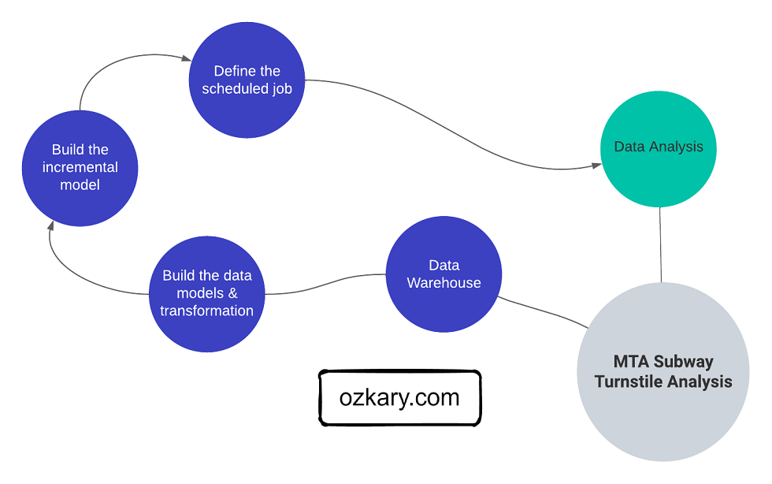

After completing the pipeline and orchestration phase in the data engineering process, our pipeline should be fully operational and loading data into our data lake. The compressed CSV files in our data lake, even though is optimized for storage, are not designed for easy access for analysis and visualization tools. Therefore, we should transition into  moving the data from the files into a data warehouse, so we can facilitate the access for the analysis process.

The process to send the data into a data warehouse requires a few essential activities before we can migrate the data into tables. Like any process before any implementation is done, we need to first work on defining the database system, schema, modeling and transforming the data from its raw format, identifying the frameworks and tools to use to use for CI/CD requirements, defining incremental data strategies to continue to support the flow of data, and supporting operational requirements to keep our data warehouse operational.

For example, data modeling involves designing the structure of the data warehouse, creating entities (tables), defining attributes (columns), and establishing data relationships to ensure efficient querying and reporting. 

Additionally, data transformation processes should be identified to cleanse, validate, and enrich the data, preparing it for analytical purposes. This crucial data modeling and transformation phase not only ensures data quality but also leads us into optimizing the entities that would host the data. By carefully considering the data warehouse schema, such as using a star schema or snowflake schema, and defining appropriate indexes and keys, we can make the data readily available for analytical and visualization tools like Power BI and Looker. 

To get better understanding about this phase of the data warehouse process, let's first do a refresh on some important concepts. As we cover these concepts, we can then relate them to some of the necessary activities that we need to take on to deliver a solution that can scale according to our data demands.



## OLAP vs OLTP Database Systems

An Online Analytical Processing (OLAP) and an Online Transaction Processing (OLTP) are two different types of database systems with distinct purposes and characteristics:

### OLAP 
- It is designed for complex analytical queries and data analysis
- It is optimized for read-heavy workloads and aggregates large volumes of data to support business intelligence (BI), reporting, and data analysis.
- These databases store historical data and facilitate data exploration, trend analysis, and decision-making
- Data is typically denormalized and organized in a multidimensional structure like a star schema or snowflake schema to enable efficient querying and aggregation.
- Some examples include data warehouses and analytical databases like Amazon Redshift, Google BigQuery, and Microsoft Azure Synapse Analytics.
  
### OLTP
- It is designed for transactional processing and handling frequent, real-time, and high-throughput transactions
- It focuses on transactional operations like inserting, updating, and deleting individual records
- Databases are typically normalized to minimize redundancy and ensure data integrity during frequent transactions
- The data is organized in a relational structure and optimized for read and write operations
- Some examples include traditional relational databases like MySQL, PostgreSQL, Microsoft SQL Server, and Oracle

In summary, OLAP and OLTP serve different purposes in the database world. OLAP databases are used for analytical processing, supporting complex queries and data analysis, while OLTP databases are used for transaction processing, managing high-frequency and real-time transactional operations. Depending on the needs of the solution, we would choose the appropriate type of database system to achieve the desired performance and functionality. In our case, an OLAP system aligns what the requirements for our solution.

## What is a Data Warehouse

A Data Warehouse is an OLAP system, which serves as the central data repository for historical and aggregated data. The data warehouse is designed to support complex analytical queries, reporting, and data analysis for Big Data use cases. It typically adopts a denormalized entity structure, such as a star schema or snowflake schema, to facilitate efficient querying and aggregations. Data from various OLTP sources is extracted, loaded and transformed (ELT) into the data warehouse to enable analytics and business intelligence. The data warehouse acts as a single source of truth for business users to obtain insights from historical data.


### ELT vs ETL

The extract, load and transform (ELT) approach differs from the extract, transform and load (ETL) approach on when the data should be transformed. For some solutions, a flow task may transform the data prior to loading it into storage. This approach tends to increase the amount of python code and hardware resources used by the VM environment. For the ELT process, the transformation may be done using SQL code and the data warehouse resources, which often tend to perform great for Big Data scenarios. In our case, we can use the data lake as external tables and use the power of the data warehouse to read and transform the data, which aligns with the ELT approach as the data is first loaded in the data lake.

### External Tables

An external table in the context of a data warehouse refers to a table that is not physically stored within the data warehouse's database but instead references data residing in an external storage location. The data in an external table can be located in cloud storage (e.g., Azure Blob Storage, AWS S3) or on-premises storage. When querying an external table, the data warehouse's query engine accesses the data in the external location on-the-fly without physically moving or copying it into the data warehouse's database.

Advantages of using external tables in a data warehouse include:

- Cost Savings: External tables allow us to store data in cost-effective storage solutions like cloud object storage
- Data Separation: By keeping the data external to the data warehouse, we can maintain a clear separation between compute and storage. We can scale them independently, optimizing costs and performance
- Data Freshness: External tables provide real-time access to data, as changes made to the external data source are immediately reflected when queried. There's no need for **raw data ingestion** processes to load the data into the data warehouse.
- Data Variety and Integration: You can have external tables referencing data in various formats (e.g., CSV, Parquet, JSON), enabling seamless integration of diverse data sources without the need for complex data transformations
- Data Archiving and Historical Analysis: External tables allow you to store historical data in an external location, reducing the data warehouse's storage requirements. You can keep archived data accessible without impacting the performance of the main data warehouse.
- Rapid Onboarding: Setting up external tables is often quicker and more straightforward than traditional data ingestion processes. This allows for faster onboarding of new data sources into the data warehouse.
- Reduced ETL Complexity: External tables can reduce the need for complex ETL (Extract, Transform, Load) processes as the data doesn't need to be physically moved or transformed before querying.

### Data Mart

Depending on the use case, the analytical tools can connect directly to the data warehouse for data analysis and reporting. In other scenarios, it is better to create data marts, which is a smaller, focused subset of a data warehouse that is designed to serve the needs of a specific business unit within an organization.

There are two main types of data marts:

- Dependent Data Mart: This type of data mart is derived directly from the data warehouse. It extracts and transforms data from the centralized data warehouse and optimizes it for a specific business unit. 
- Independent Data Mart: An independent data mart is created separately from the data warehouse, often using its own ELT processes to extract and transform data from the source systems. It is not directly connected to the data warehouse

By providing a more focused view of the data, data marts enable faster and more efficient decision-making within targeted business areas. 

## Data Warehouse Design and Architecture

A clear understanding of the business requirements, data sources and their update frequencies enables us to design the data warehouse architecture. We can choose between different data warehouse models such as star schema, snowflake schema, or hybrid models based on data relationships and query patterns. We can also determine the infrastructure and technology stack for the data warehouse, considering factors like data volume, frequency of updates, and query performance requirements, source control, and CI/CD activities.

### Schema Design

The Star and Snowflake Schemas are two common data warehouse modeling techniques. The Star Schema consist of a central fact table is connected to multiple dimension tables via foreign key relationships. The fact table contains the measures or metrics, while the dimension tables hold descriptive attributes. The Snowflake Schema is a variation of the Star Schema, but with normalized dimension tables. This means that dimension tables are further divided into multiple related tables, reducing data redundancy, but increasing SQL joins.

#### Star Schema Pros and Cons

- Simplicity: The Star Schema is straightforward and easy to understand, making it user-friendly for both data engineers and business analysts
- Performance: Star Schema typically delivers faster query performance because it denormalizes data, reducing the number of joins required to retrieve information.
- Data Redundancy: Due to denormalization, there might be some data redundancy in dimension tables, which can lead to increased storage requirements.
- Maintenance: The Star Schema is relatively easier to maintain and modify since changes in dimension tables don't affect the fact table.
- Suitability: It is best suited for scenarios where the emphasis is on query performance and when the data model is relatively simple with fewer relationships.

#### Snowflake Schema Pros and Cons

- Normalization: The Snowflake Schema reduces data redundancy and optimizes storage by normalizing dimension data
- Complexity: Compared to the Star Schema, the Snowflake Schema is more complex due to the presence of multiple normalized dimension tables
- Performance: Snowflake Schema require more joins, which can impact query performance compared to the Star Schema. However, modern data warehouses are optimized for handling Snowflake Schema efficiently.
- Maintenance: The Snowflake Schema might be slightly more challenging to maintain and modify due to the normalized structure and the need for more joins.
- Suitability: It is best suited for complex data models with high cardinality dimension attributes and when storage optimization is a priority.

In summary. we can use the Star Schema when query performance is a primary concern, and data model simplicity is essential. Use the Snowflake Schema when storage optimization is crucial, and the data model involves high-cardinality dimension attributes with potential data redundancy.
<!-- 
In summary, the Star Schema is a data modeling technique used in data warehouse design to structure the data for efficient querying and analysis. It's an important aspect of data modeling as it determines how the data will be organized and related to support the data warehouse's analytical needs. -->


### Infrastructure 

Cloud based OLAP systems like Amazon Redshift, Google BigQuery, and Microsoft Azure Synapse Analytics are built to scale with growing data volumes. They can handle petabytes of data, making them a great fit for Big Data scenarios. These systems also support MPP (Massive Parallel Processing), built-in indexing and caching, which improves query performance and reduce compute by caching query results. The serverless architecture of these systems enables us to focus on the data analysis instead of infrastructure management, which is handled by the cloud provider. 

OLAP systems contribute to data governance by providing a structured and controlled environment for managing data, ensuring data quality, enforcing security, access controls, and promoting consistency and trust in the data across the organization. These systems also implement robust security measures to protect the data, auditing capabilities for tracking data lineage and changes, which are crucial for compliance requirements.

In all, OLAP systems are well-equipped to handle big data scenarios, offering scalability, high-performance querying, cost-effectiveness, and data governance.

### Technology Stack

When it comes to the technology stack, we have to decide on what programming language, frameworks and platforms to use for our solution. For example, Python is a suitable functional programming language with an extensive ecosystem of libraries for data modeling and transformation. When using Python, we need to parse the CSV files, model and transform the data in memory and then insert it into the database. This tends to increase the amount of Python code, Docker containers and VM resources. 

We can also use SQL within the context of the database, which tends to work best for large datasets and faster processing. Due to the nature of the data lake, the CSV files can be processed as external tables within the data warehouse. SQL can then be used to create models using views to enforce the data types. In addition, the transformation can be done right in the database using SQL statements with batch queries, which tends to perform a lot better than using Python.

#### Frameworks 

Frameworks provide libraries to handle specific technical concerns. In the case of a Python-centric solution, we can use the [Pandas](https://pandas.pydata.org/) library, which is an open-source data manipulation, cleaning, transformation and analysis library widely use by data engineers and scientists. Pandas supports a DataFrame-based modeling and transformation. A DataFrame is a two-dimensional table-like data structure. It can hold data with different data types and allows us to perform various operations like filtering, grouping, joining, and aggregating. Pandas offers functions for handling missing data, removing duplicates, and converting data types, making data cleaning tasks easier.

There are also frameworks that consist of generating SQL code to build the models and process the transformation. [dbt](https://www.getdbt.com/) (data build tool) is a SQL-centric framework which at its core is primarily focused on transforming data using SQL-based queries. It allows us to define data transformation logic using SQL and Jinja, a templating language. Jinja enables powerful data transformation capabilities, such as loops, conditionals, and macros, within your SQL code. dbt enable us to build the actual data models (views), entities (tables) and SQL based transformation that are hosted on the data warehouse. 

#### Apache Spark Platform

[Apache Spark](https://spark.apache.org/) is a widely used open-source distributed computing system designed for big data processing and analytics. It provides a fast, scalable, and versatile platform for handling large-scale data workloads. While it can be used for data modeling and transformation, it serves a broader range of use cases, including batch processing, real-time processing and machine learning.

There are many popular cloud platforms that use Spark as their core engine. Some of them include: Databricks, Azure Synapse Analytics, Google Dataproc, Amazon EMR.

Data Modeling and Transformation with PySpark and SQL:

- PySpark: PySpark provides a high-level API for Spark, allowing us to write Spark applications using Python. It exposes the core Spark functionalities and supports DataFrame and Dataset APIs for working with structured data. PySpark is popular among data engineers and data scientists.

**PySpark Code Sample:**

```python
from pyspark.sql import SparkSession

# Assuming you already have the two DataFrames `dim_station` and `fact_turnstile`

# Create a SparkSession (if not already created)
spark = SparkSession.builder.appName("JoinEntities").getOrCreate()

# Join the two DataFrames on the 'station_id' column
joined_df = fact_turnstile.join(dim_station, on="station_id")

# Select the desired columns
result_df = joined_df.select("station_name", "created_datetime", "entries", "exits")

# Show the result
result_df.show()
```

- SQL: Spark includes a SQL module that allows us to run SQL queries directly on data. This makes it convenient for those familiar with SQL to leverage their SQL skills to perform data modeling and transformation tasks using Spark.

**PySpark and SQL Code Sample:**

```python
from pyspark.sql import SparkSession

# Assuming you already have the two DataFrames `dim_station` and `fact_turnstile`

# Create a SparkSession (if not already created)
spark = SparkSession.builder.appName("JoinEntities").getOrCreate()

# Register the DataFrames as temporary views
dim_station.createOrReplaceTempView("dim_station_view")
fact_turnstile.createOrReplaceTempView("fact_turnstile_view")

# Write the SQL query for joining and selecting the desired columns
sql_query = """
SELECT s.station_name, t.created_datetime, t.entries, t.exits
FROM fact_turnstile_view t
JOIN dim_station_view s ON t.station_id = s.station_id
"""

# Execute the SQL query
result_df = spark.sql(sql_query)

# Show the result
result_df.show()
```

##### Sample Output

|   station_name  |    created_datetime   |  entries  |  exits  |
|-----------------|-----------------------|-----------|---------|
| Central Station | 2023-02-13 12:00:00   |   10000   |   5000  |
| Times Square    | 2023-02-13 12:10:00   |   8000    |   3000  |
| Union Square    | 2023-02-13 12:20:00   |   12000   |   7000  |
| Grand Central   | 2023-02-13 12:30:00   |   9000    |   4000  |
| Penn Station    | 2023-02-13 12:40:00   |   11000   |   6000  |


By supporting multiple languages like PySpark and SQL, Apache Spark caters to a broader audience, making it easier for developers, data engineers, and data scientists to leverage its capabilities effectively. Apache Spark provides a unified and flexible platform for data modeling and transformation at scale.

#### Source Control and CI/CD

Storing the source code of our data warehouse solution on systems like GitHub offers several benefits that enhance governance, version control, collaboration, and continuous integration/continuous deployment (CI/CD) specifically tailored to data modeling and transformation assets:

- Governance and Version Control for Data Models
   - GitHub provides version control, ensuring that all changes to data models are tracked, audited, and properly managed
   - We can review and compare changes in data models, ensuring compliance with regulatory requirements and business standards

- Continuous Integration and Continuous Deployment (CI/CD) for Data Transformation
   - GitHub integrates with CI/CD tools, automating the testing and deployment of data transformation assets
   - CI/CD pipelines ensure that changes to data transformation code are thoroughly tested and safely deployed, reducing errors and improving data accuracy

- Collaboration and Teamwork on Data Assets
   - GitHub's collaborative features enable data engineers and analysts to work together on data models and transformations seamlessly
   - Code reviews and discussions help maintain data quality and foster knowledge sharing among team members

- Reusability and Flexibility in Data Transformation
   - Storing data transformation code on GitHub promotes the reuse of code snippets and best practices across the data warehouse solution
   - By leveraging shared assets, data teams can adapt quickly to changes in business requirements and respond to evolving data needs

- Disaster Recovery and Redundancy for Data Transformation Logic
   - GitHub acts as a secure backup for data transformation logic, ensuring redundancy and disaster recovery capabilities
   - In case of any issues, the data transformation code can be restored, minimizing downtime and data inconsistencies

In the context of a data warehouse solution, using GitHub as a version control system for managing data models and transformation assets brings numerous advantages that improve governance, collaboration, and code quality. It ensures that the data warehouse solution remains agile, reliable, and capable of adapting to changes in business requirements and data sources.

## Summary

Optimized data access allows stakeholders to explore insights and make informed decisions based on reliable and up-to-date data.

????

## Exercise - Data Warehouse and Transformation

??

> 👉 [Data Engineering Process Fundamentals - Data Warehouse and Transformation Exercise]

Thanks for reading.

Send question or comment at Twitter @ozkary

👍 Originally published by [ozkary.com](https://www.ozkary.com)