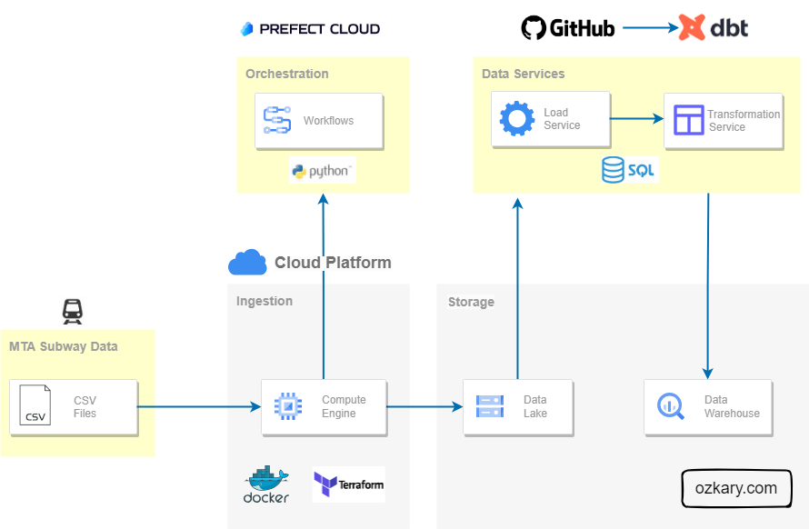
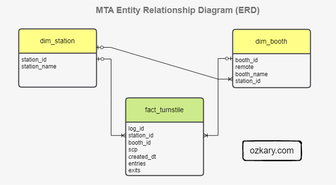
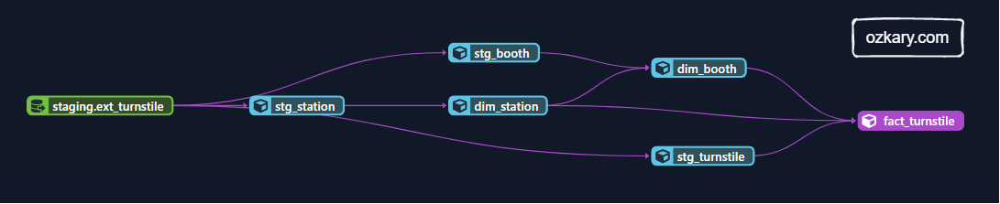
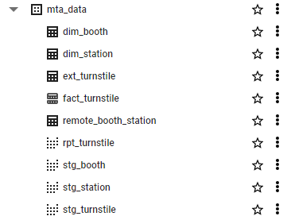
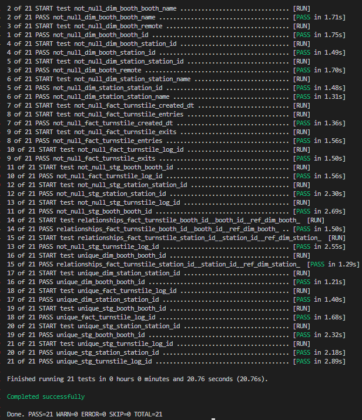
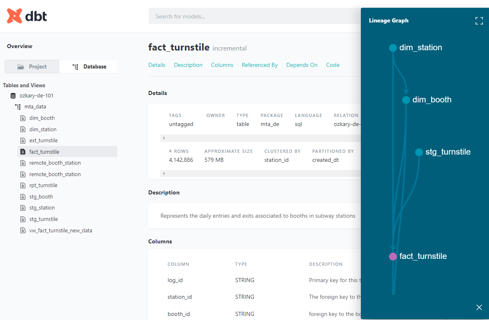
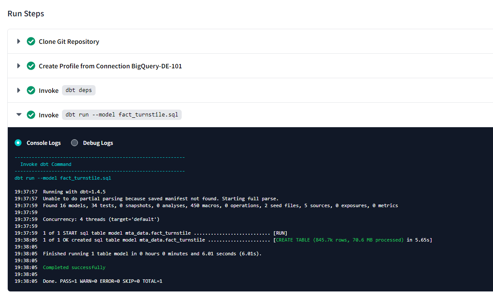

In this hands-on lab, we build upon our data engineering process where we previously focused on defining a data pipeline orchestration process. Now, we should focus on storing and making the data accessible for visualization and analysis. So far, our data is stored in a Data Lake, while Data Lakes excel at handling vast volumes of data, they are not optimized for query performance, so our step is to enable the bulk data processing and analytics by working on our Data Warehouse (DW).

During this exercise, we delve into the data warehouse design and implementation step, crafting robust data models, and designing transformation tasks. We explore how to efficiently load, cleanse, and merge data, ultimately creating dimension and fact tables. Additionally, we discuss areas like query performance, testability, and source control of our code, ensuring a reliable and scalable data solution. By leveraging incremental models, we continuously update our data warehouse with only the deltas (new updates), optimizing query performance and enhancing the overall data pipeline. By the end, we have a complete data pipeline, taking data from CSV to our data warehouse, equipped for seamless visualization and analysis.

## Data Warehouse Design

A data warehouse is an OLAP system, which serves as the central data repository for historical and aggregated data. In contrast to the ETL process employed by data lakes with Python code, a data warehouse relies on the ETL process. This fundamental distinction emphasizes the need for well-defined and optimized models within the database, enabling efficient data access and exceptional performance. 

> 👍 For the ETL process, the data is transformed before adding it to storage. For the ELT process, the data is first loaded in storage in its raw format, the transformation is then done before inserting into the dimension and fact tables.

Before building the concrete tables, our initial focus is on creating precise data models based on thorough analysis and specific requirements. To achieve this, we leverage SQL (Structured Query Language) and tools that facilitate model development in an automated, testable, and repeatable manner. By incorporating such tools into our project, we build the data services area in which we manage the data modeling and transformation to expand our architecture into the following:



> 👉 For our use case, we are using [Google BigQuery](https://cloud.google.com/bigquery/) as our data warehouse system. Make sure to review the Data Engineering Process - Design and Planning section and run the Terraform script to provision this resource.

### External Tables

An external table is not physically hosted within the data warehouse database. Since our raw data is stored on a data lake, we can reference that location and load those files as an external table. we can create an external table using the data lake files as the source by providing a file pattern to select all the compressed files. 

The following SQL can be executed as a query on the data warehouse. Access to the data lake should already be configured when the service accounts where assigned to the resources during the design and planning phase.

```sql
CREATE OR REPLACE EXTERNAL TABLE mta_data.ext_turnstile
OPTIONS (
  format = 'CSV',
  uris = ['gs://ozkary_data_lake_ozkary-de-101/turnstile/*.csv.gz']  
);

```

When this SQL script is executed, and the external table is created, the data warehouse retrieves the metadata about the external data, such as the schema, column names, and data types, without actually moving the data into the data warehouse storage. Once the external table is created, we can query the data using SQL as if it were a regular table. 

## Design and Architecture

During the design and architecture stage of our data warehouse project, our primary objective is to transition from conceptual ideas to concrete designs. Here, we make pivotal technical choices that pave the way for building the essential resources and defining our data warehouse approach. 

### Star Schema

We start by selecting the Star Schema model. This model consist of a central fact table that is connected to multiple dimension tables via foreign key relationships. The fact table contains the measures or metrics, while the dimension tables hold descriptive attributes. 

### Infrastructure

For the infrastructure, we are using a cloud hosted OLAP system, Google BigQuery. This is a system that can handle petabytes of data. It also provides MPP (Massive Parallel Processing), built-in indexing and caching, which improves query performance and reduce compute by caching query results. The serverless architecture of these systems help us on reducing cost. Because the system is managed by the cloud provider, we can focus on the data analysis instead of infrastructure management.

### Technology Stack

For the technology stack, we are using a SQL-centric approach. We want to be able to manage our models and transformation tasks within the memory context and processing power of the database, which tends to work best for large datasets and faster processing. In addition, this approach works well with a batch processing approach.

[dbt](https://www.getdbt.com/) (data build tool) is a SQL-centric framework which at its core is primarily focused on transforming data using SQL-based queries. It allows us to define data models and transformation logic using SQL and Jinja, a templating language with data transformation capabilities, such as loops, conditionals, and macros, within our SQL code. This framework enables us to build the actual data models as views, tables and SQL based transformation that are hosted on the data warehouse. 

As we build code for our data model and transformation tasks, we need to track it, manage the different versions and automate the deployments to our database. To manage this, we use [GitHub](https://github.com/), which is a web-based platform that provides version control and collaborative features for software development and management. It also provides CI/CD capabilities to help us execute test plans, build releases and deploy them. dbt connects with GitHub to manage deployments. This enables the dbt orchestration features to run the latest code as part of the pipeline. 

> 👍 A deployment consists of getting the latest model metadata, build it on the database, and run the incremental data tasks when new data is available in the data lake.

## Data Warehouse Implementation

The data warehouse implementation is the stage where the conceptual data model and design plans are transformed into a functional system by implementing the data models and writing the code for our transformation tasks.

### Data Modeling

Data modeling is the implementation of the structure of the data warehouse, creating models (views) and entities (tables), defining attributes (columns), and establishing data relationships to ensure efficient querying and reporting. It is also important to identify the primary keys, foreign keys, and indexes to improve data retrieval performance. 

To build our models, we should follow these specifications:

- Create an external table using the Data Lake folder and *.csv.gz file pattern as a source
  - ext_turnstile
- Create the staging models
  - Create the station view (stg_station) from the external table as source
    - Get the unique stations 
    - Create a surrogate key using the station name    
  - Create the booth view (stg_booth) from the external table as source    
    - Create a surrogate key using the booth UNIT and CA fields  
  - Create the fact view (stg_turnstile) from the external table as source
    - Create a surrogate key using CA, UNIT, SCP, DATE, time

Our physical data model should look like this:



#### Why do we use partitions and cluster

> 👍 We should always review the technical specifications of the database system to find out what other best practices are recommended to improve performance.

- Partitioning is the process of dividing a large table into smaller, more manageable parts based on the specified column. Each partition contains rows that share a common value like a specific date. A partition improves performance and query cost.

- When we run a query in BigQuery, it gets executed by a distributed computing infrastructure that spans multiple machines. Clustering is an optional feature in BigQuery that allows us to organize the data within each partition. The purpose of clustering is to physically arrange data within a partition in a way that is conducive to efficient query processing.

#### SQL Server and Big Query Concept Comparison

- In SQL Server, a clustered index defines the physical order of data in a table. In BigQuery, clustering refers to the organization of data within partitions based on one or more columns. Clustering in BigQuery does not impact the physical storage order like a clustered index in SQL Server.

- Both SQL Server and BigQuery support table partitioning. The purpose is similar, allowing for better data management and performance optimization. 

### Data Transformation

The data transformation phase is a critical stage in a data warehouse project. This phase involves several key steps, including data extraction, cleaning, loading, data type casting, use naming conventions, and implementing incremental loads to continuously insert the new information since the last update via batch processes.

For our transformation services, we follow these specifications:

- Use the staging models to build the physical models
  - Map all the columns to our naming conventions, lowercase and underline between words
  - Create the station dimension table (dim_station) from the stg_station model 
    - Add incremental strategy for ongoing new data       
  - Create the booth dimension table (dim_booth) from the stg_booth model    
    - Add incremental strategy for ongoing new data    
    - Use the station_name to get the foreign key, station_id
    - Cluster the table by station_id      
  - Create the fact table (fact_turnstile) from the stg_turnstile model
    - Add incremental strategy for ongoing new data    
    - Partition the table by created_dt and use day granularity
    - Cluster the table by station_id
    - Join on dimension tables to use id references instead of text
- Remove rows with null values for the required fields
  - Station, CA, UNIT, SCP, DATE, TIME
- Cast columns to the correct data types
  - created
- Continuously run all the model with an incremental strategy to append new records

## Install System Requirements and Frameworks

Before looking at the code, we need to setup our environment with all the necessary dependencies, so we can build our models.

### Requirements

> 👉 Verify that there are files on the data lake. If not, run the data pipeline process to download the files into the data lake.

> 👉 <a href="https://github.com/ozkary/data-engineering-mta-turnstile/tree/main/Step4-Data-Warehouse" target="_datawarehouse">Clone this repo or copy the files from this folder, dbt and sql and create a GitHub project
</a>

- CSV files in the data lake
- Create a [dbt](https://www.getdbt.com/) cloud account  
  - Link dbt with your GitHub project. 
  - Create schedule job on dbt cloud for every Sunday 9am
  - Or install locally (VM) and run from CLI
- GitHub account
- Google BigQuery resource 

#### Configure the CLI

##### Install dbt core and BigQuery dependencies 
Run these command from the Step4-Data-Warehouse/dbt folder

```bash
$ cd Step4-Data-Warehouse/dbt
$ pip install dbt-core dbt-bigquery  
$ dbt init
$ dbt deps 
```

##### Create a profile file
From the Step4-Data-Warehouse folder, run the following commands

```bash
$ cd ~
$ mkdir .dbt
$ cd .dbt
$ touch profiles.yml
$ nano profiles.yml
```

- Paste the profiles file content

> 👉 Use your dbt cloud project project information and cloud key file

- Run this command see the project folder configuration location
  
```bash
$ dbt debug --config-dir
```

- Update the content of that file to match your project information
  
```
Analytics:
  outputs:
    dev:
      dataset: mta_data
      job_execution_timeout_seconds: 300
      job_retries: 1
      keyfile: /home/.gcp/your-file.json
      location: us-east1
      method: service-account
      priority: interactive
      project: your-gcp-project
      threads: 2
      type: bigquery
  target: dev

```

##### Validate the project configuration
This should generate a list of all the assets that should be generated in the project including the constraints.

```bash
$ dbt list --profile Analytics
```

## Review the Code

With our environment setup and clear specifications about how to build the models and our transformation, we can now look at the code and see how that is done. Use Visual Studio code or a similar tool to edit this project.

The dbt folder contains the source code. The stating file has the view definitions. The core folder has the table definitions. The schema files have rules and data constraints that are used to validate the models. This is how we are able to test our models. 

The schema.yml file is a configuration file used to define the schema of the final output of the models. It provides the ability to explicitly specify the column names, data types, and other properties of the resulting table created by each dbt model. This file allows dbt to generate the appropriate SQL statements for creating or altering tables in the target data warehouse.

> 👍 All these files are executed with the dbt CLI. The files are compiled into SQL statements that are deployed to the database or just executed in memory to run the test and validation scripts. The compiled SQL is stored in the target folder. The transformation tasks are compiled into the run folder and executed on the database.

```
- dbt
  │
  ├─ models
  │   │
  │   ├─ core
  │   │   ├─ schema.yml
  │   │   ├─ dim_booth.sql
  │   │   ├─ dim_station.sql
  │   │   ├─ fact_turnstile.sql
  │   │   └─ ...
  │   ├─ staging
  │   │   ├─ schema_*.yml
  │   │   ├─ stg_booth.sql
  │   │   ├─ stg_station.sql
  │   │   ├─ stg_turnstile.sql
  │   │   └─ ...  
  │   ├─ target
  │   │   ├─ compile
  │   │   ├─ run
  │   │   └─ ...  
  └─ dbt_project.yml

```

### Lineage

Data lineage is the documentation and tracking of the flow of data from its origin to its destination, including all the intermediate processes and transformations that it undergoes. 



### Staging Data Models - Views

We use the view strategy to build our staging models. When these files are executed (via CLI commands), the SQL is generated and deployed to the database. We also add a test parameter to limit the number of data to 100 rows during the development process, which is removed when deploying. Jinja directives are in double brackets {{}}.

- stg_station.sql
  
```sql
{{ config(materialized='view') }}

with stations as 
(
  select 
    Station,
    row_number() over(partition by Station) as rn
  from {{ source('staging','ext_turnstile') }}   
  where Station is not null
)
select
    -- create a unique key based on the station name
    {{ dbt_utils.generate_surrogate_key(['Station']) }} as station_id,    
    Station as station_name
from stations
where rn = 1

-- use is_test_run false to disable the test limit
-- dbt build --m <model.sql> --var 'is_test_run: false'

  limit 100


```

- stg_booth.sql
  
```sql
{{ config(materialized='view') }}

with booths as 
(
  select
    UNIT,
    CA,
    Station,
    row_number() over(partition by UNIT, CA) as rn
  from {{ source('staging','ext_turnstile') }}   
  where Unit is not null and CA is not null and Station is not null
)
select
    -- create a unique key 
    {{ dbt_utils.generate_surrogate_key(['UNIT', 'CA']) }} as booth_id,
    UNIT as remote,
    CA as booth_name,
    Station as station_name
from booths
where rn = 1

-- dbt build --m <model.sql> --var 'is_test_run: false'


  limit 100



```
- stg_turnstile.sql
  
```sql

{{ config(materialized='view') }}

with turnstile as 
(
  select     
  CA,
  UNIT,
  STATION,
  concat(CA,UNIT,SCP) as REF,
  SCP,
  LINENAME,
  DIVISION,
  concat(log.DATE," ", log.TIME) as CREATED,
  ENTRIES,
  EXITS,
    row_number() over(partition by CA, UNIT, SCP, DATE, TIME) as rn
  from {{ source('staging','ext_turnstile') }} as log
  where Station is not null and DATE is not null and TIME is not null
  
)
select
    -- create a unique key 
    {{ dbt_utils.generate_surrogate_key(['REF', 'CREATED']) }} as log_id,
    CA as booth,
    UNIT as remote,
    STATION as station,

    -- unit and line information
    SCP as scp,
    LINENAME AS line_name,
    DIVISION AS division,

     -- timestamp
    cast(CREATED as timestamp) as created_dt,    
       
    -- measures
    cast(entries as integer) as entries,
    cast(exits as integer) as exits    
from turnstile
where rn = 1


-- dbt build --m <model.sql> --var 'is_test_run: false'

  limit 100


```

### Physical Data Models - Tables

we use the incremental strategy to build our tables. This enable us to continuously append data to our tables when there is new information. We use the models (views) to build the actual tables. When these scripts are executed (via CLI commands), the process checks if the object exists, if it does not exists, it creates it. It then reads the data from the views using CTE (common table expressions) and appends all the records that are not already in the table using the id, for the dimension tables. For the fact table, this is done by checking the created date condition.

- dim_station.sql

```sql

{{ config(materialized='incremental') }}

with stations as (
select 
    station_id, 
    station_name    
from {{ ref('stg_station') }} as d
where station_id is not null
)
select
    ns.station_id,
    ns.station_name
from stations ns

     -- logic for incremental models this = dim_station table
    left outer join {{ this }} dim
        on ns.station_id = dim.station_id
    where dim.station_id is null     

 

```

- dim_booth.sql

```sql

{{ config(materialized='incremental',
   cluster_by = "station_id"
 )}}

with booth as (
select 
    booth_id,
    remote,
    booth_name,
    station_name
from {{ ref('stg_booth') }}
where booth_id is not null 
),

dim_station as (
    select station_id, station_name from {{ ref('dim_station') }}   
)
select 
    b.booth_id,
    b.remote,
    b.booth_name,
    st.station_id
from booth b 
inner join dim_station st 
    on b.station_name = st.station_name

     -- logic for incremental models this = dim_booth table
    left outer join {{ this }} s
        on b.booth_id = s.booth_id
    where s.booth_id is null     
 

```

- fact_turnstile.sql

```sql
{{ config(materialized='incremental',
    partition_by={
      "field": "created_dt",
      "data_type": "timestamp",
      "granularity": "day"
      },
      cluster_by = "station_id"
    ) 
}}

with turnstile as (
    select 
        log_id,
        remote,
        booth,
        station,
        scp,
        line_name,
        division,
        created_dt,
        entries,
        exits
    from {{ ref('stg_turnstile') }}
    where log_id is not null
), 

dim_station as (
    select station_id, station_name from {{ ref('dim_station') }}   
),

dim_booth as (
    select booth_id, remote, booth_name  from {{ ref('dim_booth') }}   
)
select 
    log.log_id,
    st.station_id,
    booth.booth_id,
    log.scp,
    log.line_name,
    log.division,
    log.created_dt,
    log.entries,
    log.exits
from turnstile as log
left join dim_station as st
   on log.station = st.station_name
left join dim_booth as booth
on log.remote = booth.remote and log.booth = booth.booth_name 

     -- logic for incremental models this = fact_turnstile table
    left outer join {{ this }} fact
        on log.log_id = fact.log_id
    where fact.log_id is null     

 

```

- schema.yml
  
```yml
version: 2

models:
  - name: dim_station
    description: >
      List of unique stations identify by station_id.       
    columns:
          - name: station_id
            description: The station identifier            
            tests:
                - unique:
                    severity: warn
                - not_null:
                    severity: warn
          - name: station_name
            description: the station name
            tests:
                - not_null:
                    severity: warn

  - name: dim_booth
    description: >
      List of unique booth identify by booth_id.  
    columns:
          - name: booth_id
            description: The booth identifier            
            tests:
                - unique:
                    severity: warn
                - not_null:
                    severity: warn
          - name: remote
            description: the remote gate name
            tests:
                - not_null:
                    severity: warn
          - name: booth_name
            description: the station booth
            tests:
                - not_null:
                    severity: warn
          - name: station_id
            description: the station id
            tests:
                - relationships:
                  to: ref('dim_station')
                  field: station_id
                  severity: warn              
  - name: fact_turnstile
    description: >
     Represents the daily entries and exits associated to booths in subway stations
    columns:
          - name: log_id
            description: Primary key for this table, generated with a concatenation CA, SCP,UNIT, STATION CREATED            
            tests:
                - unique:
                    severity: warn
                - not_null:
                    severity: warn
          - name: booth_id
            description: foreign key to the booth dimension            
            tests:
               - relationships:
                  to: ref('dim_booth')
                  field: booth_id
                  severity: warn
          - name: station_id          
            description:  The foreign key to the station dimension            
            tests:
               - relationships:
                  to: ref('dim_station')
                  field: station_id
                  severity: warn
          - name: scp
            description: The device address
          - name: line_name
            description: The subway line
          - name: division
            description: The subway division          
          - name: created_dt
            description: The date time for the activity
            tests:
                - not_null:
                    severity: warn
          - name: entries
            description: The number of entries
            tests:
                - not_null:
                    severity: warn
          - name: exits
            description: the number of exits 
            tests:
                - not_null:
                    severity: warn
```

#### Incremental Models

In dbt, an incremental model uses a merge operation to update a data warehouse's tables incrementally rather than performing a full reload of the data each time. This approach is particularly useful when dealing with large datasets and when the source data has frequent updates or inserts. Incremental models help optimize data processing and reduce the amount of data that needs to be processed during each run, resulting in faster data updates. 

SQL merge query:

```sql

merge into `ozkary-de-101`.`mta_data`.`dim_station` as DBT_INTERNAL_DEST
using (

  with stations as (
  select 
      station_id, 
      station_name    
  from `ozkary-de-101`.`mta_data`.`stg_station` as d
  )
  select
      ns.station_id,
      ns.station_name
  from stations ns
  -- logic for incremental models
  left outer join `ozkary-de-101`.`mta_data`.`dim_station` s
      on ns.station_id = s.station_id
  where s.station_id is null     
  -- 
      ) as DBT_INTERNAL_SOURCE
      on (FALSE)  
  when not matched then insert
      (`station_id`, `station_name`)
  values
      (`station_id`, `station_name`)
```

## How to Run It

Follow these steps to build the data models on our database.

### Build the models and set the test run variable to false. This allows for the full dataset to be created

```bash
$ dbt build --select stg_booth.sql --var 'is_test_run: false'
$ dbt build --select stg_station.sql --var 'is_test_run: false'
$ dbt build --select stg_turnstile.sql --var 'is_test_run: false'

$ dbt build --select dim_booth.sql 
$ dbt build --select dim_station.sql 
$ dbt build --select fact_turnstile.sql

```  

After running these command, the following resources should be in the data warehouse:



> 👍 The build command is responsible for compiling, generating and deploying the SQL code for our dbt project, while the run command executes that SQL code against your data warehouse to update the data. Typically, we would run dbt build first to compile the project, and then run dbt run to execute the compiled code against the database.

### Validate the project. 

There should be no compilation errors.
  
```bash
$ dbt debug
```

### Run the test cases

All test should pass.

```bash
$ dbt test
```



### Generate documentation

Run generate to create the documentation. We can then run serve to view the documentation on the browser.

```bash
$ dbt docs generate
$ dbt docs serve
```

This is the documentation for the fact table with the lineage graph showing how it was built.



### Schedule the job

Login to dbt cloud and set this job:

  - On dbt Cloud setup the dbt schedule job to run every Sunday at 9am
  - Use the production environment
  - Use the following command
  
```bash
$ dbt run --model fact_turnstile.sql
```
> 👍 We should also note, that we can run the fact_turnstile.sql model to test the data import from the CLI

After running the cloud job, the log should show the following information with the number of rows affected. 



> 👍 There should be files on the data lake for the job to insert any new records. To validate this, run these queries from the Data Warehouse to check how many rows are in each table.

```sql
-- check station dimension table
select count(*) from mta_data.dim_station;

-- check booth dimension table
select count(*) from mta_data.dim_booth;

-- check the fact table
select count(*) from mta_data.fact_turnstile;

-- check the staging fact data
select count(*) from mta_data.stg_turnstile;
```

### Manually Query the data lake for new data

To test the for new records, we can manually run this query. 

> This is automatically done when we run the fact table model

```sql
with turnstile as (
    select 
        log_id      
    from mta_data.stg_turnstile
)
select 
    log.log_id    
from turnstile as log
-- logic for incremental models find new rows that are not in the fact table
left outer join mta_data.fact_turnstile fact
    on log.log_id = fact.log_id
where fact.log_id is null     

```

## Summary

During this data warehouse exercise, we delve into the design and implementation step, crafting robust data models, and designing transformation tasks. Carefully selecting a star schema design and utilizing BigQuery as our OLAP system, we optimize performance and handle large datasets efficiently. Leveraging SQL for coding and a SQL-Centric framework, we ensure seamless data modeling and transformation. We use GitHub for our source code management and CI/CD tool integration, so the latest changes can be built and deployed. Thorough documentation and automated data transformations underscore our commitment to data governance and streamlined operations. The result is a resilient and future-ready data warehouse capable of meeting diverse analytical needs.

## Next Step

With our data warehouse design and implementation complete, we have laid a solid foundation to unleash the full potential of our data. Now, we venture into the realm of data analysis and visualization, where we can leverage powerful tools like Power BI and Looker to transform raw data into actionable insights.

Coming Soon!

> 👉 [Data Engineering Process Fundamentals - Data Analysis and Visualization]

Thanks for reading.

Send question or comment at Twitter @ozkary

👍 Originally published by [ozkary.com](https://www.ozkary.com)