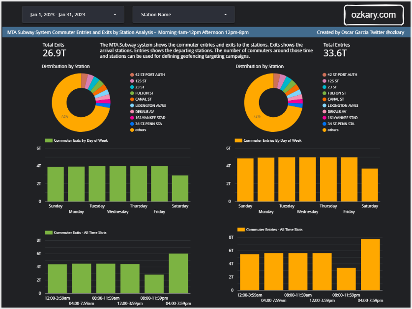
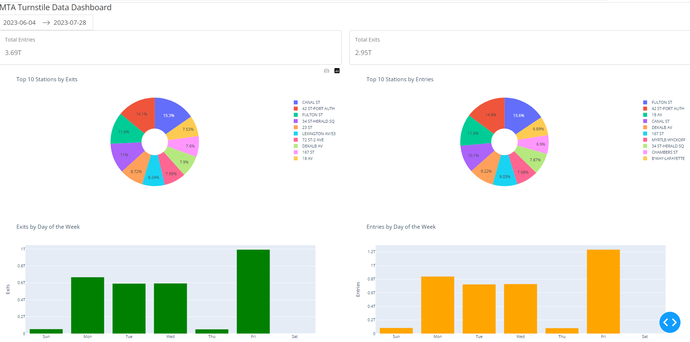
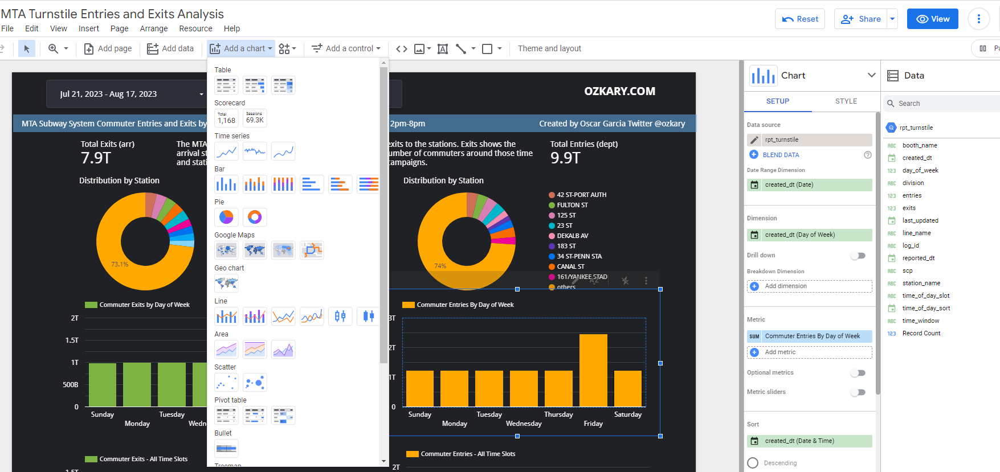

After learning the concepts of efficient analysis and visualization, we are ready to embark on the data analysis and visualization exercise in our data engineering process. This phase marks an inflection point in our transformation of data into valuable insights.

With the understanding on best practices for data analysis, we first create a code-based dashboard utilizing Python and Plotly. We then follow up by using a high-quality enterprise tool, such as Looker, to construct a low-code cloud-hosted dashboard. This can provides us with enough understanding of the type of effort that each approach takes.

> 👍 This is a dashboard created with Looker


Once we have built our dashboard, we can align with our original requirements and work on the data analysis conclusion, which allows the stake holders to make the corresponding business decisions. But before we start coding, let's start by reviewing some of the specifications for our data analysis, which defines the blue print for our implementation effort.

## Specifications

At this point of the process, we understand the requirements, and we are also familiar with the data, so we can define our specifications as follows:

- Identify the relevant measures, exits and entries
- Perform distribution analysis by station
  - This provides a geo-fence boundary
- Perform distribution analysis by day of the week and time slots
  
By calculating the total number of passengers for arrivals and departures, we gain a comprehensive understanding of passenger flow dynamics. Furthermore, we can employ distribution analysis to investigate variations across stations, days of the week, and time slots. These analyses provide essential insights for business strategy and decision-making, allowing us to identify peak travel periods, station preferences, and time-specific trends that can help us make informed decisions.

### Data Analysis Requirements

- Identify the time slots for morning and afternoon analysis
  - 12:00am-3:59am 
  - 04:00am-7:59am 
  - 08:00am-11:59am 
  - 12:00pm-3:59pm 
  - 04:00pm-7:59pm 
  - 08:00pm-11:59pm	
- Analyze the data by commuter exits (arrival) and entries (departure)
- Use a master filter for a date rage to control all the charts
- Add a secondary filter component to select stations
- Show the total number of entries and exits for the selected date range 
  - Use a score card component
- Look at the distribution by stations, which represents the busiest stations
  - Create donut charts using the subway station name as main dimension 
- Look at the distribution using the day of the week to identify the busiest days
  - Add a bar chart to see the exits and entries per day
 - Look at the distribution using the time slot to identify the busiest hours of the day
  - Add a bar chart to see the exits and entries within each time slot

## Dashboard Design

For the dashboard design, we can use a a two column layout and place the exits components in the left column and the entries components on the right column of the dashboard. We can also add a header container for the filters, date range and station name. 

### UI Components

For our dashboard components, we should use the following:

- Date range picker
- Station name list box
- For each selected measure (exits, entries), we should use a set of the following components
  - A score cards for the total numbers
  - A donut chart for the station distribution
  - A bar chart for the day of the week distribution
  - A bar chart for the time slot distribution

## Review the Code - Code Centric

The dashboard layout is done using HTML for the presentation and Python to build the different HTML elements using the [dash](https://dash.plotly.com/) library.

```javascript
# Define the layout of the app
app.layout = html.Div([
    html.H4("MTA Turnstile Data Dashboard"),
        
    dcc.DatePickerRange(
        id='date-range',
        start_date=data['created_dt'].min(),
        end_date=data['created_dt'].max(),
        display_format='YYYY-MM-DD'
    ),
 
    dbc.Row([
        dbc.Col(
            dbc.Card(
                dbc.CardBody([
                    html.P("Total Entries"),
                    html.H5(id='total-entries')
                ]),
                className='score-card'
            ),
            width=6
        ),
        dbc.Col(
            dbc.Card(
                dbc.CardBody([
                    html.P("Total Exits"),
                    html.H5(id='total-exits')
                ]),
                className='score-card'
            ),
            width=6
        )
    ], className='score-cards'),

    dbc.Row([
            dbc.Col(
                dcc.Graph(id='top-entries-stations', className='donut-chart'),
                width=6
            ),
            dbc.Col(
                dcc.Graph(id='top-exits-stations', className='donut-chart'),
                width=6
            )
    ], className='donut-charts'),

    dbc.Row([
                dbc.Col(
                    dcc.Graph(id='exits-by-day', className='bar-chart'),
                    width=6
                ),
                dbc.Col(
                    dcc.Graph(id='entries-by-day', className='bar-chart'),
                    width=6
                )
    ], className='bar-charts'),

    dbc.Row([
                dbc.Col(
                    dcc.Graph(id='exits-by-time', className='bar-chart'),
                    width=6
                ),
                dbc.Col(
                    dcc.Graph(id='entries-by-time', className='bar-chart'),
                    width=6
                )
    ], className='bar-charts')

])
```

The `update_dashboard` handles the data range on change event. As the date range changes, the data is filtered. We then calculate the score card values for exits and entries. We then make the calls to generated the other charts using the filtered data frame. Lastly, we return all the components, so the dashboard can be rendered.

```python

def update_dashboard(start_date, end_date):
    filtered_data = data[(data['created_dt'] >= start_date) & (data['created_dt'] <= end_date)]   
        
    total_entries = filtered_data['entries'].sum() / 1e12  # Convert to trillions
    total_exits = filtered_data['exits'].sum() / 1e12  # Convert to trillions
      
    measures = ['exits','entries']    
    filtered_data["created_dt"] = pd.to_datetime(filtered_data['created_dt'])  
    measures = ['exits','entries']  
    
    exits_chart , entries_chart = create_station_donut_chart(filtered_data)
    exits_chart_by_day ,entries_chart_by_day = create_day_bar_chart(filtered_data, measures)
    exits_chart_by_time, entries_chart_by_time = create_time_bar_chart(filtered_data, measures)
    
    return (
        f"{total_entries:.2f}T",
        f"{total_exits:.2f}T",
        entries_chart,
        exits_chart,
        exits_chart_by_day,
        entries_chart_by_day,
        exits_chart_by_time,
        entries_chart_by_time
    )
```

The `create_station_donut_chart` function builds the donut charts. It gets the top stations with the most entries ans exits. It thens build the charts.

```python
def create_station_donut_chart(df: pd.DataFrame ) -> Tuple[go.Figure, go.Figure]:
    """
     creates the station distribution donut chart   
    """
    top_entries_stations = df.groupby('station_name').agg({'entries': 'sum'}).nlargest(10, 'entries')
    top_exits_stations = df.groupby('station_name').agg({'exits': 'sum'}).nlargest(10, 'exits')
    
    entries_chart = px.pie(top_entries_stations, names=top_entries_stations.index, values='entries',
                           title='Top 10 Stations by Entries', hole=0.3)
    exits_chart = px.pie(top_exits_stations, names=top_exits_stations.index, values='exits',
                         title='Top 10 Stations by Exits', hole=0.3)
    
    entries_chart.update_traces(marker=dict(colors=px.colors.qualitative.Plotly))
    exits_chart.update_traces(marker=dict(colors=px.colors.qualitative.Plotly))
    return entries_chart, exits_chart

```

The `create_day_bar_chart` builds two bar charts to show the data distribution based on the day of the week. Since a date-time data type does not now about the actual day. We need to map the information to our day category and add the result series as another column. This enables us to build the charts.

```python
def create_day_bar_chart(df: pd.DataFrame, measures: List[str]) -> Tuple[go.Figure, go.Figure]:
    """
    Creates a bar chart using the week days from the given dataframe.
    """
    measures = ['exits','entries']
    day_categories = ['Sun', 'Mon', 'Tue', 'Wed', 'Thu', 'Fri', 'Sat']   
    group_by_date = df.groupby(["created_dt"], as_index=False)[measures].sum()
    
    df['weekday'] = pd.Categorical(df['created_dt'].dt.strftime('%a'),
                                                 categories=day_categories,
                                                 ordered=True)        
       
    group_by_weekday =  df.groupby('weekday', as_index=False)[measures].sum()
       
    exits_chart_by_day = px.bar(group_by_weekday, x='weekday', y='exits', color='weekday',
                                title='Exits by Day of the Week', labels={'weekday': 'Day of the Week', 'exits': 'Exits'},
                                color_discrete_sequence=['green'])
    
    entries_chart_by_day = px.bar(group_by_weekday, x='weekday', y='entries', color='weekday',
                                  title='Entries by Day of the Week', labels={'weekday': 'Day of the Week', 'entries': 'Entries'},
                                  color_discrete_sequence=['orange'])
    
    # Hide the legend on the side
    exits_chart_by_day.update_layout(showlegend=False)
    entries_chart_by_day.update_layout(showlegend=False)   

    # Return the chart
    return exits_chart_by_day, entries_chart_by_day
```

The `create_time_bar_chart` builds two bar charts showing the data distribution at particular times of the day. Similar to resolving the day name, we need to map and label our time range, so we can create another series with that label. This enable us to create those charts.

```python
def create_time_bar_chart(df: pd.DataFrame, measures : List[str] ) -> Tuple[go.Figure, go.Figure]:

    """
    Creates a bar chart using the time slot category
    """
   
    # Define time (hr) slots
    time_slots = {
        '12:00-3:59am': (0, 3, 0),
        '04:00-7:59am': (4, 7, 1),
        '08:00-11:59am': (8, 11, 2),
         '12:00-3:59pm': (12, 15, 3),
        '04:00-7:59pm': (16, 19, 4),
        '08:00-11:59pm': (20, 23, 5)
    }
        
    # Add a new column 'time_slot' based on time ranges
    def categorize_time(row):
        for slot, (start, end, order) in time_slots.items():
            if start <= row.hour <= end:
                return slot
            
    df['time_slot'] = df['created_dt'].apply(categorize_time)
    group_by_time = df.groupby('time_slot', as_index=False)[measures].sum()

    # Sort the grouped_data DataFrame based on the sorting value
    group_by_time_sorted = group_by_time.sort_values(by=['time_slot'], key=lambda x: x.map({slot: sort_order for slot, (_, _, sort_order) in time_slots.items()}))

        
    exits_chart_by_time = px.bar(group_by_time_sorted, x='time_slot', y='exits', color='time_slot',
                                title='Exits by Day of the Week', labels={'time_slot': 'Time of Day', 'exits': 'Exits'},
                                color_discrete_sequence=['green'])
    
    entries_chart_by_time = px.bar(group_by_time_sorted, x='time_slot', y='entries', color='time_slot',
                                  title='Entries by Day of the Week', labels={'time_slot': 'Time of Day', 'entries': 'Entries'},
                                  color_discrete_sequence=['orange'])
    # Hide the legend on the side
    exits_chart_by_time.update_layout(showlegend=False)
    entries_chart_by_time.update_layout(showlegend=False)

    return exits_chart_by_time, entries_chart_by_time

```

The result should be this dashboard:



### Requirements

> 👉 <a href="https://github.com/ozkary/data-engineering-mta-turnstile/tree/main/Step5-Analysis" target="_repo">Clone this repo</a> or copy the files from this folder, dbt and sql.

- Use the analysis_data.csv file
  - We are using a local file for this implementation
- Install the Python dependencies

```bash
$ pip install pandas
$ pip install plotly
$ pip install dash
$ pip install dash_bootstrap_components
```

### How to Run It

After installing the dependencies and downloading the code, we should be able to run the code from terminal by typing:

```bash
$ python3 dashboard.py
```

We should note that this is a simple implementation to illustrate the amount of effort that takes to build a dashboard using code. The code uses a local csv file. To connect to the data warehouse, we need to expand this code to use an API call that is authorized to access the data warehouse. This approach works wells for small teams that are working closely together running experiments on the data, but for a more enterprise solution, we should look at using a tool like Looker or PowerBI. Let's take a look at that next.

## Review the Code - Low-Code

Tools like Looker and PowerBI excel at data visualization with little to no code. Since those tools provide use with all the visual tools to configure a dashboard, there is really no much code. As an example, these tools can take a date-time field and allow us to show the day of the week automatically. 

Only for some situation where there is no out-of-box solution, we could add another field with a snippet of code. If we recall, we have a time range requirement. Since this is very particular to our project, we need to create that new series with our labels. The way this is done is by adding a new field that maps to the date-time hour value. That looks as follows:

```python
CASE 
    WHEN HOUR(created_dt) BETWEEN 0 AND 3 THEN "12:00-3:59am" 
    WHEN HOUR(created_dt) BETWEEN 4 AND 7 THEN "04:00-7:59am" 
    WHEN HOUR(created_dt) BETWEEN 8 AND 11 THEN "08:00-11:59am" 
    WHEN HOUR(created_dt) BETWEEN 12 AND 15 THEN "12:00-3:59pm" 
    WHEN HOUR(created_dt) BETWEEN 16 AND 20 THEN "04:00-7:59pm" 
    WHEN HOUR(created_dt) BETWEEN 20 AND 23 THEN "08:00-11:59pm" 
END
```

### Requirements

The only requirement here is to sign up with Looker Studio and have access to a data warehouse or database than can serve data, and it is accessible from outside sources.

> 👉 [Sign-up for Looker Studio](https://lookerstudio.google.com/)

Other Visualizations tools: 

- [PowerBI](https://powerbi.microsoft.com/)
- [Tableau](https://www.tableau.com/)

### Looker UI

Take a look at the image below. It is the Looker UI. We should become familiar with the following areas:

- Add data: Use this to add a new data source
- Add a chart: This allows us to add new charts
- Add a control: This is where we can add the date range and station name list
- Canvas: This is where we drop all the components
- Setup Pane: Enable us to configure the date range, dimension, measures and sort settings
- Style Pane: This is where we can configure the colors, font 
- Data Pane:  It shows us the data sources with the fields. Here we can add new fields.
  - New fields are create as functions. As we hover over the field, we are able to see a function (fx) icon, which means that we can edit the function and configure our snippet



### How to Build it

- Sign up for a looker account or use another BI tool
- Create a new dashboard
- Click on the Add Data button
- Use the connector for our data source
   -  This should enable us to configure the credentials for the access
   -  Pick the view rpt_turnstile which already has the join with the fact_table and the dimension tables
- Once the data is loaded, we can see the dimensions and measures
- Add the dashboard filters
  - Add a date range control for the filter, this should use the created_dt field
  - Add a list control and associate it with the station name
- Add the rest of the charts
- All charts should be associated with the date range dimension
  - This enables the filtering to cascade to all the charts
- Use the entries and exits measures for all the dashboards
  - Add two scorecards for the sum of entries and exits 
  - Add a donut char for the exits and entries distribution by stations
  - Add two bar charts (entries and exits) and use the week day value from the created date dimension
    - Sort then by the week day. Use the day number (0-6) not name (Sun-Sat). This is done by adding a new field with this code and using that for sorting

```python
WEEKDAY(created_dt)
```
  - Create the time slot dimension field (click add field and enter this definition)
```python
CASE 
    WHEN HOUR(created_dt) BETWEEN 0 AND 3 THEN "12:00-3:59am" 
    WHEN HOUR(created_dt) BETWEEN 4 AND 7 THEN "04:00-7:59am" 
    WHEN HOUR(created_dt) BETWEEN 8 AND 11 THEN "08:00-11:59am" 
    WHEN HOUR(created_dt) BETWEEN 12 AND 15 THEN "12:00-3:59pm" 
    WHEN HOUR(created_dt) BETWEEN 16 AND 19 THEN "04:00-7:59pm" 
    WHEN HOUR(created_dt) BETWEEN 20 AND 23 THEN "08:00-11:59pm" 
END
```
  - Add two bar charts (entries and exits) and use the time slot dimension
    - Use the hour value from the created date dimension for sorting by adding a new field and using that for your sort criteria

```python
HOUR(created_dt)
```

### View the Dashboard

Load the dashboard by clicking this link:

> 👉 [View the dashboard online](https://lookerstudio.google.com/reporting/94749e6b-2a1f-4b41-aff6-35c6c33f401e/)

## Data Analysis Conclusions

By looking at the dashboard, the following conclusions can be observed:

- The stations with the highest distribution represent the busiest location 
- The busiest time slot for both exits and entries is the hours between 4pm to 9pm
- All days of the week show a high volume of commuters
- Businesses can select the station close to their location for further analysis
  
With these observations, plans can be made to optimize the marketing campaigns and target users around a geo-fence area and hours of the day with proximity to the corresponding business locations.  

## Summary

??

## Next Step

We have completed our data pipeline from a CSV files to our data warehouse and dashboard. We can now discuss an advanced concept in data engineering, data streaming, which enables the integration of data in real-time.

Coming Soon!

> 👉 [Data Engineering Process Fundamentals - Real-Time Data]

Thanks for reading.

Send question or comment at Twitter @ozkary

👍 Originally published by [ozkary.com](https://www.ozkary.com)