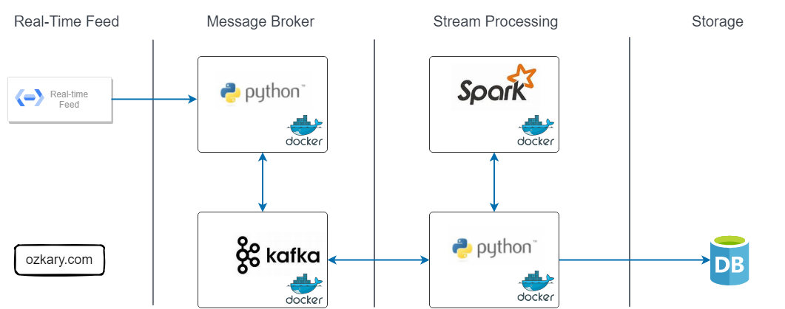

In modern data engineering solutions, the ability to handle streaming data is an absolute necessity. Many businesses require real-time insights to monitor and quickly respond to changing operational and performance conditions. This is where data streaming comes in, integrating real-time data into data warehouses and visual dashboards. To incorporate this capability into a data engineering solution, it's crucial to grasp the concept of data streaming and explore how technologies like [Apache Kafka](https://kafka.apache.org/) and [Apache Spark](https://spark.apache.org/) enable us to construct dynamic streaming data pipelines.

> 👉 [Data Engineering Process Fundamentals - Data Analysis and Visualization](https://www.ozkary.dev/data-engineering-process-fundamentals-data-analysis-visualization/)

## What is Data Streaming

Data streaming enables us to build data integration in real-time. Unlike traditional batch processing, where data is collected and processed periodically, streaming data arrives continuously by and is processed on-the-fly. This kind of integration empowers organizations to:

- React Instantly: Timely responses to events and anomalies become possible
- Predict Trends: Identify patterns and trends as they emerge
- Enhance User Experience: Provide real-time updates and personalization
- Optimize Operations: Streamline processes and resource allocation

### Data Streaming Channels

Data streaming is a continuous data flow which can arrive from a channel that is usually hosted on an HTTP end-point. The type of the channel technology depends on the provider technology stack and can be any of the following:

- Web Hooks: Web hooks are like virtual messengers that notify us when something interesting happens on the web. They are HTTP callbacks triggered by specific events, such as a change in a system. To harness data from web hooks, we set up endpoints that listen for these notifications, allowing us to react instantly to changes.

- Events: Events are a fundamental concept in data streaming. They represent occurrences in a system or application, such as a user click, a sensor detecting a temperature change, or a train arrival to a station. Events can be collected and processed in real-time by using a middleware platform like Apache Kafka or RabbitMQ, providing insights into user behavior, system health, and more.

- API Integration: APIs (Application Programming Interfaces) are bridges between different software systems. Through API integration, we can fetch data from external services, social media platforms, IoT devices, or any source that exposes an API. This seamless connectivity enables us to incorporate external data into our applications and processes by scheduling calls to the API at a certain frequency.

> 👍 Events are used for a wide range of real-time applications, including IoT data collection, application monitoring, and user behavior tracking. Web hooks are typically employed for integrating external services, automating workflows, and receiving notifications from third-party platforms.

### Scaling to Handle a Data Stream

Data streaming sources often produce small payload size with high volume of messages. This introduces scalability concerns that should be addressed with essential components like the following:

- Streaming Infrastructure: Robust streaming infrastructure is the backbone of data streaming. This includes systems like Apache Kafka, AWS Kinesis, or Azure Stream Analytics, which facilitate the ingestion, processing, and routing of data streams

- Real-Time Processing: Traditional batch processing won't cut it for data streaming. We need real-time processing frameworks like [Apache Storm](https://storm.apache.org/), or Apache Spark Streaming to handle data as it flows

- Data Storage: Storing and managing streaming data is crucial. we might use data lakes for long-term storage and databases optimized for real-time access. Cloud storage solutions offer scalability and reliability

- Analytics and Visualization: To derive meaningful insights, we need analytics tools capable of processing streaming data. Visualization platforms like PowerBI, Looker, or custom dashboards can help you make sense of the information in real time

- Monitoring and Alerts: Proactive monitoring ensures that your data streaming pipeline is healthy. Implement alerts and triggers to respond swiftly to anomalies or critical events

- Scalable Compute Resources: As data volumes grow, compute resources should be able to scale horizontally to handle increased data loads. Cloud-based solutions are often used for this purpose

## Data Streaming Components

At the heart of data streaming solutions lies technologies like Apache Kafka, a distributed event streaming platform, and Apache Spark, a versatile data processing engine. Together, they form a powerful solution that ingests, processes, and analyzes streaming data at scale.

### Apache Kafka

Kafka acts as the ingestion layer or message broker in the streaming pipeline. It serves as a highly durable, fault-tolerant, and scalable event streaming platform. Data producers, which can be various sources like applications, sensors, or webhooks publish events (messages) to Kafka topics. These events are typically small pieces of data containing information such as transactions, logs, or sensor readings. This is a simplified overview of how Kafka works:

- Kafka organizes events into topics. A topic is a logical channel or category to which records (messages) are sent by producers and from which records are consumed by consumers. Topics serve as the central mechanism for organizing and categorizing data within Kafka. Each topic can have multiple partitions to support fail-over scenarios
  
  - Kafka is distributed and provides fault tolerance. If a broker (Kafka server) fails, partitions can be replicated across multiple brokers

- Kafka follows a publish-subscribe model. Producers send records to topics, and consumers subscribe to one or more topics to receive and process those records

  - A producer is a program or process responsible for publishing records to Kafka topics. Producers generate data, which is then sent to one or more topics. Each message in a topic is identified by an offset, which represents its position within the topic.

  - A consumer is a program or process that subscribes to one or more topics and processes the records within them. Consumers can read data from topics in real-time and perform various operations on it, such as analytics, storage, or forwarding to other systems

### Apache Spark

Apache Spark Streaming is a micro-batch processing framework built on top of Apache Spark. It enables real-time data processing by ingesting data from Kafka topics in mini-batches. Here's how the process works:

> 👍 Apache Spark offers a unified platform for both batch and stream processing. If your application requires seamless transitions between batch and stream processing modes, Spark can be a good fit.

- Kafka Integration: Spark Streaming integrates with Kafka using the Kafka Direct API. It can consume data directly from Kafka topics, leveraging Kafka's parallelism and fault tolerance features

- Mini-Batch Processing: Spark Streaming reads data from Kafka topics in mini-batches, typically ranging from milliseconds to seconds. Each mini-batch of data is treated as a Resilient Distributed Dataset (RDD) within the Spark ecosystem

- Data Transformation: Once the data is ingested into Spark Streaming, we can apply various transformations, computations, and analytics on the mini-batches of data. Spark provides a rich set of APIs for tasks like filtering, aggregating, joining, and machine learning

- Windowed Operations: Spark Streaming allows us to perform windowed operations, such as sliding windows or tumbling windows, to analyze data within specific time intervals. This is useful for aggregating data over fixed time periods (e.g., hourly, daily) or for tracking patterns over sliding windows

- Output: After processing, the results can be stored in various destinations, such as a data lake (e.g., Hadoop HDFS), a data warehouse (e.g., BigQuery, Redshift), or other external systems. Spark provides connectors to these storage solutions for seamless data persistence

### Benefits of a Kafka and Spark Integration

A Kafka and Spark integration enables us to build solutions with High Availability requirements due to the following features:

- Fault Tolerance: Kafka ensures that events are not lost even in the face of hardware failures, making it a reliable source of data

- Scalability: Kafka scales horizontally, allowing you to handle increasing data volumes by adding more Kafka brokers

- Flexibility: Spark Streaming's flexibility in data processing and windowing operations enables a wide range of real-time analytics

- End-to-End Pipeline: By combining Kafka's ingestion capabilities with Spark's processing power, you can create end-to-end data streaming pipelines that handle real-time data ingestion, processing, and storage

## Solution Design and Architecture

For our solution strategy, we follow a design as shown below. This design helps us ensure the smooth flow of data, efficient processing and storage, so it can become immediately available in our data warehouse and consequently the visualization tools. Let's break down each component and explain its purpose.

### Components

- Real-Time Data Source:
   - This is an external data source, which continuously emits data as events or messages

- Message Broker Layer:
   - Our message broker layer as the central hub for data ingestion and distribution. It consists of two vital components:
     - Kafka Instance: Kafka acts as a scalable message broker and entry point for data ingestion. It efficiently collects and organizes data in topics from the source
     - Kafka Producer (Python): To bridge the gap between the data source and Kafka, we write a Python-based Kafka producer. This component is responsible for capturing data from the real-time source and forwarding it to the Kafka instance and corresponding topic

- Stream Processing Layer:
   - The stream processing layer is where the messages from Kafka are processed, aggregated and sent to the corresponding data storage. This layer also consists of two key components:   
     - Spark Instance: Apache Spark, a high-performance stream processing framework, is responsible for processing and transforming data in real-time
     - Stream Consumer (Python): In order to consume the messages from a Kafka topic, we write a Python component that acts as both a Kafka Consumer and Spark application. 
       - The Kafka consumer retrieves data from the Kafka topic, ensuring that the data is processed as soon as it arrives
       - The Spark application process the messages, aggregates the data and saves the results in the data warehouse. This dual role ensures efficient data processing and storage.

- Data Warehouse:
   - As the final destination for our processed data, the data warehouse provides a reliable and structured repository for storing the results of our real-time data processing, so visualization tools like Looker and PowerBI can display the data as soon as the dashboards are refreshed

> 👉 We should note that dashboards query the data from the database. This means that for a near real-time data to be available, the dashboard data needs to be refreshed at certain intervals (e.g., minutes or hourly). For real-time data to be pushed to a dashboard, there needs to be a live connection (socket) between the dashboard and the streaming platform, which is not done from the data warehouse but another system component.

### DevOps Support - Containerization

In order to continue to meet our DevOps requirement, enhance scalability and manageability,  and following best enterprise level practices, we use Docker containers for all of our components. Each component, our Kafka and Spark instance as well as our two Python-based components, runs in separate Docker container. This ensures modularity, easy deployment, and resource isolation.

### Advantages

Our data streaming design offers several advantages:

     - Real-time Processing: Data is processed as it arrives, enabling timely insights and rapid response to changing conditions
     - Scalability: The use of Kafka and Spark allows us to scale our architecture effortlessly to handle growing data volumes
     - Containerization: Docker containers simplify deployment and management, making our system highly portable and maintainable
     - Integration: The seamless integration of Kafka, Spark, and the Kafka consumer as a Spark client ensures data continuity and efficient processing

This data streaming strategy, powered by Kafka and Spark, empowers us to unlock real-time insights from our data streams, providing valuable information for rapid decision-making, analytics, and storage.

## Summary

In today's data-driven landscape, data streaming solutions are an absolute necessity, enabling the rapid processing and analysis of vast amounts of real-time data. Technologies like Kafka and Spark play a pivotal role in empowering organizations to harness real-time insights from their data streams.

Kafka and Spark, work together seamlessly to enable real-time data processing and analytics. Kafka handles the reliable ingestion of events, while Spark Streaming provides the tools for processing, transforming, analyzing, and storing the data in a data lake or data warehouse in near real-time, allowing businesses to make  decisions much at a much faster pace.

TODO: https://medium.com/plumbersofdatascience/a-beginners-guide-building-your-first-dockerized-streaming-pipeline-3bd5a62046e1

## Exercise - Data Streaming with Apache Kafka Exercise

Coming soon!

> 👉 Data Engineering Process Fundamentals - Data Streaming With Apache Kafka Exercise

Thanks for reading.

Send question or comment at Twitter @ozkary

👍 Originally published by [ozkary.com](https://www.ozkary.com)