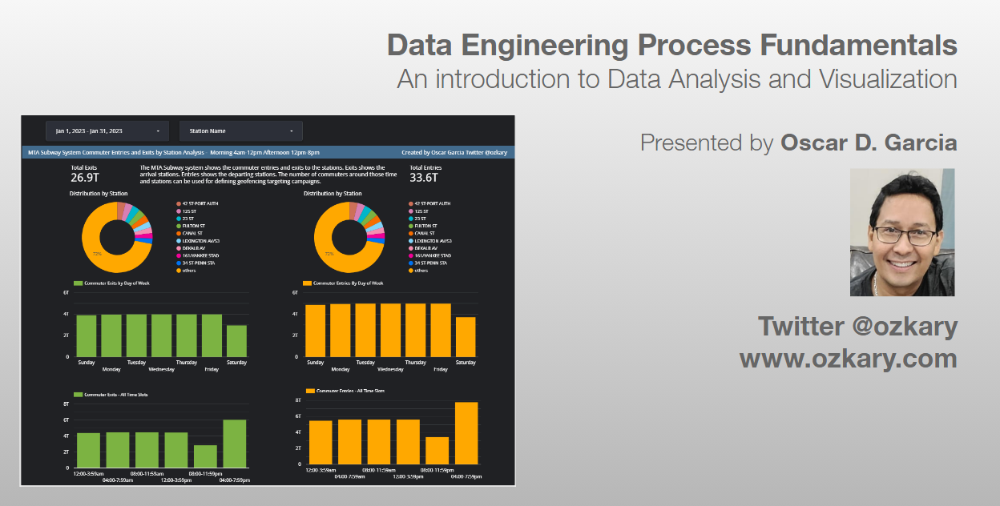

In this technical presentation, we will delve into the fundamental concepts of Data Engineering in the areas of data analysis and visualization. We focus on these areas by using both a code-centric and low-code approach. 

- Follow this GitHub repo during the presentation: (Give it a star)

**https://github.com/ozkary/data-engineering-mta-turnstile**

- Read more information on my blog at:  

**https://www.ozkary.com/2023/03/data-engineering-process-fundamentals.html**

  
### Presentation

[Presentation Introduction to Data Analysis and Visualization](https://docs.google.com/presentation/d/e/2PACX-1vQAtz3RxLOg4Y6Ya4_Wj5E3MnsRDZL_nXC9rsbWFlNRO7-REKLd0UImTG8Y-7a_KZuruKOR8pv_Rnmy/pub?start=false&loop=false&delayms=5000&amp;controls=1)

### YouTube Video

## Section 1: Data Analysis Essentials

Data Analysis: Explore the fundamentals of data analysis using Python, unraveling the capabilities of libraries such as Pandas and NumPy. Learn how Jupyter Notebooks provide an interactive environment for data exploration, analysis, and visualization.

Data Profiling: With Python at our fingertips, discover how Jupyter Notebooks aid in data profiling—understanding data structures, quality, and characteristics. Witness the seamless integration with tools like pandas-profiling for comprehensive data insights.

Cleaning and Preprocessing: Dive into the world of data cleaning and preprocessing with Python's Pandas library, facilitated by the user-friendly environment of Jupyter Notebooks. See how Visual Studio Code enhances the coding experience for efficient data preparation.

## Section 2: Statistical Analysis vs. Business Intelligence

Statistical Analysis: Embrace Python's statistical libraries, such as SciPy and StatsModels, within the Jupyter environment. Witness the power of statistical analysis for extracting patterns and correlations from data, all seamlessly integrated into your workflow with Visual Studio Code.

Business Intelligence: Contrast statistical analysis with the broader field of business intelligence, emphasizing the role of Python in data transformation. Utilize Jupyter Notebooks to showcase how Python's versatility extends to business intelligence applications.

## Section 3: The Power of Data Visualization

Importance of Data Visualization: Unlock the potential of Python's visualization libraries, such as Matplotlib and Seaborn, within the interactive canvas of Jupyter Notebooks. Visual Studio Code complements this process, providing a robust coding environment for creating captivating visualizations.

Introduction to Tools: While exploring the importance of data visualization, let's talk about the powerful visualization tools like Power BI, Looker, and Tableau. Learn how this integration elevates your data storytelling capabilities.

**Conclusion:**

This session aims to equip attendees with a strong foundation in data engineering, focusing on the pivotal role of data analysis and visualization. By the end of this presentation, participants will grasp how to effectively utilize these practices, so they are able to start the journey on data analysis and visualization.

This presentation will be accompanied by live code demonstrations and interactive discussions, ensuring attendees gain practical knowledge and valuable insights into the dynamic world of data engineering.

  
**Some of the technologies that we will be covering:**

- Data Analysis
- Data Visualization
- Python
- Jupyter Notebook
- Looker
  

Thanks for reading.

Send question or comment at Twitter @ozkary
Originally published by [ozkary.com](https://www.ozkary.com)