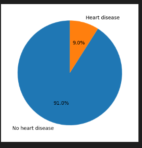
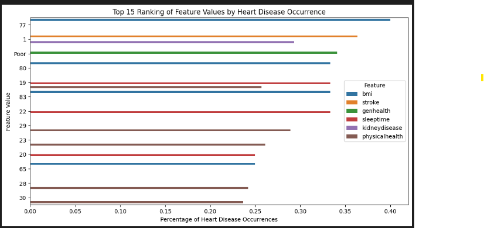
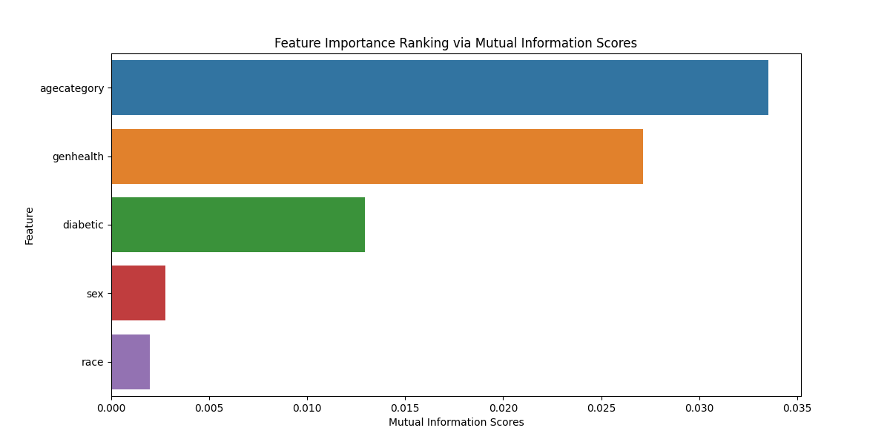
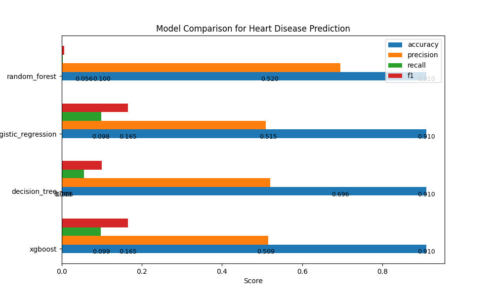
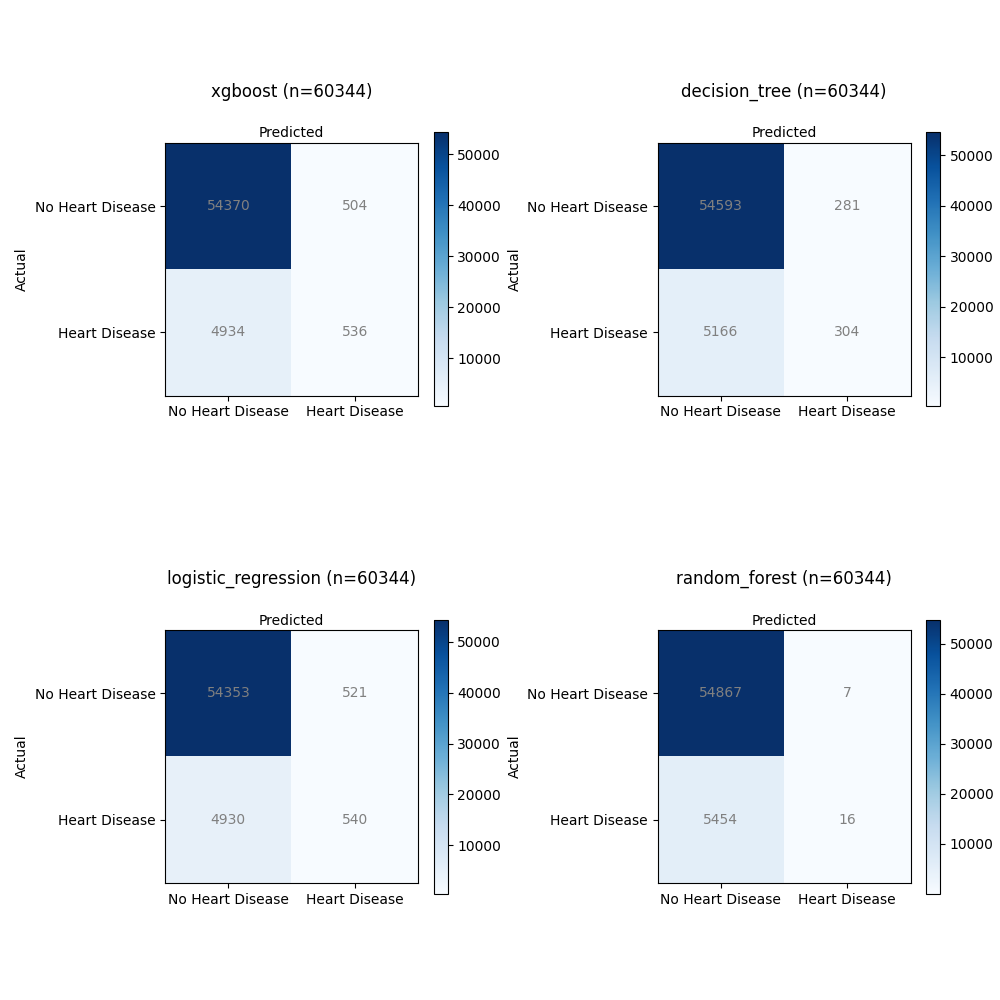

# Abstract

Heart disease is a leading cause of mortality worldwide, and its early identification and risk assessment are critical for effective prevention and intervention. With the help of electronic health records (EHR) and a wealth of health-related data, there is a significant opportunity to leverage machine learning techniques for predicting and assessing the risk of heart disease in individuals.


The United States Centers for Disease Control and Prevention (CDC) has been collecting a vast array of data on demographics, lifestyle, medical history, and clinical parameters. This data repository offers a valuable resource to develop predictive models that can help identify those at risk of heart disease before symptoms manifest.

This study aims to use machine learning models to predict an individual's likelihood of developing heart disease based on CDC data. By employing advanced algorithms and data analysis, we seek to create a predictive model that factors in various attributes such as age, gender, cholesterol levels, blood pressure, smoking habits, and other relevant health indicators. The solution could assist healthcare professionals in evaluating an individual's risk profile for heart disease.

## Key Objectives

Key objectives of this study include:

1. Developing a robust machine learning model capable of accurately predicting the risk of heart disease using CDC data.
2. Identifying the most influential risk factors and parameters contributing to heart disease prediction.
3. Compare model performance:
   - Logistic Regression
   - Decision Tree
   - Random Forest
   - XGBoost Classification
4. Evaluating the following metrics
   - Accuracy
   - Precision, 
   - F1 
   - Recall 
5. Providing an API, so tools can integrate and make a risk analysis.
   - Build a local app 
   - Build an Azure function for cloud deployment

The successful implementation of this research will lead to a transformative impact on public health by enabling timely preventive measures and tailored interventions for individuals at risk of heart disease.

## Conclusion

This study was conducted by using four different Machine Learning algorithm. After comparing the performance of all these models, we concluded that the **XGBoost Model** has a relatively balanced precision and recall metrics, indicating that it's better at identifying true positives while keeping false positives in check. Based on this analysis, we choose XGBoost as the best performing model for this type of analysis.


## Machine Learning Engineering Process

In order to execute this project, we follow a series of steps for discovery and data analysis, data processing and model selection. This process is done using jupyter notebooks for the experimental phase, and python files for the implementation and delivery phase.

### Experimental Phase Notebooks

- Data analysis and cleanup 
  - [Step 1 - Data Analysis](https://github.com/ozkary/machine-learning-engineering/blob/main/projects/heart-disease-risk/data_analysis.ipynb)  
- Process and convert the data for modeling, feature analysis
  - [Step 2 - Data Processing](https://github.com/ozkary/machine-learning-engineering/blob/main/projects/heart-disease-risk/data_processing.ipynb)
- Train the model using different algorithm to evaluate the best option
  - [Step 3 - Model Processing](https://github.com/ozkary/machine-learning-engineering/blob/main/projects/heart-disease-risk/data_train.ipynb)
- Run test cases and predict results
  - [Step 4 - Model Prediction](https://github.com/ozkary/machine-learning-engineering/blob/main/projects/heart-disease-risk/data_predict.ipynb)

> 👉 The data files for this study can be found in the same GitHub project as the Jupyter Notebook files.

## Data Analysis - Exploratory Data Analysis (EDA)

These are the steps to analysis the data:

- Load the data/2020/heart_2020_cleaned.csv
- Fill in the missing values with zero
- Review the data 
  - Rename the columns to lowercase
  - Check the data types
  - Preview the data
- Identify the features
  - Identify the categorical and numeric features
  - Identify the target variables    
- Remove duplicates
- Identify categorical features that can be converted into binary
- Check the class balance in the data
  - Check for Y/N labels for heart disease identification

### Features

Based on the dataset, we have a mix of categorical and numerical features. We consider the following for encoding:

1. **Categorical Features:**
   - 'heartdisease': This is the target variable. We remove this feature for the model training.
   - 'smoking', 'alcoholdrinking', 'stroke', 'sex', 'agecategory', 'race', 'diabetic', 'physicalactivity', 'genhealth', 'sleeptime', 'asthma', 'kidneydisease', 'skincancer': These are categorical features. We can consider one-hot encoding these features.
   
2. **Numerical Features:**
   - 'bmi', 'physicalhealth', 'mentalhealth', 'diffwalking': These are already numerical features, so there's no need to encode them.

```python
# get a list of numeric features
features_numeric = list(df.select_dtypes(include=[np.number]).columns)

# get a list of object features and exclude the target feature 'heartdisease'
features_category = list(df.select_dtypes(include=['object']).columns)

# remove the target feature from the list of categorical features
target = 'heartdisease'

features_category.remove(target)

print('Categorical features',features_category)
print('Numerical features',features_numeric)

```

### Data Validation and Class Balance

The data shows imbalance for the Y/N classes. There are less cases of heart disease, as expected, than the rest of the population. This can result in low performing models as there is way more negatives cases (N). To account for that, we can use techniques like down sampling the negative cases.

#### Heart Disease Distribution

```python
# plot a distribution of the target variable set labels for each bar chart and show the count
print(df[target].value_counts(normalize=True).round(2))

# plot the distribution of the target variable
df[target].value_counts().plot(kind='bar', rot=0)
plt.xlabel('Heart disease')
plt.ylabel('Count')
# add a count label to each bar
for i, count in enumerate(df[target].value_counts()):
    plt.text(i, count-50, count, ha='center', va='top', fontweight='bold')

plt.show()

# # get the percentage of people with heart disease on a pie chart
df[target].value_counts(normalize=True).plot(kind='pie', labels=['No heart disease', 'Heart disease'], autopct='%1.1f%%', startangle=90)
plt.ylabel('')
plt.show()
```

> 👉 No 91% Yes 9%



## Data Processing

For data processing, we should follow these steps:

- Load the data/2020/heart_2020_eda.csv
- Process the values
  - Convert Yes/No features to binary (1/0)
  - Cast all the numeric values to int to avoid float problems
- Process the features
  - Set the categorical features names
  - Set the numeric features names  
  - Set the target variable
- Feature importance analysis
 - Use statistical analysis to get the metrics like risk and ratio
 - Mutual Information score

#### Feature Analysis

The purpose of feature analysis in heart disease study is to uncover the relationships and associations between various patient characteristics (features) and the occurrence of heart disease. By examining factors such as lifestyle, medical history, demographics, and more, we aim to identify which specific attributes or combinations of attributes are most strongly correlated with heart disease. Feature analysis allows for the discovery of risk factors and insights that can inform prevention and early detection strategies. 

```python
# Calculate the mean and count of heart disease occurrences per feature value
feature_importance = []

# Create a dataframe for the analysis
results = pd.DataFrame(columns=['Feature', 'Value', 'Percentage'])

for feature in all_features:    
    grouped = df.groupby(feature)[target].mean().reset_index()
    grouped.columns = ['Value', 'Percentage']
    grouped['Feature'] = feature
    results = pd.concat([results, grouped], axis=0)

# Sort the results by percentage in descending order and get the top 10
results = results.sort_values(by='Percentage', ascending=False).head(15)

# get the overall heart diease occurrence rate
overall_rate = df[target].mean()
print('Overall Rate',overall_rate)

# calculate the difference between the feature value percentage and the overall rate
results['Difference'] = results['Percentage'] - overall_rate

# calculate the ratio of the difference to the overall rate
results['Ratio'] = results['Difference'] / overall_rate

# calculate the risk of heart disease occurrence for each feature value
results['Risk'] = results['Percentage'] / overall_rate

# sort the results by ratio in descending order
results = results.sort_values(by='Risk', ascending=False)

print(results)

# Visualize the rankings (e.g., create a bar plot)
import matplotlib.pyplot as plt
import seaborn as sns

plt.figure(figsize=(12, 6))
sns.barplot(data=results, x='Percentage', y='Value', hue='Feature')
plt.xlabel('Percentage of Heart Disease Occurrences')
plt.ylabel('Feature Value')
plt.title('Top 15 Ranking of Feature Values by Heart Disease Occurrence')
plt.show()
```

```bash

Overall Rate 0.09035
           Feature Value  Percentage  Difference     Ratio      Risk
65             bmi    77    0.400000    0.309647  3.427086  4.427086
1           stroke     1    0.363810    0.273457  3.026542  4.026542
3        genhealth  Poor    0.341131    0.250778  2.775537  3.775537
68             bmi    80    0.333333    0.242980  2.689239  3.689239
18       sleeptime    19    0.333333    0.242980  2.689239  3.689239
71             bmi    83    0.333333    0.242980  2.689239  3.689239
21       sleeptime    22    0.333333    0.242980  2.689239  3.689239
1    kidneydisease     1    0.293308    0.202956  2.246254  3.246254
29  physicalhealth    29    0.289216    0.198863  2.200957  3.200957

```



1. `Overall Rate`: This is the overall rate of heart disease occurrence in the  dataset. It represents the proportion of individuals with heart disease (target='Yes') in the  dataset. For example, if the overall rate is 0.2, it means that 20% of the individuals in the  dataset have heart disease.

2. `Difference`: This value represents the difference between the percentage of heart disease occurrence for a specific feature value and the overall rate. It tells us how much more or less likely individuals with a particular feature value are to have heart disease compared to the overall population. A positive difference indicates a higher likelihood, while a negative difference indicates a lower likelihood.

3. `Ratio`: The ratio represents the difference relative to the overall rate. It quantifies how much the heart disease occurrence for a specific feature value deviates from the overall rate, considering the overall rate as the baseline. A ratio greater than 1 indicates a higher risk compared to the overall population, while a ratio less than 1 indicates a lower risk.

4. `Risk`: This metric directly quantifies the likelihood of an event happening for a specific feature value, expressed as a percentage. It's easier to interpret as it directly answers the question: "What is the likelihood of heart disease for individuals with this feature value?"

These values help us understand the relationship between different features and heart disease. Positive differences, ratios greater than 1, and risk values greater than 100% suggest a higher risk associated with a particular feature value, while negative differences, ratios less than 1, and risk values less than 100% suggest a lower risk. This information can be used to identify factors that may increase or decrease the risk of heart disease within the  dataset.

#### Mutual Information Score

The mutual information score measures the dependency between a feature and the target variable. Higher scores indicate stronger dependency, while lower scores indicate weaker dependency. A higher score suggests that the feature is more informative when predicting the target variable.

```python
# Compute mutual information scores for each feature
X = df[cat_features]
y = df[target]

def mutual_info_heart_disease_score(series):
    return mutual_info_score(series, y)

mi_scores = X.apply(mutual_info_heart_disease_score)
mi_ranking = pd.Series(mi_scores, index=X.columns).sort_values(ascending=False)

print(mi_ranking)
# Visualize the rankings
plt.figure(figsize=(12, 6))
sns.barplot(x=mi_ranking.values, y=mi_ranking.index)
plt.xlabel('Mutual Information Scores')
plt.ylabel('Feature')
plt.title('Feature Importance Ranking via Mutual Information Scores')
```

```bash
agecategory    0.033523
genhealth      0.027151
diabetic       0.012960
sex            0.002771
race           0.001976
```



## Machine Learning Training and Model Selection

- Load the data/2020/heart_2020_processed.csv
- Process the features
  - Set the categorical features names
  - Set the numeric features names  
  - Set the target variable
- Split the data
  - train/validation/test split with 60%/20%/20% distribution.
  - Random_state 42
  - Use strategy = y to deal with the class imbalanced problem
- Train the model
  - LogisticRegression
  - RandomForestClassifier
  - XGBClassifier
  - DecisionTreeClassifier
- Evaluate the models and compare them
  - accuracy_score
  - precision_score
  - recall_score
  - f1_score
- Confusion Matrix

### Data Split

- Use a 60/20/20 distribution fir train/val/test
- Random_state 42 to shuffle the data
- Use strategy = y when there is a class imbalance in the dataset. It helps ensure that the class distribution in both the training and validation (or test) sets closely resembles the original dataset's class distribution

```python
def split_data(self, test_size=0.2, random_state=42):
        """
        Split the data into training and validation sets
        """
        # split the data in train/val/test sets, with 60%/20%/20% distribution with seed 1
        X = self.df[self.all_features]
        y = self.df[self.target_variable]
        X_full_train, X_test, y_full_train, y_test = train_test_split(X, y, test_size=test_size, random_state=random_state, stratify=y)

        # .25 splits the 80% train into 60% train and 20% val
        X_train, X_val, y_train, y_val  = train_test_split(X_full_train, y_full_train, test_size=0.25, random_state=random_state)

        X_train = X_train.reset_index(drop=True)
        X_val = X_val.reset_index(drop=True)
        y_train = y_train.reset_index(drop=True)
        y_val = y_val.reset_index(drop=True)
        X_test = X_test.reset_index(drop=True)
        y_test = y_test.reset_index(drop=True)

        # print the shape of all the data splits
        print('X_train shape', X_train.shape)
        print('X_val shape', X_val.shape)
        print('X_test shape', X_test.shape)
        print('y_train shape', y_train.shape)
        print('y_val shape', y_val.shape)
        print('y_test shape', y_test.shape)
        
        return X_train, X_val, y_train, y_val, X_test, y_test

X_train, X_val, y_train, y_val, X_test, y_test = train_data.split_data(test_size=0.2, random_state=42)

```

The `split_data` call is a method that splits a dataset into training, validation, and test sets. Here's a breakdown of the returned values:

- **X_train:** This represents the features (input variables) of the training set. The model will be trained on this data.

- **y_train:** This corresponds to the labels (output variable) for the training set. It contains the correct outcomes corresponding to the features in `X_train`.

- **X_val:** These are the features of the validation set. The model's performance is often assessed on this set during training to ensure it generalizes well to new, unseen data.

- **y_val:** These are the labels for the validation set. They serve as the correct outcomes for the features in `X_val` during the evaluation of the model's performance.

- **X_test:** These are the features of the test set. The model's final evaluation is typically done on this set to assess its performance on completely unseen data.

- **y_test:** Similar to `y_val`, this contains the labels for the test set. It represents the correct outcomes for the features in `X_test` during the final evaluation of the model.

#### Model Training

For model training, we first pre-process the data by taking these steps:

- `preprocess_data` 
  - The input features X are converted to a dictionary format using the to_dict method with the orientation set to `records`. This is a common step when working with scikit-learn transformers, as they often expect input data in this format.  
  - If is_training is True, it fits a transformer (self.encoder) on the data using the fit_transform method. If False, it transforms the data using the previously fitted transformer (self.encoder.transform). The standardized features are then returned.

We then train the different models:

- `train`
  -This method takes X_train (training features) and y_train (training labels) as parameters.
  -If the models attribute of the class is None, it initializes a dictionary of machine learning models including logistic regression, random forest, XGBoost, and decision tree classifiers. 

```python
def preprocess_data(self, X, is_training=True):      
        """
        Preprocess the data for training or validation
        """  
        X_dict = X.to_dict(orient='records')        
        
        if is_training:
            X_std = self.encoder.fit_transform(X_dict)            
        else:
            X_std = self.encoder.transform(X_dict)
            
        # Return the standardized features and target variable
        return X_std

def train(self, X_train, y_train):
        
      if self.models is None:
          self.models = {
              'logistic_regression': LogisticRegression(C=10, max_iter=1000, random_state=42),
              'random_forest': RandomForestClassifier(n_estimators=100, max_depth=5, random_state=42, n_jobs=-1),
              'xgboost': XGBClassifier(n_estimators=100, max_depth=5, random_state=42, n_jobs=-1),                
              'decision_tree': DecisionTreeClassifier(max_depth=5, random_state=42)
          }
      
      for model in self.models.keys():
          print('Training model', model)
          self.models[model].fit(X_train, y_train) 

# hot encode the categorical features for the train data
model_factory = HeartDiseaseModelFactory(cat_features, num_features)
X_train_std = model_factory.preprocess_data(X_train[cat_features + num_features], True)

# hot encode the categorical features for the validation data
X_val_std = model_factory.preprocess_data(X_val[cat_features + num_features], False)

# Train the model
model_factory.train(X_train_std, y_train)

```

#### Model Evaluation

For the model evaluation, we calculate the following metrics:

1. **Accuracy** tells us how often your model is correct. It's the percentage of all predictions that are accurate. For example, an accuracy of 92% is great, while 70% is not good.

2. **Precision** is about being precise, not making many mistakes. It's the percentage of positive predictions that were actually correct. For instance, a precision of 90% is great, while 50% is not good.

3. **Recall** is about not missing any positive instances. It's the percentage of actual positives that were correctly predicted. A recall of 85% is great, while 30% is not good.

4. **F1 Score** is a balance between precision and recall. It's like having the best of both worlds. For example, an F1 score of 80% is great, while 45% is not good.

```python

def evaluate(self, X_val, y_val, threshold=0.5):
        """
        Evaluate the model on the validation data set and return the predictions
        """

        # create a dataframe to store the metrics
        df_metrics = pd.DataFrame(columns=['model', 'accuracy', 'precision', 'recall', 'f1', 'y_pred'])

        # define the metrics to be calculated
        fn_metrics = { 'accuracy': accuracy_score,'precision': precision_score,'recall': recall_score,'f1': f1_score}

        # loop through the models and get its metrics
        for model_name in self.models.keys():
            
            model = self.models[model_name]

            # The first column (y_pred_proba[:, 0]) is for class 0 ("N")
            # The second column (y_pred_proba[:, 1]) is for class 1 ("Y")            
            y_pred = model.predict_proba(X_val)[:,1]
            # get the binary predictions
            y_pred_binary = np.where(y_pred > threshold, 1, 0)

            # add a new row to the dataframe for each model            
            df_metrics.loc[len(df_metrics)] = [model_name, 0, 0, 0, 0, y_pred_binary]

            # get the row index
            row_index = len(df_metrics)-1

            # Evaluate the model metrics
            for metric in fn_metrics.keys():
                score = fn_metrics[metric](y_val, y_pred_binary)
                df_metrics.at[row_index,metric] = score
           
        return df_metrics

```

**Model Performance Metrics:**

| Model               | Accuracy | Precision | Recall   | F1       |
|---------------------|----------|-----------|----------|----------|
| Logistic Regression | 0.9097   | 0.509     | 0.0987   | 0.1654   |
| Random Forest       | 0.9095   | 0.6957    | 0.0029   | 0.0058   |
| XGBoost             | 0.9099   | 0.5154    | 0.098    | 0.1647   |
| Decision Tree       | 0.9097   | 0.5197    | 0.0556   | 0.1004   |

These metrics provide insights into the performance of each model, helping us understand their strengths and areas for improvement. 


**Analysis:**

- XGBoost Model:
   - Accuracy: 90.99
   - Precision: 51.54%
   - Recall: 9.80%
   - F1 Score: 16.47%

- Decision Tree Model:
   - Accuracy: 90.97%
   - Precision: 51.97%
   - Recall: 5.56%
   - F1 Score: 10.04%

- Logistic Regression Model:
   - Accuracy: 90.97%
   - Precision: 50.90%
   - Recall: 9.87%
   - F1 Score: 16.54%

- Random Forest Model:
   - Accuracy: 90.95%
   - Precision: 69.57%
   - Recall: 0.29%
   - F1 Score: 0.58%


- XGBoost Model has a relatively balanced precision and recall, indicating it's better at identifying true positives while keeping false positives in check.

- Decision Tree Model has the lowest recall, suggesting that it may miss some positive cases.

- Logistic Regression Model has a good balance of precision and recall similar to the XGBoost Model.

- Random Forest Model has high precision but an extremely low recall, meaning it's cautious in predicting positive cases but may miss many of them.

Based on this analysis, we will choose XGBoost as our API model



**Confusion Matrix:**

The confusion matrix is a valuable tool for evaluating the performance of classification models, especially for a binary classification problem like predicting heart disease (where the target variable has two classes: 0 for "No" and 1 for "Yes"). Let's analyze what the confusion matrix represents for heart disease prediction using the four models.

For this analysis, we'll consider the following terms:

- True Positives (TP): The model correctly predicted "Yes" (heart disease) when the actual label was also "Yes."

- True Negatives (TN): The model correctly predicted "No" (no heart disease) when the actual label was also "No."

- False Positives (FP): The model incorrectly predicted "Yes" when the actual label was "No." (Type I error)

- False Negatives (FN): The model incorrectly predicted "No" when the actual label was "Yes." (Type II error)

```python
from sklearn.metrics import confusion_matrix
import seaborn as sns
import matplotlib.pyplot as plt

cms = []
model_names = []
total_samples = []

for model_name in df_metrics['model']:
    model_y_pred = df_metrics[df_metrics['model'] == model_name]['y_pred'].iloc[0]

    # Compute the confusion matrix
    cm = confusion_matrix(y_val, model_y_pred)    
    cms.append(cm)
    model_names.append(model_name)
    total_samples.append(np.sum(cm))    

# Create a 2x2 grid of subplots
fig, axes = plt.subplots(2, 2, figsize=(10, 10))

# Loop through the subplots and plot the confusion matrices
for i, ax in enumerate(axes.flat):
    cm = cms[i]    
    im = ax.imshow(cm, interpolation='nearest', cmap=plt.cm.Blues)
    ax.figure.colorbar(im, ax=ax, shrink=0.6)
    
    # Set labels, title, and value in the center of the heatmap
    ax.set(xticks=np.arange(cm.shape[1]), yticks=np.arange(cm.shape[0]), 
           xticklabels=["No Heart Disease", "Heart Disease"], yticklabels=["No Heart Disease", "Heart Disease"],
           title=f'{model_names[i]} (n={total_samples[i]})\n')

    # Loop to annotate each quadrant with its count
    for i in range(cm.shape[0]):
        for j in range(cm.shape[1]):
            ax.text(j, i, str(cm[i, j]), ha="center", va="center", color="gray")
            
    ax.title.set_fontsize(12)
    ax.set_xlabel('Predicted', fontsize=10)
    ax.set_ylabel('Actual', fontsize=10)
    ax.xaxis.set_label_position('top')

# Adjust the layout
plt.tight_layout()

```

Let's examine the confusion matrices for each model:



- **XGBoost**:
  - Total Samples: 60,344
  - Confusion Matrix Total:
    - True Positives (TP): 536
    - True Negatives (TN): 54,370
    - False Positives (FP): 504
    - False Negatives (FN): 4,934

- **Decision Tree**:
  - Total Samples: 60,344
  - Confusion Matrix Total:
    - True Positives (TP): 304
    - True Negatives (TN): 54,593
    - False Positives (FP): 281
    - False Negatives (FN): 5,166

- **Logistic Regression**:
  - Total Samples: 60,344
  - Confusion Matrix Total:
    - True Positives (TP): 540
    - True Negatives (TN): 54,353
    - False Positives (FP): 521
    - False Negatives (FN): 4,930

- **Random Forest**:
  - Total Samples: 60,344
  - Confusion Matrix Total:
    - True Positives (TP): 16
    - True Negatives (TN): 54,867
    - False Positives (FP): 7
    - False Negatives (FN): 5,454

**XGBoost**:
- This model achieved a relatively high number of True Positives (TP) with 536 cases correctly predicted as having heart disease.
- It also had a significant number of True Negatives (TN), indicating correct predictions of no heart disease (54,370).
- However, there were 504 False Positives (FP), where it incorrectly predicted heart disease.
- It had 4,934 False Negatives (FN), suggesting instances where actual heart disease cases were incorrectly predicted as non-disease.

**Decision Tree**:
- The Decision Tree model achieved 304 True Positives (TP), correctly identifying heart disease cases.
- It also had 54,593 True Negatives (TN), showing accurate predictions of no heart disease.
- There were 281 False Positives (FP), indicating instances where the model incorrectly predicted heart disease.
- It had 5,166 False Negatives (FN), meaning it missed identifying heart disease in these cases.

**Logistic Regression**:
- The Logistic Regression model achieved 540 True Positives (TP), correctly identifying cases with heart disease.
- It had a high number of True Negatives (TN) with 54,353 correctly predicted non-disease cases.
- However, there were 521 False Positives (FP), where the model incorrectly predicted heart disease.
- It also had 4,930 False Negatives (FN), indicating missed predictions of heart disease.

**Random Forest**:
- The Random Forest model achieved a relatively low number of True Positives (TP) with 16 cases correctly predicted as having heart disease.
- It had a high number of True Negatives (TN) with 54,867 correctly predicted non-disease cases.
- There were only 7 False Positives (FP), suggesting rare incorrect predictions of heart disease.
- However, it also had 5,454 False Negatives (FN), indicating a substantial number of missed predictions of heart disease.

All models achieved a good number of True Negatives, suggesting their ability to correctly predict non-disease cases. However, there were variations in True Positives, False Positives, and False Negatives. The XGBoost model achieved the highest True Positives but also had a significant number of False Positives. The Decision Tree and Logistic Regression models showed similar TP and FP counts, while the Random Forest model had the lowest TP count. The trade-off between these metrics is essential for assessing the model's performance in detecting heart disease accurately.

### Summary

In the quest to find the best solution for predicting heart disease, it's crucial to evaluate various models. However, it's not just about picking a model and hoping for the best. We need to be mindful of class imbalances – situations where one group has more examples than the other. This imbalance can throw our predictions off balance. 

To fine-tune our models, we also need to adjust the hyperparameters. Think of it as finding the perfect settings to make our models have a better performance. By addressing class imbalances and tweaking those hyperparameters, we ensure our models perform accurately. 

By using the correct data features and evaluating the performance of our models, we can build solutions that could assist healthcare professionals in evaluating an individual's risk profile for heart disease.

Thanks for reading.

Send question or comment at Twitter @ozkary
Originally published by [ozkary.com](https://www.ozkary.com)