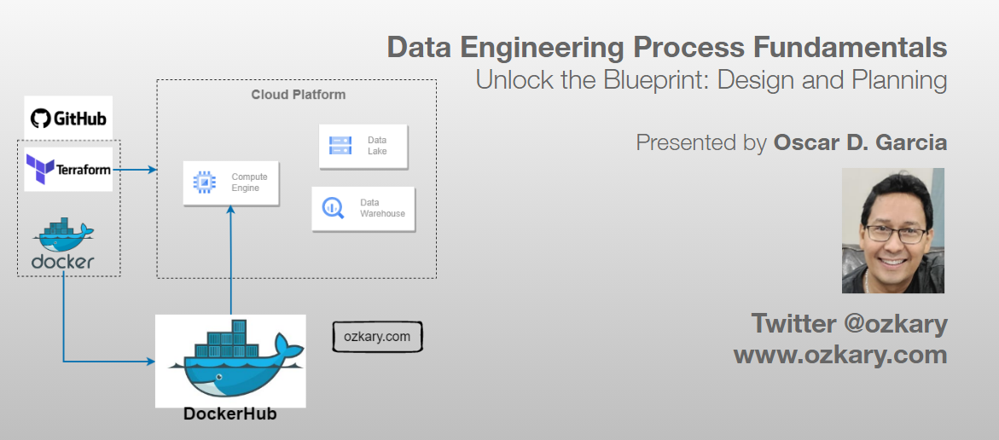
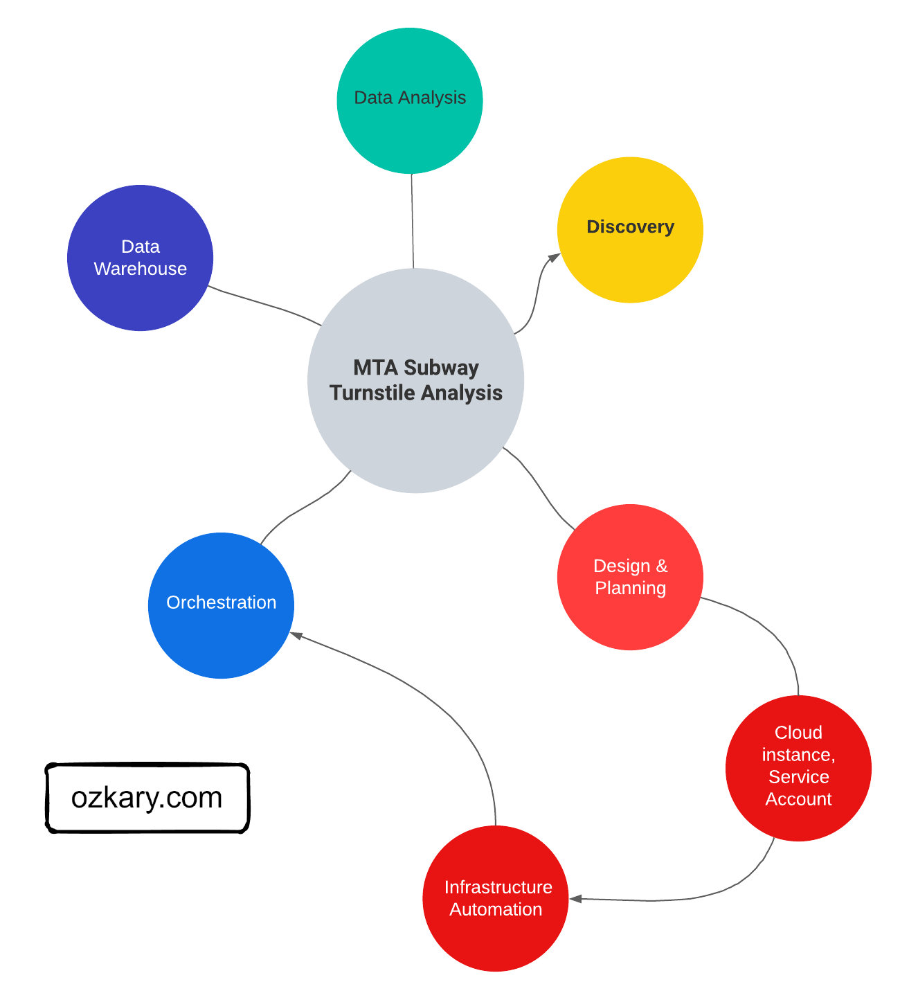
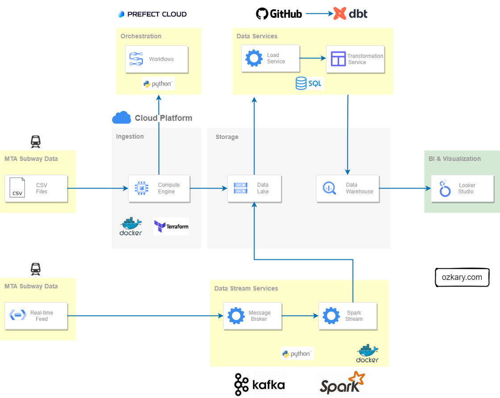
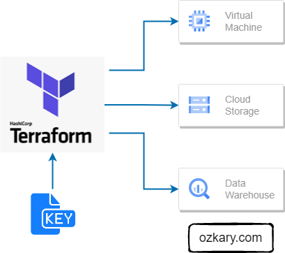

# Overview

The design and planning phase of a data engineering project is crucial for laying out the foundation of a successful and scalable solution. This phase ensures that the architecture is strategically aligned with business objectives, optimizes resource utilization, and mitigates potential risks.

In this technical presentation, we embark on the next chapter of our data journey, delving into the critical Design and Planning 
Phase. 

- Follow this GitHub repo during the presentation: (Give it a star)

> 👉 https://github.com/ozkary/data-engineering-mta-turnstile

- Read more information on my blog at:  

> 👉 https://www.ozkary.com/2023/03/data-engineering-process-fundamentals.html

## YouTube Video

<iframe width="560" height="315" src="https://www.youtube.com/embed/O6gqhreqGDo?si=8vnZxaRj1K7oJCJp" title="YouTube video player" frameborder="0" allow="accelerometer; autoplay; clipboard-write; encrypted-media; gyroscope; picture-in-picture; web-share" allowfullscreen></iframe>

### Video Agenda

System Design and Architecture:

- Understanding the foundational principles that shape a robust and scalable data system.

 Data Pipeline and Orchestration:

- Uncovering the essentials of designing an efficient data pipeline and orchestrating seamless data flows.

 Source Control and Deployment:

- Navigating the best practices for source control, versioning, and deployment strategies.

 CI/CD in Data Engineering:

- Implementing Continuous Integration and Continuous Deployment (CI/CD) practices for agility and reliability.

 Docker Container and Docker Hub:

- Harnessing the power of Docker containers and Docker Hub for containerized deployments.

 Cloud Infrastructure with IaC:

- Exploring technologies for building out cloud infrastructure using Infrastructure as Code (IaC), ensuring efficiency and consistency.

**Key Takeaways:**

- Gain insights into designing scalable and efficient data systems.

- Learn best practices for cloud infrastructure and IaC.

- Discover the importance of data pipeline orchestration and source control.

- Explore the world of CI/CD in the context of data engineering.

- Unlock the potential of Docker containers for your data workflows.
  
**Some of the technologies that we will be covering:**

- Cloud Infrastructure
- Data Pipelines
- GitHub and Actions
- VC Code
- Docker and Docker Hub
- Terraform
  
## Presentation

### Data Engineering Overview

A Data Engineering Process involves executing steps to understand the problem, scope, design, and architecture for creating a solution. This enables ongoing big data analysis using analytical and visualization tools.

#### Topics

- Importance of Design and Planning
- System Design and Architecture
- Data Pipeline and Orchestration
- Source Control and CI/CD
- Docker Containers
- Cloud Infrastructure with IaC

**Follow this project: Give a star**

> 👉 [Data Engineering Process Fundamentals](//github.com/ozkary/data-engineering-mta-turnstile)

### Importance of Design and Planning

The design and planning phase of a data engineering project is crucial for laying out the foundation of a successful and scalable solution. This phase ensures that the architecture is strategically aligned with business objectives, optimizes resource utilization, and mitigates potential risks.

#### Foundational Areas

- Designing the data pipeline and technology specifications like flows, coding language, data governance and tools
- Define the system architecture like cloud services for scalability, data platform
- Source control and deployment automation with CI/CD
- Using Docker containers for environment isolation to avoid deployment issues
- Infrastructure automation with Terraform or cloud CLI tools
- System monitor, notification and recovery

### System Design and Architecture

In a system design, we need to clearly define the different technologies that should be used for each area of the solution. It includes the high-level system architecture, which defines the different components and their integration.

- The **design** outlines the technical solution, including system architecture, data integration, flow orchestration, storage platforms, and data processing tools. It focuses on defining technologies for each component to ensure a cohesive and efficient solution.

- A **system architecture** is a critical high-level design encompassing various components such as data sources, ingestion resources, workflow orchestration, storage, transformation services, continuous ingestion, validation mechanisms, and analytics tools.

### Data Pipeline and Orchestration

A data pipeline is basically a workflow of tasks that can be executed in Docker containers. The execution, scheduling, managing and monitoring of the pipeline is referred to as orchestration. In order to support the operations of the pipeline and its orchestration, we need to provision a VM and data lake, and monitor cloud resources. 

- This can be code-centric, leveraging languages like Python, SQL
- Or a low-code approach, utilizing tools such as Azure Data Factory, which provides a turn-key solution
- Monitor services enable us to track telemetry data to support operational requirements
- Docker Hub, GitHub can be used for the CI/CD process and deployed our code-centric solutions
- Scheduling, recovering from failures and dashboards are essentials for orchestration
- Low-code solutions , like data factory, can also be used

### Source Control - CI/CD

Implementing source control practices alongside Continuous Integration and Continuous Delivery (CI/CD) pipelines is vital for facilitating agile development. This ensures efficient collaboration, change tracking, and seamless code deployment, crucial for addressing ongoing feature changes, bug fixes, and new environment deployments.

- Systems like Git facilitates effective code and configuration file management, enabling collaboration and change tracking.
- Platforms such as GitHub enhance collaboration by providing a remote repository for sharing code.
- CI involves integrating code changes into a central repository, followed by automated build and test processes to validate changes and provide feedback.
- CD automates the deployment of code builds to various environments, such as staging and production, streamlining the release process and ensuring consistency across environments.

### Docker Container and Docker Hub

Docker proves invaluable for our data pipelines by providing self-contained environments with all necessary dependencies. With Docker Hub, we can effortlessly distribute pipeline images, facilitating swift and reliable provisioning of new environments.

- Docker containers streamline the deployment process by encapsulating application and dependency configurations, reducing runtime errors.
- Containerizing data pipelines ensures reliability and portability by packaging all necessary components within a single container image.
- Docker Hub serves as a centralized container registry, enabling seamless image storage and distribution for streamlined environment provisioning and scalability.

### Cloud Infrastructure with IaC

Infrastructure automation is crucial for maintaining consistency, scalability, and reliability across environments. By defining infrastructure as code (IaC), organizations can efficiently provision and modify cloud resources, mitigating manual errors.

- Define infrastructure configurations as code, ensuring consistency across environments.
- Easily scale resources up or down to meet changing demands with code-defined infrastructure.
- Reduce manual errors and ensure reproducibility by automating resource provisioning and management.
- Track infrastructure changes under version control, enabling collaboration and ensuring auditability.
- Track infrastructure state, allowing for precise updates and minimizing drift between desired and actual configurations. 

Thanks for reading.

Send question or comment at Twitter @ozkary
Originally published by [ozkary.com](https://www.ozkary.com)
