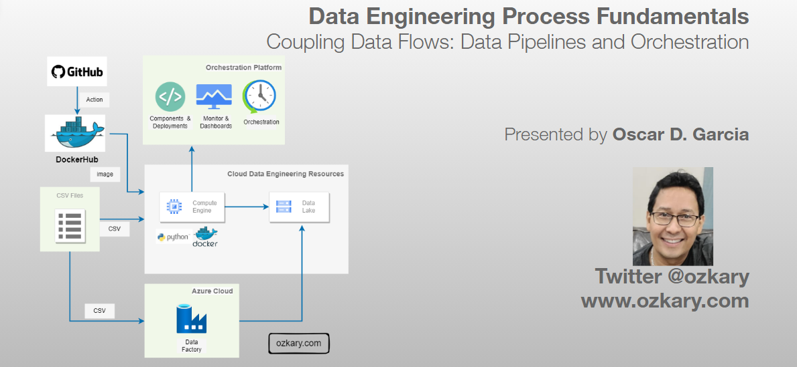
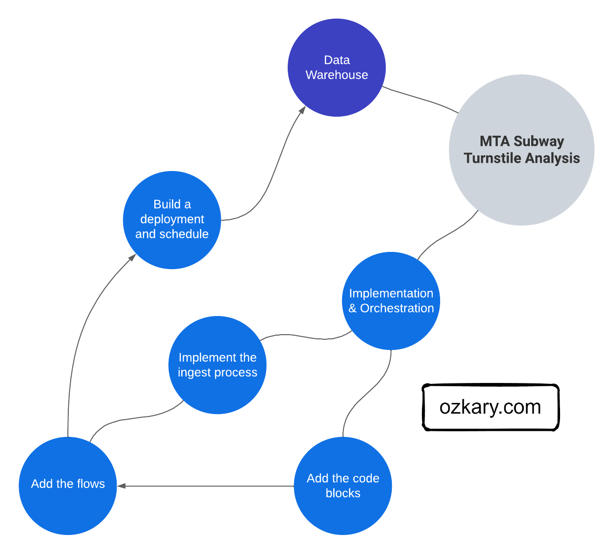
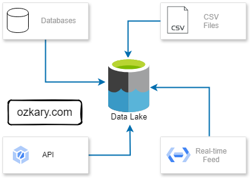
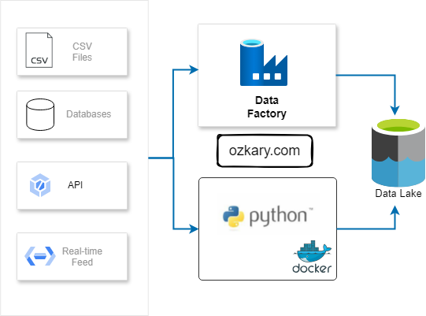
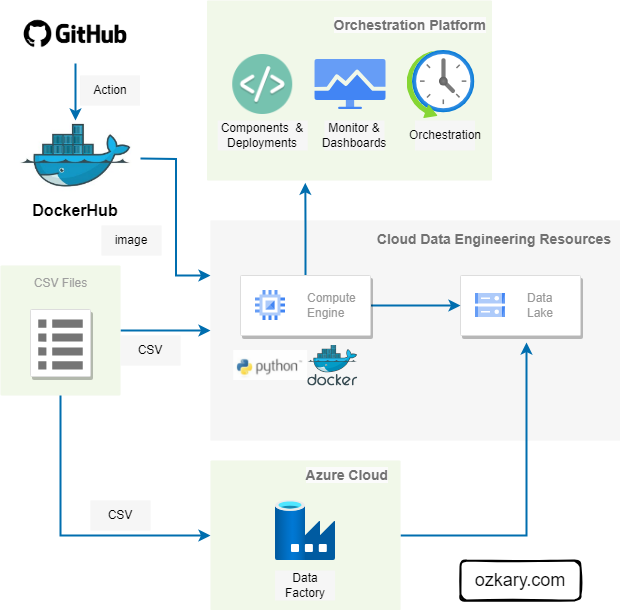
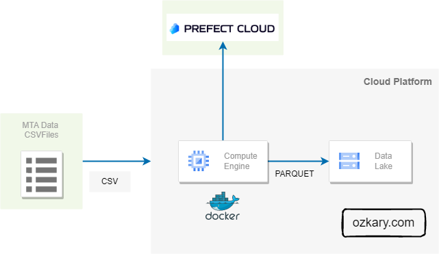
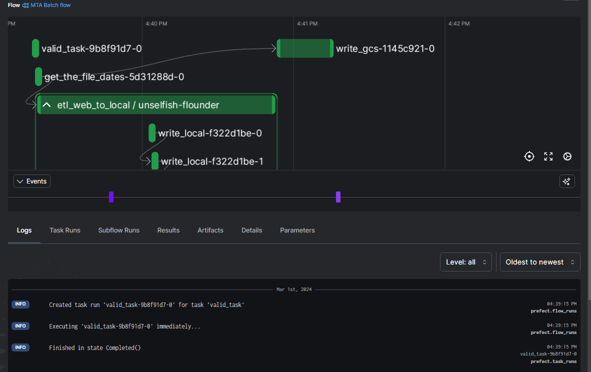
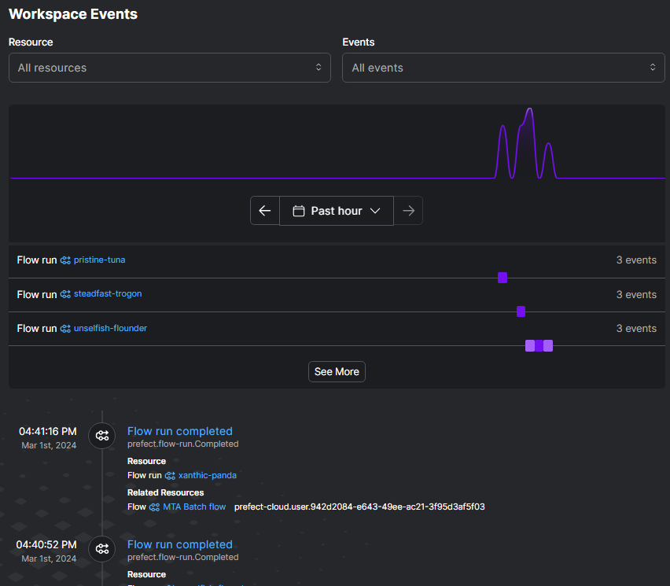

# Overview

A data pipeline refers to a series of connected tasks that handles the extract, transform and load (ETL) as well as the extract, load and transform (ELT) operations and integration from a source to a target storage like a data lake or data warehouse. Properly designed pipelines ensure data integrity, quality, and consistency throughout the system.

In this technical presentation, we embark on the next chapter of our data journey, delving into building a pipeline with orchestration for ongoing development and operational support.

- Follow this GitHub repo during the presentation: (Give it a star)

> 👉 https://github.com/ozkary/data-engineering-mta-turnstile

- Read more information on my blog at:  

> 👉 https://www.ozkary.com/2023/03/data-engineering-process-fundamentals.html

## YouTube Video

<iframe width="560" height="315" src="https://www.youtube.com/embed/5ZoK9oKXWMI?si=JlS41yDrx7mddRZt" title="Data Engineering Process Fundamentals - Data Pipeline" frameborder="0" allow="accelerometer; autoplay; clipboard-write; encrypted-media; gyroscope; picture-in-picture; web-share" allowfullscreen></iframe>

### Video Agenda

- **Understanding Data Pipelines:"*
  - Delve into the concept of data pipelines and their significance in modern data engineering.

- **Implementation Options:**
  - Explore different approaches to implementing data pipelines, including code-centric and low-code tools.

- **Pipeline Orchestration:**
  - Learn about the role of orchestration in managing complex data workflows and the tools available, such as Apache Airflow, Apache Spark, Prefect, and Azure Data Factory.

- **Cloud Resources:**
  - Identify the necessary cloud resources for staging environments and data lakes to support efficient data pipeline deployment.

- **Implementing Flows:**
  - Examine the process of building data pipelines, including defining tasks, components, and logging mechanisms.

- **Deployment with Docker:**
  - Discover how Docker containers can be used to isolate data pipeline environments and streamline deployment processes.

- **Monitor and Operations:**
  - Manage operational concerns related to data pipeline performance, reliability, and scalability.

**Key Takeaways:**

- Gain practical insights into building and managing data pipelines.

- Learn coding techniques with Python for efficient data pipeline development.

- Discover the benefits of Docker deployments for data pipeline management.

- Understand the significance of data orchestration in the data engineering process.

- Connect with industry professionals and expand your network.

- Stay updated on the latest trends and advancements in data pipeline architecture and orchestration.
  
**Some of the technologies that we will be covering:**

- Cloud Infrastructure
- Data Pipelines
- GitHub
- VSCode
- Docker and Docker Hub
  
## Presentation

### Data Engineering Overview

A Data Engineering Process involves executing steps to understand the problem, scope, design, and architecture for creating a solution. This enables ongoing big data analysis using analytical and visualization tools.

#### Topics

- Understanding Data pipelines
- Implementation Options	
- Pipeline Orchestration
- Cloud Resources
- Implementing Code-Centric Flows
- Deployment with Docker
- Monitor and Operations

**Follow this project: Star/Follow the project**

> 👉 [Data Engineering Process Fundamentals](//github.com/ozkary/data-engineering-mta-turnstile)

### Understanding Data Pipelines

A data pipeline refers to a series of connected tasks that handles the extract, transform and load (ETL) as well as the extract, load and transform (ELT) operations and integration from a source to a target storage like a data lake or data warehouse

#### Foundational Areas

- Data Ingestion and Transformation
- Code-Centric vs. Low-Code Options
- Orchestration
- Cloud Resources
- Implementing flows, tasks, components and logging
- Deployment
- Monitoring and Operations

### Data Ingestion and Transformation

Data ingestion is the process of bringing data in from various sources, such as databases, APIs, data streams and files, into a staging area. Once the data is ingested, we can transform it to match our requirements.

**Key Areas:**

- Identify methods for extracting data from various sources (databases, APIs, Data Streams, files, etc.).
- Choose between batch or streaming ingestion based on data needs and use cases
- Data cleansing and standardization ensure quality and consistency.
- Data enrichment adds context and value.
- Formatting into the required data models for analysis.

### Implementation Options

The implementation of a pipeline refers to the designing and/or coding of each task in the pipeline. A task can be implemented using a programming languages like Python or SQL. It can also be implemented using a low-code tool with zero or some code snippet.

**Options:**

- Code-centric: Provides flexibility, customization, and full control (Python, SQL, etc.). Ideal for complex pipelines with specific requirements. Requires programming expertise.

- Low-code: Offers visual drag-and-drop interfaces that allow the engineer to connect to APIs, databases, data lakes and other sources that provide access via API, enabling faster development. (Azure Data Factory, GCP Cloud Dataflow)
  

### Pipeline Orchestration

Orchestration is the automation, management and coordination of the data pipeline tasks. It involves the scheduling, workflows, monitoring and recovery of those tasks. The orchestration handles the execution, error handling, retry and the alerting of problems in the pipeline.

**Orchestration Tools:**

- Apache Airflow: Offers flexible and customizable workflow creation for engineers using Python code, ideal for complex pipelines.
- Apache Spark: Excels at large-scale batch processing tasks involving API calls and file downloads with Python. Its distributed framework efficiently handles data processing and analysis.
- Prefect: This open-source workflow management system allows defining and managing data pipelines as code, providing a familiar Python API.
- Cloud-based Services: Tools like Azure Data Factory and GCP Cloud Dataflow provide a visual interface for building and orchestrating data pipelines, simplifying development. They also handle logging and alerting.

### Cloud Resources

Cloud resources are critical for data pipelines. Virtual machines (VMs) offer processing power for code-centric pipelines, while data lakes serve as central repositories for raw data. Data warehouses, optimized for structured data analysis, often integrate with data lakes to enable deeper insights.

**Resources:**

- **Code-centric pipelines:** VMs are used for executing workflows, managing orchestration, and providing resources for data processing and transformation. Often, code runs within Docker containers.

- **Data Storage:** Data lakes act as central repositories for storing vast amounts of raw and unprocessed data. They offer scalable and cost-effective solutions for capturing and storing data from diverse sources.

- **Low-code tools:** typically have their own infrastructure needs specified by the platform provider. Provisioning might not be necessary, and the tool might be serverless or run on pre-defined infrastructure.

### Implementing Code-Centric Flows

In a data pipeline, orchestrated **flows** define the overall sequence of steps. These flows consist of **tasks**, which represent specific actions within the pipeline. For modularity and reusability, a task should use **components** to encapsulate common concerns like security and data lake access.

**Pipeline Structure:**

- Flows: Are coordinators that define the overall structure and sequence of the data pipeline. They are responsible for orchestrating the execution of other flows or tasks in a specific order.

- Tasks: Are operators for each individual units of work within the pipeline. Each task represents a specific action or function performed on the data, such as data extraction, transformation, or loading. They manipulate the data according to the flow's instructions.

- Components: These are reusable code blocks that encapsulate functionalities common across different tasks. They act as utilities, providing shared functionality like security checks, data lake access, logging, or error handling.

### Deployment with Docker and Docker Hub

Docker proves invaluable for our data pipelines by providing self-contained environments with all necessary dependencies. With Docker Hub, we can effortlessly distribute pipeline images, facilitating swift and reliable provisioning of new environments.

- Docker containers streamline the deployment process by encapsulating application and dependency configurations, reducing runtime errors.

- Containerizing data pipelines ensures reliability and portability by packaging all necessary components within a single container image.

- Docker Hub serves as a centralized container registry, enabling seamless image storage and distribution for streamlined environment provisioning and scalability.

### Monitor and Operations

Monitoring your data pipeline's performance with telemetry data is key to smooth operations. This enables the operations team to proactively identify and address issues, ensuring efficient data delivery.

**Key Components:**

- **Telemetry Tracing:** Tracks the execution of flows and tasks, providing detailed information about their performance, such as execution time, resource utilization, and error messages.

- **Monitor and Dashboards:** Visualize key performance indicators (KPIs) through user-friendly dashboards, offering real-time insights into overall pipeline health and facilitating anomaly detection.

- **Notifications to Support:** Timely alerts are essential for the operations team to be notified of any critical issues or performance deviations, enabling them to take necessary actions.

## Summary

A data pipeline is basically a workflow of tasks that can be executed in Docker containers. The execution, scheduling, managing and monitoring of the pipeline is referred as orchestration. In order to support the operations of the pipeline and its orchestration, we need to provision a VM and data lake cloud resources, which we can also automate with Terraform. By selecting the appropriate programming language and orchestration tools, we can construct resilient pipelines capable of scaling and meeting evolving data demands effectively.

Thanks for reading.

Send question or comment at Twitter @ozkary
👍 Originally published by [ozkary.com](https://www.ozkary.com)
