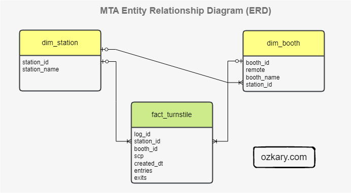
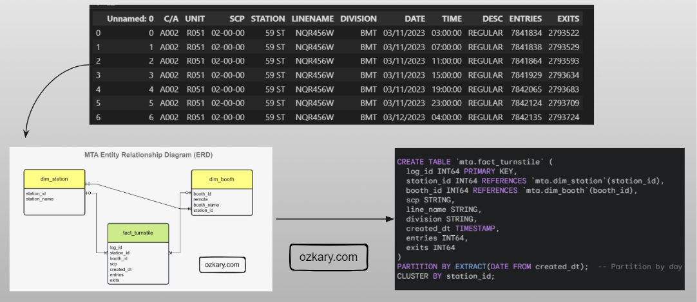

# Overview

A Data Warehouse is an OLAP system, which serves as the central data repository for historical and aggregated data. A data warehouse is designed to support complex analytical queries, reporting, and data analysis for Big Data use cases. It typically adopts a denormalized entity structure, such as a star schema or snowflake schema, to facilitate efficient querying and aggregations. Data from various OLTP sources is extracted, loaded and transformed (ELT) into the data warehouse to enable analytics and business intelligence. The data warehouse acts as a single source of truth for business users to obtain insights from historical data.

In this technical presentation, we embark on the next chapter of our data journey, delving into data modeling and building our data warehouse.

- Follow this GitHub repo during the presentation: (Give it a star)

> 👉 https://github.com/ozkary/data-engineering-mta-turnstile

- Read more information on my blog at:  

> 👉 https://www.ozkary.com/2023/03/data-engineering-process-fundamentals.html

## YouTube Video

<iframe width="560" height="315" src="https://www.youtube.com/embed/_Jc-IACZV50?si=KpZVg9Tz_cQlvCHB" title="Data Engineering Process Fundamentals - Data Warehouse" frameborder="0" allow="accelerometer; autoplay; clipboard-write; encrypted-media; gyroscope; picture-in-picture; web-share" referrerpolicy="strict-origin-when-cross-origin" allowfullscreen></iframe>

### Video Agenda

Building on our previous exploration of data pipelines and orchestration, we now delve into the pivotal phase of data modeling and analytics. In this continuation of our data engineering process series, we focus on architecting insights by designing and implementing data warehouses, constructing logical and physical models, and optimizing tables for efficient analysis. Let's uncover the foundational principles driving effective data modeling and analytics.

**Agenda:**

- **Operational Data Concepts:**
  - Explanation of operational data and its characteristics.
  - Discussion on data storage options, including relational databases and NoSQL databases.

- **Data Lake for Data Staging:**
  - Introduction to the concept of a data lake as a central repository for raw, unstructured, and semi-structured data.
  - Explanation of data staging within a data lake for ingesting, storing, and preparing data for downstream processing.
  - Discussion on the advantages of using a data lake for data staging, such as scalability and flexibility.

- **Data Warehouse for Analytical Data:**

  - Overview of the role of a data warehouse in storing and organizing structured data for analytics and reporting purposes.
  - Discussion on the benefits of using a data warehouse for analytical queries and business intelligence.

- **Data Warehouse Design and Implementation:**

  - Introduction to data warehouse design principles and methodologies.
  - Explanation of logical models for designing a data warehouse schema, including conceptual and dimensional modeling.

- **Star Schema:**

  - Explanation of the star schema design pattern for organizing data in a data warehouse.
  - Discussion on fact tables, dimension tables, and their relationships within a star schema.
  - Explanation of the advantages of using a star schema for analytical querying and reporting.

- **Logical Models:**

  - Discussion on logical models in data warehouse design.
  - Explanation of conceptual modeling and entity-relationship diagrams (ERDs).
  
- **Physical Models - Table Construction:**

  - Discussion on constructing tables from the logical model, including entity mapping and data normalization.
  - Explanation of primary and foreign key relationships and their implementation in physical tables.

- **Table Optimization Index and Partitions:**

  - Introduction to table optimization techniques for improving query performance.
  - Explanation of index creation and usage for speeding up data retrieval. 
  - Discussion on partitioning strategies for managing large datasets and enhancing query efficiency.

- **Incremental Strategy:**

  - Introduction to incremental loading techniques for efficiently updating data warehouses.
  - Explanation of delta processing.
  - Discussion on the benefits of incremental loading in reducing processing time and resource usage.

- **Orchestration and Operations:**

  - Tools and frameworks for orchestrating data pipelines, such as dbt.
  - Discussion on the importance of orchestration and monitoring the data processing tasks.
  - Policies to archive data in blob storage.

**Why join this session?**

- Learn analytical data modeling essentials.
- Explore schema design patterns like star and snowflake.
- Optimize large dataset management and query efficiency.
- Understand logical and physical modeling strategies.
- Gain practical insights and best practices.
- Engage in discussions with experts.
- Advance your data engineering skills.
- Architect insights for data-driven decisions.
  
## Presentation

### Data Engineering Overview

A Data Engineering Process involves executing steps to understand the problem, scope, design, and architecture for creating a solution. This enables ongoing big data analysis using analytical and visualization tools.

#### Topics

- Operational Data
- Data Lake 
- Data Warehouse
- Schema and Data Modeling
- Data Strategy and Optimization
- Orchestration and Operations

**Follow this project: Star/Follow the project**

> 👉 [Data Engineering Process Fundamentals](//github.com/ozkary/data-engineering-mta-turnstile)

### Operational Data

Operational data **(OLTP)** is often generated by applications, and it is stored in transactional relational databases like SQL Server, Oracle and NoSQL (JSON) databases like CosmosDB, Firebase. This is the data that is created after an application saves a user transaction like contact information, a purchase or other activities that are available from the application. 

#### Features

- Application support and transactions
- Relational data structure and SQL or document structure NoSQL
- Small queries for case analysis

#### Not Best For:

- Reporting and analytical systems **(OLAP)**
- Large queries
- Centralized Big Data system

### Data Lake - From Ops to Analytical Data Staging 

A Data Lake is an optimized storage system for Big Data scenarios. The primary function is to store the data in its raw format without any transformation. Analytical data is the transaction data that has been extracted from a source system via a data pipeline as part of the staging data process.

**Features:**

- Store the data in its raw format without any transformation 
- This can include structure data like CSV files, unstructured data like JSON and XML documents, or column-base data like parquet files
- Low Cost for massive storage power
- Not Designed for querying or data analysis
- It is used as external tables by most systems

### Data Warehouse - Staging to Analytical Data

A Data Warehouse, OLAP system,  is a centralized storage system that stores integrated data from multiple sources. The system is designed to host and serve Big Data scenarios with lower operational cost than transaction databases, but higher costs than a Data Lake.

**Features:**

- Stores historical data in relational tables with an optimized schema, which enables the data analysis process
- Provides SQL support to query and transform the data
- Integrates external resources on Data Lakes as external tables
- The system is designed to host and serve Big Data scenarios. 
- Storage is more expensive
- Offloads archived data to Data Lakes

### Data Warehouse - Design and Implementation

In the **design phase**, we lay the groundwork by defining the database system, schema model, logical data models, and technology stack (SQL, Python, frameworks and tools) required to support the data warehouse’s implementation and operations. 

In the **implementation phase**, we focus on converting logical data models into a functional system. By creating concrete structures like dimension and fact tables and performing data transformation tasks, including data cleansing, integration, and scheduled batch loading, we ensure that raw data is processed and unified for analysis.

### Design - Schema Modeling

The Star and Snowflake Schemas are two common data warehouse modeling techniques. The Star Schema consist of a central fact table is connected to multiple dimension tables via foreign key relationships. The Snowflake Schema is a variation of the Star Schema, but with dimension tables that are further divided into multiple related tables.

**What to use:**

- Use the Star Schema when query performance is a primary concern, and data model simplicity is essential

- Use the Snowflake Schema when storage optimization is crucial, and the data model involves high-cardinality dimension attributes with potential data redundancy

### Data Modeling

Data modeling lays the foundation for a data warehouse. It starts with modeling raw data into a **logical model** outlining the data and its relationships, with a focus based on data requirements. This model is then translated, using DDL, into the specific views, tables, columns (data types), and keys that make up the **physical model** of the data warehouse, with a focus on technical requirements.

### Data Optimization to Deliver Performance

To achieve faster queries, improve performance and reduce resource cost, we need to efficiently organize our data. Two key techniques for accomplishing this are data partitioning and data clustering. 

- **Data Partitioning:** Imagine dividing your data table into smaller, self-contained segments based on a specific column (e.g., date). This allows the DW to quickly locate and retrieve only the relevant data for your queries, significantly reducing scan times.

- **Data Clustering:** Allows us to organize the data within each partition based on another column (e.g., Station). This groups frequently accessed data together physically, leading to faster query execution, especially for aggregations or filtering based on the clustered column.

### Data Transformation and Incremental Strategy

The data transformation phase is a critical stage in a data warehouse project. This phase involves several key steps, including data extraction, cleaning, loading, data type casting, use of naming conventions, and implementing incremental loads to continuously insert the new information since the last update via batch processes.

- Data Lineage: Tracks the flow of data from its origin to its destination, including all the intermediate processes and transformations that it undergoes. 

### Orchestration and Operations

Effective orchestration and operation are the keys of a reliable and efficient data project.  They streamline data pipelines, ensure data quality, and minimize human intervention.  This translates to faster development cycles, reduced errors, and improved overall data management.

- **Version Control and CI/CD with GitHub**: Enables development, automated testing, and seamless deployment of data pipelines.

- **Documentation**: Maintain clear and comprehensive documentation covering data pipelines, data quality checks, scheduling, data archiving policies

- **Scheduling and Automation**: Automates repetitive tasks, such as data ingestion, transformation, and archiving processes,

- **Monitoring and Notification**: Provides real-time insights into pipeline health, data quality, and archiving success

## Summary

Before we can move data into a data warehouse system, we explore two pivotal phases for our data warehouse solution: design and implementation. In the design phase, we lay the groundwork by defining the database system, schema and data model, and technology stack required to support the data warehouse’s implementation and operations. This stage ensures a solid infrastructure for data storage and management.

In the implementation phase, we focus on converting conceptual data models into a functional system. By creating concrete structures like dimension and fact tables and performing data transformation tasks, including data cleansing, integration, and scheduled batch loading, we ensure that raw data is processed and unified for analysis. 

Thanks for reading.

Send question or comment at Twitter @ozkary
👍 Originally published by [ozkary.com](https://www.ozkary.com)
