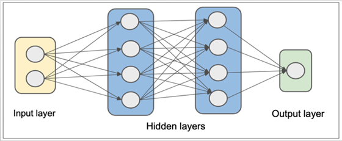

# Overview

This presentation explores the potential of Generative AI, specifically Large Language Models (LLMs), for streamlining software development by generating code directly from user stories written in GitHub. We delve into benefits like increased developer productivity and discuss techniques like Prompt Engineering and user story writing for effective code generation. Utilizing Python and AI, we showcase a practical example of reading user stories, generating code, and updating the corresponding story in GitHub, demonstrating the power of AI in streamlining software development.

> #BuildwithAI Series


- Follow this GitHub repo during the presentation: (Give it a star and follow the project)

> 👉 https://github.com/ozkary/ai-engineering

- Read more information on my blog at:  

## YouTube Video

<iframe width="560" height="315" src="https://www.youtube.com/embed/QsX5ylDx4gM?si=Z0Vukx_wxBsWUAog" title="Generative AI: Generate Code from User Stories" frameborder="0" allow="accelerometer; autoplay; clipboard-write; encrypted-media; gyroscope; picture-in-picture; web-share" referrerpolicy="strict-origin-when-cross-origin" allowfullscreen></iframe>

### Video Agenda

**Agenda:**

- Introduction to LLMs and their Role in Code Generation
- Prompt Engineering - Guiding the LLM
- Writing User Stories for Code Generation
- Introducing Gemini AI and AI Studio
- Python Implementation - A Practical Example using VS Code
  - Reading user stories from GitHub.
  - Utilizing Gemini AI to generate code based on the user story.
  - Updating the corresponding GitHub user story with the generated code.
- Conclusion: Summarize the key takeaways of the article, emphasizing the potential of Generative AI in code creation.

**Why join this session?**

- Discover how Large Language Models (LLMs) can automate code generation, saving you valuable time and effort.
- Learn how to craft effective prompts that guide LLMs to generate the code you need.
- See how to write user stories that bridge the gap between human intent and AI-powered code creation.
- Explore Gemini AI and AI Studio
- Witness Code Generation in Action: Experience a live demonstration using VS Code, where user stories from GitHub are transformed into code with the help of Gemini AI.
  
## Presentation

### What are LLM Models - Not Skynet

Large Language Model (LLM) refers to a class of Generative AI models that are designed to understand prompts and questions and generate human-like text based on large amounts of training data. LLMs are built upon Foundation Models which have a focus on language understanding.

#### Common Tasks

- **Text** and **Code Generation**: LLMs can  generate code snippets or even entire programs based on specific requirements

- **Natural Language Processing (NLP)**: Understand and generate human language, sentiment analysis, translation

- **Text Summarization**: LLMs can condense lengthy 
pieces of text into concise summaries

- **Question Answering**: LLMs can access and process information from various sources to answer questions, making a great fit for chatbots


### Training LLM Models - Secret Sauce

Models are trained using a combination of machine learning and deep learning. Massive datasets of text and code are collected, cleaned, and fed into complex neural networks with multiple layers. These networks iteratively learn by analyzing patterns in the data, allowing them to map inputs like user stories to desired outputs such as code generation.

#### Training Process:

- **Data Collection**: Sources from books, articles, code repositories, and online conversations

- **Preprocessing**: Data cleaning and formatting for the ML algorithms to understand it effectively

- **Model Training**: The neural network architecture is trained on the data. The network adjusts its internal parameters to learn how to map input data (user stories) to desired outputs (code snippets)

- **Fine-tuning**: Fine-tune models for specific tasks like code generation, by training the model on relevant data (e.g., specific programming languages, coding conventions).



### Transformer Architecture - Not Autobots

Transformer is a neural network architecture that excels at processing long sequences of text by analyzing relationships between words, no matter how far apart they are. This allows LLMs to understand complex language patterns and generate human-like text.

#### Components

- **Encoder**: Process the input (use story) by using multiple encoder layers with self-attention Mechanism to analyze the relationship between words
  
- **Decoder**: Uses the encoded information and its own attention mechanism to generate the output text (like code), ensuring it aligns with the text.
  
- **Attention Mechanism**: Enables the model to effectively focus on the most important information for the task at hand, leading to improved NLP and generation capabilities.


> 👉 Read: [Attention is all you need by Google, 2017](https://research.google/pubs/attention-is-all-you-need/)

### Prompt Engineering - What is it?

Prompt engineering is the process of designing and optimizing prompts to better utilize LLMs. Well described prompts can help the AI models better understand the context and generate more accurate responses.

#### Features

- **Clarity and Specificity**: Effective prompts are clear, concise, and specific about the task or desired response

- **Task Framing**: Provide background information, specifying the desired output format (e.g., code, email, poem), or outlining specific requirements

- **Examples and Counter-Examples**: Including relevant examples and counterexamples within the prompt can further guide the LLM 

- **Instructional Language**: Use clear and concise instructions to improve the LLM's understanding of what information to generate

**User Story Prompt:**

```bash
As a web developer, I want to create a React component with TypeScript for a login form that uses JSDoc for documentation, hooks for state management, includes a "Remember This Device" checkbox, and follows best practices for React and TypeScript development so that the code is maintainable, reusable, and understandable for myself and other developers, aligning with industry standards.

Needs:

- Component named "LoginComponent" with state management using hooks (useState)
- Input fields:
    - ID: "email" (type="email") - Required email field (as username)
    - ID: "password" (type="password") - Required password field
- Buttons:
    - ID: "loginButton" - "Login" button
    - ID: "cancelButton" - "Cancel" button
- Checkbox:
    - ID: "rememberDevice" - "Remember This Device" checkbox

```

### Generate Code from User Stories - Practical Use Case

In the Agile methodology, user stories are used to capture requirements, tasks, or a feature from the perspective of a role in the system. For code generation, developers can write user stories to capture the context, requirements and technical specifications necessary to generate code with AI.

#### Code Generation Flow:

- **1 User Story**: Get the GitHub tasks with user story information

- **2 LLM Model**: Send the user story as a prompt to the LLM Model

- **3 Generated Code**: Send the generated code back to GitHub as a comment for a developer to review

> 👉 LLM generated code is not perfect, and developers should manually review and validate the generated code.


### How does LLMs Impact Development?

LLMs accelerate development by generating code faster, leading to shorter development cycles. They also automate documentation and empower exploration of complex algorithms, fostering innovation.

#### Features:

- **Code Completion**: Analyze your code and suggest completions based on context

- **Code Synthesis**: Describe what you want the code to do, and the LLM can generate the code

- **Code Refactoring**: Analyze your code and suggest improvements for readability, performance, or best practices.

- **Documentation**: Generate documentation that explains your code's purpose and functionality

- **Code Translation**: Translate code snippets between different programming languages


> 👉 Security Concerns: Malicious actors could potentially exploit LLMs to generate harmful code.

### What is Gemini AI?

Gemini is Google's next-generation large language model (LLM), unlocking the potential of Generative AI. This powerful tool understands and generates various data formats, from text and code to images and audio.

#### Components:

- Gemini: Google's next-generation multimodal LLM, capable of understanding and generating various data formats (text, code, images, audio)

- Gemini API: Integrate Gemini's into your applications with a user-friendly API

- Google AI Studio: A free, web-based platform for prototyping with Gemini [aistudio.google.com](https://aistudio.google.com)

 - Experiment with prompts and explore Gemini's capabilities
   - Generate creative text formats, translate languages
  - Export your work to code for seamless integration into your projects


> 👉 Multimodal LLMs can handle text, images, video, code


## Generative AI for Development Summary

LLM plays a crucial role in code generation by harnessing its language understanding and generative capabilities. People in roles like developers, data engineers, scientists and others can utilize AI models to swiftly generate scripts in various programming languages, streamlining their programming tasks. 

**Common Tasks:**
 -   Code generation
 -   Natural Language Processing (NLP)
 -   Text summarization
 -  Question answering

**Architecture:**
 -  Multi-layered neural networks
 -  Training process

 **Transformer Architecture:**
 -   Encoder-Decoder structure
 -  Attention mechanism  

**Prompt Engineering:**
 -  Crafting effective prompts with user stories

 **Code Generation from User Stories:**
  -   Leveraging user stories for code generation


Thanks for reading.

Send question or comment at Twitter @ozkary

👍 Originally published by [ozkary.com](https://www.ozkary.com)
