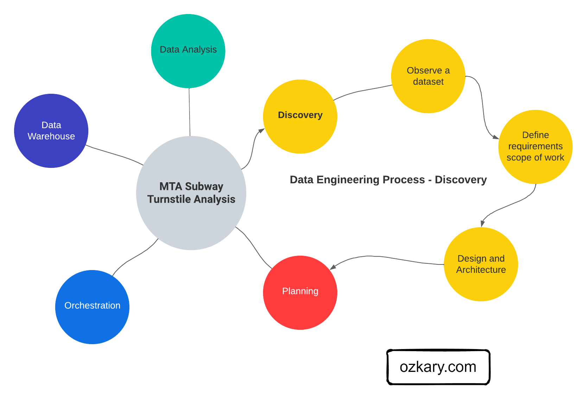
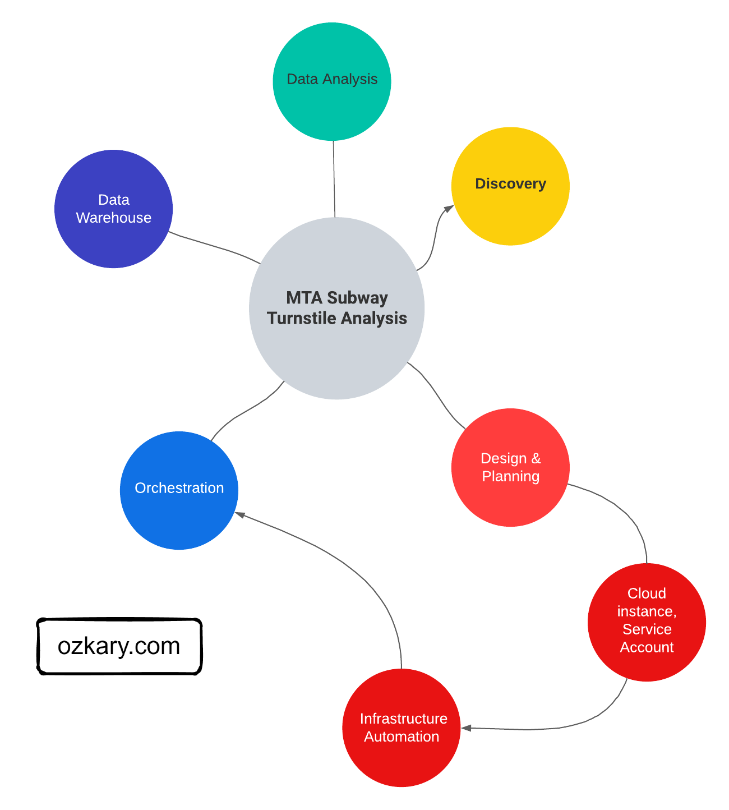
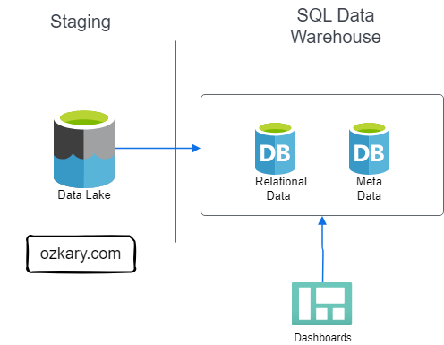
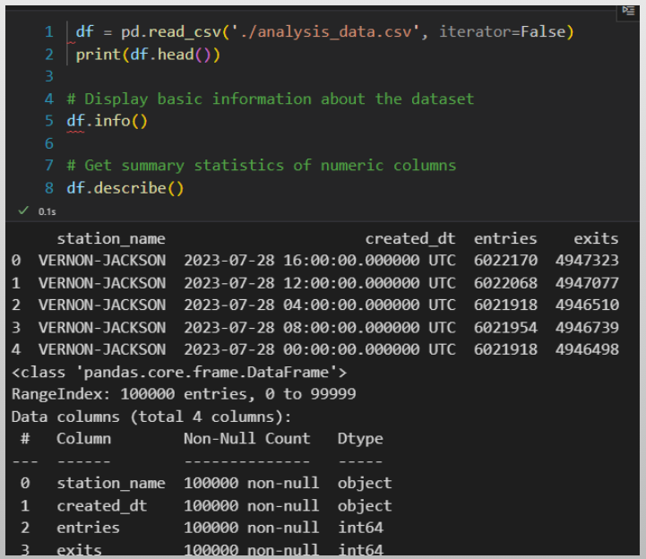
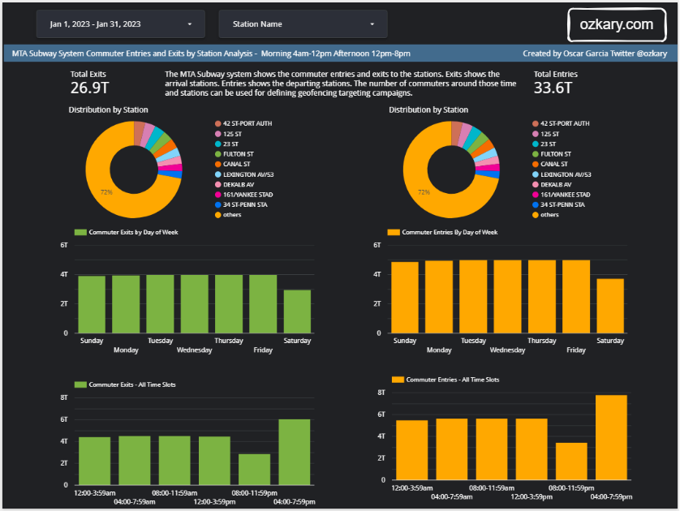

# Overview

Welcome, data engineers! Today, we delve into the world of cloud-based data pipelines, the backbone of efficient data movement within your organization. As a continuation of our Data Engineering Process Fundamentals series, this session equips you with the knowledge to build robust and scalable data pipelines leveraging the power of the cloud. Throughout this presentation, we'll explore the benefits of cloud-based solutions, delve into key design considerations, and unpack the process of building and optimizing your very own data pipeline in the cloud.

- Follow this GitHub repo during the presentation: (Give it a star)

> 👉 https://github.com/ozkary/data-engineering-mta-turnstile

- Read more information on my blog at:  

> 👉 https://www.ozkary.com/2023/03/data-engineering-process-fundamentals.html

## YouTube Video

<iframe width="560" height="315" src="https://www.youtube.com/embed/iMXl99xwGjo?si=t7BY1qxOXn3x0Qun" title="Data Engineering Process Fundamentals - Streamlining Data Flow: Building Cloud-Based Data Pipelines" frameborder="0" allow="accelerometer; autoplay; clipboard-write; encrypted-media; gyroscope; picture-in-picture; web-share" referrerpolicy="strict-origin-when-cross-origin" allowfullscreen></iframe>

### Video Agenda

**About this event**

This session guides you through the essential stages of building a cloud-based data pipeline:

**Agenda:**

**Discovery**: We'll embark on a journey of discovery, identifying data sources, understanding business needs, and defining the scope of your data pipeline.

**Design and Planning**: Here, we'll transform insights into a well-defined blueprint. We'll discuss architecture considerations, data flow optimization, and technology selection for your cloud pipeline.

**Data Pipeline and Orchestration**: Get ready to orchestrate the magic! This stage delves into building the pipeline itself, selecting the right tools, and ensuring seamless data movement between stages.

**Data Modeling and Data Warehouse**: Data needs a proper home! We'll explore data modeling techniques and the construction of a robust data warehouse in the cloud, optimized for efficient analysis.

**Data Analysis and Visualization**: Finally, we'll unlock the power of your data. Learn how to connect your cloud pipeline to tools for insightful analysis and compelling data visualizations.

**Why Watch**:

**Process Power**: Learn a structured, process-oriented approach to building and managing efficient cloud data pipelines.

**Data to Insights**: Discover how to unlock valuable information from your data using Python for data analysis.

**The Art of Visualization**: Master the art of presenting your data insights through compelling data visualizations.

**Future-Proof Your Skills**: Gain in-demand cloud data engineering expertise, including data analysis and visualization techniques.  

This session equips you with the knowledge and practical skills to build a data pipelines, a crucial skill for data-driven organizations. You'll not only learn the "how" but also the "why" behind each step, empowering you to confidently design, implement, and analyze data pipelines that drive results.

**Video Chapters:**

0:00:00 Welcome to Data Engineering Process Fundamentals
0:02:19 Phase 1: Discovery
0:19:30 Phase 2: Design and Planning
0:33:30 Phase 3: Data Pipeline and Orchestration
0:49:00 Phase 4: Data Modeling and Data Warehouse 
0:59:00 Phase 5: Data Analysis and Visualization
1:01:00 Final Thoughts

## Presentation

### Data Engineering Overview

A Data Engineering Process involves executing steps to understand the problem, scope, design, and architecture for creating a solution. This enables ongoing big data analysis using analytical and visualization tools.

#### Process Phases:

- Discovery
- Design and Planning
- Data Pipeline and Orchestration
- Data Modeling and Data Warehouse 
- Data Analysis and Visualization

**Follow this project: Star/Follow the project**

> 👉 [Data Engineering Process Fundamentals](//github.com/ozkary/data-engineering-mta-turnstile)

### Phase 1: Discovery Process

The discovery process involves identifying the problem, analyzing data sources, defining project requirements, establishing the project scope, and designing an effective architecture to address the identified challenges. 

**Activities include:**

- Background & problem statement: Clearly document and understand the challenges the project aims to address.
- Exploratory Data Analysis (EDA): Make observations about the data, its structure, and sources.
- Define Project Requirements based on the observations, enabling the team to understand the scope and goals.
- Scope of Work: Clearly outline the scope, ensuring a focused and well-defined set of objectives.
- Set the Stage by selecting tools and technologies that are needed.
- Design and Architecture: Develop a robust design and project architecture that aligns with the defined requirements and scope.

### Phase 2: Design and Planning

The design and planning phase of a data engineering project is crucial for laying out the foundation of a successful and scalable solution. This phase ensures that the architecture is strategically aligned with business objectives, optimizes resource utilization, and mitigates potential risks.

**Foundational Areas**

- Designing the data pipeline and technology specifications like flows, coding language, data governance and tools
- Define the system architecture with cloud services for scalability like data lakes & warehouse, orchestration.
- Source control and deployment automation with CI/CD
- Using Docker containers for environment isolation to avoid deployment issues
- Infrastructure automation with Terraform or cloud CLI tools
- System monitor, notification and recovery to support operations

### Phase 3: Data Pipeline and Orchestration

A data pipeline is basically a workflow of tasks that can be executed in Docker containers. The execution, scheduling, managing and monitoring of the pipeline is referred to as orchestration. In order to support the operations of the pipeline and its orchestration, we need to provision a VM and data lake.

Process:

- Get Data In: Ingest data from various sources (databases, APIs, files). Decide to get it all at once (batch) or continuously (streaming).
- Clean & Format Data: Ensure data quality and consistency. Get it ready for analysis in the right format.
- Code or No-Code: Use code (Python, SQL) or pre-built solutions.
- Run The Pipeline: Schedule tasks and run the pipeline. Track its performance to find issues.
- Store Data in the Cloud: Use data lakes (staging) for raw data and data warehouses for structured, easy-to-analyze data.
- Deploy Easily: Use containers (Docker) to deploy the pipeline anywhere.
- Monitor & Maintain: Track how the pipeline runs, fix problems, and keep it working smoothly.

### Phase 4: Data Modeling and Data Warehouse

#### Data Lake - Analytical Data Staging

A Data Lake is an optimized storage system for Big Data scenarios. The primary function is to store the data in its raw format without any transformation. Analytical data is the data that has been extracted from a source system via a data pipeline as part of the staging data process.

**Features:**

- Store the data in its raw format without any transformation 
- This can include structure data like CSV files, unstructured data like JSON and XML documents, or column-base data like parquet files
- Low Cost for massive storage power
- Not Designed for querying or data analysis
- It is used as external tables by a data warehouse system

#### Data Warehouse - Staging to Analytical Data

A Data Warehouse, Online Analytical Processing (OLAP) system,  is a centralized storage system that stores integrated data from multiple sources. The system is designed to host and serve Big Data scenarios with lower operational cost than transaction databases, but higher costs than a Data Lake.

**Features:**

- Stores historical data in relational tables with an optimized schema, which enables the data analysis & visualization process
- Provides SQL support to query and transform the data
- Integrates external resources on Data Lakes as external tables
- The system is designed to host and serve Big Data scenarios. 
- Storage is more expensive
- Offloads archived data to Data Lakes

### Phase 5: Data Analysis and Visualization

####  How Do We Gather Insights From Data?

We leverage the principles of data analysis and visualization. Data analysis reveals patterns and trends, while visualization translates these insights into clear charts and graphs. It's the approach to turning raw data into actionable insights for smarter decision-making. 

**Let’s Explore More About:**

- Data Analysis
  - Python and Jupyter Notebook
- Data Visualization
  - Chart Types and Design Principles
  - Code-centric with Python Graphs
  - Low-code with tools like Looker, PowerBI, Tableau

#### Data Analysis - Exploring Data

Data analysis is the practice of exploring data and understanding its meaning. It involves activities that can help us achieve a specific goal, such as identifying data dimensions and measures, as well as the process to identify outliers, trends, and distributions. 

**Methods:**

- We can accomplish these activities by writing code using Python and Pandas, SQL,  Jupyter Notebooks. 
- We can use libraries, such as Plotly, to generate some visuals to further analyze data and create prototypes.
- The use of low-code tools also aids in the Exploratory Data Analysis (EDA) process by modeling data and using code snippets

####  Data Visualization - Unlock Insights

Data visualization is a practice that takes the insights derived from data analysis and presents them in a visual format. While tables with numbers on a report provide raw information, visualizations allow us to grasp complex relationships and trends at a glance with the use of charts, controls and colors.

**Visualization Solutions:**
- A code-centric solution involves writing programs with a language like Python, JavaScript to manage the data analysis and create the visuals

- A low-code solution uses cloud-hosted tools like Looker, PowerBI and Tableau to accelerate the data analysis and visualization by using a design approach 

## Summary

Throughout this session, we've explored the key stages of building a powerful cloud-based data pipeline. From identifying data sources and understanding business needs (Discovery) to designing an optimized architecture (Design & Planning), building the pipeline itself (Data Pipeline & Orchestration), and finally constructing a robust data warehouse for analysis (Data Modeling & Data Warehouse), we've equipped you with the knowledge to streamline your data flow.

By connecting your cloud pipeline to data analysis and visualization tools, you'll unlock the true power of your data, enabling you to translate insights into clear, actionable information. 

### We've covered a lot today, but this is just the beginning! 

If you're interested in learning more about building cloud data pipelines, I encourage you to check out my book, 'Data Engineering Process Fundamentals,' part of the Data Engineering Process Fundamentals series. It provides in-depth explanations, code samples, and practical exercises to help in your learning.

   
 

Thanks for reading.

Send question or comment at Twitter @ozkary
👍 Originally published by [ozkary.com](https://www.ozkary.com)
