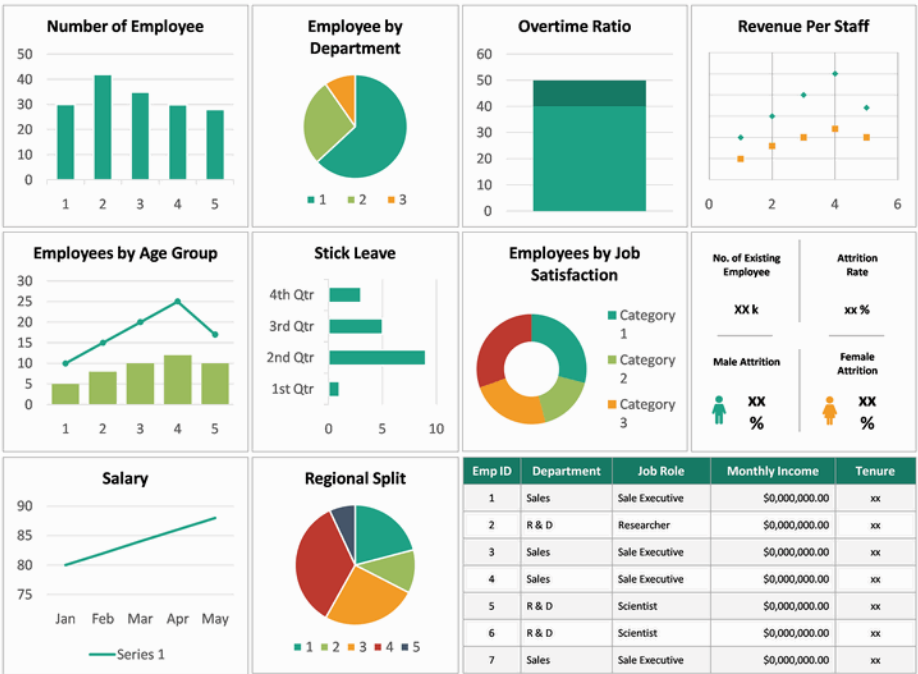

# Overview

Delve into unlocking the insights from our data with data analysis and visualization. In this continuation of our data engineering process series, we focus on visualizing insights. We learn about best practices for data analysis and visualization, we then move into an implementation using a code-centric dashboard using Python, Pandas and Plotly. We then follow up by using a high-quality enterprise tool, such as Looker, to construct a low-code cloud-hosted dashboard, providing us with insights into the type of effort each method takes.


- Follow this GitHub repo during the presentation: (Give it a star)

> 👉 https://github.com/ozkary/data-engineering-mta-turnstile

- Read more information on my blog at:  

> 👉 https://www.ozkary.com/2023/03/data-engineering-process-fundamentals.html

## YouTube Video

<iframe width="560" height="315" src="https://www.youtube.com/embed/5AZVLeDLAAo?si=jX3P4M6k7SlVG21s" title="Data Engineering Process Fundamentals - Unlocking Insights: Data Analysis and Visualization " frameborder="0" allow="accelerometer; autoplay; clipboard-write; encrypted-media; gyroscope; picture-in-picture; web-share" referrerpolicy="strict-origin-when-cross-origin" allowfullscreen></iframe>

### Video Agenda

1. Introduction:

   Recap the importance of data warehousing, data modeling and transition to data analysis and visualization.

2. Data Analysis Foundations:

  Data Profiling: Understand the structure and characteristics of your data.
  Data Preprocessing: Clean and prepare data for analysis.
  Statistical Analysis: Utilize statistical techniques to extract meaningful patterns.
  Business Intelligence: Define key metrics and answer business questions.
  Identifying Data Analysis Requirements: Explore filtering criteria, KPIs, data distribution, and time partitioning.

3. Mastering Data Visualization:

  Common Chart Types: Explore a variety of charts and graphs for effective data visualization.
  Designing Powerful Reports and Dashboards: Understand user-centered design principles for clarity, simplicity, consistency, filtering options, and mobile responsiveness.
  Layout Configuration and UI Components: Learn about dashboard design techniques for impactful presentations.

4. Implementation Showcase:

 Code-Centric Dashboard: Build a data dashboard using Python, Pandas, and Plotly (demonstrates code-centric approach).
 Low-Code Cloud-Hosted Dashboard: Explore a high-quality enterprise tool like Looker to construct a dashboard (demonstrates low-code efficiency).
 Effort Comparison: Analyze the time and effort required for each development approach.

5. Conclusion: 

Recap key takeaways and the importance of data analysis and visualization for data-driven decision-making.

**Why Join This Session?**

- Learn best practices for data analysis and visualization to unlock hidden insights in your data.
- Gain hands-on experience through code-centric and low-code dashboard implementations using popular tools.
- Understand the effort involved in different dashboard development approaches.
- Discover how to create user-centered, impactful visualizations for data-driven decision-making.
- This session empowers data engineers and analysts with the skills and tools to transform data into actionable insights that drive business value.

## Presentation

### How Do We Gather Insights From Data?

We leverage the principles of data analysis and visualization. Data analysis reveals patterns and trends, while visualization translates these insights into clear charts and graphs. It's the approach to turning raw data into actionable insights for smarter decision-making. 

**Let’s Explore More About:** 

- Data Modeling
- Data Analysis
  - Python and Jupyter Notebook
  - Statistical Analysis vs Business Intelligence
- Data Visualization
  - Chart Types and Design Principles
  - Code-centric with Python Graphs
  - Low-code with tools like Looker, PowerBI, Tableau

### Data Modeling

Data modeling lays the foundation for a data warehouse. It starts with modeling raw data into a logical model outlining the data and its relationships, with a focus based on data requirements. This model is then translated, using DDL, into the specific views, tables, columns (data types), and keys that make up the physical model of the data warehouse, with a focus on technical requirements.


### Importance of a Date Dimension

A date dimension allows us to analyze your data across different time granularities (e.g., year, quarter, month, day). By storing dates and related attributes in a separate table, you can efficiently join it with your fact tables containing metrics. When filtering or selecting dates for analysis, it's generally better to choose options from the dimension table rather than directly filtering the date column in the fact table. 

```sql
CREATE TABLE dim_date (
  date_id INT NOT NULL PRIMARY KEY,  -- Surrogate key for the date dimension
  full_date DATE NOT NULL,          -- Full date in YYYY-MM-DD format
  year INT NOT NULL,                -- Year (e.g., 2024)
  quarter INT NOT NULL,             -- Quarter of the year (1-4)
  month INT NOT NULL,               -- Month of the year (1-12)
  month_name VARCHAR(20) NOT NULL,    -- Name of the month (e.g., January)
  day INT NOT NULL,                 -- Day of the month (1-31)
  day_of_week INT NOT NULL,            -- Day of the week (1-7, where 1=Sunday)
  day_of_week_name VARCHAR(20) NOT NULL, -- Name of the day of the week (e.g., Sunday)
  is_weekend BOOLEAN NOT NULL,        -- Flag indicating weekend (TRUE) or weekday (FALSE)
  is_holiday BOOLEAN NOT NULL,        -- Flag indicating holiday (TRUE) or not (FALSE)
  fiscal_year INT,                   -- Fiscal year (optional)
  fiscal_quarter INT                 -- Fiscal quarter (optional)  -- Optional
);
```

### Data Analysis

Data analysis is the practice of exploring data and understanding its meaning. It involves activities that can help us achieve a specific goal, such as identifying data dimensions and measures, as well as the process to identify outliers, trends, and distributions. 

- We can accomplish these activities by writing code using Python and Pandas, SQL,  Jupyter Notebooks. 
- We can use libraries, such as Plotly, to generate some visuals to further analyze data and create prototypes.
- The use of low-code tools also aids in the Exploratory Data Analysis (EDA) process
  


### Data Analysis - Profiling

Data profiling is the process to identify the data types, dimensions, measures, and quantitative values, which allows the analyst to view the characteristics of the data, so we can understand how to group the information.

- Data Types: This is the type classification of the data fields. It enables us to identify categorical (text), numeric and date-time values, which define the schema
- Dimensions: Dimensions are textual, and categorical attributes that describe business entities. They are often discrete and used for grouping, filtering, organizing and partition the data
- Measures: Measures are the quantitative values that are subject to calculations such as sum, average, minimum, maximum, etc. They represent the KPIs that the organization wants to track and analyze


|     | dimension | data\_type | measure | datetime\_dimension |
| --- | --- | --- | --- | --- |
| station\_name | True | object | False | False |
| created\_dt | True | object | False | True |
| entries | False | int64 | True | False |
| exits | False | int64 | True | False |

### Data Analysis - Cleaning and Preprocessing


Data cleaning is the process of finding bad data and outliers that can affect the results. In preprocessing, we set the data types, combine or split columns, and rename columns to follow our standards.

**Bad Data:**
- Bad data could be null values 
- Values that are not within the range of the average trend for that day

**Pre-Process:**
- Cast fields with the correct type
- Rename columns and following naming conventions
- Transform values from labels to numbers when applicable

```python
# Check for null values in each column
null_counts = df.isnull().sum()
null_counts.head()

# fill null values with a specific value
df = df.fillna(0)

# cast a column to a specific data type
df['created_dt'] = pd.to_datetime(df['created_dt'])

# get the numeric col names and cast them to int
numeric_cols = df.select_dtypes(include=[np.number]).columns
df[numeric_cols] = df[numeric_cols].astype(int)

# Rename all columns to lowercase
df.columns = [col.lower() for col in df.columns]

```

### Data Analysis - Preprocess Outliers

Outliers are values that are notably different from the other data points in terms of magnitude or distribution. They can be either unusually high (positive outliers) or unusually low (negative outliers) in comparison to the majority of data points.

**Process:**
- Calculate the z-score for numeric values, which describes how far is the data point from a group of data
- Define a threshold
- Chose a value that determines when a z-score is considered high enough to be labeled as an outlier (2 or 3)
- Identify the outliers based on the z-score

```python
# measure outliers for entries and exits
# Calculate z-scores within each station group
z_scores = df.groupby('station_name')[numeric_cols] \
        .transform(lambda x: (x - x.mean()) / x.std())

# Set a threshold for outliers
threshold = 3

# Identify outliers based on z-scores within each station
outliers = (z_scores.abs() > threshold)

# Print the count of outliers for each station
outliers_by_station = outliers.groupby(df['station_name']).sum()
print(outliers_by_station)

```

### Data Analysis - Statistical Analysis

Statistical analysis focuses on applying statistical techniques in order to draw meaningful conclusions about a set of data. It involves mathematical computations, probability theory, correlation analysis, and hypothesis testing to make inferences and predictions based on the data. This is use for manufacturing, data science industries, machine learning.

- Pearson Correlation Coefficient and p-value are statistical measures used to assess the strength and significance of the linear relationship between two variables.
- P-Value: measures the statistical significance of the correlation
- Interpretation: 
  - If the p-value is small (.05) there is solid linear correlation. Otherwise, there is no correlation

```python
# Perform Pearson correlation test
def test_arrival_departure_correlation(df: pd.DataFrame, label: str) -> None:
   corr_coefficient, p_value = pearsonr(df['arrivals'], df['departures'])   
   p_value = round(p_value, 5)
   
   if p_value < 0.05:
      conclusion = f"The correlation {label} is statistically significant."
   else:
      conclusion = f"The correlation {label} is not statistically significant."
      
   print(f"Pearson Correlation {label} - Coefficient : {corr_coefficient} P-Value : {p_value}")    
   print(f"Conclusion: {conclusion}")

test_arrival_departure_correlation(df_top_stations, 'top-10 stations')

test_arrival_departure_correlation(df_correlation, 'all stations')
```

### Business Intelligence and Reporting

Business intelligence (BI) is a strategic approach that involves the collection, analysis, and presentation of data to facilitate informed decision-making within an organization. In the context of business analytics, BI is a powerful tool for extracting meaningful insights from data and turning them into actionable strategies.

**Analysts:** 
- Look at data distribution
- Understanding of data variations 
- Focus analysis based on locations, date and time periods
- Provide insights that impact business operations
- Provide insights for business strategy and decision-making


```python
# Calculate total passengers for arrivals and departures
total_arrivals = df['exits'].sum()/divisor_t
total_departures = df['entries'].sum()/divisor_t
print(f"Total Arrivals: {total_arrivals} Total Departures: {total_departures}")

# Create distribution analysis by station
df_by_station = analyze_distribution(df,'station_name',measures,divisor_t)

# Create distribution analysis by day of the week
df_by_date = df.groupby(["created_dt"], as_index=False)[measures].sum()
day_order = ['Sun', 'Mon', 'Tue', 'Wed', 'Thu', 'Fri', 'Sat']
df_by_date["weekday"] = pd.Categorical(df_by_date["created_dt"].dt.strftime('%a'), categories=day_order, ordered=True)
df_entries_by_date = analyze_distribution(df_by_date,'weekday',measures,divisor_t)

# Create distribution analysis time slots
for slot, (start_hour, end_hour) in time_slots.items():
    slot_data = df[(df['created_dt'].dt.hour >= start_hour) & (df['created_dt'].dt.hour <= end_hour)]
    arrivals = slot_data['exits'].sum()/divisor_t
    departures = slot_data['entries'].sum()/divisor_t
    print(f"{slot.capitalize()} - Arrivals: {arrivals:.2f}, Departures: {departures:.2f}")

```

### What is Data Visualization?

Data visualization is a practice that takes the insights derived from data analysis and presents them in a visual format. While tables with numbers on a report provide raw information, visualizations allow us to grasp complex relationships and trends at a glance with the use of charts, controls and colors.

**Visualization Solutions:** 
- A code-centric solution involves writing programs with a language like Python, JavaScript to manage the data analysis and create the visuals
- A low-code solution uses cloud-hosted tools like Looker, PowerBI and Tableau to accelerate the data analysis and visualization by using a design approach 


### Data Visualization - Design Principles


These design principles prioritize the user's experience by ensuring clarity, simplicity, and consistency.

- User-centered design: Focus on the needs and preferences of your audience when designing your visualizations.
- Clarity: Ensure your visualizations are easy to understand, even for people with no prior knowledge of the data.
- Simplicity: Avoid using too much clutter or complex charts.
- Consistency: Maintain a consistent visual style throughout your visualizations.
- Filtering options: Allow users to filter the data based on their specific interests.
- Device responsiveness: Design your visualizations to be responsive and viewable on all devices, including mobile phones and tablets.

### Visual Perception


Over half of our brain is dedicated to processing visual information. This means our brains are constantly working to interpret and make sense of what we see.

**Key elements influencing visual perception:**

- Color: Colors evoke emotions, create hierarchy, and guide the eye. 

- Size: Larger elements are perceived as more important. (Use different sized circles or bars to show emphasis)

- Position: Elements placed at the top or center tend to grab attention first.

- Shape: Different shapes can convey specific meanings or represent categories. (Use icons or charts with various shapes)


### Statistical Analysis - Basic Charts

- Control Charts: Monitor process stability over time, identifying potential variations or defects.
- Histograms: Depict the frequency distribution of data points, revealing patterns and potential outliers.
- Box Plots: Summarize the distribution of data using quartiles, providing a quick overview of central tendency and variability.


### Business Intelligence Charts

- Scorecards: Provide a concise overview of key performance indicators (KPIs) at a glance, enabling performance monitoring.
- Pie Charts: Illustrate proportional relationships between parts of a whole, ideal for composition comparisons.
- Doughnut Charts: Similar to pie charts but emphasize a specific category by leaving a blank center space.
- Bar Charts: Represent comparisons between categories using rectangular bars, effective for showcasing differences in magnitude.
- Line Charts: Reveal trends or patterns over time by connecting data points with a line, useful for visualizing continuous changes.
- Area charts: Can be helpful for visually emphasizing the magnitude of change over time. 
- Stacked area charts: can be used to show multiple data series.




### Data Visualization - Code Centric

Python, coupled with libraries like Plotly, Seaborn offers a versatile platform for data visualization that comes with its own set of advantages and limitations. Great for team sharing but, it is heavy in code and deployments tasks.


### Data Visualization - Low Code

Instead of focusing on code, a low-code tool enables data professionals to focus on the data by using design tools with prebuilt components and connectors. The hosting and deployment is mostly managed by the providers. This is often the solution for broader sharing and enterprise solutions.


## Final Thoughts

The synergy between data analysis and visualization is pivotal for data-driven projects. Navigating data analysis with established principles and communicating insights through visually engaging dashboards empowers us to extract value from data.


### The Future is Bright

- Augmented Reality (AR) and Virtual Reality (VR): Imagine exploring a dataset within a 3D environment & having charts and graphs overlaid on the real world
- (AI) and Machine Learning (ML): AI can automate data analysis tasks like identifying patterns and trends, while ML can personalize visualizations based on user preferences or past interactions.
- Tools will focus on creating visualizations that are accessible to people with disabilities

### We've covered a lot today, but this is just the beginning! 

If you're interested in learning more about building cloud data pipelines, I encourage you to check out my book, 'Data Engineering Process Fundamentals,' part of the Data Engineering Process Fundamentals series. It provides in-depth explanations, code samples, and practical exercises to help in your learning.

 [](https://a.co/d/gyoRfbs)  [](https://a.co/d/gyoRfbs)
 

Thanks for reading.

Send question or comment at Twitter @ozkary
👍 Originally published by [ozkary.com](https://www.ozkary.com)
