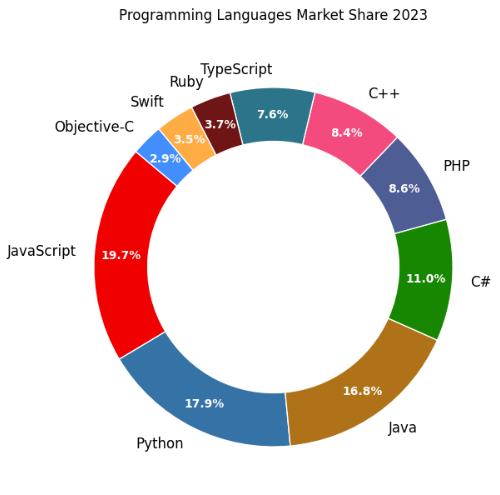

# Overview

Curious about the possibilities and where your passion fits in the ever-evolving world of technology?  Join us as we decode your unique technical journey! This presentation is designed to equip you with the knowledge and confidence to navigate your path in the exciting world of technology

## YouTube Video

<iframe width="560" height="315" src="https://www.youtube.com/embed/YoQXh7vlKnE?si=56eJkjelcrxIqVgI" title="Unlock Your Journey in Technology by ozkary" frameborder="0" allow="accelerometer; autoplay; clipboard-write; encrypted-media; gyroscope; picture-in-picture; web-share" referrerpolicy="strict-origin-when-cross-origin" allowfullscreen></iframe>

### Video Agenda

- **What's Next?:**    
    * Understanding the Technical Landscape.
    * Continuous Learning.
    * Exploring Industry Trends and Job Market.

- **Explore Your Passion: Diverse Areas of Specialization:**
    * Showcase different areas of CS specialization (e.g., web development, data science, artificial intelligence, cybersecurity).    

- **Building Blocks of Tech: Programming Languages:**    
    * Showcase and explain some popular programming languages used in different areas.     

- **Beyond Coding: Programming vs. Non-Programming Roles:**
    * Debunk the myth that all CS careers involve coding. 
    * Introduce non-programming roles in tech.    

- **Code-Centric vs. Low-Code/No-Code Development:**
    * Explain the concept of code-centric and low-code/no-code development approaches.
    * Discuss the advantages and disadvantages of each approach.    

- **The Future is Bright:**
    * Discuss emerging technologies like AI, cloud computing, and automation, and their impact on the future of CS careers.
    * Emphasize the importance of continuous learning and adaptability in this ever-changing landscape.    

**Why Attend?**

* **In-demand skills:**  Discover the technical and soft skills sought after by employers in today's tech industry.
* **Matching your passion with a career:** Explore diverse areas of specialization and identify the one that aligns with your interests and strengths. 
* **Career paths beyond coding:** Uncover a range of opportunities in tech,  whether you're a coding whiz or have a different area of expertise.
* **Future-proofing your career:** Gain knowledge of emerging technologies and how they'll shape the future of computer science.

By attending, you'll leave equipped with the knowledge and confidence to make informed decisions about your future in the ever-evolving world of technology. 

## Presentation

### What's Next for Your Tech Career?

Feeling overwhelmed by the possibilities after graduation? You're not alone! Learning never ends, as there are some **Technical foundation (hard skills)** areas to consider as you embark on a tech career.

- **Understanding the Technical Landscape**
  - Stay Informed: Keep up with the latest trends and advancements in technology
  - Broaden Your Horizons: Look beyond your core area of study. Explore other fields
- **Continuous Learning and Skill Development**
  - Adapt and Evolve: The tech industry is constantly changing
  - Technical Skills: Focus on in-demand skills such as Cloud Computing, Cybersecurity, and Data Science

Technical skills are crucial, but success in the tech industry also hinges on **strong soft skills**.  These skills are essential for success in today's collaborative tech environment:

**Networking and Professional Growth:**

- **Build Your Tech Network:** Connect and collaborate with online and offline tech communities.
- **Invest in Your Soft Skills:** Enhance your communication, teamwork, and problem-solving skills.
- **Find Your Tech Mentor:** Seek guidance and support from experienced professionals.

The tech industry is bursting with opportunities.  To navigate this exciting landscape and land your dream job, consider these key areas to craft your **career roadmap and take a chance**:

- **Work style Preferences:**

  - **Remote vs. Relocation:** Do you thrive in a remote work environment, or are you open to relocating for exciting opportunities?
  - **Big Companies vs. Startups:** Compare the established structure and resources of large companies or the fast-paced, dynamic culture of startups. 

- **Explore an Industry Specialization:**

  - **Healthcare:** Revolutionize patient care by contributing to advancements in medical technology and data analysis.
  - **Manufacturing:** Fuel innovation by optimizing production processes and integrating automation through industrial tech.

### Diverse Areas of Specialization

 Do you like creating websites? Web development might be your calling. Do you dream of building mobile apps? Mobile development could be your fit. Are you intrigued by the power of data and its ability to unlock valuable insights? Data science might be your ideal path. 

- Web Development: Build user interfaces and functionalities for websites and web applications.
- Mobile Development: Create applications specifically designed for smartphones and tablets.
- Data Engineering: Build complex data pipelines and data storage solutions.
- Data Analyst:  Process data, discover insights, create visualizations
- Data Science: Analyze large datasets to extract valuable insights and inform decision-making.
- Artificial Intelligence: Develop intelligent systems that can learn and make decisions.
- Cloud Engineering: Design, build, and manage applications and data in the cloud.
- Cybersecurity: Protect computer systems and networks from digital threats
- Game Development: Create video games and AR experiences

###  Building Blocks of Tech: Programming Languages

The world of software development hinges on a powerful tool - programming languages. These languages, with their unique syntax and functionalities,  has advantages for certain platforms like Web, Data, Mobile. 

- **Versatile Languages:**

  - JavaScript (JS): The king of web development, also used for building interactive interfaces and mobile apps (React Native).
  - Python: A beginner-friendly language, popular for data science, machine learning, web development (Django), and automation.
  - Java: An industry standard, widely used for enterprise applications, web development (Spring), and mobile development (Android), high-level programming.
  - C#: A powerful language favored for game development (Unity), web development (ASP.NET), and enterprise applications.
  - SQL: A powerful language essential for interacting with relational databases, widely used in web development, data analysis, and business intelligence.

- **Specialized Languages:**

  - PHP: Primarily used for server-side scripting and web development (WordPress).
  - C++: A high-performance language for system programming, game development, and scientific computing, low-level programming.

- **Mobile-Centric Languages:**

  - Swift: The go-to language for native iOS app development.
  - Objective-C: The predecessor to Swift, still used in some legacy iOS apps.

- **JavaScript Extensions:**

  - TypeScript: A superset of JavaScript, adding optional static typing for larger web applications.

 

### Beyond Coding: Programming vs. Non-Programming Roles

Programming involve writing code to create apps and systems. Non-programming tech roles, like project managers, QA, UX designers, and technical writers, use their skills to guide the development process, design user experiences, and document technical information. 

- Programming Roles: Developers, software engineers, data engineers 
- Non-Programming Roles: Project managers, systems analysts, user experience (UX) designers, QA, DevOps, technical writers.

The industry continuous to define new specialized roles.

 

### Empowering Everyone: Code-Centric vs. Low-Code/No-Code Development

Do you enjoy diving into the code itself using tools like Visual Studio Code? Or perhaps you prefer a more visual approach, leveraging designer tools and writing code snippets when needed?

- Code-Centric Development:

 - Traditional approach where developers write code from scratch using programming languages like Python, C#, or C++.
 - Offers maximum flexibility and control over the application's functionality and performance.
 - Requires strong programming skills and a deep understanding of software development principles.

 

- Low-Code/No-Code Development:
  - User-friendly platforms that enable rapid application development with minimal coding or no coding required.
  - Utilize drag-and-drop interfaces, pre-built components, and templates to streamline the development process.
  - Ideal for building simple applications, automating workflows, or creating prototypes.

 

## Evolving with Technology

The landscape of software development is constantly transforming, with new technologies like AI, low-code/no-code platforms, automation, and cloud engineering emerging. Keep evolving!

- AI as a Co-Pilot: AI won't replace programmers; it will become a powerful collaborator. Imagine AI tools that:
  - Generate code snippets based on your requirements.
  - Refactor and debug code for efficiency and security.
  - Automate repetitive tasks, freeing you for more creative problem-solving.

- Low-Code/No-Code Democratization: These platforms will empower citizen developers to build basic applications, streamlining workflows. Programmers will focus on complex functionalities and integrating these solutions.

- Automation Revolution: Repetitive coding tasks will be automated, allowing programmers to focus on higher-level logic, system design, and innovation.

- Cloud Engineering Boom: The rise of cloud platforms will create a demand for skilled cloud engineers who can design, build, and manage scalable applications in the cloud.
 
 

## Final Thoughts: Your Future in Tech Awaits

The tech world is yours to explore! Keep learning, join a community, choose your path in tech and industry, and build your roadmap. Find a balance between your professional pursuits and personal well-being. 

Thanks for reading.

Send question or comment at Twitter @ozkary
👍 Originally published by [ozkary.com](https://www.ozkary.com)
