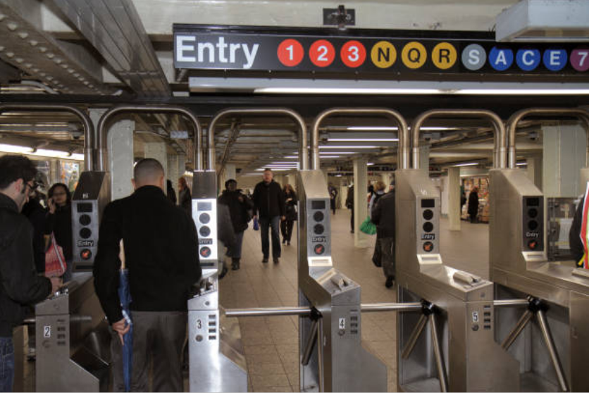

# Overview

In modern data engineering solutions, handling streaming data is very important. Businesses often need real-time insights to promptly monitor and respond to operational changes and performance trends. A data streaming pipeline facilitates the integration of real-time data into data warehouses and visualization dashboards.


- Follow this GitHub repo during the presentation: (Give it a star)

> 👉 https://github.com/ozkary/data-engineering-mta-turnstile

- Read more information on my blog at:  

> 👉 https://www.ozkary.com/2023/03/data-engineering-process-fundamentals.html

## YouTube Video

<iframe width="560" height="315" src="https://www.youtube.com/embed/RlNb_-R4Iho?si=pKuRkJqOA0cmryhh" title="Data Engineering Process Fundamentals - Building Real-Time Data Pipelines: A Practical Guide " frameborder="0" allow="accelerometer; autoplay; clipboard-write; encrypted-media; gyroscope; picture-in-picture; web-share" referrerpolicy="strict-origin-when-cross-origin" allowfullscreen></iframe>

### Video Agenda


1. What is Data Streaming?

   - Understanding the concept of continuous data flow.

   - Real-time vs. batch processing.

   - Benefits and use cases of data streaming.

2. Data Streaming Channels

   - APIs (Application Programming Interfaces)

   - Events (system-generated signals)

   - Webhooks (HTTP callbacks triggered by events)

3. Data Streaming Components

   - Message Broker (Apache Kafka)

   - Producers and consumers

   - Topics for data categorization

   - Stream Processing Engine (Apache Spark Structured Streaming)

4. Solution Design and Architecture

   - Real-time data source integration

   - Leveraging Kafka for reliable message delivery

   - Spark Structured Streaming for real-time processing

   - Writing processed data to the data lake

5. Q&A Session

   - Get your questions answered by the presenters.

**Why Join This Session?**

- Stay Ahead of the Curve: Gain a comprehensive understanding of data streaming, a crucial aspect of modern data engineering.
- Unlock Real-Time Insights: Learn how to leverage data streaming for immediate processing and analysis, enabling faster decision-making.
- Learn Kafka and Spark: Explore the power of Apache Kafka as a message broker and Apache Spark Structured Streaming for real-time data processing.
- Build a Robust Data Lake: Discover how to integrate real-time data into your data lake for a unified data repository.

## Presentation

### Introduction - What is Data Streaming?

Data streaming enables us to build data integration in real-time. Unlike traditional batch processing, where data is collected and processed periodically, streaming data arrives continuously, and it is processed on-the-fly.

   - **Understanding the concept of continuous data flow**
     - Real-time, uninterrupted transfer of data from various channels.
     - Allows for immediate processing and analysis of data as it is generated.
   - **Real-time vs. batch processing**
     - Data is collected and process in chunks at certain times
     - The data can take hours and even days depending on the source
   - **Benefits and use cases of data streaming**
     - React instantly to events
     - Predict trends with real-time updates
     - Update dashboard with up to the minute/seconds data


### Data Streaming Channels
   
  Data streams can arrive from various channels, often hosted on HTTP endpoints. The specific channel technology depends on the provider. Generally, the integration involves either a push or a pull connection.
    
  - **Events (Push Model):** These can be delivered using a subscription model like Pub/Sub, where your system subscribes to relevant topics and receives data "pushed" to it whenever events occur. Examples include user clicks, sensor readings, or train arrivals.

  - **Webhooks (Push-Based on Events):** These are HTTP callbacks triggered by specific events on external platforms. You set up endpoints that listen for these notifications to capture the data stream.

  - **APIs (Pull Model):** Application Programming Interfaces are used to actively fetch data from external services, like social media platforms. Scheduled calls are made to the API at specific intervals to retrieve the data.


   
### Data Streaming System

Powering real-time data pipelines, Apache Kafka efficiently ingests data streams, while Apache Spark analyzes and transforms it, enabling large-scale insights.

**Apache Kafka:**

Apache Kafka: The heart of the data stream. It's a high-performance platform that acts as a message broker, reliably ingesting data (events) from various sources like applications, sensors, and webhooks. These events are published to categorized channels (topics) within Kafka for further processing.

**Spark Structured Streaming:**

Built on Spark, it processes Kafka data streams in real-time. Unlike simple ingestion, it allows for transformations, filtering, and aggregations on the fly, enabling real-time analysis of streaming data.


   
### Data Streaming Components

Apache Kafka acts as the central message broker, facilitating real-time data flow. Producers, like applications or sensors, publish data (events) to categorized channels (topics) within Kafka. Spark then subscribes as a consumer, continuously ingesting and processing these data streams in real-time.

- **Message Broker (Kafka):** Routes real-time data streams.
- **Producers & Consumers:** Producers **send** data to topics, Consumers **receive** and process it.
- **Topics (Categories):** Organize data streams by category.
- **Stream Processing Engine (Spark Structured Streaming):**
    - **Reads** data from Kafka.
    - **Extracts** information.
    - **Transforms** & summarizes data (aggregations).
    - **Writes** to a data lake.


   
### Use case Background

The Metropolitan Transportation Authority (MTA) subway system in New York has stations around the city. All the stations are equipped with turnstiles or gates which tracks as each person enters (departure)  or exits (arrival) the station.

- The MTA subway system has stations around the city.
- All the stations are equipped with turnstiles or gates which tracks as each person enters or leaves the station. 
- CSV files provide information about the amount of commuters per stations at different time slots.



### Data Specifications

Since we already have a data transformation layer that incrementally updates the data warehouse, our real-time integration will focus on leveraging this existing pipeline. We'll achieve this by aggregating data from the stream and writing the results directly to the data lake.

- Group by these categorical fields: "AC", "UNIT","SCP","STATION","LINENAME","DIVISION", "DATE", "DESC"
- Aggregate these measures: "ENTRIES", "EXITS"
- Sample result: "A001,R001,02-00-00,Test-Station,456NQR,BMT,09-23-23,REGULAR,16:54:00,140,153"

```python

# Define the schema for the incoming data
turnstiles_schema = StructType([
    StructField("AC", StringType()),
    StructField("UNIT", StringType()),
    StructField("SCP", StringType()),
    StructField("STATION", StringType()),
    StructField("LINENAME", StringType()),
    StructField("DIVISION", StringType()),
    StructField("DATE", StringType()),
    StructField("TIME", StringType()),
    StructField("DESC", StringType()),
    StructField("ENTRIES", IntegerType()),
    StructField("EXITS", IntegerType()),
    StructField("ID", StringType()),
    StructField("TIMESTAMP", StringType())
])

```

### Solution Architecture for Real-time Data Integration

Data streams are captured by the Kafka producer and sent to Kafka topics. The Spark-based stream consumer retrieves and processes the data in real-time, aggregating it for storage in the data lake.

**Components:**
- **Real-Time Data Source:** Continuously emits data streams (events or messages).
- **Message Broker Layer:**
    - **Kafka Broker Instance:** Acts as a central hub, efficiently collecting and organizing data into topics.
    - **Kafka Producer (Python):** Bridges the gap between the source and Kafka.
- **Stream Processing Layer:**
    - **Spark Instance:** Processes and transforms data in real-time using Apache Spark.
    - **Stream Consumer (Python):** Consumes messages from Kafka and acts as both a Kafka consumer and Spark application:
        - Retrieves data as soon as it arrives.
        - Processes and aggregates data.
        - Saves results to a data lake.
- **Data Storage:** Data transformation for visualization tools (Looker, Power BI) to access.
- **Docker Containers**: Use containers for deployments


### Data Transformation and Incremental Strategy

The data transformation phase is a critical stage in a data warehouse project. This phase involves several key steps, including data extraction, cleaning, loading, data type casting, use of naming conventions, and implementing incremental loads to continuously insert the new information since the last update via batch processes.


Data Lineage: Tracks the flow of data from its origin to its destination, including all the intermediate processes and transformations that it undergoes. 

### Impact on Data Visualization

- Our architecture efficiently processes real-time data by leveraging our existing data transformation layer. 
- This optimized flow enables significantly faster data visualization. 
- The dashboard refresh time can increase their frequency to load the new data.
 

> For real-time updates directly on the dashboard, a socket-based integration would be necessary. 


## Key Takeaways: Real-Time Integration

Data streaming solutions are an absolute necessity, enabling the rapid processing and analysis of vast amounts of real-time data. Technologies like Kafka and Spark play a pivotal role in empowering organizations to harness real-time insights from their data streams.

- **Real-time Power:** Kafka handles various data streams, feeding them to data topics.
- **Spark Processing Power:** Spark reads from these topics, analyzes messages in real-time, and aggregates the data to our specifications.
- **Existing Pipeline Integration:** Leverages existing pipelines to write data to data lakes for transformation.
- **Faster Insights:** Delivers near real-time information for quicker data analysis and visualization.


### We've covered a lot today, but this is just the beginning! 

If you're interested in learning more about building cloud data pipelines, I encourage you to check out my book, 'Data Engineering Process Fundamentals,' part of the Data Engineering Process Fundamentals series. It provides in-depth explanations, code samples, and practical exercises to help in your learning.

 [](https://a.co/d/gyoRfbs)  [](https://a.co/d/gyoRfbs)
 

Thanks for reading.

Send question or comment at Twitter @ozkary
👍 Originally published by [ozkary.com](https://www.ozkary.com)
