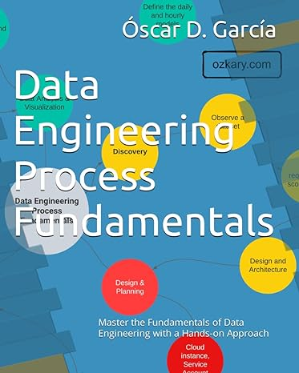

# Overview

Gain understanding of Medallion Architecture and its application in modern data engineering. Learn how to optimize data pipelines, improve data quality, and unlock valuable insights. Discover practical steps to implement Medallion principles in your organization and drive data-driven decision-making.

- Follow this GitHub repo during the presentation: (Give it a star)

> 👉 https://github.com/ozkary/data-engineering-mta-turnstile

- Read more information on my blog at:  

> 👉 https://www.ozkary.com/2023/03/data-engineering-process-fundamentals.html

## YouTube Video

<iframe width="560" height="315" src="https://www.youtube.com/embed/jZGJjy0ujfE?si=hrO1PHSdHc6KX_0O" title="Data Engineering Process Fundamentals - Medallion Architecture: A Blueprint for Data Insights and Governance" frameborder="0" allow="accelerometer; autoplay; clipboard-write; encrypted-media; gyroscope; picture-in-picture; web-share" referrerpolicy="strict-origin-when-cross-origin" allowfullscreen></iframe>

### Video Agenda

- Introduction to Medallion Architecture
  - Defining Medallion Architecture
  - Core Principles
  - Benefits of Medallion Architecture

- The Raw Zone
  - Understanding the purpose of the Raw Zone
  - Best practices for data ingestion and storage

- The Bronze Zone
  - Data transformation and cleansing
  - Creating a foundation for analysis

- The Silver Zone
  - Data optimization and summarization
  - Preparing data for consumption

- The Gold Zone
  - Curated data for insights and action
  - Enabling self-service analytics

- Empowering Insights
  - Data-driven decision-making
  - Accelerated Insights

- Data Governance
  - Importance of data governance in Medallion Architecture
  - Implementing data ownership and stewardship
  - Ensuring data quality and security

**Why Attend:**

Gain a deep understanding of Medallion Architecture and its application in modern data engineering. Learn how to optimize data pipelines, improve data quality, and unlock valuable insights. Discover practical steps to implement Medallion principles in your organization and drive data-driven decision-making.

## Presentation

### Introducing Medallion Architecture

Medallion architecture is a data management approach that organizes data into distinct layers based on its quality and processing level.

- **Improved Data Quality:** By separating data into different zones, you can focus on data quality at each stage.
- **Enhanced Data Governance:** Clear data ownership and lineage improve data trustworthiness.
- **Accelerated Insights:** Optimized data in the Silver and Gold zones enables faster query performance.
- **Scalability:** The layered approach can accommodate growing data volumes and complexity.
- **Cost Efficiency:** Optimized data storage and processing can reduce costs.

### The Raw Zone: Foundation of Your Data Lake

The Raw Zone is the initial landing place for raw, unprocessed data. It serves as a historical archive of your data sources.

* **Key Characteristics:**
  * Unstructured or semi-structured format (e.g., CSV, JSON, Parquet)
  * Data is ingested as-is, without any cleaning or transformation
  * High volume and velocity
  * Data retention policies are crucial
* **Benefits:**
  * Preserves original data for potential future analysis
  * Enables data reprocessing
  * Supports data lineage and auditability

### Use case Background

The Metropolitan Transportation Authority (MTA) subway system in New York has stations around the city. All the stations are equipped with turnstiles or gates which tracks as each person enters (departure)  or exits (arrival) the station.

- The MTA subway system has stations around the city.
- All the stations are equipped with turnstiles or gates which tracks as each person enters or leaves the station. 
- CSV files provide information about the amount of commuters per stations at different time slots.

### Problem Statement

In the city of New York, commuters use the Metropolitan Transportation Authority (MTA) subway system for transportation. There are millions of people that use this system every day; therefore, businesses around the subway stations would like to be able to use Geofencing advertisement to target those commuters or possible consumers and attract them to their business locations at peak hours of the day.

- **Geofencing** is a location based technology service in which mobile devices’ electronic signal is tracked as it enters or leaves a virtual boundary (geo-fence) on a geographical location. Businesses around those locations would like to use this technology to increase their sales.
- Businesses around those locations would like to use this technology to increase their sales by pushing ads to potential customers at specific times.

### The Bronze Zone: Transforming Raw Data

The Bronze Zone is where raw data undergoes initial cleaning, structuring, and transformation. It serves as a staging area for data before moving to the Silver Zone.
  
* **Key Characteristics:**
  * Data is cleansed and standardized
  * Basic transformations are applied (e.g., data type conversions, null handling)
  * Data is structured into tables or views
  * Data quality checks are implemented
  * Data retention policies may be shorter than the Raw Zone
* **Benefits:**
  * Improves data quality and consistency
  * Provides a foundation for further analysis
  * Enables data exploration and discovery

### The Silver Zone: A Foundation for Insights

The Silver Zone houses data that has been further refined, aggregated, and optimized for specific use cases. It serves as a bridge between the raw data and the final curated datasets.

* **Key Characteristics:**
  * Data is cleansed, standardized, and enriched
  * Data is structured for analytical purposes (e.g., normalized, de-normalized)
  * Data is optimized for query performance (e.g., partitioning, indexing)
  * Data is aggregated and summarized for specific use cases
* **Benefits:**
  * Improved query performance
  * Supports self-service analytics
  * Enables advanced analytics and machine learning
  * Reduces query costs

### The Gold Zone: Your Data's Final Destination

* **Definition:** The Gold Zone contains the final, curated datasets ready for consumption by business users and applications. It is the pinnacle of data transformation and optimization.
* **Key Characteristics:**
  * Data is highly refined, aggregated, and optimized for specific use cases
  * Data is often materialized for performance
  * Data is subject to rigorous quality checks and validation
  * Data is secured and governed
* **Benefits:**
  * Enables rapid insights and decision-making
  * Supports self-service analytics and reporting
  * Provides a foundation for advanced analytics and machine learning
  * Reduces query latency

### The Gold Zone: Empowering Insights and Actions

The Gold Zone is the final destination for data, providing a foundation for insights, analysis, and action. It houses curated, optimized datasets ready for consumption.

* **Key Characteristics:**
  * Data is accessible and easily consumable
  * Supports various analytical tools and platforms (BI, ML, data science)
  * Enables self-service analytics
  * Drives business decisions and actions
* **Examples of Consumption Tools:**
  * Business Intelligence (BI) tools (Looker, Tableau, Power BI)
  * Data science platforms (Python, R, SQL)
  * Machine learning platforms (TensorFlow, PyTorch)
  * Advanced analytics tools

### Data Governance: The Cornerstone of Data Management

**Data governance** is the framework that defines how data is managed within an organization, while **data management** is the operational execution of those policies. Data Governance is essential for ensuring data quality, consistency, and security. 

**Key components of data governance include:**

* **Data Lineage:** Tracking data's journey from source to consumption. 
* **Data Ownership:** Defining who is responsible for data accuracy and usage.
* **Data Stewardship:** Managing data on a day-to-day basis, ensuring quality and compliance.
* **Data Security:** Protecting data from unauthorized access, use, disclosure, disruption, modification, or destruction.
* **Compliance:** Adhering to industry regulations (e.g., GDPR, CCPA, HIPAA) and internal policies. 

By establishing clear roles, responsibilities, and data lineage, organizations can build trust in their data, improve decision-making, and mitigate risks. 

### Data Transformation and Incremental Strategy

The data transformation phase is a critical stage in a data warehouse project. This phase involves several key steps, including data extraction, cleaning, loading, data type casting, use of naming conventions, and implementing incremental loads to continuously insert the new information since the last update via batch processes.

Data Lineage: Tracks the flow of data from its origin to its destination, including all the intermediate processes and transformations that it undergoes. 

### Data Governance : Metadata

Assigns the owner, steward and responsibilities of the data.

### Summary: Leverage Medallion Architecture for Success

* **Key Benefits:** 
  * Improved data quality
  * Enhanced governance
  * Accelerated insights
  * Scalability
  * Cost Efficiency.

### We've covered a lot today, but this is just the beginning! 

If you're interested in learning more about building cloud data pipelines, I encourage you to check out my book, 'Data Engineering Process Fundamentals,' part of the Data Engineering Process Fundamentals series. It provides in-depth explanations, code samples, and practical exercises to help in your learning.

   
 

Thanks for reading.

Send question or comment at Twitter @ozkary
👍 Originally published by [ozkary.com](https://www.ozkary.com)
