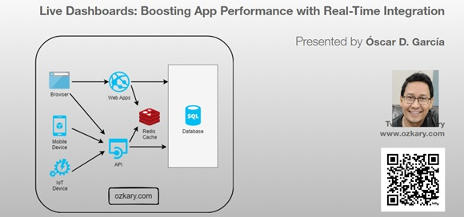
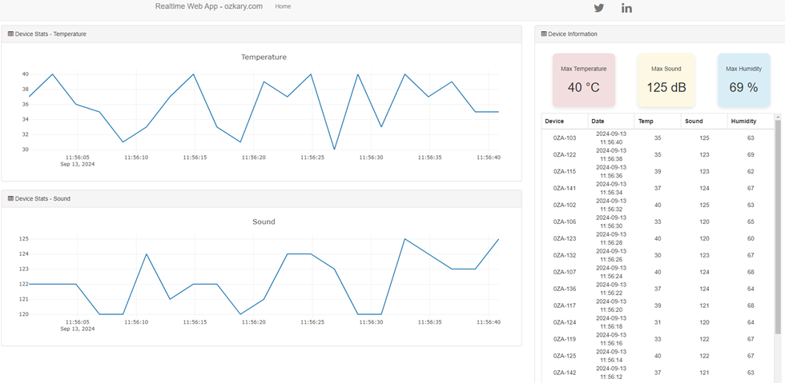
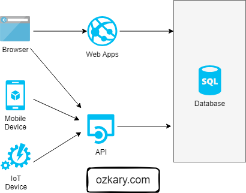
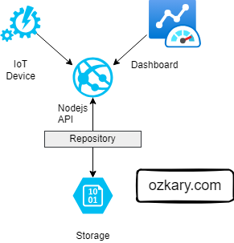
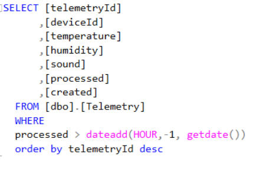
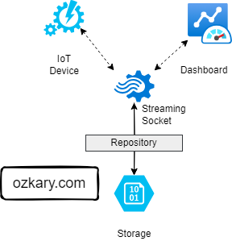
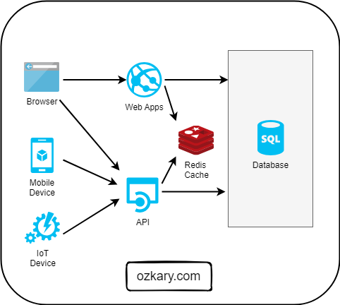
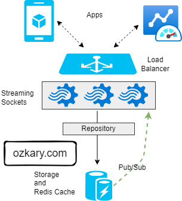

# Overview

Dive into the future of web applications. We're moving beyond traditional API polling and embracing real-time integration. Imagine your client app maintaining a persistent connection with the server, enabling bidirectional communication and live data streaming. We'll also tackle scalability challenges and integrate Redis as our in-memory data solution.

- Follow this GitHub repo during the presentation: (Give it a star)

> 👉 https://github.com/ozkary/Realtime-Apps-with-Nodejs-Angular-Socketio-Redis

## YouTube Video

<iframe width="560" height="315" src="https://www.youtube.com/embed/yJxoPWzCVdc?si=_WHBw49JKXCFswE5" title="Live Dashboards: Boosting App Performance with Real-Time Integration" frameborder="0" allow="accelerometer; autoplay; clipboard-write; encrypted-media; gyroscope; picture-in-picture; web-share" referrerpolicy="strict-origin-when-cross-origin" allowfullscreen></iframe>

### Video Agenda

This presentation explores strategies for building highly responsive and interactive live dashboards. We'll delve into the challenges of traditional API polling and demonstrate how to leverage Node.js, Angular, Socket.IO, and Redis to achieve real-time updates and a seamless user experience.

- Introduction:

  - Understanding telemetry data and the importance to monitor the data
  - Challenges of traditional API polling for real-time data.
  - Design patterns to enhance an app with minimum changes

- Traditional Solution Architecture

  - SQL Database Integration.
  - Restful API
  - Angular and Node.js Integration

- Real-Time Integration with Web Sockets

  - Database Optimization Challenges
  - Introduction to Web Sockets for bidirectional communication.
  - Implementing Web Sockets in a Web application.
  - Handling data synchronization and consistency.

- Distributed Caching with Redis:

  - Benefits of in-memory caching for improving performance and scalability.
  - Integrating Redis into your Node.js application.
  - Caching strategies for distributed systems.

- Case Study: Building a Live Telemetry Dashboard

  - Step-by-step demonstration of the implementation.
  - Performance comparison with and without optimization techniques.
  - User experience benefits of real-time updates.
  
- Benefits and Considerations

  - Improved dashboard performance and responsiveness.
  - Reduced server load and costs.
  - Scalability and scalability considerations.
  - Best practices for implementing real-time updates.

**Why Attend:**

Gain a deep understanding of real-time data integration for your Web application. 

## Presentation

### Telemetry Data Story

Devices send telemetry data via API integration with SQL Server. There are inherit performance problems with a disk-based database. We progressively enhance the system with minimum changes by adding real-time integration and an in-memory cache system.

### Database Integration

**Solution Architecture**
- Disk-based Storage 
- Web apps and APIs query database to  get the data
- Applications can do both high reads and writes
- Web components, charts polling back-end database for reads
 
**Let’s Start our Journey**
- Review our API integration and talk about concerns
- Do not refactor everything
- Enhance to real-time integration with sockets
- Add  Redis as the distributed cache
- Add the service broker strategy to sync the data sources
- Centralized the real-time integration with Redis

### RESTful API Integration

**Applied Technologies**
- REST API Written with Node.js
- TypeORM Library Repository
- Angular Client Application with Plotly.js Charts
- Disk-based storage – SQL  Server
- API Telemetry (GET, POST) route
 
**Use Case**
- IoT devices report telemetry information via API
- Dashboard reads that most recent data only via API calls which queries the storage service
- Polling the database to get new records
 
**Project Repo  (Star the project and follow)**
https://github.com/ozkary/Realtime-Apps-with-Nodejs-Angular-Socketio-Redis      

### Database Optimization and Challenges

**Slow Queries  on disk-based storage**
- Effort on index optimization
- Database Partition strategies
- Double-digit millisecond  average speed (physics on data disks)
 	
**Simplify data access strategies**
- Relational data is not optimal for high data read systems (joins?)
- Structure needs to be de-normalized
- Often views are created to shape the data, date range limit
 
**Database Contention**
- Read isolation levels (nolock)
- Reads competing with inserts

**Cost to Scale**
- Vertical and horizontal scaling up on resources
- Database read-replicas to separate reads and writes
- Replication workloads/tasks
- Data lakes and data warehouse

### Real-Time Integration

**What is Socket.io, Web Sockets?**
- Enables real-time bidirectional communication.
- Push data to clients as events take place on the server
- Data streaming
- Connection starts as HTTP is them promoted to Web Sockets 
  
**Additional Technologies**
-Socket.io (Signalr for .Net) for both client and server components 

**Use Case**
- IoT devices report telemetry information via sockets. All subscribed clients get the information as an event which updates the dashboard

**Demo**
- Update both server and client to support Web sockets
- Use device demo tool to connect and automate the telemetry data to the server

### Distributed Cache Strategy

**Why Use a Cache?**
- Data is stored in-memory
- Sub-millisecond average speed
- Cache-Aside Pattern
  - Read from cache first (cache-hit) fail over to database (cache miss)
  - Update cache on cache miss
- Write-Through
  - Write to cache and database
  - Maintain both systems updated
- Improves app performance
- Reduces load on Database

**Application Changes**
- Changes are only done on the server
- No changes on client-side

### Redis and Socket.io Integration

**What is Redis?**
- Key-value store, keys can contain strings (JSON), hashes, lists, sets, & sorted sets
- Redis supports a set of atomic operations on these data types (available until committed)
- Other features include transactions, publish/subscribe, limited time to live -TTL 
- You can use Redis from most of today's programming languages using libraries
  
**Use Case**

- As application load and data frequency increases, we need to use a cache for performance. We also need to centralize the events, so all the socket servers behind a load balancer can notify the clients. Update both storage and cache

**Demo**
- Start Redis-cli on Ubuntu and show some inserts, reads and sync events. 
  - sudo service redis-server restart
  - redis-cli -c -p 6379 -h localhost
  - zadd table:data 100 "{data:'100'}“
  - zrangebycore table:data 100 200
  - subscribe telemetry:data  
 

### Summary: Boosting Your App Performance

When your application starts to slow down due to heavy read and writes on your database, consider moving the read operations to a cache solution and broadcasting the data to your application via a real-time integration using Web Sockets. This approach can significantly enhance performance and user experience.

**Key Benefits**

- **Improved Performance**: Offloading reads to a cache system like Redis reduces load on the database.
- **Real-Time Updates**: Using Web Sockets ensures that your application receives updates in real-time, with no need for manual refreshes.
- **Scalability**: By reducing the database load, your application can handle more concurrent users.
- **Efficient Resource Utilization**: Leveraging caching and real-time technologies optimizes the user of server resources, leading to savings and better performance.

### We've covered a lot today, but this is just the beginning! 

If you're interested in learning more about building cloud data pipelines, I encourage you to check out my book, 'Data Engineering Process Fundamentals,' part of the Data Engineering Process Fundamentals series. It provides in-depth explanations, code samples, and practical exercises to help in your learning.

   
 

Thanks for reading.

Send question or comment at Twitter @ozkary
👍 Originally published by [ozkary.com](https://www.ozkary.com)
