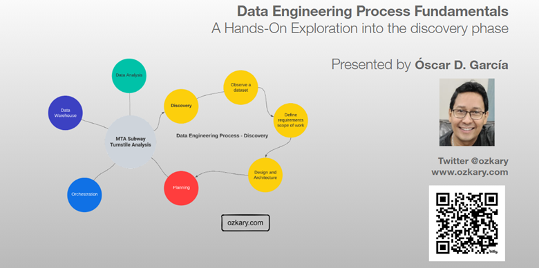
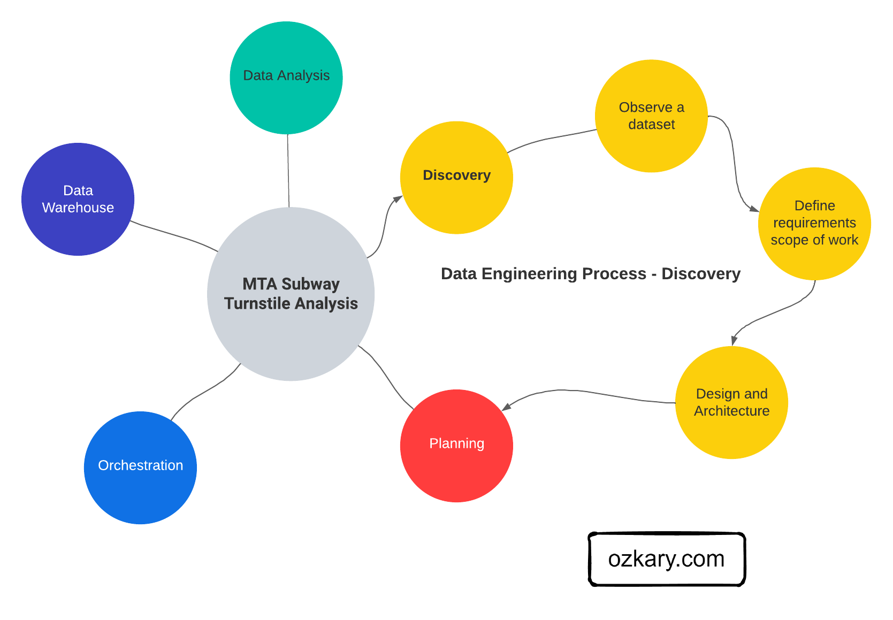
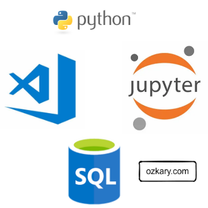
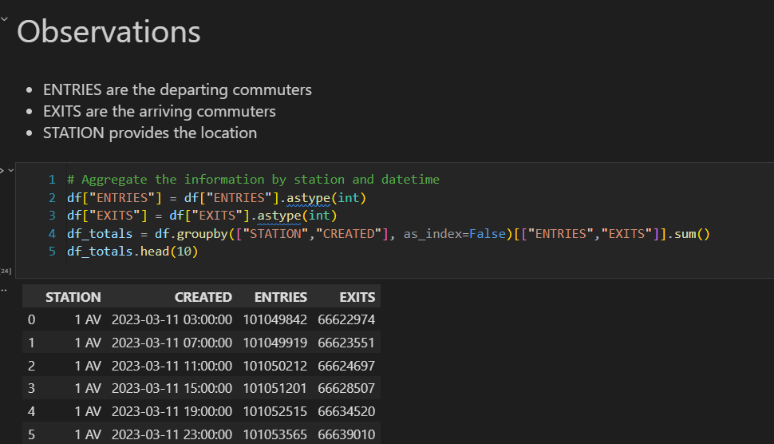

# Overview

The discovery process involves identifying the problem, analyzing data sources, defining project requirements, establishing the project scope, and designing an effective architecture to address the identified challenges.

In this session, we will delve into the essential building blocks of data engineering, placing a spotlight on the discovery process. From framing the problem statement to navigating the intricacies of exploratory data analysis (EDA) using Python, VSCode, Jupyter Notebooks, and GitHub, you'll gain a solid understanding of the fundamental aspects that drive effective data engineering projects.




- Follow this GitHub repo during the presentation: (Give it a star)

> 👉 (GitHub Repo)[https://github.com/ozkary/data-engineering-mta-turnstile]

Jupyter Notebook

> 👉 (Jupyter Notebook)[https://github.com/ozkary/data-engineering-mta-turnstile/blob/main/Step1-Discovery/mta_discovery.ipynb]

- Data engineering Series:  

> 👉 (Blog Series)[https://www.ozkary.com/2023/03/data-engineering-process-fundamentals.html]

## Jupyter Notebook Preview

```python
# Standard library imports
from time import time
from pathlib import Path
import requests
from io import StringIO
# Load pandas support for data analysis tasks, dataframe (two-dimensional data structure with rows and columns) management
import pandas as pd    
import numpy as np 

# URL of the file you want to download. Note: It should be a Saturday date
url = 'http://web.mta.info/developers/data/nyct/turnstile/turnstile_241026.txt'

# Download the file in memory
response = requests.get(url)
response.raise_for_status()  # Check if the request was successful

# Create a DataFrame from the downloaded content
data = StringIO(response.text)
df = pd.read_csv(data)

# Display the DataFrame first 10 rows
df.head(10)

# use info to get the column names, data type and null values
df.info()

# remove spaces and type case the columns
df.columns = [column.strip() for column in df.columns]
print(df.columns)
df["ENTRIES"] = df["ENTRIES"].astype(int)
df["EXITS"] = df["EXITS"].astype(int)

# Define the set of special characters you want to check for
special_characters_set = set('@#$%/')


def has_special_characters(col, special_characters):
    # Check if any character in the column name is not alphanumeric or in the specified set
    return any(char in special_characters for char in col)

def rename_columns(df, special_characters_set):
    # Create a mapping of old column names to new column names
    mapping = {col: ''.join(char for char in col if char.isalnum() or char not in special_characters_set) for col in df.columns}

    print(mapping)
    # Rename columns using the mapping
    df_renamed = df.rename(columns=mapping)
    
    return df_renamed


# Identify columns with special characters using list comprehension syntax
columns_with_special_characters = [col for col in df.columns if has_special_characters(col, special_characters_set)]

# Print the result
print("Columns with special characters:", columns_with_special_characters)

# Identify columns with special characters and rename them
df = rename_columns(df, special_characters_set)

# Display the data frame again. there should be no column name with special characters
print(df.info())

```

## YouTube Video

<iframe width="560" height="315" src="https://www.youtube.com/embed/4oUJQN2qoPo?si=96w_pKD5qQU27gNA" title="A Hands-On Exploration into the discovery phase - Data Engineering Process Fundamentals" frameborder="0" allow="accelerometer; autoplay; clipboard-write; encrypted-media; gyroscope; picture-in-picture; web-share" allowfullscreen></iframe>

### Video Agenda

1. Introduction:

   - Unveiling the importance of the discovery process in data engineering.

   - Setting the stage with a real-world problem statement that will guide our exploration.

2. Setting the Stage:

   - Downloading and comprehending sample data to kickstart our discovery journey.

   - Configuring the development environment with VSCode and Jupyter Notebooks.

3. Exploratory Data Analysis (EDA):

   - Delving deep into EDA techniques with a focus on the discovery phase.

   - Demonstrating practical approaches using Python to uncover insights within the data.

4. Code-Centric Approach:

   - Advocating the significance of a code-centric approach during the discovery process.

   - Showcasing how a code-centric mindset enhances collaboration, repeatability, and efficiency.

5. Version Control with GitHub:

   - Integrating GitHub seamlessly into our workflow for version control and collaboration.

   - Managing changes effectively to ensure a streamlined data engineering discovery process.

6. Real-World Application:

   - Applying insights gained from EDA to address the initial problem statement.

   - Discussing practical solutions and strategies derived from the discovery process.


**Key Takeaways:**

- Mastery of the foundational aspects of data engineering.

- Hands-on experience with EDA techniques, emphasizing the discovery phase.

- Appreciation for the value of a code-centric approach in the data engineering discovery process.

  
**Some of the technologies that we will be covering:**

- Python
- Data Analysis and Visualization
- Jupyter Notebook
- Visual Studio Code

## Presentation

### Data Engineering Overview

A Data Engineering Process involves executing steps to understand the problem, scope, design, and architecture for creating a solution. This enables ongoing big data analysis using analytical and visualization tools.

#### Topics

- Importance of the Discovery Process
- Setting the Stage - Technologies
- Exploratory Data Analysis (EDA)
- Code-Centric Approach
- Version Control
- Real-World Use Case

**Follow this project: Give a star**
> 👉 [Data Engineering Process Fundamentals](//github.com/ozkary/data-engineering-mta-turnstile)

### Importance of the Discovery Process

The discovery process involves identifying the problem, analyzing data sources, defining project requirements, establishing the project scope, and designing an effective architecture to address the identified challenges.

- Clearly document the problem statement to understand the challenges the project aims to address.
- Make observations about the data, its structure, and sources during the discovery process.
- Define project requirements based on the observations, enabling the team to understand the scope and goals.
- Clearly outline the scope of the project, ensuring a focused and well-defined set of objectives.
- Use insights from the discovery phase to inform the design of the solution, including data architecture.
- Develop a robust project architecture that aligns with the defined requirements and scope.



### Setting the Stage - Technologies

To set the stage, we need to identify and select the tools that can facilitate the analysis and documentation of the data. Here are key technologies that play a crucial role in this stage:

- **Python:** A versatile programming language with rich libraries for data manipulation, analysis, and scripting.
  
**Use Cases:** Data download, cleaning, exploration, and scripting for automation.

- **Jupyter Notebooks:** An interactive tool for creating and sharing documents containing live code, visualizations, and narrative text.
  
**Use Cases:** Exploratory data analysis, documentation, and code collaboration.

- **Visual Studio Code:** A lightweight, extensible code editor with powerful features for source code editing and debugging.
  
**Use Cases:** Writing and debugging code, integrating with version control systems like GitHub.

- **SQL (Structured Query Language):** A domain-specific language for managing and manipulating relational databases.
  
**Use Cases:** Querying databases, data extraction, and transformation.




### Exploratory Data Analysis (EDA)

EDA is our go-to method for downloading, analyzing, understanding and documenting the intricacies of the datasets. It's like peeling back the layers of information to reveal the stories hidden within the data. Here's what EDA is all about:

- EDA is the process of analyzing data to identify patterns, relationships, and anomalies, guiding the project's direction.

- Python and Jupyter Notebook collaboratively empower us to download, describe, and transform data through live queries.

- Insights gained from EDA set the foundation for informed decision-making in subsequent data engineering steps.

- Code written on Jupyter Notebook can be exported and used as the starting point for components for the data pipeline and transformation services.


### Code-Centric Approach

A code-centric approach, using programming languages and tools in EDA, helps us understand the coding methodology for building data structures, defining schemas, and establishing relationships. This robust understanding seamlessly guides project implementation.


- Code delves deep into data intricacies, revealing integration and transformation challenges often unclear with visual tools.

- Using code taps into Pandas and Numpy libraries, empowering robust manipulation of data frames, establishment of loading schemas, and addressing transformation needs.

- Code-centricity enables sophisticated analyses, covering aggregation, distribution, and in-depth examinations of the data.

- While visual tools have their merits, a code-centric approach excels in hands-on, detailed data exploration, uncovering subtle nuances and potential challenges. 



### Version Control

Using a tool like GitHub is essential for effective version control and collaboration in our discovery process. GitHub enables us to track our exploratory code and Jupyter Notebooks, fostering collaboration, documentation, and comprehensive project management. Here's how GitHub enhances our process:

- **Centralized Tracking:** GitHub centralizes tracking and managing our exploratory code and Jupyter Notebooks, ensuring a transparent and organized record of our data exploration.

- **Sharing:** Easily share code and Notebooks with team members on GitHub, fostering seamless collaboration and knowledge sharing.

- **Documentation:** GitHub supports Markdown, enabling comprehensive documentation of processes, findings, and insights within the same repository.

- **Project Management:** GitHub acts as a project management hub, facilitating CI/CD pipeline integration for smooth and automated delivery of data engineering projects.


## Summary: The Power of Discovery

By mastering the discovery phase, you lay a strong foundation for successful data engineering projects. A thorough understanding of your data is essential for extracting meaningful insights.

- **Understanding Your Data:** The discovery phase is crucial for understanding your data's characteristics, quality, and potential.
- **Exploratory Data Analysis (EDA):** Use techniques to uncover patterns, trends, and anomalies.
- **Data Profiling:** Assess data quality, identify missing values, and understand data distributions.
- **Data Cleaning:** Address data inconsistencies and errors to ensure data accuracy.
- **Domain Knowledge:** Leverage domain expertise to guide data exploration and interpretation.
- **Setting the Stage:** Choose the right language and tools for efficient data exploration and analysis.


The data engineering discovery process involves defining the problem statement, gathering requirements, and determining the scope of work. It also includes a data analysis exercise utilizing Python and Jupyter Notebooks or other tools to extract valuable insights from the data. These steps collectively lay the foundation for successful data engineering endeavors.

Thanks for reading.

Send question or comment at Twitter @ozkary
👍 Originally published by [ozkary.com](https://www.ozkary.com)
