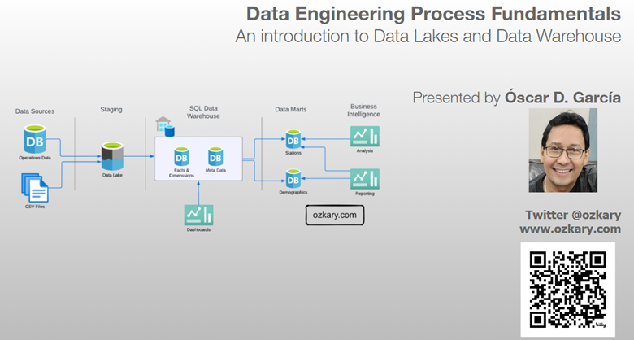
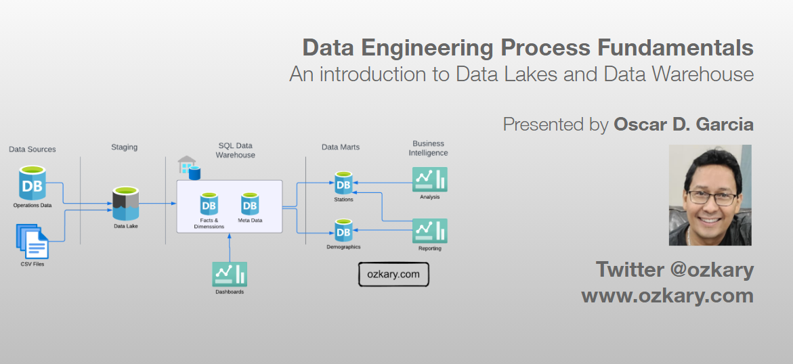
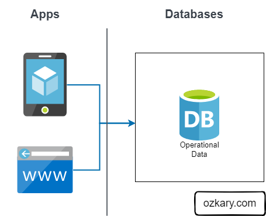
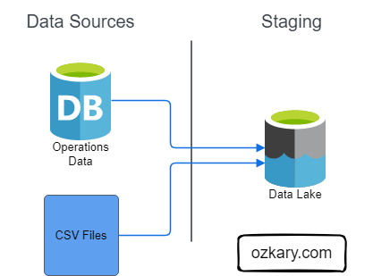
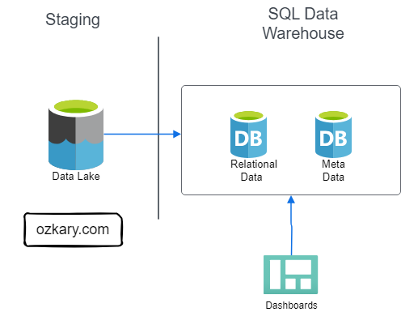
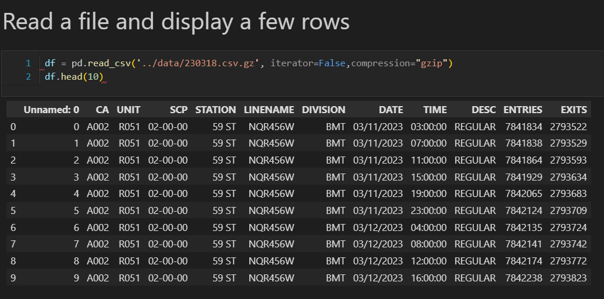
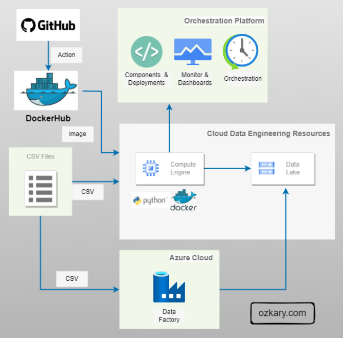
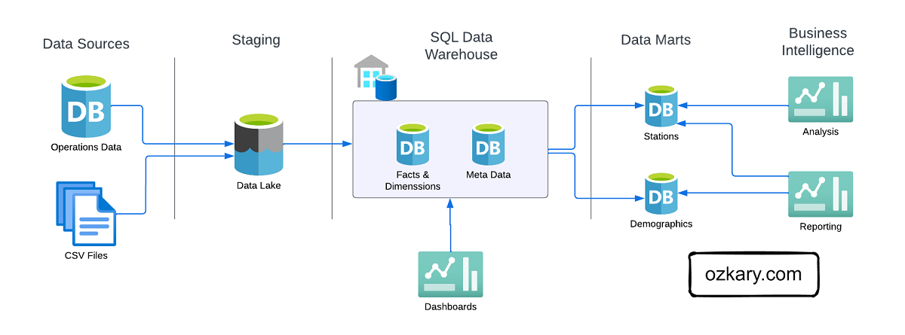
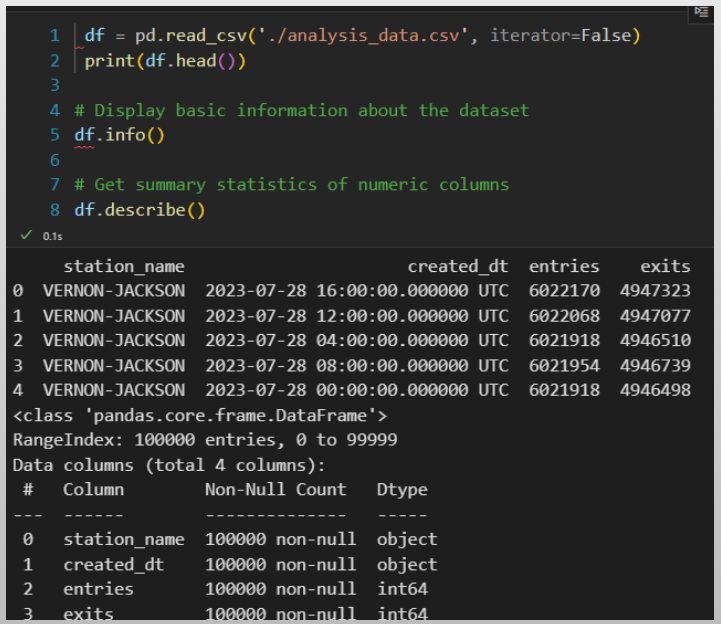
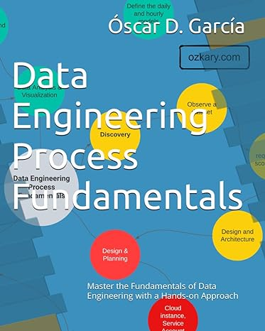

# Overview

In this technical presentation, we will delve into the fundamental concepts of Data Engineering, focusing on two pivotal components of modern data architecture - Data Lakes and Data Warehouses. We will explore their roles, differences, and how they collectively empower organizations to harness the true potential of their data.

- Follow this GitHub repo during the presentation: (Star the project to follow and get updates)

> 👉 [GitHub Repo](https://github.com/ozkary/data-engineering-mta-turnstile)

- Data engineering Series:  

> 👉 [Blog Series](https://www.ozkary.com/2023/03/data-engineering-process-fundamentals.html)
  
## YouTube Video

### Video Agenda

Agenda:

1. Introduction to Data Engineering:

- Brief overview of the data engineering landscape and its critical role in modern data-driven organizations.

- Operational Data

2. Understanding Data Lakes:

- Explanation of what a data lake is and its purpose in storing vast amounts of raw and unstructured data.

3. Exploring Data Warehouses:

- Definition of data warehouses and their role in storing structured, processed, and business-ready data.

4. Comparing Data Lakes and Data Warehouses:

- Comparative analysis of data lakes and data warehouses, highlighting their strengths and weaknesses.

- Discussing when to use each based on specific use cases and business needs.

5. Integration and Data Pipelines:

- Insight into the seamless integration of data lakes and data warehouses within a data engineering pipeline.

- Code walkthrough showcasing data movement and transformation between these two crucial components.

6. Real-world Use Cases:

- Presentation of real-world use cases where effective use of data lakes and data warehouses led to actionable insights and business success.

- Hands-on demonstration using Python, Jupyter Notebook and SQL to solidify the concepts discussed, providing attendees with practical insights and skills.

7. Q&A and Hands-on Session:

- An interactive Q&A session to address any queries.

Conclusion:

This session aims to equip attendees with a strong foundation in data engineering, focusing on the pivotal role of data lakes and data warehouses. By the end of this presentation, participants will grasp how to effectively utilize these tools, enabling them to design efficient data solutions and drive informed business decisions.

## Presentation

### Data Engineering Overview

A Data Engineering Process involves executing steps to understand the problem, scope, design, and architecture for creating a solution. This enables ongoing big data analysis using analytical and visualization tools.

**Topics**

- Data Lake and Data Warehouse
- Discovery and Data Analysis
- Design and Infrastructure Planning
- Data Lake - Pipeline and Orchestration
- Data Warehouse - Design and Implementation
- Analysis and Visualization

**Follow this project: Give a star**

> 👉 [Data Engineering Process Fundamentals](//github.com/ozkary/data-engineering-mta-turnstile)

### Operational Data

Operational data is often generated by applications, and it is stored in transactional relational databases like SQL Server, Oracle and NoSQL (JSON) databases like MongoDB, Firebase. This is the data that is created after an application saves a user transaction like contact information, a purchase or other activities that are available from the application. 

**Features:**

- Application support and transactions
- Relational data structure and SQL or document structure NoSQL
- Small queries for case analysis

**Not Best For:**

- Reporting system
- Large queries
- Centralized Big Data system

### Data Lake - Analytical Data Staging 

A Data Lake is an optimized storage system for Big Data scenarios. The primary function is to store the data in its raw format without any transformation. Analytical data is the transaction data that has been extracted from a source system via a data pipeline as part of the staging data process.

**Features:**

- Store the data in its raw format without any transformation 
- This can include structure data like CSV files, unstructured data like JSON and XML documents, or column-base data like parquet files
- Low Cost for massive storage power
- Not Designed for querying or data analysis
- It is used as external tables by most systems

### Data Warehouse - Analytical Data

A Data Warehouse is a centralized storage system that stores integrated data from multiple sources. The system is designed to host and serve Big Data scenarios with lower operational cost than transaction databases, but higher costs than a Data Lake. This system host the Analytical Data that has been processed and is ready for analytical purposes.

**Data Warehouse Features:**

- Stores historical data in relational tables with an optimized schema, which enables the data analysis process
- Provides SQL support to query the data
- It can integrate external resources like CSV and parquet files that are stored on Data Lakes as external tables
- The system is designed to host and serve Big Data scenarios. It is not meant to be used as a transactional system
- Storage is more expensive
- Offloads archived data to Data Lakes

### Discovery - Data Analysis

During the discovery phase of a Data Engineering Process, we look to identify and clearly document a problem statement, which helps us have an understanding of what we are trying to solve. We also look at our analytical approach to make observations about at the data, its structure and source. This leads us into defining the requirements for the project, so we can define the scope, design and architecture of the solution.

- Download sample data files
- Run experiments to make observations
- Write Python scripts using VS Code or Jupyter Notebooks
- Transform the data with Pandas
- Make charts with Plotly
- Document the requirements

### Design and Planning

The design and planning phase of a data engineering project is crucial for laying out the foundation of a successful system. It involves defining the system architecture, designing data pipelines, implementing source control practices, ensuring continuous integration and deployment (CI/CD), and leveraging tools like Docker and Terraform for infrastructure automation.
 
- Use GitHub for code repo and for CI/CD actions
- Use Terraform is an Infrastructure as Code (IaC) tool that enables us to manage cloud resources across multiple cloud providers
- Use Docker containers to run the code and manage its dependencies

### Data Lake - Pipeline and Orchestration

A data pipeline is basically a workflow of tasks that can be executed in Docker containers. The execution, scheduling, managing and monitoring of the pipeline is referred to as orchestration. In order to support the operations of the pipeline and its orchestration, we need to provision a VM and data lake, and monitor cloud resources. 

- This can be code-centric, leveraging languages like Python
- Or a low-code approach, utilizing tools such as Azure Data Factory, which provides a turn-key solution
- Monitor services enable us to track telemetry data
- Docker Hub, GitHub can be used for the CI/CD process

### Data Warehouse - Design and Implementation

In the design phase, we lay the groundwork by defining the database system, schema model, and technology stack required to support the data warehouse’s implementation and operations. In the implementation phase, we focus on converting conceptual data models into a functional system. By creating concrete structures like dimension and fact tables and performing data transformation tasks, including data cleansing, integration, and scheduled batch loading, we ensure that raw data is processed and unified for analysis. Create a repeatable and extendable process.

### Data Warehouse - Data Analysis

Data analysis is the practice of exploring data and understanding its meaning. It involves activities that can help us achieve a specific goal, such as identifying data dimensions and measures, as well as data analysis to identify outliers, trends, and distributions. 

- We can accomplish these activities by writing code using Python and Pandas, SQL, Visual Studio Code or Jupyter Notebooks. 
- What's more, we can use libraries, such as Plotly, to generate some visuals to further analyze data and create prototypes.

### Data Analysis and Visualization

Data visualization is a powerful tool that takes the insights derived from data analysis and presents them in a visual format. While tables with numbers on a report provide raw information, visualizations allow us to grasp complex relationships and trends at a glance. 

- Dashboards, in particular, bring together various visual components like charts, graphs, and scorecards into a unified interface that can help us tell a story
- Use tools like PowerBI, Looker, Tableau to model the data and create enterprise level visualizations

### Conclusion

Both data lakes and data warehouses are essential components of a data engineering project. The primary function of a data lake is to store large amounts of operational data in its raw format, serving as a staging area for analytical processes. In contrast, a data warehouse acts as a centralized repository for information, enabling engineers to transform, process, and store extensive data. This allows the analytical team to utilize coding languages like Python and tools such as Jupyter Notebooks, as well as low-code platforms like Looker Studio and Power BI, to create enterprise-quality dashboards for the organization.

## We've covered a lot today, but this is just the beginning! 

If you're interested in learning more about building cloud data pipelines, I encourage you to check out my book, 'Data Engineering Process Fundamentals,' part of the Data Engineering Process Fundamentals series. It provides in-depth explanations, code samples, and practical exercises to help in your learning.

[Amazon](https://www.amazon.com/Data-Engineering-Process-Fundamentals-Hands/dp/B0CV7TPSNB)

Thanks for reading.

Send question or comment at Twitter @ozkary
👍 Originally published by [ozkary.com](https://www.ozkary.com)
