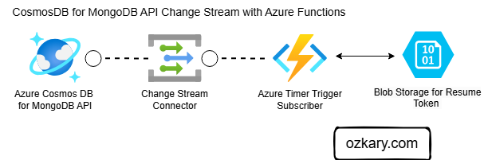

# Overview

Azure Functions triggers for Cosmos DB enable developers to write event-driven applications that respond to changes in a collection/container. While this integration works seamlessly with the core SQL API, it doesn't directly support the MongoDB API. To achieve similar functionality with the MongoDB API, you can leverage change streams, a powerful feature that provides real-time monitoring of data modifications. This article will guide you through setting up and utilizing change streams in Cosmos DB's MongoDB API within an Azure Function.

> Cosmos DB is a data base service which supports various database systems: NoSQL, MongoDB, PostgreSQL, Apache Cassandra, Apache Gremlin, and Table.





## Understanding Change Streams

Change streams offer a continuous, ordered stream of changes occurring in a MongoDB collection (or a Cosmos DB container using the MongoDB API). They track inserts, updates, replaces, and deletes, providing your applications with real-time visibility into data modifications. This is invaluable for scenarios like:

- **Real-time Analytics and Reporting:** Update dashboards and analytics systems as data changes.
- **Data Synchronization:** Keep different data stores in sync by reacting to changes in real time.
- **Event-Driven Architectures:** Trigger downstream processes and workflows based on data modifications.
- **Auditing and Logging:** Capture a detailed history of data changes for audit trails and compliance.

## Implementing Change Streams in Azure Functions

Here's how to set up a change stream within an Azure Function:

- Prerequisites:

  - An active Azure subscription.
  - A Cosmos DB account configured with the MongoDB API.
  - An Azure Function App.
  - Install the MongoDB Driver: Use npm to install the necessary driver:

```bash
npm install mongodb
```

### Implement the Azure Function

 For this integration, we can use a Timer Trigger function. Since the MongoDB API doesn't offer a direct change feed trigger like the SQL API, the Timer Trigger provides a workaround. The function will execute at specified intervals (e.g., every 5 minutes or less) and establish a connection to MongoDB. Upon connection, it can then retrieve change stream events. This approach maintains the serverless nature of Azure Functions, as the function isn't continuously running but activates periodically to process changes.

> An alternative to an Azure Function is to build a **Node.js** or **.NET Core** application and run it as a service on a VM. This provides a constantly running process for change stream monitoring, but requires managing the VM and application lifecycle.

- Configure the Timer Trigger:

In your Azure Function's `function.json`, configure the `timerTrigger` to define the execution schedule. The schedule expression follows the NCrontab format. For example, to trigger every 5 minutes, use `*/5 * * * *`.

```javascript
{
  "bindings": [
    {
      "name": "myTimer",
      "type": "timerTrigger",
      "direction": "in",
      "schedule": "*/5 * * * *"
    }
  ]
}

```

The name property specifies the name of the timer object that will be passed to your function. The schedule expression determines the frequency of execution. Adjust the schedule value as needed to control the polling interval for change stream events. More frequent polling captures changes more rapidly, but consumes more resources. Less frequent polling conserves resources, but may introduce latency in processing changes.

- Configure your app settings

  Use the local.settings.json for local development and your function settings on Azure to store the following configurations values:

```javascript
{
  "IsEncrypted": false,
  "Values": {
    "FUNCTIONS_WORKER_RUNTIME": "node",
    "AzureWebJobsStorage": "<your-storage-connection-string>",
    "CosmosDBConnectionString": "mongodb://<your-cosmosdb-connection-string-from azure>",
    "CosmosDBDatabaseName": "<db-name>",
    "CosmosDBCollectionName": "<collection-name>"
  }
}

```
 
Ensure you define the AzureWebJobsStorage setting with a valid Azure Storage connection string. This is essential for the Azure Functions runtime. Furthermore, we'll use this storage account to persist the last processed change stream resume token. Each change stream record includes a token, enabling the resumption of processing from a specific point. By saving the token after each function execution, we can restart the function and continue processing new changes without duplicates. Upon restarting, the function will retrieve the stored token and resume the change stream from that point.


- Implement the Function Code: 
  
  Use the MongoDB Node.js driver to connect to Cosmos DB and process the change stream:

```javascript
import { InvocationContext, CosmosDBTrigger } from "@azure/functions";
import { MongoClient, ChangeStreamDocument, Document } from "mongodb";


const getResumeToken = async function() : Promise<Binary | null> {

    // document = {token, updatedDt, _id}
    const lastProcessedDoc = await getLastProcessedToken() || null; // retrieve the last processed token
    let lastProcessedToken = lastProcessedDoc?.token ? Binary.createFromBase64(lastProcessedDoc.token) : null;        

    return lastProcessedToken;
}

const factoryTrigger = async function (context: Context, documents: ChangeStreamDocument<Document>[]): Promise<void> {
    
    // read the database env settings from local.settings.json or function configuration (Azure)
    const connectionString = process.env["CosmosDBConnection"]; 
    const databaseName = process.env["CosmosDBDatabaseName"]; 
    const collectionName = process.env["CosmosDBCollectionName"]; 
    const client = new MongoClient(connectionString);

    let currentToken = null;    

    try {
        await client.connect();
        
        const database = client.db(databaseName);
        const collection = database.collection(collectionName);                          
        const lastProcessedToken = await getResumeToken();
            
        // define the pipeline with the events and properties on the document
        const pipeline = [ 
        { $match: { "operationType": { $in: ["insert", "update", "replace"] } } }, 
        { $project: { "_id": 1, "fullDocument": 1, "ns": 1, "documentKey": 1} } ];
    
        // use resumeAfter when the token is found
        const changeStream = lastProcessedToken ? 
            collection.watch(pipeline, { resumeAfter: { _data: lastProcessedToken}, fullDocument: 'updateLookup'}) : collection.watch(pipeline,  { fullDocument: 'updateLookup' });                             

        // Set up event handlers for the change stream the doc is the full document with the current changes
        changeStream.on('change', async (doc: ChangeStreamDocWithToken<Document>) => {
            console.log('Data change detected', doc);

            // get the resume token from the document
            const binToken = doc._id._data;
            const token = binToken.toString('base64');
                                    
            // Save the last processed token the next run
            currentToken = { token, updated: doc.fullDocument.updatedDt, id: doc.fullDocument._id };            
          
            // Add your auditing logic here
            console.log(`Send to storage id: ${doc.fullDocument._id}`);

            await sendToLog(logCollection, doc.fullDocument);

            const dateString = new Date().toISOString().slice(0, 10); // "YYYY-MM-DD"
            const blobName = `log-${dateString}.json`;  // Example filename: log-2024-07-25.json
            const changeData = JSON.stringify(doc.fullDocument) + '\n'; // Newline-delimited JSON
            console.log(changeData);
            
            // Append the data to blob or another mongodb collection depending on your requirements            
                
        });

        changeStream.on('error', async (error: any) => { 
          // or more specific error type if known
            context.log("Change stream error:", error);                          
        });

        changeStream.on('close', () => {  
            // Handle the 'close' event, usually optional
            context.log('Change Stream Closed');           
        });

        changeStream.on('connect', () => {  
            console.log('Change Stream Connected');           
        });

        // max timer to allow function to stop
        const timeout = setTimeout(async () => { 
                console.log(`Closing the stream after timeout ${maxDuration}`);
                clearTimeout(timeout);            
                await changeStream.close();   
                await client.close();  
                if (currentToken)       
                    updateLastProcessedToken(currentToken);
            }, maxDuration);

        context.log('Watching for changes...');
    } catch (err) {
        context.log('Error setting up change stream:', err);
           
        if (client)
            await client.close();
    } 
};

export default cosmosDBTrigger;
```

The `factoryTrigger` function uses a timer to periodically poll a Cosmos DB change stream (using the MongoDB API) for data modifications. It retrieves the last processed change stream token from blob storage to resume processing from where it left off. The function then watches the specified Cosmos DB collection for inserts, updates, and replaces, processing each change by sending the full document to a log collection and appending it to a newline-delimited JSON file in blob storage. 

A timeout is implemented to limit the function's execution time and maintain its serverless nature. The timer ensures the function doesn't run continuously, conserving resources, while still periodically checking for and processing changes. The timeout further enforces this resource constraint by closing the change stream and exiting the function after a specified duration. This prevents runaway execution and associated costs while allowing the function to pick up where it left off in the next timer-triggered execution.

- Implement the Blob Storage API

```javascript

import { fileRead, fileWrite } from "./blobStorageUtils";

export interface DocumentToken {
    token: string;
    updated: string;
    id: string;
}

const tokenKey = 'resume-token';

const MISSING_CONFIG = 'Missing configuration partition/row key for last processed token.'
const NOT_FOUND = 'No existing entity found'
const FAILED_UPDATE = 'Failed to update record';

/**
 * Read the last process token from a blob storage
 * @returns the value 
 */
export async function getLastProcessedToken(): Promise<DocumentToken | null> {
   
    if (!tokenKey) {
        throw new Error(MISSING_CONFIG);
        return;
    }

    try {
        const blobName = `${tokenKey}.json`;        
        const value = await fileRead(blobName);
        return JSON.parse(value) as DocumentToken;
    } catch (error) {
        console.log(NOT_FOUND);
        return null;
    }
}

export async function updateLastProcessedToken(value: DocumentToken): Promise<void> {

    if (!tokenKey || !rowKey) {
        throw new Error(MISSING_CONFIG);
        return;
    }

    try {        
        const blobName = `${tokenKey}.json`;        
        await fileWrite(blobName, JSON.stringify(value));
        
    } catch (error) {
        console.log(FAILED_UPDATE, error);        
    }
}

```

This is a simple implementation wrapper which simplifies interaction with Azure Blob Storage, abstracting away the complexities of the @azure/storage-blob package (which requires `import { BlobServiceClient, ContainerClient } from "@azure/storage-blob";`). It offers convenient functions for reading and writing JSON data to blobs, streamlining the process of managing the change stream resume token. Consult the Azure documentation on the @azure/storage-blob package for more detailed information and advanced usage scenarios.

The `getLastProcessedToken` function reads the resume token from a file named `resume-token.json`. The `updateLastProcessedToken` function then overwrites this file with the latest resume token. This mechanism allows the change stream to be restarted from a specific point, ensuring that changes are processed sequentially without gaps or duplicates.

## Conclusion:

Change streams provide a powerful mechanism for reacting to data modifications in Cosmos DB's MongoDB API. While the MongoDB API doesn't directly support a change feed trigger within Azure Functions, the timer-based approach outlined here offers a near real-time solution. By periodically polling the change stream, applications can effectively capture and process data changes with minimal latency. This approach balances the need for real-time responsiveness with the efficiency and cost-effectiveness of serverless functions. Leveraging change streams in this way opens up opportunities to build dynamic, data-driven applications that react swiftly to evolving information, combining the scalability and flexibility of Cosmos DB with the familiar MongoDB development experience.

Thanks for reading.

Send question or comment at Twitter @ozkary
👍 Originally published by [ozkary.com](https://www.ozkary.com)
