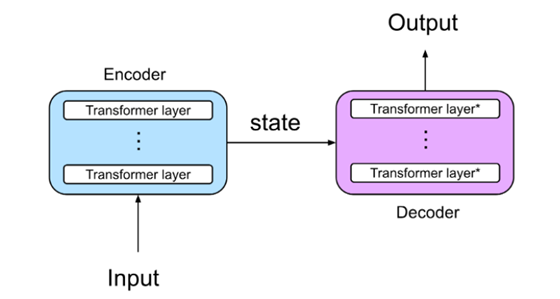
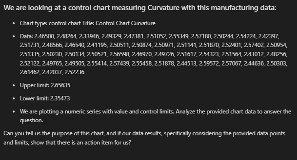
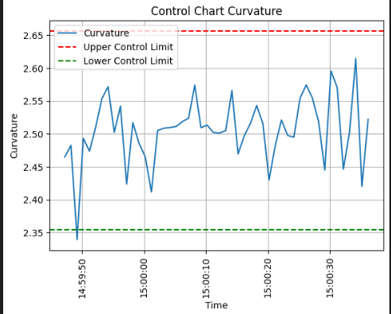

# Overview

This presentation explores how Generative AI, particularly Large Language Models (LLMs), can empower engineers with deeper data understanding. We'll delve into creating complex charts using Python and demonstrate how LLMs can analyze these visualizations, identify trends, and suggest actionable insights. Learn how to effectively utilize LLMs through prompt engineering with natural language and discover how this technology can save you valuable time and effort.

> #BuildwithAI Series

- Follow this GitHub repo during the presentation: (Give it a star and follow the project)

> 👉 https://github.com/ozkary/ai-engineering

## YouTube Video

<iframe width="560" height="315" src="https://www.youtube.com/embed/gSCYAl8vS44?si=pFEfs8nQT743mIO6" title="Smart Charts: Powered by AI" frameborder="0" allow="accelerometer; autoplay; clipboard-write; encrypted-media; gyroscope; picture-in-picture; web-share" referrerpolicy="strict-origin-when-cross-origin" allowfullscreen></iframe>

### Video Agenda

**Agenda:**

1. Introduction to LLMs and their Role in Data Analysis and Training
- What are LLMs, and how do they work?
- LLMs in the context of data analysis and visualization.

2. Prompt Engineering - Guiding the LLM
- Crafting effective prompts for chart analysis.
- Providing context within the prompt (chart type, data).

3. Tokens - The Building Blocks
- Understanding the concept of tokens in LLMs.
- How token limits impact prompt design and model performance.

4. Let AI Help with Data Insights - Real Use Case
- Creating complex charts using Python libraries.
- Write Prompts for Chart Analysis
- Utilizing an LLM to analyze the generated charts.
- Demonstrating how LLMs can identify trends, anomalies, and potential areas for improvement.

6. Live Demo - Create complex charts using python and ask AI to help you with the analysis
- Live coding demonstration of creating a complex chart and using an LLM to analyze it.
  
Why Attend?

- Discover how to leverage LLMs to gain deeper insights from your data visualizations.
- Learn practical techniques for crafting effective prompts to guide LLM analysis.
- Enhance your data analysis skills with the power of AI.  
  
## Presentation

### What are LLM Models - Not Skynet

Large Language Model (LLM) refers to a class of Generative AI models that are designed to understand prompts and questions and generate human-like text based on large amounts of training data. LLMs are built upon Foundation Models which have a focus on language understanding.

#### Common Tasks

- **Text** and **Code Generation**: LLMs can  generate code and data analysis text based on specific prompts

- **Natural Language Processing (NLP)**: Understand and generate human language, sentiment analysis, translation

- **Text Summarization**: LLMs can condense lengthy 
pieces of text into concise summaries

- **Question Answering**: LLMs can access and process information from various sources to answer questions, making a great fit for chatbots

### Training LLM Models - Secret Sauce

Models are trained using a combination of machine learning and deep learning. Massive datasets of text are collected, cleaned, and fed into complex neural networks with multiple layers. These networks iteratively learn by analyzing patterns in the data, allowing them to map inputs like chart data to desired outputs, such as chart analysis.

#### Training Process:

- **Data Collection**: Sources from books, articles, code repositories, and online conversations

- **Preprocessing**: Data cleaning and formatting for the ML algorithms to understand it effectively

- **Model Training**: The neural network architecture is trained on the data. The network adjusts its internal parameters to learn how to map input data (user stories) to desired outputs (code snippets)

- **Fine-tuning**: Fine-tune models for specific tasks like code generation, by training the model on relevant data (e.g., specific programming languages, coding conventions).

### Transformer Architecture - Not Autobots

Transformer is a neural network architecture that excels at processing long sequences of text by analyzing relationships between words, no matter how far apart they are. This allows LLMs to understand complex language patterns and generate human-like text.

#### Components

- **Encoder**: Process the input (use story) by using multiple encoder layers with self-attention Mechanism to analyze the relationship between words
  
- **Decoder**: Uses the encoded information and its own attention mechanism to generate the output text (like code), ensuring it aligns with the text.
  
- **Attention Mechanism**: Enables the model to effectively focus on the most important information for the task at hand, leading to improved NLP and generation capabilities.

> 👉 Read: [Attention is all you need by Google, 2017](https://research.google/pubs/attention-is-all-you-need/)

### Fine-Tuning for Specific Domain

Fine-tuning LLMs is a process to specialize a pre-trained model into a specific domain like data analysis with your process information.

#### Process:

- Use the knowledge and parameters gained from a large pretrained dataset,  source model 
- Enhance the model performance by retraining the source model with a domain specific and smaller dataset
- Use the target model for the final integration

### Tokens - The Building Blocks of Language Models

Large language models work by dissecting text into a sequence of tokens. These tokens act as the building blocks, allowing it to grasp the essence, structure, and connections within the text.

#### Details

- Tokens can be individual words, punctuation marks, or even smaller sub-word units, depending on the specific LLM architecture.
- The length of a word can influence the number of tokens it generates.
- Similar to how Lego bricks come in various shapes and sizes, tokens can vary depending on the model's design.
- Measure cost.

> 👉 Think of tokens as Lego blocks

### Prompt Engineering - What is it?

Prompt engineering is the process of designing and optimizing prompts to better utilize LLMs. Well described prompts can help the AI models better understand the context and generate more accurate responses.

#### Features

- **Clarity and Specificity**: Effective prompts are clear, concise, and specific about the task or desired response

- **Task Framing**: Provide background information, specifying the desired output format (e.g., code, email, poem), or outlining specific requirements

- **Examples and Counter-Examples**: Including relevant examples and counterexamples within the prompt can further guide the LLM 

- **Instructional Language**: Use clear and concise instructions to improve the LLM's understanding of what information to generate

### Chart Analysis with AI

By combining existing charts with AI-driven analysis, we can unlock deeper insights, automate interpretation, and empower users to make more informed decisions.

#### Data Analysis Flow:

- **Chart Data:** Identify the key data points from the chart (e.g., x-axis values, y-axis values, data labels, limits).

- **Chart Prompt:** Format this information in a concise and human-readable format, such as:

"We are looking at a control chart measuring Curvature data points…"

- **Analysis Prompt:** Provide details about what would you like to learn from the data: 

"Interpret this chart, data series, limits and action items to take?"

> 👉 LLM generated analysis is not perfect, if the prompt is not detail enough, hallucinations may occurred

## Smart Charts Powered by AI - Summary

LLMs empower developers, data engineers/analysts, and scientists by enhancing data understanding through AI-driven chart analysis. To ensure accurate and insightful analysis, crafting detailed prompts is crucial.

- **Provide Chart Context:**
  - Chart Type: (e.g., line chart, bar chart, pie chart, scatter plot)
  - Chart Title 
  - Data Series
  - Data Ranges/Limits: (e.g., Time period,  Upper/Lower Limits)

- **Provide Guiding Questions:**
  - What is the overall trend of the data? 
  - Are there any significant peaks or dips?
  - Are there any outliers or anomalies?
  - What are the key takeaways from this chart?
  - What actions, if any, should be considered?

> 👉 By framing the prompt with contextual and guiding questions, you effectively "train" the model to analyze the chart in a more human-like and insightful manner.

Thanks for reading! 😊 If you enjoyed this post and would like to stay updated with our latest content, don’t forget to follow us. Join our community and be the first to know about new articles, exclusive insights, and more!

Leave comments on this post or contact me at:

 - Twitter @ozkary
 - BlueSky https://bsky.app/profile/ozkary.bsky.social

👍 Originally published by [ozkary.com](https://www.ozkary.com)
