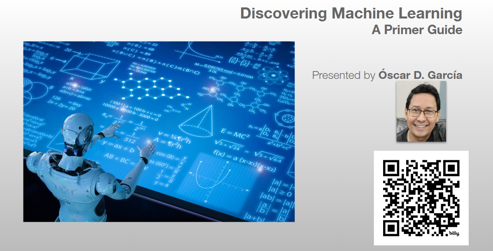
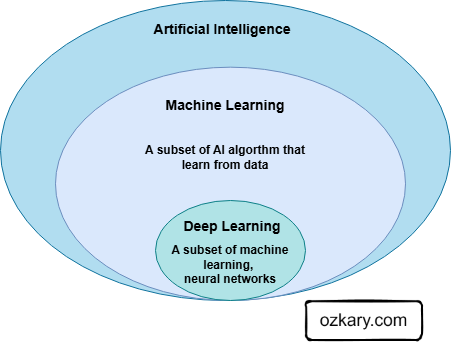
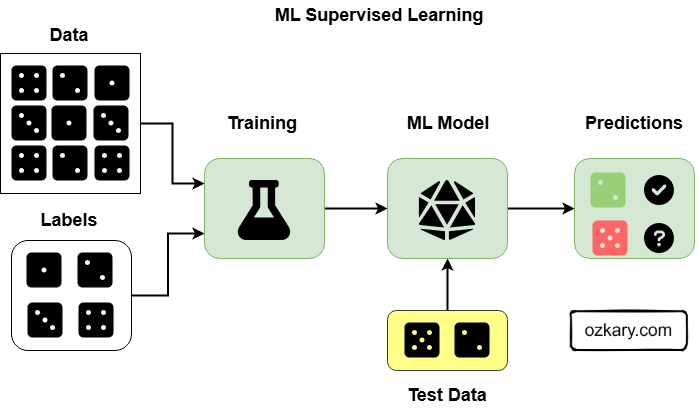
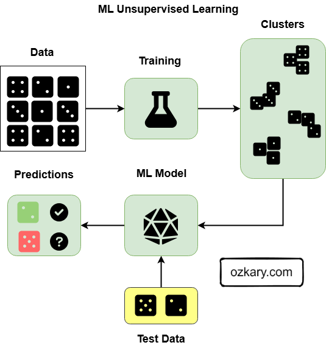
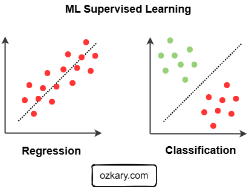
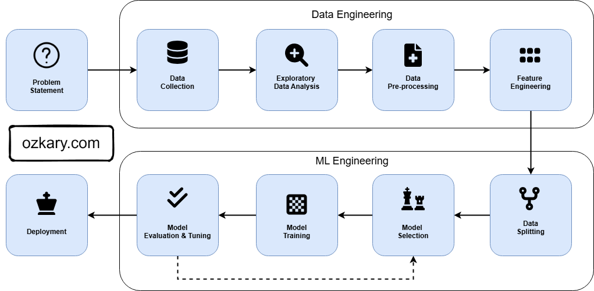

# Overview

Machine Learning can seem like a complex and mysterious field. This presentation aims to discover the core concepts of Machine Learning, providing a primer guide to key ideas like supervised and unsupervised learning, along with practical examples to illustrate their real-world applications. We'll also explore a GitHub repository with code examples to help you further your understanding and experimentation.

> #BuildwithAI Series



- Follow this GitHub repo during the presentation: **(Please star and follow the project for updates.)**

> 👉 https://github.com/ozkary/machine-learning-engineering


## YouTube Video

<iframe width="560" height="315" src="https://www.youtube.com/embed/ZJDyXNuHrfE?si=2c-KQA_6FoFTYy7b" title="Discovering Machine Language a Primer Guide" frameborder="0" allow="accelerometer; autoplay; clipboard-write; encrypted-media; gyroscope; picture-in-picture; web-share" referrerpolicy="strict-origin-when-cross-origin" allowfullscreen></iframe>

### Video Agenda

**Agenda:**

1. What is Machine Learning?
   - Definition and core concepts

2. Why is Machine Learning Important?
   - Key applications and benefits
  
3. Types of Machine Learning
   - Supervised Learning
   - Examples: Classification & Regression
   - Unsupervised Learning
   - Examples: Clustering & Dimensionality Reduction

4. Problem Types

   - Regression: Predicting continuous values
   - Classification: Predicting categorical outcomes
  
5. Model Development Process

   - Understand the Problem
   - Exploratory Data Analysis (EDA)
   - Data Preprocessing
   - Feature Engineering
   - Data Splitting
   - Model Selection
   - Training & Evaluation 
  
## Presentation

### What is Machine Learning

ML is a subset of AI that focuses on enabling computers to learn and improve performance on a specific task without being explicitly programmed. In essence, it's about learning from data patterns to make predictions or decisions based on it.

#### Core Concepts

- Learn from data
- Improve performance with more training data
- Main goal is to make predictions and decisions on new data
- Learn the relation of data + outcome to define the model
- The new data + model predicts an outcome 



### Why is Machine Learning Important?

ML impacts how computers solve problems. Traditional systems rely on pre-defined rules programmed by humans. This approach struggles with complexity and doesn't adapt to new information. In contrast, ML enables computers to learn directly from data, similar to how humans learn.

- Coding Rules

```python
def heart_disease_risk_rule_based(age, overweight, diabetic):
     """
     Assesses heart disease risk based on a set of predefined rules.

     Args:
         age: Age of the individual (int).
         overweight: True if overweight, False otherwise (bool).
         diabetic: True if diabetic, False otherwise (bool).

     Returns:
         "High Risk" or "Low Risk" (str).
     """
     if age > 50 and overweight and diabetic:
         return "High Risk"
     elif age > 60 and (overweight or diabetic):
         return "High Risk"
     elif age > 40 and overweight and not diabetic:
        return "Moderate Risk"
     else:
         return "Low Risk"

```

- Learning from data

```python
from sklearn.model_selection import train_test_split
from sklearn.ensemble import RandomForestClassifier
from sklearn.metrics import accuracy_score


df = pd.DataFrame(data)
# Prepare the data
X = df[['Age', 'Overweight', 'Diabetic']]  # Features
y = df['Heart Disease']  # Target

# Split data into training and testing sets
# X has the categories/features
# y has the target value
# train data is for training
# test data is for testing
# .2 means 20% of the data is used for testing 80% for training
# 42 is the seed for random shuffling

X_train, X_test, y_train, y_test = train_test_split(X, y, test_size=0.2, random_state=42)

# Train a Random Forest classifier
model = RandomForestClassifier()
model.fit(X_train, y_train)

# Make predictions on the test set
y_pred = model.predict(X_test)

# Evaluate the model
accuracy = accuracy_score(y_test, y_pred)
print(f"Accuracy of the model : {accuracy}")

# 70% - 80%: Often considered a reasonable starting point for many classification problems.
# 80% - 90%: Good performance for many applications.
# 90% - 95%: Very good performance. Often challenging to achieve, but possible for well-behaved problems with good data.
# > 95%: Excellent performance, potentially approaching the limits of what's possible for the problem. Be careful of overfitting if you're achieving very high accuracy.
# 100%: Usually a sign of overfitting.
```

> 👉 [Jupyter Notebook](https://github.com/ozkary/machine-learning-engineering/blob/main/01-introduction/comparison.ipynb)

### Types of ML Models - Supervised Learning

#### Examples

- Regression: Predicting a continuous value (e.g., house prices, stock prices).
- Classification: Predicting a category or class label (e.g., cat/dog/bird, disease/no disease).
- Model Examples: Linear Regression, Logistic Regression, Decision Trees, Random Forest.



### Types of ML Models - Unsupervised Learning

#### Examples

- Clustering: Grouping similar data points together (e.g., group patients by symptoms, age groups)

- Association: Discovering relationships or associations between items (e.g., symptom association)

> "Patients who report 'Fever' and 'Cough' are also frequently reporting 'Headache' or 'Muscle Aches'."

- Model Examples:  Clustering (k-means), association (Frequent Pattern Growth)



### Supervise Learning - Common Problem Types

Regression and Classification are two main problem types to solve. With Regression, we look to predict a continuous target variable like price, cost. With Classification, we look to predict a discrete target like a group or y/n class.

#### Problem Types

1. Regression:

   - In regression, the target variable is continuous and represents a quantity or a number.
   - Example: Predicting house prices, temperature predictions, stock prices.

2. Classification:

   - In classification, the target variable is discrete and represents a category or a class.
   - Example: spam vs. non-spam emails, predicting heart disease Y/N.




### ML Model Development Process - MLOps

Developing a new ML model involves understanding the core problem, then using a data engineering process to gather, explore, and prepare the data. We then move to the ML process to split the data, select the algorithm, train and evaluate the model.

 - **Development Process**
    *   Understand the problem
    *   Exploratory Data Analysis (EDA)
    *   Data Preprocessing
    *   Feature Engineering
    *   Data Splitting
    *   Model Selection
    *   Train TRaining
    *   Model Evaluate & Tuning
    *   Deployment

> MLOps is the operation process to manage the training, evaluation and deployment of your models




> 👉 [Vehicle MSRP Regression](https://github.com/ozkary/machine-learning-engineering/blob/main/projects/vehicle-msrp/regression.ipynb)

### Machine Learning Summary

Machine learning (ML) enables computers to learn patterns from data and make predictions or decisions without explicit programming, unlike rule-based systems. ML models improve as they process more data.

- **Supervised Learning:**

  - Learns from labeled data (input-output pairs)
  - Regression: Predicts continuous values (e.g., house prices)
  - Classification: Predicts categories (e.g., heart disease y/n)

- **Unsupervised Learning:**

  - Learns from unlabeled data (only inputs) and discovers patterns and structures.
  - Clustering: Grouping similar data points (e.g., group patients by symptoms, age groups)
  - Association: Discovering relationships between items (e.g., symptoms association)

While we've explored foundational areas, numerous other exciting topics exist, such as neural networks, natural language processing, computer vision, large language models (LLMs). Visit the repository for more exploration.

Thanks for reading! 😊 If you enjoyed this post and would like to stay updated with our latest content, don’t forget to follow us. Join our community and be the first to know about new articles, exclusive insights, and more!

Leave comments on this post or contact me at:

 - Twitter @ozkary
 - BlueSky https://bsky.app/profile/ozkary.bsky.social

👍 Originally published by [ozkary.com](https://www.ozkary.com)
