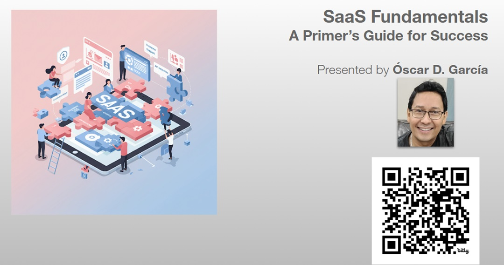
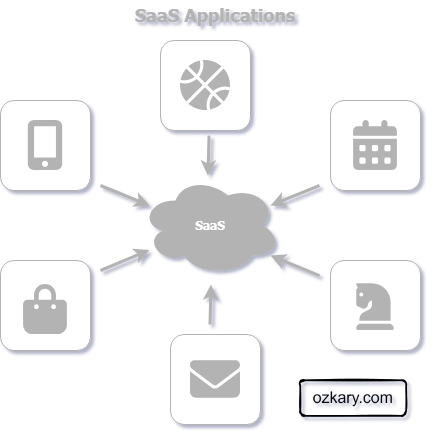
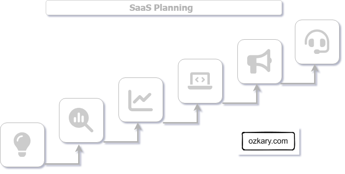
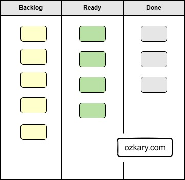
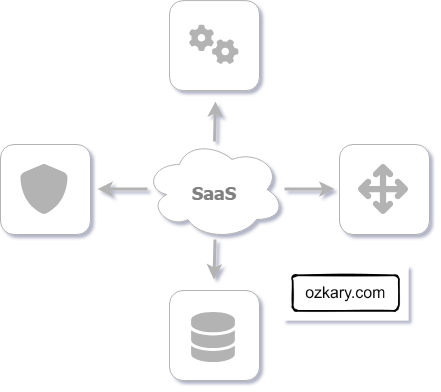
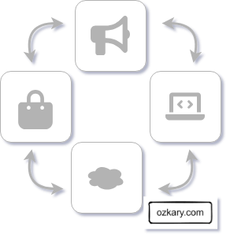
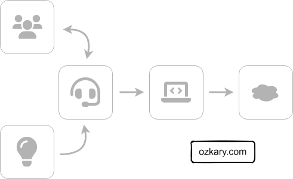

# Overview

Have you ever encountered a problem, big or small, and thought, 'Wouldn't it be great if there was software to solve this?' You envision a tool, a solution, something that would make life easier or a process more efficient. That spark of an idea, that 'what if' moment, is where innovation begins. But what if you could do more than just imagine it? What if you could take that spark and transform it into a real, thriving application? With the SaaS approach, that's not just a dream – it's an achievable reality. This presentation will show you the fundamental steps to take your software idea from a simple thought to a successful online service.

> #Innovation Series

## YouTube Video

> This is the April 2025 Presentation

<iframe width="560" height="315" src="https://www.youtube.com/embed/DN4A_BUb2AM?si=Ao00xHZP8vC9EhqT" title="SaaS Fundamentals  a Primer Guide fo Success" frameborder="0" allow="accelerometer; autoplay; clipboard-write; encrypted-media; gyroscope; picture-in-picture; web-share" referrerpolicy="strict-origin-when-cross-origin" allowfullscreen></iframe>

### Video Agenda

- Introduction to SaaS
- Planning for SaaS Success
- Technical Approach & MVP
- Automation, Security, and Data
- Rollout and Market Presence
- Continuous Retention and Support
- How Do I Get Started?

## Presentation

### Introduction to Software as a Service (SaaS)

SaaS is a cloud-based software delivery model where users pay monthly or yearly to use it. It does not require the need to install  anything or buy licenses.

**Features:**

- Cloud hosted.
- Monthly or yearly commitment.
- Reduced cost.
- Low risk investment for consumers.
- Ongoing product updates that are seamless to the users.

>👉 **Key takeaway:* SaaS offers a convenient and cost-effective way to access and use software.

### Planning for SaaS Success

A SaaS concept should be about ideas that solve real-world problems and are possible to deliver without breaking the bank.

**Concepts:**

- **Problem Identification:** Pinpoint a real-world problem your SaaS will solve. Validate user pain points.
- **Market Research:** Assess market demand and analyze competitors to understand the landscape.
- **Business Models:** Define pricing, subscription tiers, and payment options for revenue generation.
- **Financial Planning:** Create a budget for development, tech, marketing, and support costs.
- **Technology Budget:** Estimate costs for your tech stack, tools, and third-party services.
- **Marketing & Support Costs:** Include marketing and customer support expenses in your financial plan.

>👉 **Key takeaway:** Solid planning and an MVP are crucial for early validation.

### Technical Approach & Minimum Viable Product (MVP)

The technical foundation of your SaaS is built during the MVP phase. Selecting the right technologies and defining the scope of your initial release are critical for efficient development and early user validation.

**Concepts:**

- **MVP Core Features:** Define the essential features that address the core problem your SaaS solves.
- **Iterate with Feedback:** Plan for continuous iteration based on user feedback collected during the MVP phase.
- **Tech Stack:** Choose the development tools and platforms that best suit your project's needs.
- **Code/No-Code:** Evaluate if no-code solutions can efficiently deliver the MVP's core functionality.
- **Cloud Provider:** Select a reliable cloud hosting provider (Microsoft Azure, Google Cloud, AWS).
- **Hosting Options:** Consider various hosting options based on scalability and performance requirements.

>👉 **Key takeaway:** A focused MVP and a well-chosen tech stack accelerate early validation and development.

### Operational Foundation: Automation, Security, and Data

A robust SaaS solution requires a strong operational foundation. This ensures efficient updates, seamless tenant creation, and secure cloud deployments.

**Concepts:**

- **Build Automation:** Implement automation for deployment, updates, and infrastructure management to streamline operations.
- **Security:** Establish a secure and scalable authentication and authorization system using federated identity management. Importance of data security and user privacy.
- **Data Management:** Define data storage, backup, and recovery strategies to ensure data integrity and availability.
- **Ability to Scale:** Design the system to handle increasing user loads and data volumes.

>👉 **Key takeaway:** Use a third-party cloud service that provide those features

### Launching Your SaaS: Marketing & Deployment

Launching your SaaS involves more than just coding; it's about building a strong market presence. A well-crafted marketing and product site, coupled with strategic deployment, will drive user adoption. 

- **Marketing Site:**
    - Creating a compelling marketing website to attract users.
    - SEO and content marketing strategies.
    - Use a CRM to track leads.
- **Product Site:**
    - Creating a user-friendly product website with documentation and support resources.
- **Cloud Hosting:**
    - Choosing a reliable cloud hosting provider (e.g., AWS, Azure, Google Cloud).
    - Scalability and reliability considerations.
- **Marketplace:**
    - Exploring opportunities for listing your SaaS on marketplaces (e.g., Azure Marketplace, AWS Marketplace).
    - Benefits of marketplace distribution.

>👉 **Key takeaway:** A strong online presence is essential for attracting and retaining users.

### Building Long-Term Success: Retention & Support

The journey doesn't end after launch. Retaining users and providing exceptional support are critical for long-term SaaS success. 

- **Continuous Retention:**
    - Implementing feedback mechanisms to gather user insights.
    - Regularly updating and improving the SaaS product.
    - Building a community around your SaaS.
- **Support:**
    - Providing excellent customer support through various channels (e.g., chat, email, knowledge base).
    - Proactive support and troubleshooting.
    - Creating a knowledge base.

>👉 **Key takeaway:** Continuous improvement and excellent support are crucial for long-term success.

### How Do I Get Started?

To begin your SaaS journey, it's crucial to follow the fundamental concepts we've discussed. These principles will guide you through the process of building a successful and sustainable SaaS solution.

**Approach:**

- **Find a Viable, Real Use Case:**
    - Identify a practical problem that can be solved with a SaaS solution, ensuring it's feasible and cost-effective.
- **Scope the MVP and Define the Technical Approach:**
    - Determine the core features for your Minimum Viable Product (MVP) and select the appropriate technology stack and cloud provider.
- **Build a Robust Operational Foundation:**
    - Implement automation, establish strong security measures, and create a scalable data management strategy.
- **Launch with a Strong Market Presence:**
    - Develop a compelling marketing site and a user-friendly product site, and explore marketplace opportunities.
- **Focus on Continuous Retention and Support:**
    - Prioritize user feedback, deliver ongoing updates, and provide excellent customer support to build long-term success.
- **Embrace Iteration for Continuous Growth:**
    - Build a culture of continuous improvement, regularly iterating on your product and processes based on user feedback and market trends.

>👉  **Key takeaway:** By following to these fundamental concepts, you can lay a solid foundation for your SaaS journey.

Thanks for reading! 😊 If you enjoyed this post and would like to stay updated with our latest content, don’t forget to follow us. Join our community and be the first to know about new articles, exclusive insights, and more!

Leave comments on this post or contact me at:

 - Twitter @ozkary
 - BlueSky https://bsky.app/profile/ozkary.bsky.social

👍 Originally published by [ozkary.com](https://www.ozkary.com)
