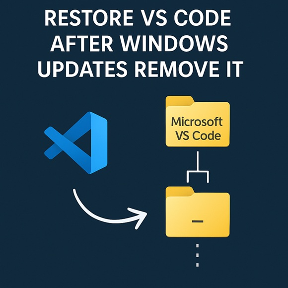

# Restore VS Code After Windows Updates Remove It

Windows updates are meant to improve system stability, but occasionally, they **restructure important folders**, leading to unexpected issues. One problem some users have encountered is **VS Code files being moved** to a mysterious `_` folder inside its installation directory. If this happens to you, don’t worry—**you can restore VS Code easily** with a simple script!



## Understanding the Issue

After certain Windows updates, your **VS Code installation folder** (`C:\Users\{YourUsername}\AppData\Local\Programs\Microsoft VS Code`) may contain a subfolder called `_`. Instead of properly maintaining the installation structure, the update **isolates essential VS Code files** within this `_` folder, making it difficult for the application to launch correctly.

## How to Fix It Manually
1. Open **File Explorer** and navigate to:

```bash
C:\Users\{YourUsername}\AppData\Local\Programs\Microsoft VS Code
```

2. If you see a `_` folder, open it.
3. **Move all its contents** back to the parent directory.
4. Restart **VS Code** to ensure everything works normally.

## Automate the Fix with a Script
If you want a **one-click solution**, this batch script will **detect the misplaced files**, prompt you for confirmation, and move them back automatically:

```bash
@echo off
setlocal

:: ==============================================================
:: Restore VS Code After Windows Updates Remove It
:: ==============================================================
:: Some Windows updates mistakenly move VS Code files into a "_" 
:: subfolder inside its main installation directory. This script 
:: checks if the folder exists and prompts the user before restoring 
:: the files to the correct location.
:: ==============================================================

:: Define the VS Code installation directory
set "vscodeDir=%USERPROFILE%\AppData\Local\Programs\Microsoft VS Code"

:: Define the misplaced folder path
set "underscoreDir=%vscodeDir%\_"

:: Check if the "_" directory exists
if not exist "%underscoreDir%" (
 echo No misplaced files found. Nothing to fix!
 exit /b
)

:: Prompt user for confirmation
echo A misplaced folder ("_") was found inside the VS Code installation directory.
set /p userInput=Do you want to move its contents back to the parent folder? (Y/N): 

:: Convert input to uppercase to handle lowercase entries
if /I not "%userInput%"=="Y" (
 echo Operation canceled.
 exit /b
)

:: Move files back to the parent directory
echo Moving files back to parent directory...
move "%underscoreDir%\*" "%vscodeDir%"
echo Done! The misplaced files have been restored.

endlocal

```

## How to Use the Script
- Copy the code into Notepad.
- Save it as restore_vscode.bat (make sure it’s saved as All Files, not a .txt file).
- Run the script by right-clicking and selecting Run as administrator.
- If the _ folder exists, the script will ask for confirmation before moving the files.
- Press Y and hit Enter to restore your VS Code files.

## Automating the Process for Future Updates

If you find this problem recurring after every update, consider automating the fix:

- Task Scheduler: Set up a scheduled task to run this script after each Windows update.
- Startup Folder: Place the script in the Windows startup directory so it runs on boot.

By using this script, you’ll save time and frustration, ensuring VS Code remains fully functional after every Windows update.

Thanks for reading and follow me for more technical articles, videos and podcasts

 - GitHub https://github.com/ozkary
 - Twitter https://x.com/ozkary
 - YouTube https://www.youtube.com/@ozkary
 - BlueSky https://bsky.app/profile/ozkary.bsky.social

👍 Originally published by [ozkary.com](https://www.ozkary.com)
