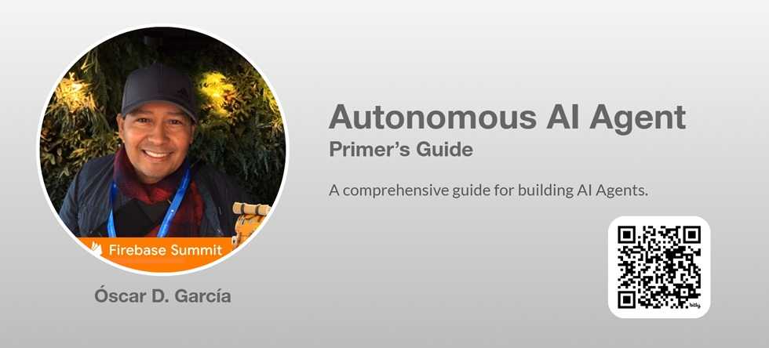
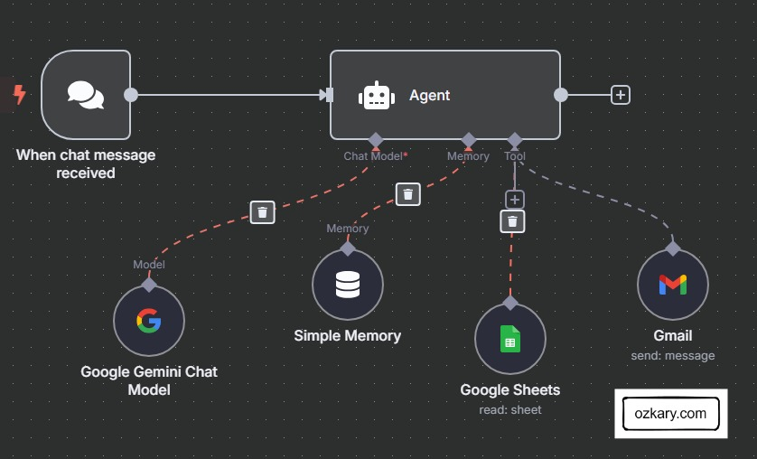
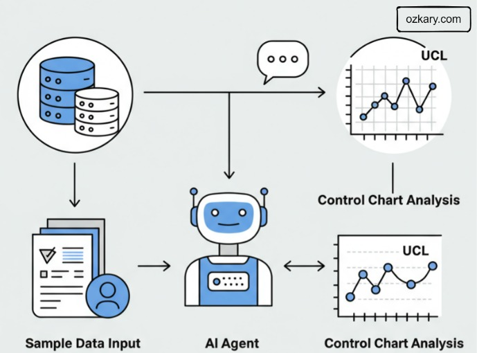
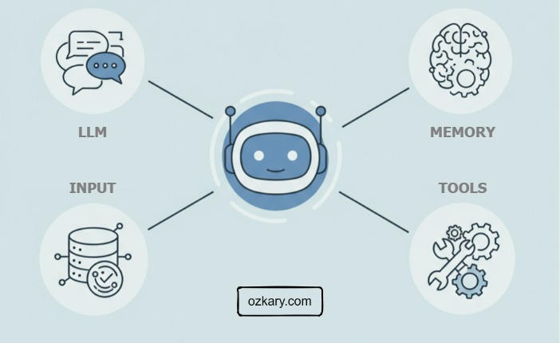
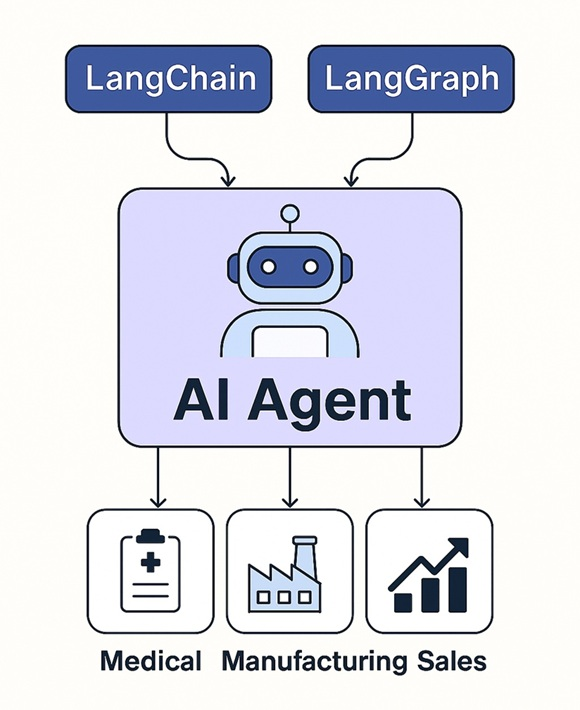

# Overview

What’s the AI agent mystique? Are they just chatbots with automation? What makes them different—and why does it matter?

This presentation breaks it down from the ground up. We’ll explore what truly sets AI agents apart—how they perceive, reason, and act with autonomy across industries ranging from healthcare to retail to logistics. You'll walk away with a clear understanding of what an agent is, how it works, and what it takes to build one.

Whether you’re a developer, strategist, or simply curious, this session is your entry point to one of the most transformative ideas in AI today.



> #BuildWithAI Series

## YouTube Video

<iframe width="560" height="315" src="https://www.youtube.com/embed/3tOK4nvEjOE?si=AW-73vcD6ids55mi" title="Autonomous AI Agent: A Primer's Guide" frameborder="0" allow="accelerometer; autoplay; clipboard-write; encrypted-media; gyroscope; picture-in-picture; web-share" referrerpolicy="strict-origin-when-cross-origin" allowfullscreen></iframe>

## GitHub Repo

[](https://github.com/ozkary/ai-engineering/tree/main/ai-agents)

### Video Agenda:

- What is an AI Agent?  
- Autonomy Advantage: How AI Agents Go Beyond Automation
- The Agent’s Secret Power  
- Model Context Protocol (MCP): The Key to Tool Integration  
- How Does an Agent Talk MCP?  
- Benefits of MCP for AI Agents  
- Shape Agent Behavior Through Prompting

## Presentation

### What is an AI Agent?

An AI agent is a software robot that observes what’s happening, figures out what to do, and then does it—all without a human needing to guide every step.

**Manufacturing Setting:**

- Monitors sensor data in real time, comparing each new reading against control limits and recent patterns to detect drift, anomalies, or rule violations.
- Decides what needs to happen next—whether that’s pausing production, flagging maintenance, or adjusting inputs to keep the process stable.
- Acts without waiting for instructions, logging the event, alerting staff, or triggering automated workflows across connected systems.

> "Now, you might wonder—how’s this different from just traditional automation?"



## Autonomy Advantage: How AI Agents Go Beyond Automation

Unlike scripted automation, an AI agent brings autonomy—acting with awareness, judgment, and initiative. It doesn’t just execute commands—it thinks.

- **Perception** Observes real-time data from sensors, machines, and systems—just like a human operator watching a dashboard—but at higher speed and scale.

- **Reasoning** Analyzes trends and patterns from recent data (its reasoning window) to assess stability, detect anomalies, or anticipate breakdowns—just like an engineer interpreting a control chart.

- **Action** Takes initiative by triggering responses: adjusting inputs, alerting staff, logging events, or even halting production—without waiting for permission.

> But, what powers this autonomy?



## The Agent’s Secret Power

An AI agent doesn’t just automate—it senses, thinks, and acts on its own. These core technologies are what give it autonomy.

**Manufacturing Setting:**

- Perception Ingests real-time sensor data and stores recent readings in a reasoning window for short-term memory.
- Reasoning Uses an LLM (like Gemini) to analyze trends, detect rule violations, and interpret process behavior—beyond rigid logic.
- Action Executes commands using predefined tools via MCP—like notifying staff, triggering scripts, or calling APIs.

> Wait, what are MCP tools?



## Model Context Protocol (MCP): The Key to Tool Integration

MCP is a communication framework that lets AI agents use tools—like APIs, databases, or notifications—by expressing intent in structured language.

- Triggering a Notification The agent says: @notify: supervisor_alert("Vibration spike detected on motor_3A") MCP delivers a formatted message via email, SMS, or system alert.

```yaml
POST /alerts/send
Content-Type: application/json

{
  "recipient": "supervisor_team",
  "message": "Vibration spike detected on motor_3A",
  "priority": "high"
}
```

```yaml
tool: notify_supervisor
description: Sends an alert message to the assigned supervisor team
parameters:
  - name: message
    type: string
    required: true
    description: The alert message to send
example_call: "@notify: supervisor_alert(\"Vibration spike detected on motor_3A\")"
execution:
  type: webhook
  method: POST
  endpoint: https://factory.opsys.com/alerts/send
  payload_mapping:
    recipient: "supervisor_team"
    message: "{{message}}"
    priority: "high"
```

## How Does the Agent Understand MCP?

When an agent makes a decision, it doesn’t call a function directly—it *declares intent* using a structured phrase. MCP translates that intent into a real-world action by matching it to a predefined tool. Essentially, reading the tool metadata as a prompt.

**Agent says:**
```text
@notify: supervisor_alert("Vibration spike detected on motor_3A")
```

**In Action:**

- **Agent** emits intent using MCP syntax, @notify: supervisor_alert("Vibration spike detected on motor_3A")
- **MCP** matches the function name (`supervisor_alert`) to a registered tool.
- **Execution Engine** constructs the proper HTTP request using metadata, endpoint URL, method, headers, authentication.
- **Action** is performed: supervisor is notified via the external system.

> The agent just describes what it needed to happen. MCP handles the how.


## Benefits of MCP for AI Agents

MCP gives AI agents the flexibility and intelligence to grow beyond fixed automation—enabling them to explore, understand, and apply tools in dynamic environments.

- **Dynamic Tool Discovery:*- Agents can learn about and use new tools without explicit programming.
- **Human-like Tool Usage:*- Agents leverage tools based on their "understanding" of the tool's purpose and capabilities, similar to how a human learns to use a new application.
- **Enhanced Functionality & Adaptability:*- Unlocks a vast ecosystem of capabilities for autonomous agents.

> *To act effectively, agents also need character—a defined role, a point of view, a way to think.*

## Shape Agent Behavior Through Prompting

Textual instructions or context provided to guide the agent's behavior and reasoning. They are crucial for controlling and directing autonomous agents.

- **System Prompts** Define the agent’s identity, role, tone, and reasoning strategy. This is its operating character—guiding how it thinks across all interactions. > Example: “You are a manufacturing agent that monitors vibration data and applies SPC rules to detect risk.”

- **User/Agent Prompts** Deliver instructions at the moment. These guide the agent’s short-term focus and task-specific reasoning. > Example: “Analyze this new sample and let me know if we’re trending toward a shutdown.”

> How do I get started?

## Getting Started with AI Agents: The Tech Stack

To build your first AI agent, these tools offer a powerful foundation—though not the only options, they represent a well-integrated, production-ready ecosystem:

- LangChain: Core framework for integrating tools, memory, vector databases, and APIs. Think of it as the foundation that gives your agent capabilities.

- LangGraph Adds orchestration and state management by turning your LangChain components into reactive, stateful workflows—ideal for agents that need long-term memory and conditional behavior.

- LangSmith: Monitoring and evaluation suite to observe, debug, and improve your agents—see how prompts, memory, and tools interact across sessions.

- n8n: No-code orchestration platform that lets you deploy agents into real-world business systems—perfect for automation without touching code.




Thanks for reading! 😊 If you enjoyed this post and would like to stay updated with our latest content, don’t forget to follow us. Join our community and be the first to know about new articles, exclusive insights, and more!

- [Google Developer Group](https://gdg.community.dev/gdg-broward-county-fl/)
- [GitHub](https://github.com/ozkary)
- [Twitter](https://x.com/ozkary)
- [YouTube](https://www.youtube.com/@ozkary)
- [BlueSky](https://bsky.app/profile/ozkary.bsky.social)

👍 Originally published by [ozkary.com](https://www.ozkary.com)
