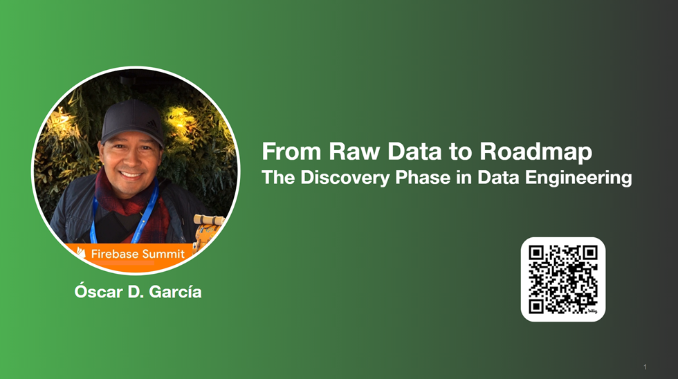

# Overview

The discovery process involves identifying the problem, analyzing data sources, defining project requirements, establishing the project scope, and designing an effective architecture to address the identified challenges.

In this session, we will delve into the essential building blocks of data engineering, placing a spotlight on the discovery process. From framing the problem statement to navigating the intricacies of exploratory data analysis (EDA) using Python, VSCode, Jupyter Notebooks, and GitHub, you'll gain a solid understanding of the fundamental aspects that drive effective data engineering projects.

> DevFest Series
> Data Engineering Process Fundamentals Series

- Follow this GitHub repo during the presentation: (Give it a star)

> 👉 [GitHub Repo](https://github.com/ozkary/data-engineering-mta-turnstile)

Jupyter Notebook

> 👉 [Jupyter Notebook](https://github.com/ozkary/data-engineering-mta-turnstile/blob/main/Step1-Discovery/mta_discovery.ipynb)

- Data engineering Series:  

> 👉 [Blog Series](https://www.ozkary.com/2023/03/data-engineering-process-fundamentals.html)

> 👉 [Data Engineering Book on Amazon](https://www.amazon.com/Data-Engineering-Process-Fundamentals-Hands/dp/B0CV7TPSNB)

## YouTube Video

<iframe width="560" height="315" src="https://www.youtube.com/embed/UVS7A_3CGlU?si=rX_uwaTrAciyhmGa" title="From Raw Data to Roadmap: The Discovery Phase in Data Engineering - Data Engineering Process Fundamentals" frameborder="0" allow="accelerometer; autoplay; clipboard-write; encrypted-media; gyroscope; picture-in-picture; web-share" allowfullscreen></iframe>

### Video Agenda

In this session, we will delve into the essential building blocks of data engineering, placing a spotlight on the discovery process. From framing the problem statement to navigating the intricacies of exploratory data analysis (EDA), data modeling using Python, VS Code, Jupyter Notebooks, SQL, and GitHub, you'll gain a solid understanding of the fundamental aspects that drive effective data engineering projects.

1. Introduction:

   - The "Why": We'll discuss why understanding your data upfront is crucial for success.
   - The Problem: We'll introduce a real-world problem that will guide our exploration.

2. Data Loading and Preparation:

   - Loading: We'll demonstrate how to efficiently load data from an online source directly into our workspace.
   - Structuring: We'll prepare the loaded data for analysis, making it easy to work with.

3. Exploratory Data Analysis (EDA):

   - First Look: We'll learn how to quickly generate and interpret summary statistics for our data.
   - The Story: We'll use these statistics to understand the data's characteristics and identify any red flags or anomalies.

4. Data Cleaning and Modeling:
    
   - Cleaning: We'll identify and handle common data issues like missing values and inconsistencies.
   - Modeling: We'll organize our data into separate tables for dimensions (descriptive attributes) and facts (measurable values).

5. Visualization and Real-World Application:

     - Bringing it to Life: We'll create charts to visualize the data and find patterns.
     - Solving the Problem: We'll apply the insights gained to address our original problem and discuss practical solutions.

Key Takeaways:

- Mastery of the foundational aspects of data engineering.
- Hands-on experience with EDA techniques, emphasizing the discovery phase.
- Appreciation for the value of a code-centric approach in the data engineering discovery process.

**Upcoming Talks:**

Join us for subsequent sessions in our Data Engineering Process Fundamentals series, where we will delve deeper into specific facets of data engineering, exploring topics such as data modeling, pipelines, and best practices in data governance.

This presentation is based on the book, "Data Engineering Process Fundamentals," which provides a more comprehensive guide to the topics we'll cover. You can find all the sample code and datasets used in this presentation on our popular GitHub repository.

## Presentation

### Data Engineering Overview

A Data Engineering Process involves executing steps to understand the problem, scope, design, and architecture for creating a solution. This enables ongoing big data analysis using analytical and visualization tools.

#### Topics

- Importance of the Discovery Process
- Setting the Stage - Technologies
- Exploratory Data Analysis (EDA)
- Code-Centric Approach
- Version Control
- Real-World Use Case

**Follow this project: Give a star**
> 👉 [Data Engineering Process Fundamentals](//github.com/ozkary/data-engineering-mta-turnstile)

### Importance of the Discovery Process

The discovery process involves identifying the problem, analyzing data sources, defining project requirements, establishing the project scope, and designing an effective architecture to address the identified challenges.

- Clearly document the problem statement to understand the challenges the project aims to address.
- Make observations about the data, its structure, and sources during the discovery process.
- Define project requirements based on the observations, enabling the team to understand the scope and goals.
- Clearly outline the scope of the project, ensuring a focused and well-defined set of objectives.
- Use insights from the discovery phase to inform the design of the solution, including data architecture.
- Develop a robust project architecture that aligns with the defined requirements and scope.

### Setting the Stage - Technologies

To set the stage, we need to identify and select the tools that can facilitate the analysis and documentation of the data. Here are key technologies that play a crucial role in this stage:

- **Python:** A versatile programming language with rich libraries for data manipulation, analysis, and scripting.
  
**Use Cases:** Data download, cleaning, exploration, and scripting for automation.

- **Jupyter Notebooks:** An interactive tool for creating and sharing documents containing live code, visualizations, and narrative text.
  
**Use Cases:** Exploratory data analysis, documentation, and code collaboration.

- **Visual Studio Code:** A lightweight, extensible code editor with powerful features for source code editing and debugging.
  
**Use Cases:** Writing and debugging code, integrating with version control systems like GitHub.

- **SQL (Structured Query Language):** A domain-specific language for managing and manipulating relational databases.
  
**Use Cases:** Querying databases, data extraction, and transformation.

### Exploratory Data Analysis (EDA)

EDA is our go-to method for downloading, analyzing, understanding and documenting the intricacies of the datasets. It's like peeling back the layers of information to reveal the stories hidden within the data. Here's what EDA is all about:

- EDA is the process of analyzing data to identify patterns, relationships, and anomalies, guiding the project's direction.

- Python and Jupyter Notebook collaboratively empower us to download, describe, and transform data through live queries.

- Insights gained from EDA set the foundation for informed decision-making in subsequent data engineering steps.

- Code written on Jupyter Notebook can be exported and used as the starting point for components for the data pipeline and transformation services.

### Code-Centric Approach

A code-centric approach, using programming languages and tools in EDA, helps us understand the coding methodology for building data structures, defining schemas, and establishing relationships. This robust understanding seamlessly guides project implementation.

- Code delves deep into data intricacies, revealing integration and transformation challenges often unclear with visual tools.

- Using code taps into Pandas and Numpy libraries, empowering robust manipulation of data frames, establishment of loading schemas, and addressing transformation needs.

- Code-centricity enables sophisticated analyses, covering aggregation, distribution, and in-depth examinations of the data.

- While visual tools have their merits, a code-centric approach excels in hands-on, detailed data exploration, uncovering subtle nuances and potential challenges. 

### Version Control

Using a tool like GitHub is essential for effective version control and collaboration in our discovery process. GitHub enables us to track our exploratory code and Jupyter Notebooks, fostering collaboration, documentation, and comprehensive project management. Here's how GitHub enhances our process:

- **Centralized Tracking:** GitHub centralizes tracking and managing our exploratory code and Jupyter Notebooks, ensuring a transparent and organized record of our data exploration.

- **Sharing:** Easily share code and Notebooks with team members on GitHub, fostering seamless collaboration and knowledge sharing.

- **Documentation:** GitHub supports Markdown, enabling comprehensive documentation of processes, findings, and insights within the same repository.

- **Project Management:** GitHub acts as a project management hub, facilitating CI/CD pipeline integration for smooth and automated delivery of data engineering projects.

## Summary: The Power of Discovery

By mastering the discovery phase, you lay a strong foundation for successful data engineering projects. A thorough understanding of your data is essential for extracting meaningful insights.

- **Understanding Your Data:** The discovery phase is crucial for understanding your data's characteristics, quality, and potential.
- **Exploratory Data Analysis (EDA):** Use techniques to uncover patterns, trends, and anomalies.
- **Data Profiling:** Assess data quality, identify missing values, and understand data distributions.
- **Data Cleaning:** Address data inconsistencies and errors to ensure data accuracy.
- **Domain Knowledge:** Leverage domain expertise to guide data exploration and interpretation.
- **Setting the Stage:** Choose the right language and tools for efficient data exploration and analysis.

The data engineering discovery process involves defining the problem statement, gathering requirements, and determining the scope of work. It also includes a data analysis exercise utilizing Python and Jupyter Notebooks or other tools to extract valuable insights from the data. These steps collectively lay the foundation for successful data engineering endeavors.

Thanks for reading! 😊 If you enjoyed this post and would like to stay updated with our latest content, don’t forget to follow us. Join our community and be the first to know about new articles, exclusive insights, and more!

- [Google Developer Group](https://gdg.community.dev/gdg-broward-county-fl/)
- [GitHub](https://github.com/ozkary)
- [Twitter](https://x.com/ozkary)
- [YouTube](https://www.youtube.com/@ozkary)
- [BlueSky](https://bsky.app/profile/ozkary.bsky.social)

👍 Originally published by [ozkary.com](https://www.ozkary.com)
