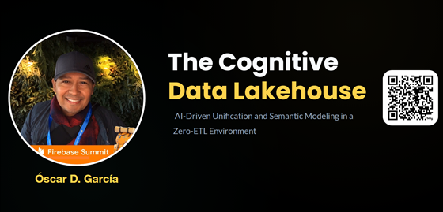

# Overview

In the modern data landscape, the wall between "where data lives" and "how we get insights" is crumbling. This session focuses on the Cognitive Data Lakehouse. A paradigm shift that allows developers to treat a fragmented data lake as a unified, high-performance warehouse.

We will explore how to move beyond brittle ETL pipelines using Zero-ETL architecture in the cloud. The core of our discussion will center on using integrated AI capabilities and semantic modeling to solve the "Metadata Mess" inherent in global manufacturing feeds without moving a single byte of data. From raw telemetry in object storage to semantic intelligence via large language models, we’ll show you the real-world application of AI in modern data engineering.



- Follow this GitHub repo during the presentation: (Give it a star)

> 👉 https://github.com/ozkary/data-engineering-mta-turnstile

- Read more information on my blog at:  

> 👉 https://www.ozkary.com/2023/03/data-engineering-process-fundamentals.html

## YouTube Video

<iframe width="560" height="315" src="https://www.youtube.com/embed/E87qPNObF7g?si=f6ii8FOVH8sPI0Dv" title="The Cognitive Data Lakehouse: AI-Driven Unification and Semantic Modeling in a Zero-ETL Environment" frameborder="0" allow="accelerometer; autoplay; clipboard-write; encrypted-media; gyroscope; picture-in-picture; web-share" referrerpolicy="strict-origin-when-cross-origin" allowfullscreen></iframe>

### Video Agenda

**Phase 1: Foundations & The Zero-ETL Strategy**

We kick off with the infrastructure layer. We'll discuss the design of cross-region telemetry tables and how modern cloud engines allow us to query raw files in object storage with the performance of a native table. We’ll establish why "0x data movement" is the goal for modern scalability.

**Phase 2: Confronting the Metadata Mess**

Schema drift and inconsistent naming across global regions are the enemies of unified analytics. We will look at why traditional manual mapping fails and how we can use AI inference to bridge these gaps and standardize naming conventions automatically.

**Phase 3: AI-Driven Unification & Semantic Modeling**

The "Cognitive" part of the Lakehouse. We’ll dive into the technical implementation of registering AI models directly within your data warehouse environment. You'll see how to create an abstraction layer that uses AI to normalize data on the fly, creating a robust semantic model.

**Phase 4: Scaling to a Global Feed**

Finally, we’ll demonstrate the DevOps workflow for integrating a new international factory feed into a global telemetry view. We'll show how to maintain a "Single Source of Intelligence" that BI tools and analysts can consume without needing to know the complexities of the underlying lake.

**💡 Why Attend?**

- Master Modern Architecture: Learn the "Abstraction Layer" design pattern that is replacing traditional, slow ETL/ELT processes.
- Hands-on AI for Data Ops: See exactly how to use AI and semantic modeling within SQL-based workflows to automate data cleaning and schema mapping.
- Scale Without Pain: Discover how to manage global data sources (multi-region, multi-format) through a single governing layer.
- Developer Networking: Connect with other data architects, engineering leaders, and professionals solving similar scale and complexity challenges.

**Target Audience:** Data Engineers, Analytics Architects, Cloud Developers, and anyone interested in the intersection of Big Data and Generative AI.

## Presentation
### Phase 1: The Zero-ETL Strategy
#### INFRASTRUCTURE: DATA STAYS LOCAL

**Architecting for Scale**

- Storage Decoupling: Raw files remain in the Data Lake, eliminating replication overhead.
- Virtual Access: Data Warehouse external tables allow immediate querying of CSV, Parquet, and JSON.
- Minimal Latency: No waiting for ingest pipelines; analysis starts upon file arrival.


#### UNMATCHED STORAGE EFFICIENCY

**Zero Data Replication**

- Traditional ETL requires moving data across multiple tiers. Our architecture ensures a single source of truth with zero data movement between GCS and BigQuery compute.
- This is similar to the Bronze Zone in a Medallion Architecture.


### Phase 2: The Metadata Mess
#### CHALLENGES OF UNIFICATION

**Schema Friction**
- Feeds arrive with inconsistent headers (e.g., 'Device Number' vs 'deviceNo'). Manual aliasing is fragile and slow.

**Entity Drift**
- Names and IDs vary across systems, preventing standard joins from matching records effectively.

**Type Mismatches**
- Varying data types for the same concept (Integer vs String) crash standard SQL aggregation views.

### Phase 3: The AI Solution
#### BIGQUERY STUDIO: THE AI INTERFACE

**Remote AI Registration**
-  Register Gemini Pro directly inside BigQuery to enable cognitive functions within your SQL workspace.

```sql
CREATE MODEL `gemini_remote`
REMOTE WITH CONNECTION `bq_connection`
OPTIONS(endpoint = 'gemini-1.5-pro');

```

**Automated Inference**
- AI "reads" information schemas to infer mapping logic, moving you from Code Author to Logic Approver.

```sql
SELECT ml_generate_text_result
FROM ML.GENERATE_TEXT(
  MODEL `gemini_remote`,
  (SELECT "Compare Source A and B schemas. Write a SQL view to unify them." AS prompt)
);

```
#### AI-ASSISTED SCHEMA DISCOVERY
**Prompting for Base Tables**
- Using AI to generate the DDL for external tables by pointing to compressed feeds in the lake (USA & MEX factories).

```sql
SELECT ml_generate_text_result
FROM ML.GENERATE_TEXT(
  MODEL `gemini_remote`,
  (SELECT "Create External Tables as smart_factory.us_telemetry with path 'gs://factory-dl/us/dev-540/telemetry-*.csv.gz' '. Include option CSV, GZIP compression and skip 1 row. Infer and add the schema using lower case" AS prompt));

SELECT ml_generate_text_result
FROM ML.GENERATE_TEXT(
  MODEL `gemini_remote`,
  (SELECT "Create External Tables as smart_factory.mx_telemetry with path 'gs://factory-dl/mx/dev-940/telemetry-*.csv.gz' '. Include option CSV, GZIP compression and skip 1 row. Use schema device_number STRING, bay_id INT64, factory STRING, created STRING" AS prompt));

```

**Generated BigLake DDL**
```sql
-- USA Factory Feed
CREATE OR REPLACE EXTERNAL TABLE `smart_factory.us_telemetry` (
  device_number STRING,
  bay_id INT64,
  factory STRING,
  created STRING
)
OPTIONS (
  format = 'CSV',
  uris = ['gs://factory-dl/us/dev-540/telemetry*.csv.gz'],
  skip_leading_rows = 1,
  compression = 'GZIP'
);

-- MEX Factory Feed
CREATE OR REPLACE EXTERNAL TABLE `smart_factory.mx_telemetry` (
  device_number STRING,
  bay_id INT64,
  factory STRING,
  created STRING
)
OPTIONS (
  format = 'CSV',
  uris = ['gs://factory-dl/mx/dev-940/telemetry*.csv.gz'],
  skip_leading_rows = 1,
  compression = 'GZIP'
);


```

#### AI-ABSTRACTION: THE VIEW LAYER
**Generating the Interface**
- AI creates a clean abstraction view for each external table, decoupling raw storage from the analytics model.
```sql
-- AI Instruction
"Create a view named 
smart_factory.vw_us_telemetry 
selecting all columns from the
usa_telemetry table. Safe cast the created column as datetime."
```

**Abstraction Layer DDL**
```sql
-- Semantic Abstraction Layer
CREATE OR REPLACE VIEW `smart_factory.vw_us_telemetry` AS
SELECT 
  device_number,
  bay_id,
  factory,
  SAFE_CAST(created as DATETIME) AS created
FROM `smart_factory.us_telemetry`;

```

#### COGNITIVE UNIFICATION

**The Multi-Region Model**

- The unified view now consumes from the abstraction layer, ensuring that changes to raw storage don't break the views down stream. 

```sql
-- AI Instruction
"Create a view with name
smart_factory.vw_telemetry that creates a union of all the fields from the views vw_[region]_telemetry. The regions include us and mx. List out all the field names. Never use * for field names"

```

**Unified Global View**

```sql
-- Semantic Abstraction Layer
CREATE OR REPLACE VIEW `smart_factory.vw_telemetry` AS
SELECT 
  device_number,
  bay_id,
  factory,
  created
FROM `smart_factory.vw_us_telemetry`
UNION ALL
SELECT 
  device_number,
  bay_id,
  factory,
  created
FROM `smart_factory.vw_mx_telemetry`

```

#### SCALING TO CHINA FACTORY

**Evolving the Model**

- Adding the new China feed by generating the External Table definition via AI. 
  
```sql
CREATE OR REPLACE EXTERNAL TABLE `smart_factory.cn_telemetry` (
  device_number STRING,
  bay_id INT64,
  factory STRING,
  created STRING
)
OPTIONS (
  format = 'CSV',
  uris = ['gs://factory-dl/cn/dev-900/telemetry*.csv.gz'],
  skip_leading_rows = 1,
  compression = 'GZIP'

```

**Human-in-the-Loop DevOps**
- Use AI to update the unified view with the new data feed.  Review and apply the changes by the DevOps team, as changes to a production view require approval.


#### ADVANTAGE COMPARISON MATRIX

| Metric | Manual Data Engineering | AI-Augmented Zero-ETL |
| :--- | :--- | :--- |
| Unification Speed | Days/Weeks per Source | Minutes via Generative AI |
| Schema Drift | Manual Script Rewrites | Adaptive AI View Discovery |
| Infrastructure Cost | High (Data Redundancy) | Minimal (In-place on GCS) |


**Strategic Intelligence ROI:**

> ROI(ai) = Insights Velocity / (Movement Cost + Labor Hours)

#### FINAL THOUGHTS: STRATEGIC SUMMARY

**Legacy Challenges**

- Brittle ETL: Manual pipelines break with every schema change.
- Cost Inefficiency: Redundant storage for processed data.
- Semantic Silos: Hard-coded aliases for disparate naming conventions.
- Slow Time-to-Insight: Weeks spent on manual schema alignment.

**AI-Assisted Solutions**

- Zero-ETL Arch: Cost-effective storage with Data Lake virtual access.
- Automated Inference: Vertex AI handles the "heavy lifting" of mapping.
- Adaptive DevOps: Scalable model evolution (USA → MEX → China).
- Unified Intelligence: One virtual source of truth for global analytics. 

> Moving from Data Reporting to Active Semantic Intelligence.


### We've covered a lot today, but this is just the beginning! 

If you're interested in learning more about building cloud data pipelines, I encourage you to check out my book, 'Data Engineering Process Fundamentals,' part of the Data Engineering Process Fundamentals series. It provides in-depth explanations, code samples, and practical exercises to help in your learning.

 [](https://a.co/d/gyoRfbs)  [](https://a.co/d/gyoRfbs)
 

**Upcoming Talks:**

Join us for subsequent sessions in our Data Engineering Process Fundamentals series, where we will delve deeper into specific facets of data engineering, exploring topics such as data modeling, pipelines, and best practices in data governance.

This presentation is based on the book, [Data Engineering Process Fundamentals](https://www.amazon.com/Data-Engineering-Process-Fundamentals-Hands/dp/B0CV7TPSNB), which provides a more comprehensive guide to the topics we'll cover. You can find all the sample code and datasets used in this presentation on our popular GitHub repository [Introduction to Data Engineering Process Fundamentals](https://github.com/ozkary/data-engineering-mta-turnstile).


Thanks for reading! 😊 If you enjoyed this post and would like to stay updated with our latest content, don’t forget to follow us. Join our community and be the first to know about new articles, exclusive insights, and more!

- [Google Developer Group](https://gdg.community.dev/gdg-broward-county-fl/)
- [GitHub](https://github.com/ozkary)
- [Twitter](https://x.com/ozkary)
- [YouTube](https://www.youtube.com/@ozkary)
- [BlueSky](https://bsky.app/profile/ozkary.bsky.social)

👍 Originally published by [ozkary.com](https://www.ozkary.com)