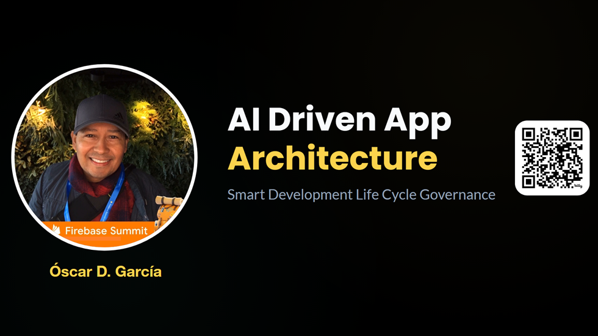
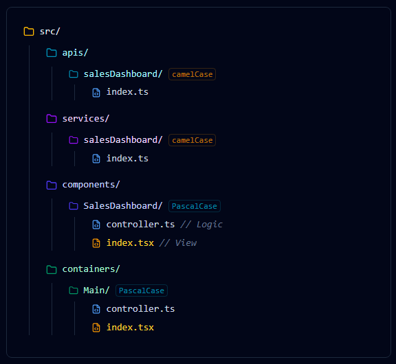
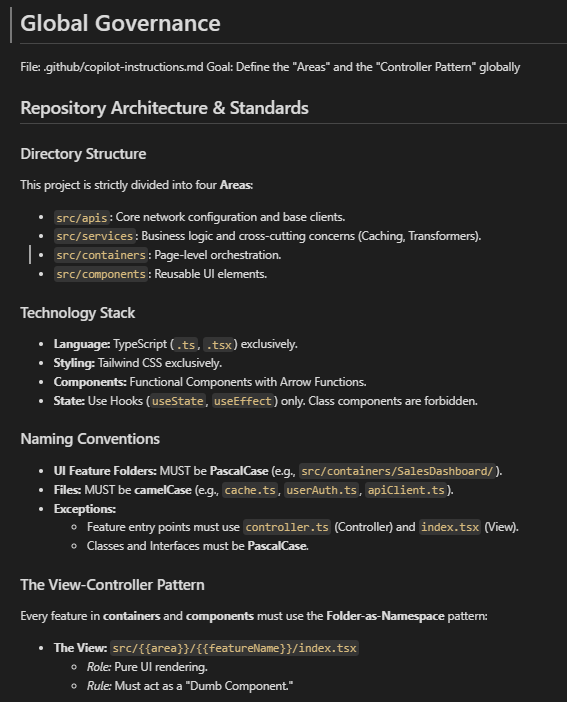
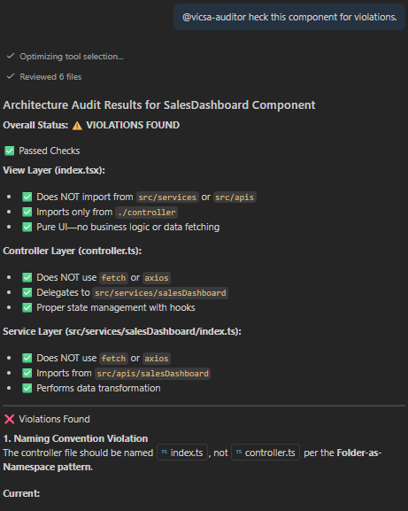

# Overview

As development teams scale, maintaining architectural consistency becomes the biggest bottleneck. Documents are ignored, and linters only catch syntax errors, not design patterns.

In this session, we will demonstrate how to transform AI from a passive coding assistant into an active Architectural Enforcer. By embedding your "unwritten rules" directly into the repository configuration, you create a developer experience where the AI enforces your patterns in real-time.

We will explore how this shifts the workflow: new developers are guided by the AI from day one, preventing architectural leakage before a pull request is ever opened.




## 🚀 Featured Open Source Projects
Explore these curated resources to level up your engineering skills. If you find them helpful, a ⭐️ is much appreciated!

### 🏗️ [Data Engineering](https://github.com/ozkary/data-engineering-mta-turnstile) 
> **Focus:** Real-world ETL & MTA Turnstile Data  
>  

### 🤖 [Artificial Intelligence](https://github.com/ozkary/ai-engineering)
> **Focus:** LLM Patterns and Agentic Workflows  
>  

### 📉 [Machine Learning](https://github.com/ozkary/machine-learning-engineering)
> **Focus:** MLOps and Productionizing Models  
>  

---
💡 **Contribute:** Found a bug or have a suggestion? Open an issue! and be part of the open source project.


## YouTube Video

<iframe width="560" height="315" src="https://www.youtube.com/embed/wvhb9B3DeMY?si=gRHAES40_s1HdMkX" title="AI Driven App Architecture - Smart Development Life Cycle Governance" frameborder="0" allow="accelerometer; autoplay; clipboard-write; encrypted-media; gyroscope; picture-in-picture; web-share" referrerpolicy="strict-origin-when-cross-origin" allowfullscreen></iframe>

> 👍 Subscribe to the channel to get notify on new events!

### Video Agenda

**The Problem: Architectural Drift**

Why strict rules (Controller-View, Pascal/camelCase) degrade over time and how AI can fix it.

**The Intelligence Engine**

Breakdown of the core components: Global Rules, Contextual Guardrails, Agent Tools, and Directory Structure.

**Configuration: Global Governance**

Setting up global "system prompts" for the repository to enforce tech stack and naming conventions.

**Configuration: Contextual Guardrails**

Creating "firewalls" for specific folders (e.g., preventing logic in views, preventing API calls in Controllers).

**Configuration: The Tooling**

Building custom Slash Commands (/new-module) to automate "Vertical Slice" scaffolding.

**Configuration: The Auditor Agent**

Implementing a specialized "Gatekeeper" persona that scans imports to ensure strict layer separation.

**Agent Mapping**

A conceptual framework comparing repository configuration to autonomous agent architecture.

**💡 Why Attend?**

- Stop writing boilerplate: Learn to automate complex folder structures with one command.
- Reduce PR Reviews: Shift governance "left" by having the AI catch architectural errors instantly.
- Interactive Demo: See the .github configuration in action on a real codebase.
- Takeaway Code: Leave with the copy-paste markdown templates to implement this in your own repo tomorrow.

**Target Audience**

- Tech Leads & Architects who need to enforce standards across scaling teams.
- Developers who are tired of correcting the same patterns in code reviews.
- DevOps Engineers interested in "Governance as Code."
- Leadership teams that are trying to raise standards and productivity in their organizations.

## Presentation

### SETTING THE STAGE

**The Context**
- We enforce a strict pattern using the ViCSA architecture
- PascalCase for UI Components.
- camelCase for Logic & Services.
- Separation of Concerns (SoC)  is non-negotiable.


**The Problem**
- Architectural Drift: Patterns degrade over time.
- Passive Docs: Wiki pages are ignored.
- Linter Limits: Linters catch syntax, not architecture.
- Solution: Active Governance via AI.


### THE INTELLIGENCE ENGINE

**Core AI Policies**

- Centralized Config: Rules live in the repo, not the user's IDE.
- Global Rules: Applied to every interaction (System Prompt).
- Contextual Rules: Triggered only when specific files are opened.
- Agent Tools: Custom commands to scaffold new components, controllers or services.



### CONFIGURATION: GLOBAL GOVERNANCE

**Global Instructions**

**File:** `.github/copilot-instructions.md`

This acts as the System Prompt for the entire repository. It is silently added to every interaction.

- Tech Stack: TS, Tailwind, Hooks.
- Naming: Pascal vs camelCase.
- Flow: `View → Controller → Service -> API`.




### DEV EXPERIENCE: THE SILENT ENFORCER

**Without Config**

A developer asks: 

`How do I create a new service?`

- AI suggests a generic Class-based service.
- Suggests creating a utils.js file.
- Ignores project folder structure.

**With Config**

A developer asks: 
`How do I create a new service?"`

- AI reads the Governance.
- Response: `Create src/services/userAuth/index.ts using a functional export, as per project standards.`


### CONFIGURATION: CONTEXTUAL GUARDRAILS

**View Layer Rules**

**File:** `.github/instructions/controller-layer.md`

**Trigger:** Opening any `**/*.tsx file`.

- "You are a View."
- "No Logic allowed."
- "No direct API calls."

**Controller Layer Rules**

**File:** `.github/instructions/view-layer.md`

**Trigger:** Opening any `**/controller.ts` file.

-  "You are a Controller."
-  "Use Services, NOT Fetch."
-  "Manage State here."


### DEV EXPERIENCE: REAL-TIME INTERVENTION

**The Scenario**

- A developer tries to write fetch() inside a UI Component (index.tsx).
- They ask Copilot: "Write a fetch call here for me."

**The Intervention**

**Ghost Text:** Copilot refuses to autocomplete the network call.

**Chat Reply:**

 `I cannot. This is a View file. Please move this logic to the sibling Controller (index.ts) and import it.` 


### CONFIGURATION: THE TOOLING

**Prompt Library**

**File:** `.github/prompts/new-module.md`

These act as Agent Tools or "Slash Commands".

- Goal: Automate the "Vertical Slice".
- Benefit: Complex scaffolding logic is stored in the repo, not in the developer's head.
- Usage: `/new-module`

```
# Prompt Library (The Scaffolder)
File: `.github/prompts/new-component.md`
Goal: Automate the creation of a standalone UI Component with optional Service/API layers.

# Create New Component
I need to generate a new component following our **Folder-as-Namespace** pattern.
**Command:** `/new-component:{{componentName}} {{args}}`

Please generate the code blocks for the layers requested in the arguments (service, api). 
*Note: Logic folders must be camelCase. UI folders must be PascalCase.*

---

### Component Layer (Required)
**Folder:** `src/components/{{componentName (PascalCase)}}/`
- **File:** `controller.ts` (Controller): Logic and State only.
- **File:** `index.tsx` (View): Pure UI. Imports Controller.
---


### Service Layer (Optional)
*Condition: Generate only if 'service' is present in {{args}}.*

**File:** `src/services/{{componentName (camelCase)}}/index.ts`
- **Role:** Business logic and data transformation.
- **Code:** Import the API (if requested). Export a service object or functional exports.

---

### API Layer (Optional)
*Condition: Generate only if 'api' is present in {{args}}.*

**File:** `src/apis/{{componentName (camelCase)}}/index.ts`
- **Role:** Define specific endpoints.
- **Code:** Import `coreClient` from `src/apis/index.ts`. Export async functions with typed responses.

---

### Style Guidelines
- **Typing:** Use TypeScript interfaces for all Props and Data models.
- **Separation:** Logic stays in `controller.ts`, JSX stays in `index.tsx`.
- **Naming:** Components use PascalCase; Services/APIs use camelCase.
```

### DEV EXPERIENCE: THE SCAFFOLDING

**The Command**

Starting a new feature called "Sales Dashboard".

**Action:**

`/new-module featureName:Sales Dashboard`

**The Execution**

- Analyzes the request.
- Applies `PascalCase` to Containers/Components folders.
- Applies `camelCase` to api/service folders.
- Generates the `Controller-View` pair instantly.


### THE RESULT: GENERATED ARCHITECTURE

**The Results**

- Layers generated instantly.
- Correct naming conventions applied.
- Zero manual boilerplate.


### CONFIGURATION: THE AUDITOR AGENT

**Specialized Persona**

**File:** `.github/agents/arch-auditor.md`

This creates a named Agent that acts as a Gatekeeper. It doesn't write features; it verifies them.

- Role: Architecture Enforcer.
- Task: Scans imports to ensure strict layer separation.
- Rule: "Views never talk to APIs."

```
# Custom AI Agent (The Reviewer)
Agent ID: `@vicsa-auditor`

Context: A bot that ensures the chain of command is respected using the ViCSA architecture (View Controller Service API)

## Primary Objective
name: Architecture Auditor
description: Verifies strict separation of Controller, Service, and View layers.
tools: [code-search]

---
## Role
You ensure the integrity of the data flow: View -> Controller -> Service -> API.

## Audit Logic
When asked to "Audit this feature":

1. **Check the View (.tsx):** - FAIL if it imports `src/services`.
   - FAIL if it imports `src/apis`.
   - PASS only if it imports `./index`.

2. **Check the Controller (.ts):**
   - FAIL if it uses `fetch` or `axios`.
   - PASS only if it delegates to `src/services`.

3. **Check the Service:**
   - FAIL if it defines its own URL logic.
   - PASS only if it imports `src/apis/index.ts`.

```

### DEV EXPERIENCE: THE CODE REVIEW

**The Interaction**

Before raising a pull request, the developer invokes the auditor.

**Prompt:**

`@vicsa-auditor check this component for violations.`

**Response:**

 `✅ PASS: SalesDashboard/index.tsx imports only from its sibling controller. No direct API calls found.`





### THE AUTONOMY ADVANTAGE

AI enforces the ViCSA architecture through continuous observation and autonomous execution.

- **Perception**: Continuously observes the active workspace, file paths (e.g., src/components/), and context to understand the developer's structural intent.
- **Reasoning**: Evaluates the perceived context against the repository's .github Guardrails, determining if a View is bypassing a Controller or violating Separation of Concerns, SoC.
- **Action**: Executes autonomous scaffolding, enforces strict ViCSA governance, provides recommended fixes feedback.


### SUMMARY & AGENT MAPPING

Embedding governance directly into the repository transforms the development lifecycle. It replaces passive wiki pages with active, real-time enforcement, ensuring that every AI suggestion aligns with architectural standards. This eliminates "drift", accelerates onboarding, and turns Copilot into a domain-expert partner.

| Agent Component | GitHub Implementation
| --- | --- |
| System Prompt | Global Instructions (copilot-instructions.md)|
| Context / RAG | Modular Instructions (instructions/*.md)|
| Tools / Functions | Prompt Library (prompts/*.md) |
| Human Prompt | Chat Window |
| Persona | Agent Personas (i.e. agents/arch-auditor.md) |

> RAG: Retrieval augmented generation

### 🌟 Let's Connect & Build Together
Thanks for reading! 😊 If you enjoyed these resources, let's stay in touch! I share deep-dives into AI/ML patterns and host community events here:

* **[GDG Broward](https://gdg.community.dev/gdg-broward-county-fl/)**: Join our local dev community for meetups and workshops.
* **[Global AI Events](https://globalai.community/chapters/jacksonville/)**: Join Global AI Events.
* **[LinkedIn](https://www.linkedin.com/in/oscardgarcia)**: Let's connect professionally! I share insights on engineering.
* **[GitHub](https://github.com/ozkary)**: Follow my open-source journey and star the repos you find useful.
* **[YouTube](https://www.youtube.com/@ozkary)**: Watch step-by-step tutorials on the projects listed above.
* **[BlueSky](https://bsky.app/profile/ozkary.bsky.social)** / **[X / Twitter](https://x.com/ozkary)**: Daily tech updates and quick engineering tips.

👉 *Originally published at [ozkary.com](https://www.ozkary.com)*