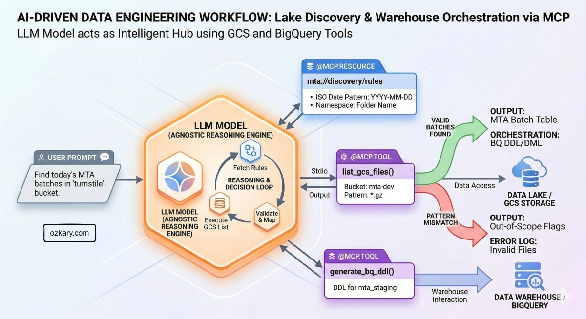

# Overview

This session explores the strategy of leveraging AI to move beyond manual implementation and into the next level of data engineering. We dive into a process that positions the AI not as a syntax generator, but as a cognitive partner in the engineering lifecycle. We will examine the architectural shift required to transform raw data lake assets into high-performance, orchestrated systems, focusing on the strategic collaboration between human intent and agentic design.

## 🚀 Featured Open Source Projects
Explore these curated resources to level up your engineering skills. If you find them helpful, a ⭐️ is much appreciated!

### 🏗️ [Data Engineering](https://github.com/ozkary/data-engineering-mta-turnstile) 
> **Focus:** Real-world ETL & MTA Turnstile Data  
>  

### 🤖 [Artificial Intelligence](https://github.com/ozkary/ai-engineering)
> **Focus:** LLM Patterns and Agentic Workflows  
>  

### 📉 [Machine Learning](https://github.com/ozkary/machine-learning-engineering)
> **Focus:** MLOps and Productionizing Models  
>  

---
💡 **Contribute:** Found a bug or have a suggestion? Open an issue! and be part of the open source project.

## 🔗 Related Repository: AI Agents for Data Engineering

Explore the full implementation of the AI Agents used in this workflow:
**https://github.com/ozkary/data-engineering-mta-turnstile/tree/main/ai-agents**

## YouTube Video

<iframe width="560" height="315" src="https://www.youtube.com/embed/opelf_XJ8Js?si=U7xVs3nqJAVsWkkV" title="Architecting an Agentic Data Pipeline - From Data Lake Discovery to Managed Orchestration" frameborder="0" allow="accelerometer; autoplay; clipboard-write; encrypted-media; gyroscope; picture-in-picture; web-share" referrerpolicy="strict-origin-when-cross-origin" allowfullscreen></iframe>

> 👍 Subscribe to the channel to get notify on new events!

### 📅 Agenda

- **Data Lake Discovery:** The strategy of deploying discovery agents to autonomously identify patterns and define the foundation of the data grain.
- **Governance & Requirements:** Establishing the strategic guardrails and requirements that empower an "Architect" agent to maintain system consistency.
- **Logical Design for the Staging Area:** A process dive into using AI to propose and build a logical abstraction layer, separating raw sources from core business logic.
- **Designing and Implementing the Physical Model:** How agents navigate the transition to physical storage, building Dimension and Fact tables while maintaining referential integrity.
- **Incremental Update Strategy:** Developing a sustainable approach to support continuous data feeds from the data lake using idempotent, self-healing processes.
- **Pipeline Design and Orchestration:** The coordination of complex tasks to manage the relationship between dimensions and facts, ensuring strict lineage and integrated observability.

### ⭐ Why Attend?

- **Elevate Your Role:** Learn how to shift your focus from writing repetitive code to defining high-level architectural intent and performing strategic design reviews.
- **Master Systemic Reasoning:** Understand how to leverage AI to solve complex engineering challenges like referential integrity and dependency management at scale.
- **Build for Operations:** Move toward a model where system health and observability are built-in byproducts of the design process, not afterthoughts.

### 👥 Who Is This For?

- **Data Engineers & Architects:** Looking to evolve their workflow from manual scripting to high-level systemic design.
- **Engineering Leaders:** Interested in the ROI and reliability of integrating autonomous agents into the development lifecycle.
- **AI Enthusiasts:** Wanting to see a practical, "beyond-the-chatbot" application of agentic reasoning in a production environment.
- **Technical Decision Makers:** Seeking a strategy for maintaining governance and referential integrity in an AI-augmented organization.

## Presentation

### Automating the Data Engineering Lifecycle

We are running a modern Data Engineering process by combining the reasoning power of AI Agents with the standardized connectivity of MCP tools.

- **Goal:** Move from manual scripting to an intelligent, agent-led pipeline.
- **Outcome:** A system that can discover, map, and orchestrate data across the cloud.

### How do we leverage these tools?

The "Brains" and the "Hands" of the process.

- **AI Agents:** Use Large Language Models (LLMs) to understand complex system instructions and specific user prompts. They provide the "logic" behind the process.
- **MCP Tools:** Provide the "connectivity." They expose metadata to the agent, which allows the AI to understand exactly what actions are available and how to execute them correctly.

### How does this all work?

The Execution Loop

- **The Model:** The agent calls a managed LLM service in the cloud (Gemini) for high-level reasoning.
- **Discovery:** The agent "sees" the available MCP tools and automatically understands how to use them to interact with GCS or BigQuery.
- **Governance:** System Prompts provide the guardrails, core requirements, and engineering standards the agent must follow.
- **Action:** The User Prompt provides the specific task (e.g., "Find today's files"). The agent then executes the work.

### Intelligent Orchestration

We build an AI-powered Data Engineering process that successfully handles:

- **Data Lake Discovery:** Automatically identifying patterns and namespaces in GCS.
- **Data Warehouse Orchestration:** Mapping those discoveries directly into BigQuery and creating the data models for analysis.

### AI-Driven Data Engineering
- Agents can connect to a data lake and run discovery on the file
- Agents can use the result of the discovery to build external tables, views, tables and even stored procedures for the incremental update process

## 🌟 Let's Connect & Build Together
Thanks for reading! 😊 If you enjoyed these resources, let's stay in touch! I share deep-dives into AI/ML patterns and host community events here:

* **[GDG Broward](https://gdg.community.dev/gdg-broward-county-fl/)**: Join our local dev community for meetups and workshops.
* **[Global AI Events](https://globalai.community/chapters/jacksonville/)**: Join Global AI Events.
* **[LinkedIn](https://www.linkedin.com/in/oscardgarcia)**: Let's connect professionally! I share insights on engineering.
* **[GitHub](https://github.com/ozkary)**: Follow my open-source journey and star the repos you find useful.
* **[YouTube](https://www.youtube.com/@ozkary)**: Watch step-by-step tutorials on the projects listed above.
* **[BlueSky](https://bsky.app/profile/ozkary.bsky.social)** / **[X / Twitter](https://x.com/ozkary)**: Daily tech updates and quick engineering tips.

👉 *Originally published at [ozkary.com](https://www.ozkary.com)*