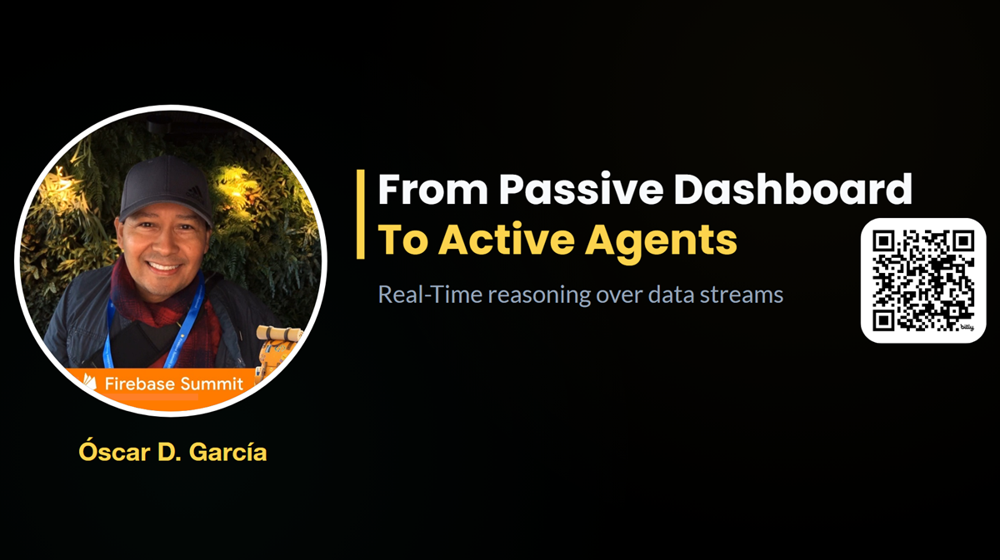

# Overview

Dashboards are effective at showing us that something is breaking, but they usually rely on a human to watch the screen and decide what to do next. In this session, we will look at how to take a standard real-time telemetry dashboard and make it autonomous.

We will walk through a practical implementation using an Angular frontend and a Node.js server. We’ll look at how the system leverages a relational database for persistence and a Redis in-memory cache to handle high-frequency and short volume data feeds. From there, we incorporate an AI Agent that follows three core principles: perceiving the data stream through a sliding window, reasoning against statistical control limits, and acting by sending real-time analysis back to the user. This session is focused on bridging the gap between raw data streams and automated decision-making.

## 🚀 Featured Open Source Projects
Explore these curated resources to level up your engineering skills. If you find them helpful, a ⭐️ is much appreciated!

### 🏗️ [Data Engineering](https://github.com/ozkary/data-engineering-mta-turnstile) 
> **Focus:** Real-world ETL & MTA Turnstile Data  
>  

### 🤖 [Artificial Intelligence](https://github.com/ozkary/ai-engineering)
> **Focus:** LLM Patterns and Agentic Workflows  
>  

### 📉 [Machine Learning](https://github.com/ozkary/machine-learning-engineering)
> **Focus:** MLOps and Productionizing Models  
>  

---
💡 **Contribute:** Found a bug or have a suggestion? Open an issue! and be part of the open source project.

## 🔗 Review the repo used for this presentation: 

### Tech Stack

## YouTube Video

<iframe width="560" height="315" src="https://www.youtube.com/embed/oJC8XhxvdX4?si=Wh2MTD2gHWAnjqoL" title="From Passive Dashboards to Active Agents: Real-Time Reasoning over Data Streams" frameborder="0" allow="accelerometer; autoplay; clipboard-write; encrypted-media; gyroscope; picture-in-picture; web-share" referrerpolicy="strict-origin-when-cross-origin" allowfullscreen></iframe>

> 👍 Subscribe to the channel to get notify on new events!

### 📅 Agenda

- The Real-Time Feed: Monitoring Device Telemetry

An introduction to the live system where devices emit high-frequency data for quality monitoring and $3\sigma$ control limit oversight.

- System Architecture: From Ingestion to Persistence

A deep dive into the technical stack, mapping out the data journey through Node.js, Redis in-memory caching, and relational database storage.

- The Human in the Loop: Cognitive Limitations

Exploring the "Passive Monitoring" challenge—why relying on human interpretation of real-time alerts creates a bottleneck in process control.

- The AI Agent: Applying the 3 Principles

Implementing the "Active Observer" using the three core pillars of AI Agents: Perception (the window), Reasoning (the limits), and Action (the analysis).

- The Intelligent Journey: Summary & Advantages

Recapping our transition from a passive monitor to a smart system and discussing the advantages of automated, agentic data interpretation.

### ⭐ Why Attend?

The industry is moving beyond simple "Chat" interfaces and into the realm of Agentic Observability. By attending this session, you will see a practical blueprint for integrating intelligence directly into a high-velocity data stack.

### 👥 Who Is This For?

- Junior Developers: Learn the fundamentals of real-time streaming, how to manage state in Node.js, and how to interact with AI APIs in a professional environment.
- Senior Engineers & Architects: See a robust architectural pattern for integrating Redis, relational databases, and AI Agents while maintaining system stability and security.
- Decision Makers (VPs/Directors): Understand the ROI of "Active Monitoring"—how AI Agents can act as a force multiplier for your engineering teams by automating the first layer of data interpretation.
- Quality & Reliability Engineers: Explore how to digitize the control limit logic you already use into an autonomous 24/7 "Digital Twin."

## Presentation

### The Real-Time Feed Challenge
*High-velocity telemetry defines the "digital pulse" of modern industrial systems.*

* **Telemetry Streams:** Industrial devices emit continuous telemetry (Temperature, Sound, Humidity). These data points require sub-second processing to maintain operational stability.
* **Control Limits:** Quality engineers rely on statistical boundaries to define "normal" operation. Detecting drift is the critical first step in identifying risks before failure occurs.

---

### Scalable System Architecture
*A multi-layered stack designed to bridge the gap between ingestion and intelligence.*

* **Redis Cache:** Manages the "Live State" or Digital Twin. Provides sub-millisecond access for immediate AI perception.
* **Relational Data Warehouse:** Powers the historical persistence layer for long-term trend analysis and compliance auditing.
* **Node Controller:** The orchestration hub. Manages telemetry ingestion, state updates, and the execution of the agentic reasoning loop.

---

### The "Human in the Loop" Trap
*Passive observability relies on human interpretation, creating a critical bottleneck.*

* **Cognitive Overload:** Humans struggle to interpret hundreds of concurrent streams, missing subtle patterns.
* **Alert Fatigue:** Constant threshold violations desensitize responders, causing critical $3\sigma$ violations to be ignored.
* **Response Latency:** The time required for a human to interpret a dashboard often exceeds the window for effective corrective action.

---

### The 3 Principles of AI Agents
*Automating observability requires a system that can perceive, reason, and act independently.*

1.  **Perception:** Maintaining a stateful sliding window of the Digital Twin to understand temporal context.
2.  **Reasoning:** Evaluating the stream against statistical $3\sigma$ limits and physical engineering constraints.
3.  **Action:** Closing the loop by emitting real-time narratives or triggering autonomous safety protocols.

---

### The Intelligent Journey: Comparison

| Feature | Passive Monitor | Smart Monitor |
| :--- | :--- | :--- |
| **Interpretation** | Requires human "eyes-on-glass" | Autonomous, semantic interpretation |
| **Response** | Reactive to simple thresholds | Proactive identification of drift |
| **Reliability** | High risk of missed signals | Intelligent filtering of noise |
| **Data Context** | Disconnected historical vs. live | Stateful perception of "Live Device" |
| **Intervention** | Significant human latency | Automated safety & audit narratives |

---

### Learn More & Connect
* **Book:** *Data Engineering Process Fundamentals*
* **GitHub:** [Realtime-Apps-with-Nodejs-Angular-Socketio-Redis](https://github.com/ozkary/Realtime-Apps-with-Nodejs-Angular-Socketio-Redis)
* **Registration:** [GDG Community Event Link](https://gdg.community.dev/events/details/google-gdg-broward-county-fl-presents-from-passive-dashboards-to-active-agents-real-time-reasoning-over-data-streams/)

**Follow us on OZKARY.COM**

## 🌟 Let's Connect & Build Together
Thanks for reading! 😊 If you enjoyed these resources, let's stay in touch! I share deep-dives into AI/ML patterns and host community events here:

* **[GDG Broward](https://gdg.community.dev/gdg-broward-county-fl/)**: Join our local dev community for meetups and workshops.
* **[Global AI Events](https://globalai.community/chapters/jacksonville/)**: Join Global AI Events.
* **[LinkedIn](https://www.linkedin.com/in/oscardgarcia)**: Let's connect professionally! I share insights on engineering.
* **[GitHub](https://github.com/ozkary)**: Follow my open-source journey and star the repos you find useful.
* **[YouTube](https://www.youtube.com/@ozkary)**: Watch step-by-step tutorials on the projects listed above.
* **[BlueSky](https://bsky.app/profile/ozkary.bsky.social)** / **[X / Twitter](https://x.com/ozkary)**: Daily tech updates and quick engineering tips.

👉 *Originally published at [ozkary.com](https://www.ozkary.com)*

