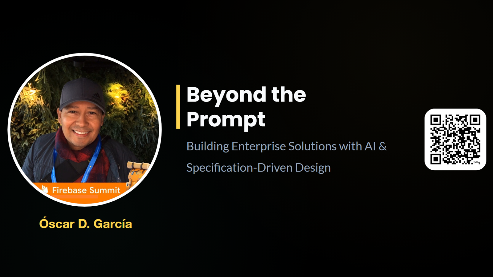

# Overview

Relying on raw prompt engineering or conversational text interfaces alone will not deliver a production-ready, enterprise-grade AI solution. To build resilient, secure, and compliant software in the age of AI assistants, developers must move past chaotic "vibe coding" and adopt a structured, process-oriented architectural workflow.

This session delivers a blueprint for Specification-Driven Design (SDD), demonstrating how disciplined discovery and modular markdown specifications enable a project assistant to successfully manage and execute multiple phases of the software development lifecycle. By treating AI as an execution engine governed by rigorous technical guardrails, rather than a black-box chatbot, engineers can drastically accelerate velocity while maintaining absolute system integrity. We walk through a real-world case study of a decoupled, zero-trust enterprise quality healthcare risk-assessment engine to show this methodology in action.

## 🚀 Featured Open Source Projects
Explore these curated resources to level up your engineering skills. If you find them helpful, a ⭐️ is much appreciated!

### 🤖 [Artificial Intelligence](https://github.com/ozkary/ai-engineering)
> **Focus:** LLM Patterns and Agentic Workflows  
>  

### 🏗️ [Data Engineering](https://github.com/ozkary/data-engineering-mta-turnstile) 
> **Focus:** Real-world ETL & MTA Turnstile Data  
>  

---
💡 **Contribute:** Found a bug or have a suggestion? Open an issue and be part of the open source project.

## 🔗 Related Repository: AI Engineering
Explore the full implementation of the AI specifications and code used in this workflow:
**https://github.com/ozkary/ai-engineering**

## YouTube Video

<iframe width="560" height="315" src="https://www.youtube.com/embed/Bk9y4nS4RL8" title="Beyond the Prompt: Building Enterprise Solutions with AI & Specification-Driven Design" frameborder="0" allow="accelerometer; autoplay; clipboard-write; encrypted-media; gyroscope; picture-in-picture; web-share" referrerpolicy="strict-origin-when-cross-origin" allowfullscreen></iframe>

> 👍 Subscribe to the channel to get notified on new events!

## 📅 Agenda

- **The Purpose: Understanding the Toolchain & Vibe Coding** – Defining the real-world roles of code assistants (like GitHub Copilot and Google Antigravity) and what "vibe coding" actually means for an enterprise workflow.
- **The Chaos: The Pitfalls of Planless Execution** – The fallout when launching straight into terminal commands without a design baseline: monolithic files, bypassed architectural patterns, and untracked requirements.
- **The Discovery & Specification Process: System Decomposition** – How to properly break down a complex problem before writing code—identifying distinct system areas, modular boundaries, UI/UX input definitions, core system requirements, and downstream DevOps needs.
- **The Blueprint: Establishing Governance & Guardrails** – Putting your specifications and governance rules together into a structured, unified layout that forces the AI assistant to strictly follow your target design patterns.
- **The Iterative SDLC: Continuous Gap Analysis & Adaptive Specifications** – Embracing an Agile approach to handle missing requirements by starting small, continuously feeding refinements to the assistant, and leveraging it to run live gap analyses and solution summaries.

---

## The Purpose: Understanding the Toolchain & Vibe Coding

Modern software development has been dramatically reshaped by AI code assistants like GitHub Copilot and Google Antigravity. As developers, these tools offer immense power, but they require a clear understanding of their role in the developer toolchain. Often, developers fall into the trap of "vibe coding"—sitting down in front of an AI chat interface and typing conversational prompts to generate code on the fly without a predefined plan. 

While vibe coding is fast and can yield functional prototypes in a couple of hours, it lacks the structure needed for enterprise-grade applications. For enterprise software, we must treat AI assistants not as autonomous magic boxes that build everything, but as **peer programmers**. They operate best when provided with clear, contextual instructions, and when their scope is constrained to specific, manageable files or tasks. 

By integrating these tools into Visual Studio Code or as command-line interfaces (like the Antigravity CLI), we can work side-by-side with the AI. However, this interaction must be deliberate. We must set guardrails so the AI does not scan unrelated files, dilute its focus, or make arbitrary architectural decisions on our behalf.

## The Chaos: The Pitfalls of Planless Execution

What happens when we dive straight into terminal commands or prompt-driven code generation without a design baseline? We enter a state of planless execution, or **chaos**.

When you prompt an AI to "build a React application with a product form" without constraints:
1. **Monolithic Files:** The AI tends to generate a single, massive file containing state, logic, rendering, and styles because that is the most direct path to satisfy the prompt.
2. **Bypassed Architecture:** Common enterprise architectural patterns, such as separating components, containers, and services, are completely ignored.
3. **Untracked Requirements & Lost Context:** As the chat history grows, the AI starts losing context. Crucial design constraints, accessibility needs, and security protocols are forgotten, forcing the developer to repeatedly restate them.
4. **Untraceability:** The final codebase becomes difficult to maintain or trace back to original business requirements. There is no documentation or specifications explaining why decisions were made.

To avoid this chaos, we must establish a rigorous design baseline before writing or generating a single line of code.

## AI Storming: The Framework for Structured Discovery

To combat the chaos of planless execution, developers must transition from simple vibe coding to a structured methodology known as **AI Storming**. Similar to traditional brainstorming sessions where developers sketch out designs and architectural workflows, AI Storming leverages the AI assistant as a cognitive partner to explore the domain model, synthesize requirements, and identify hidden edge cases before a single line of application code is written.

By engaging in this process-oriented framework, you use the AI's vast knowledge base to analyze project feasibility, perform system decomposition, and quickly get up to speed on unfamiliar technologies or industry standards. Rather than letting the AI write the application directly from conversational chat, you use the AI to draft the specifications that will ultimately govern the build process.

💡 **Learn More:** To dive deeper into this methodology, read about the [AI Storming Framework](/aistorming-a-process-oriented-framework-for-ai-assisted-discovery-analysis-and-specification/).

## The Discovery & Specification Process: System Decomposition

Enterprise software development begins with **discovery** and **system decomposition**. Instead of executing a "big bang" implementation, we break down a complex problem statement into modular, logical boundaries. 

For example, when building a real-world healthcare risk-assessment engine:
1. **Identify System Areas:** Segment the project into distinct areas such as the database, DevOps pipelines, API endpoints, and the user interface (UI/UX).
2. **Define Requirements & Compliance:** In healthcare, security, accessibility, and zero-PII (Personally Identifiable Information) compliance are paramount. We must explicitly define these constraints up front.
3. **Draft Modular Specifications:** Create dedicated markdown specifications for each area (e.g., UI specs, API specs, security specs, database schema specs). 

By structuring our discovery process and outputting markdown specifications, we create a clear, traceably documented source of truth. This modular approach ensures that both human developers and AI assistants have a clear boundary of work, preventing scope creep and design drift.

## The Blueprint: Establishing Governance & Guardrails

Once the modular specifications are drafted, they are unified into a **Solution Blueprint**. This blueprint serves as the master driver for the AI assistant. 

To enforce guardrails and governance:
1. **Specify Coding Standards:** Define naming conventions (e.g., PascalCase for React components, camelCase for services), CSS libraries (e.g., Tailwind), and state management patterns.
2. **Structure the Project Layout:** Define the exact directory structure (e.g., `/app` for React, `/api` for Python backend, `/assets` for media) so the AI knows where to locate and create files.
3. **Provide Contextual Libraries:** If a library is updated or has specific usage guidelines, write those down or pass the official documentation directly to the AI to prevent it from using outdated code patterns.

By feeding these structured specifications to the AI assistant, we establish governance. The AI is forced to work within our design patterns, ensuring that the generated code is consistent, maintainable, and complies with enterprise standards.

## The Iterative SDLC: Continuous Gap Analysis & Adaptive Specifications

Specification-Driven Design is not a static, "one-and-done" process. It is an **agile, iterative lifecycle**. 

1. **Start with an MVP:** Begin with the minimum viable requirements and a baseline specification.
2. **Execute and Review:** Let the AI generate code based on the specifications. Run the application, review the code structure, and test the features.
3. **Conduct Gap Analysis:** As implementation progresses, you will inevitably identify missing requirements (e.g., "How do we handle user authentication on Cloud Run?" or "How do we implement voice-to-text hotkeys for accessibility?").
4. **Update the Specs, Not Just the Code:** When a gap is found, document the new requirements in the markdown specifications first. Rerun the specs through the AI assistant to let it update the implementation. 
5. **Traceability & Summaries:** Leverage the AI to perform solution summaries and next-step analyses to keep project tracking up-to-date.

This feedback loop ensures absolute traceability. Your documentation and your codebase remain in lockstep, eliminating technical debt and delivering a secure, high-quality, production-ready enterprise solution.

## Conclusion

Can we build enterprise-grade, high-quality solutions using generative AI and "vibe coding"? The short answer is yes—but only if we transition from a chaotic conversational interface to a disciplined, process-oriented workflow. 

The main highlights of this methodology include:
- **Specifications Drive Results:** The quality of the AI's output is directly proportional to the structure of the input. Drafting specifications properly is the most effective way to guide an assistant.
- **Process Over Chat:** Avoid relying on temporary chat windows where context is easily lost. Maintain permanent, adaptive specs in your repository for absolute traceability.
- **AI as a Peer Programmer:** Treat AI tools as assistants that execute tasks within clear, modular guardrails rather than a magic wand that does the planning for you.
- **Continuous Refinement:** Embrace the agile loop of gap analysis, updating specifications, and regenerating code to ensure your code and documentation stay aligned.

Ultimately, by learning how to use AI code assistants properly and wrapping them in rigorous technical governance, developers can achieve massive velocity increases without compromising system integrity or security.

---

## 🌟 Let's Connect & Build Together
Thanks for reading! 😊 If you enjoyed these resources, let's stay in touch! I share deep-dives into AI/ML patterns and host community events here:

* **[GDG Broward](https://gdg.community.dev/gdg-broward-county-fl/)**: Join our local dev community for meetups and workshops.
* **[Global AI Events](https://globalai.community/chapters/jacksonville/)**: Join Global AI Events.
* **[LinkedIn](https://www.linkedin.com/in/oscardgarcia)**: Let's connect professionally! I share insights on engineering.
* **[GitHub](https://github.com/ozkary)**: Follow my open-source journey and star the repos you find useful.
* **[YouTube](https://www.youtube.com/@ozkary)**: Watch step-by-step tutorials on the projects listed above.
* **[BlueSky](https://bsky.app/profile/ozkary.bsky.social)** / **[X / Twitter](https://x.com/ozkary)**: Daily tech updates and quick engineering tips.

👉 *Originally published at [ozkary.com](https://www.ozkary.com)*
