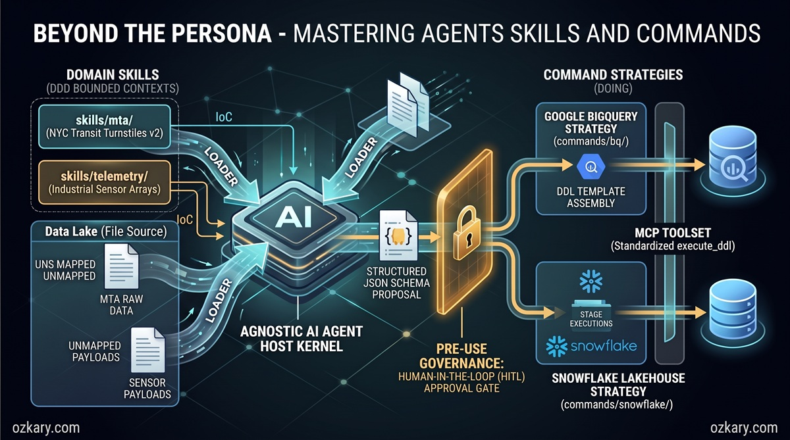
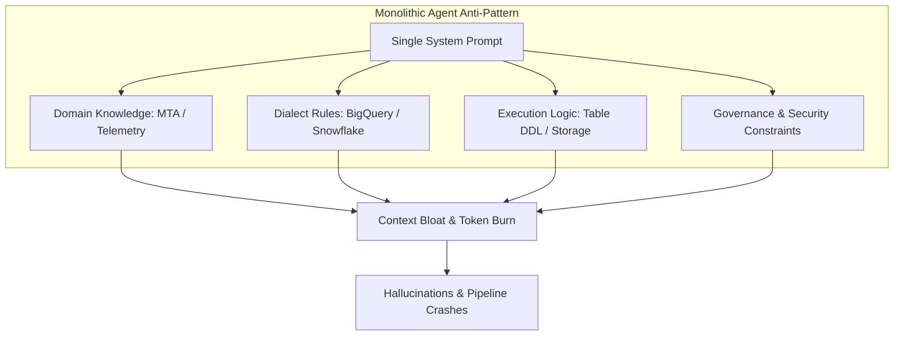
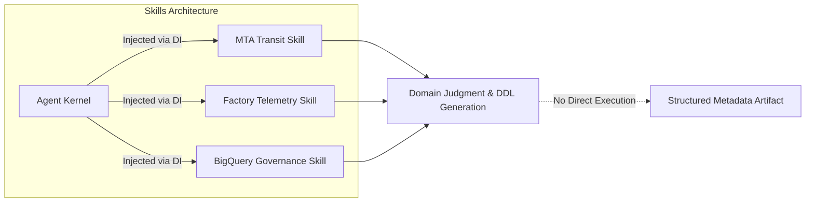
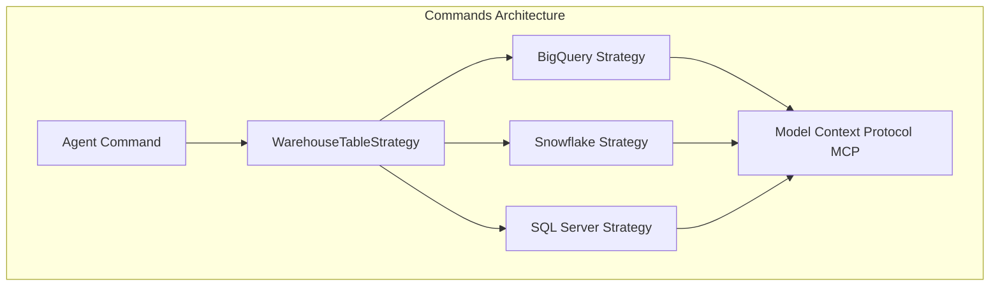
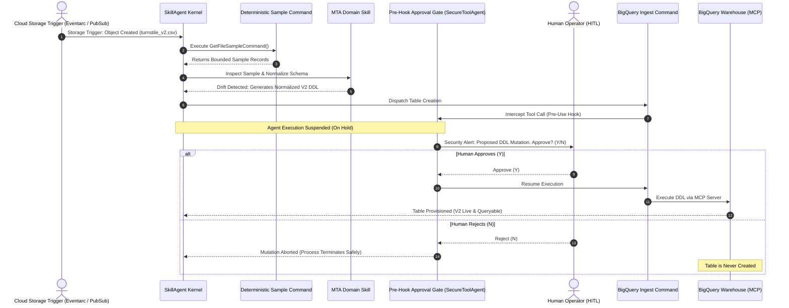

# Overview

Your agent's persona was never meant to carry your entire domain knowledge. As teams bring AI into real data engineering workflows—handling shifting ingestion feeds, inferring schemas, and standardizing lakehouse partitions—a single system instructions file quickly becomes a tangled mess of identity, procedure, and governance. It becomes difficult to maintain, costly to run, and impossible to trust in production pipelines.

The solution lies in classic software architecture principles: **skills teach an agent what it knows, while commands give it something it can do.** By decoupling domain judgment from deterministic execution, we build modular, testable, and cost-effective AI systems. A deterministic data pipeline command executes predictable steps automatically, invoking an AI skill only when genuine reasoning is required—such as when an unfamiliar payload arrives with an unmapped schema that threatens downstream tables.



In this post, we explore the architectural patterns behind modular agents, moving from an overburdened monolithic persona to a decoupled system that integrates human-in-the-loop security gates, Model Context Protocol (MCP) tools, and automated schema drift resolution.

## 🚀 Featured Open Source Projects
Explore these curated resources to level up your engineering skills. If you find them helpful, a ⭐️ is much appreciated!

### 🤖 [AI Agents (ADK)](https://github.com/ozkary/ai-engineering/tree/main/adk)
> **Focus:** LLM Patterns, Skills & Commands, and Agentic Workflows  
>  

### 🏗️ [Data Engineering](https://github.com/ozkary/data-engineering-mta-turnstile) 
> **Focus:** Real-world ETL & MTA Turnstile Data  
>  

### 📖 [Data Engineering Process Fundamentals](https://www.amazon.com/Data-Engineering-Process-Fundamentals-Hands/dp/B0CV7TPSNB)
> **Focus:** Architectural patterns, hands-on data pipelines, and MTA turnstile case studies  
> 

---
💡 **Contribute:** Found a bug or have a suggestion? Open an issue and be part of the open source project.

## 🔗 Related Repository: AI Engineering
Explore the full implementation of the skills, commands, and agent definitions used in this workflow:  
**[https://github.com/ozkary/ai-engineering/tree/main/adk](https://github.com/ozkary/ai-engineering/tree/main/adk)**

## YouTube Video

<iframe width="560" height="315" src="https://www.youtube.com/embed/o_En8fzuUvo" title="Beyond the Persona: Mastering Agent Skills and Commands" frameborder="0" allow="accelerometer; autoplay; clipboard-write; encrypted-media; gyroscope; picture-in-picture; web-share" referrerpolicy="strict-origin-when-cross-origin" allowfullscreen></iframe>

> 👍 Subscribe to the channel to get notified on new events!

## 📅 Agenda

- **The Monolith Agent — The Real-World Ingestion Problem:** Why cramming prompts, credentials, and business logic into a single persona leads to context bloat, token burn, and fragility.
- **Demystifying Agent Skills — Teaching Domain Judgment (What It Knows):** Encapsulating bounded domain knowledge into modular markdown specifications and injecting them dynamically.
- **Demystifying Agent Commands — Deterministic Execution (What It Does):** Eliminating hallucinations by replacing open-ended LLM generations with reusable, strategy-backed executable commands.
- **Managing Schema Drift — When Skills and Commands Collaborate:** Orchestrating an event-driven Zero-ETL data lakehouse pipeline that catches schema deviations and enforces human-in-the-loop guardrails.
- **Live Demonstration — From Schema Drift to Data Warehouse Provisioning:** A hands-on walkthrough using Google Antigravity, ADK CLI, and BigQuery to detect drift, draft DDL, and provision tables safely.
- **Key Takeaways & The Road Ahead:** Core principles for architecting enterprise-grade agents and scaling them across distributed data platforms.

---

## The Monolith Agent: The Anti-Pattern of Context Bloat

When engineers first build AI agents, the standard approach is straightforward: open a prompt file or system message configuration and draft a comprehensive persona. This single file frequently includes:
1. **Agent Identity:** Persona definition, voice, and conversational directives.
2. **Domain Business Logic:** Field definitions, schema contracts, validation rules, and business nuances.
3. **Target System Rules:** Naming conventions, SQL dialect specifics, partitioning strategies, and target warehouse instructions.
4. **Tool Definitions & Credentials:** Instructions on which APIs to invoke and how to format payloads.

While this works for simple prototypes, in an enterprise data pipeline it becomes a severe anti-pattern known as the **Monolithic Agent**.



### The Pitfalls of the Monolith
- **Context Bloat & Token Burn:** Every single interaction transmits the entire instruction set. If your agent is processing hundreds of file events, resending thousands of prompt tokens per run incurs massive latency and unnecessary cost.
- **Tight Vendor Coupling:** Hardcoding BigQuery, Snowflake, and SQL Server conventions into the same instructions creates cross-system contamination and makes switching platforms difficult.
- **Uncontrolled Hallucinations:** When an agent is asked to write and execute code end-to-end within an expansive prompt, field names drift, data types mutate unpredictably, and schema consistency collapses.
- **Violation of Established Software Principles:** Software engineering long ago adopted Single Responsibility (SRP), Separation of Concerns (SoC), and Domain-Driven Design (DDD). Building AI agents requires the exact same discipline.

To solve this, we decouple the agent into **Skills** (declarative knowledge) and **Commands** (deterministic actions).

---

## Demystifying Agent Skills: Teaching Domain Judgment (What It Knows)

A **Skill** represents domain expertise and semantic judgment. It answers the question: *What does the agent know?*

In practice, a skill is a structured specification (typically a modular Markdown manifest) that defines the rules, schema specifications, and analytical judgment required for a specific business domain.



### Core Characteristics of an Agent Skill
- **Single-Responsibility Boundaries:** A skill encapsulates one specific domain model (e.g., MTA subway transit feeds) or platform governance standard (e.g., BigQuery naming and partitioning standards).
- **Declarative Knowledge, Not Execution:** A skill never executes code, connects to databases, or alters infrastructure directly. It produces structured artifacts—such as an inferred schema, validation summary, or proposed Data Definition Language (DDL) statement.
- **Agnostic Dynamic Loading:** Rather than loading every skill simultaneously, the agent kernel remains lightweight. Using **Dependency Injection (DI)**, the runtime injects only the skills relevant to the active workflow.

```python
# Example: Injecting targeted skills into a lightweight SkillAgent
agent = SkillAgent(
    skills=[
        MtaTransitSkill(),        # Domain-specific schema & validation rules
        BigQueryGovernanceSkill() # Target warehouse conventions & partitioning rules
    ]
)
```

> [!NOTE]
> **Domain Skills vs. Platform Governance Skills:** A domain skill (like `MtaTransitSkill`) defines business entities, field requirements, and expected schema contracts. A platform governance skill (like `BigQueryGovernanceSkill`) defines engine-specific formatting standards—such as snake_case column conventions, timestamp parsing constraints, and lakehouse partitioning rules. Neither skill executes database queries; they purely supply the declarative rules the agent needs to synthesize compliant DDL.

By isolating domain and platform rules into distinct skills, teams can refine schema requirements and governance guidelines without modifying the underlying agent execution engine.

---

## Demystifying Agent Commands: Deterministic Execution (What It Does)

A **Command** represents deterministic execution. It answers the question: *What can the agent do?*

In production data engineering, data warehouse modifications, bucket operations, and network transactions must never be left to stochastic LLM text generation. If you ask an LLM to generate and run an `ALTER TABLE` statement directly five times, you risk getting five subtly different variations—or worse, a hallucinated column that breaks downstream dashboards.

Commands provide absolute predictability by wrapping operations in testable, deterministic code that implements the **Strategy Pattern**.



### Why Commands Matter
1. **Guaranteed Determinism:** The command implements fixed logic (e.g., `GetFileSampleCommand`, `CreateExternalTableCommand`). The LLM does not improvise the execution path.
2. **Strategy Pattern for Portability:** The agent interacts with an abstract `WarehouseTableStrategy`. Whether the target is BigQuery, Snowflake, or Databricks, the agent invokes the same interface while the underlying strategy handles engine-specific semantics.
3. **Integration with Model Context Protocol (MCP):** Commands communicate with target resources through standardized MCP servers, ensuring authentication, audit logging, and connection pooling are maintained centrally.
4. **Deterministic Routing via Configuration:** Decisions about which data warehouse receives which feed are governed by deterministic configuration files (e.g., `routing.yaml`), rather than probabilistic prompt suggestions:

```yaml
# routing.yaml: Deterministic ingestion targets
domains:
  mta_transit:
    target_warehouse: "bigquery"
    dataset: "transit_staging"
    strategy: "external_table_v2"
  factory_telemetry:
    target_warehouse: "snowflake"
    database: "iot_telemetry"
```

---

## Managing Schema Drift: When Skills and Commands Collaborate

To understand how skills and commands interact in production, consider a real-world scenario from the Metropolitan Transportation Authority (MTA) New York City transit turnstile data—the canonical dataset explored throughout my book, [*Data Engineering Process Fundamentals*](https://www.amazon.com/Data-Engineering-Process-Fundamentals-Hands/dp/B0CV7TPSNB).

### The Problem: Incoming Schema Drift
In a modern Zero-ETL lakehouse, raw transit feeds land in cloud storage buckets as CSV or Parquet files. BigQuery queries these files directly via **external tables**, avoiding heavy ETL ingestion jobs.

When a new file format arrives (Version 2) containing altered column names, restructured timestamps, or additional device counters, traditional automated pipelines fail catastrophically. Unmapped columns crash downstream queries, while naive auto-ingestion can pollute warehouse tables with broken types.



### Deterministic Inspection & Schema Normalization
A critical design requirement of this architecture is **deterministic inspection**:
- **Bounded Sampling, Not Full Payloads:** Passing massive multi-gigabyte raw files directly into an LLM prompt burns enormous tokens, risks context truncation, and introduces latency. Instead, the agent invokes a deterministic command (`GetFileSampleCommand`) to extract a bounded slice of records (the header plus the first several rows).
- **Domain-Driven Schema Normalization:** The raw sample is evaluated by the domain skill (`MtaTransitSkill`). The skill contains canonical schema rules, column mappings, and enterprise formatting conventions. When schema drift is detected, the skill does not simply panic or halt the pipeline. Instead, it **normalizes the new external table schema**—mapping renamed raw columns (`control_area`, `remote_unit`, `sub_device_id`) to standard types and generating a compliant DDL statement for BigQuery.
- **Continuous Ingestion Without Pipeline Interruption:** Because the skill normalizes the new format into a clean, parallel external table (`ext_mta_turnstile_v2`), the data lakehouse can consume the new feed immediately without breaking existing V1 analytics or crashing scheduled batch jobs.

### The Human-in-the-Loop (HITL) Gate
While the skill has the domain intelligence to normalize schemas, **autonomous AI must never possess unchecked authority to modify production database structures.**

To enforce security:
1. **Pre-Use Hooks Intercept Mutations:** When the agent attempts to run `CreateExternalTableCommand`, the command dispatches an MCP tool call. The `SecureToolAgent` layer evaluates this call against registered **Pre-Use Hooks**. Read-only queries pass freely, but state-mutating operations (DDL/DML) are intercepted before they ever reach the database server.
2. **Agent Put On Hold:** The pre-use hook suspends the agent's execution. The agent is placed on hold in a waiting state while a structured alert is surfaced to the human operator with the proposed DDL and target metadata.
3. **Approval (`yes`):** If the human verifies the DDL and approves, the hook unblocks execution. The command forwards the query through the BigQuery MCP tool, provisioning the new table seamlessly.
4. **Rejection (`no`):** If the human rejects the change or detects an anomaly, **the process halts immediately and the table is never created.** This fail-closed model guarantees that hallucinations, schema corruption, or unauthorized alterations cannot reach the analytical warehouse.

---

## Live Demonstration: From Schema Drift to Warehouse Provisioning

During the live session, we walked through this pattern using Google Antigravity and the Agent Development Kit (ADK) CLI, operating on the open-source repository.

### 1. The SkillAgent Implementation
The agent class inherits from `SecureToolAgent`, which equips it with standard MCP tool connectivity and security controls. We then inject domain skills and executable commands:

```python
class SkillAgent(SecureToolAgent):
    """
    Modular Agent demonstrating dynamic skill injection
    and deterministic command execution.
    """
    def __init__(self, skills=None, commands=None, routing_config="routing.yaml"):
        super().__init__()
        self.skills = skills or []
        self.commands = commands or []
        self.routing_config = load_routing(routing_config)

    def register_skill(self, skill):
        self.skills.append(skill)
        # Mounts domain specifications into agent knowledge boundary
        self.mount_knowledge(skill.get_manifest())

    def register_command(self, command):
        self.commands.append(command)
        # Binds executable tool signatures to the agent runtime
        self.bind_tool(command.get_tool_signature())
```

### 2. Simulating Schema Ingestion & The ADK CLI
To trigger the agent workflow, we invoke the **Agent Development Kit (ADK) CLI**:

```bash
adk agent run skill-agent \
  --event "storage.object.created" \
  --bucket "mta-turnstile-lake" \
  --path "feeds/v2/turnstile_2026_09.csv"
```

#### Understanding the ADK CLI Parameters
- **`skill-agent`**: The target agent profile to instantiate. The runtime configures the agent kernel and injects its specified skills (`MtaTransitSkill`, `BigQueryGovernanceSkill`) and commands (`GetFileSampleCommand`, `CreateExternalTableCommand`).
- **`--event "storage.object.created"`**: Specifies the incoming event type. This matches standard cloud lifecycle event definitions (e.g., Google Cloud Storage Object Finalize, AWS S3 `s3:ObjectCreated`, or Azure Event Grid).
- **`--bucket "mta-turnstile-lake"`**: The target storage bucket in the data lake where the raw payload arrived.
- **`--path "feeds/v2/turnstile_2026_09.csv"`**: The relative URI key of the newly dropped file.

> [!NOTE]
> **Production vs. Local Emulation:** In a live enterprise deployment, developers do not manually trigger terminal commands. Instead, automated cloud infrastructure listens for file drops: a Cloud Storage bucket event publishes to Google Cloud Pub/Sub or Eventarc, which invokes a serverless container (such as Google Cloud Run or a Cloud Function) running the ADK agent runtime. The CLI command faithfully replicates this exact production event-driven behavior for local testing, CI/CD verification, and interactive playbook orchestration with Google Antigravity.

#### Deterministic Inspection in Action
Upon receiving the event, the agent executes `GetFileSampleCommand`. Rather than streaming entire megabytes into the prompt, it fetches a bounded 5-row sample. The MTA domain skill evaluates the sample against known schemas, identifies the drift, and synthesizes a normalized DDL statement:

```text
[INFO] Executing: GetFileSampleCommand(uri="gs://mta-turnstile-lake/feeds/v2/turnstile_2026_09.csv")
[INFO] Sample loaded: 5 rows retrieved.
[WARN] Schema Drift Detected!
       Missing Baseline Columns: [C/A, UNIT, SCP]
       Detected V2 Columns:      [control_area, remote_unit, sub_device_id, net_entries, net_exits]
[INFO] Domain Skill generated BigQuery External Table DDL:
       CREATE OR REPLACE EXTERNAL TABLE `transit_staging.ext_mta_turnstile_v2`
       (
           control_area STRING,
           remote_unit STRING,
           sub_device_id STRING,
           event_timestamp TIMESTAMP,
           net_entries INT64,
           net_exits INT64
       )
       OPTIONS (
           format = 'CSV',
           uris = ['gs://mta-turnstile-lake/feeds/v2/*.csv'],
           skip_leading_rows = 1
       );
```

By normalizing the new external table schema to match lakehouse partitioning and naming conventions, the skill guarantees that the pipeline can consume the new file format without failing or interrupting existing workloads.

### 3. Human Approval (HITL) and Execution
Before mutating the data warehouse, the agent initiates table provisioning via `CreateExternalTableCommand`. However, because the agent inherits from `SecureToolAgent`, the tool call is intercepted by a **Pre-Use Hook**.

#### The Agent is Placed on Hold
The hook determines that creating or replacing an external table constitutes an infrastructure mutation requiring human authorization. The agent's execution is immediately **suspended (put on hold)**, and an interactive prompt is rendered:

```text
[SECURITY GATE] Action requires administrative authorization:
Mutation: Create BigQuery External Table 'ext_mta_turnstile_v2'
Do you approve the execution of this DDL? (yes/no): yes
```

#### Two Distinct Security Outcomes:
- **Approval Path (`yes`):** The operator reviews the proposed DDL and grants approval. The agent resumes execution, and the pre-use hook releases the intercepted command. The command invokes the BigQuery MCP tool, executes the DDL, and provisions `ext_mta_turnstile_v2`. A quick refresh of the BigQuery console confirms that the V2 table is live and queryable at wire speed.
- **Rejection Path (`no`):** If the operator detects an irregularity or rejects the change, the pre-use hook terminates the workflow immediately. The process ends, and **the table is never created.** This fail-closed architecture ensures that no unauthorized or broken schemas can ever compromise analytical pipelines.

### 4. Beyond the Demo: Multi-Version Coexistence & Skill Evolution
While the live demonstration successfully created the V2 external table, provisioning a new schema is not the end of the architectural story—it represents the beginning of an ongoing, production-grade data lifecycle:

#### Multi-Version Coexistence in Production
With `ext_mta_turnstile_v2` successfully deployed, the data warehouse operates in a live **multi-version coexistence** state. Downstream analytics, scheduled dashboards, and legacy ETL pipelines reading the original V1 table continue running without downtime. New applications and modernized reports can simultaneously begin querying the V2 schema. Over time, as data producers migrate and incoming V1 storage events cease, the legacy V1 external table can be gracefully deprecated and retired without risking breaking changes.

#### Continuous Evolution: The Inevitable Arrival of V3
Data feeds continuously evolve. Over time, an upstream vendor or sensor system might drop an unannounced Version 3 (`v3`) payload into the lakehouse. This arrival triggers the exact same event-driven loop:
1. The storage trigger detects `turnstile_2026_v3.csv`.
2. The agent executes `GetFileSampleCommand` to inspect the sample deterministically.
3. The domain skill attempts to normalize the schema and synthesize an external table DDL.

#### When Complex Drift Causes the Agent to Fail
Not all schema changes are simple column additions. In real-world enterprise environments, a V3 payload might introduce complex edge cases—such as deeply nested JSON structures, conflicting timestamp formats, or ambiguous domain concepts that defy existing heuristic rules.

In these scenarios, the LLM-driven skill may **fail to produce an acceptable or compliant schema proposal**. It might hallucinate a data type, mishandle a nested field, or violate lakehouse partitioning rules.

#### The HITL Gate as a Circuit Breaker for Skill Updates
This failure mode is precisely why the **Human-in-the-Loop (HITL) gate is indispensable**:
- **Execution Halted:** When the human operator inspects the proposed V3 DDL in the security prompt and recognizes that the schema proposal is flawed or unacceptable, they enter `no`.
- **Zero Impact on Production:** The pre-use hook aborts the operation immediately. The flawed table is never created, and the data warehouse remains protected.
- **Skill Evolution:** Rather than modifying the agent's core source code or hacking together manual database scripts, the engineering team updates the **domain skill manifest (`MtaTransitSkill`)**. By adding explicit domain heuristics, specifying parsing patterns for the new nested fields, or clarifying type conversion rules in the skill's Markdown specification, they close the knowledge gap.
- **Re-running with Enhanced Intelligence:** Once the skill is updated, re-running the agent enables it to correctly normalize the V3 schema, generate flawless DDL, pass the human inspection gate, and provision the new table cleanly.

> [!TIP]
> **Skills and Commands as First-Class SDLC Artifacts:** Creating new skills or updating existing skills and commands is not a sign of pipeline failure—it is the natural, expected lifecycle of an agentic data system. Treating skills as version-controlled specifications ensures that as data domains evolve, agent intelligence grows incrementally alongside the business.

---

## Key Takeaways & The Road Ahead

Refactoring from a monolithic agent to modular skills and commands bridges the gap between fragile AI experiments and reliable production data systems.

| Concept | Monolithic Agent | Decoupled Skills & Commands |
| :--- | :--- | :--- |
| **Domain Knowledge** | Crammed into one prompt | Modular Markdown manifests (Skills) |
| **Execution** | Stochastic LLM query generation | Reusable, strategy-backed classes (Commands) |
| **Token Cost** | High (full prompt on every call) | Low (load only active domain and tools) |
| **Portability** | Hardcoded to one database | Abstracted across engines (BigQuery, Snowflake) |
| **Safety & Governance** | Uncontrolled side-effects | Pre-Tool Hooks & Human-in-the-Loop gates |

### Guiding Principles for Your Next Agent
1. **Skills Define What the Agent Knows:** Keep them declarative. Use skills to codify domain heuristics, validation rules, and schema contracts.
2. **Commands Define What the Agent Does:** Keep them deterministic. Use proven design patterns (Strategy, Factory) and route execution through Model Context Protocol (MCP) tools.
3. **Keep the Kernel Agnostic:** Build a lightweight core engine and inject capabilities dynamically using Dependency Injection.
4. **Guard Critical Operations:** Never allow an autonomous agent to execute destructive DDL or DML without human review. Use pre-tool hooks to enforce governance.

By establishing these boundaries, data teams can confidently harness generative AI to handle real-world data entropy while keeping pipelines robust, secure, and predictable.

---

## 🌟 Let's Connect & Build Together
Thanks for reading! 😊 If you found these architectural patterns helpful, let's connect and continue the conversation:

* **[GDG Broward](https://gdg.community.dev/gdg-broward-county-fl/)**: Join our local dev community for workshops and live tech sessions.
* **[Global AI Events](https://globalai.community/chapters/jacksonville/)**: Connect with the community across global AI events.
* **[LinkedIn](https://www.linkedin.com/in/oscardgarcia)**: Follow along for regular deep dives into software architecture and AI engineering.
* **[GitHub](https://github.com/ozkary)**: Explore open-source projects, agents, and samples.
* **[YouTube](https://www.youtube.com/@ozkary)**: Watch recordings and step-by-step video tutorials.
* **[BlueSky](https://bsky.app/profile/ozkary.bsky.social)** / **[X / Twitter](https://x.com/ozkary)**: Daily tech updates and architectural tips.

👉 *Originally published at [ozkary.com](https://www.ozkary.com)*
