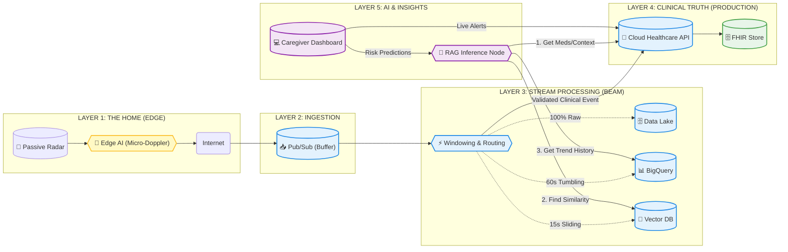

- The Healthcare API (Layer 4): This is your Medical API. It stores the patient's identity, medications, and clinical observations. It ensures that if the Wi-Fi drops or the analytics engine is slow, the "Current Medical Status" remains secure and HIPAA-compliant.

- The Triple-Fork (Layer 3): Your Apache Beam node is the brain of the traffic. It handles the Sliding Windows (15s/5s) for the Vector DB to ensure "Signature Continuity" while sending simpler Tumbling Windows (60s) to BigQuery for trend reporting.

- The RAG Node (Layer 5): This is where the magic happens. It queries the Medical API to understand who the patient is (e.g., "Post-op heart patient") and then uses the Vector DB to see if their current "Sliding Window" matches a known danger pattern.

# Presentation

# AI‑Native Data Pipelines: Using Vectors When SQL Isn’t Enough
### Community Session Slide Deck (Markdown Version)

---

# Slide 1 — Title Slide
## **AI‑Native Data Pipelines: Using Vectors When SQL Isn’t Enough**
**Subtitle:** Turning complex movement signals into vector‑powered insights  
**Speaker:** Óscar D. García  

_Image placeholder (right side):_  
`[Insert cover image here]`

---

# Slide 2 — From Sensor Signal to Data Lake
### **How raw movement becomes usable data**
We begin with a continuous stream of physical movement captured by a sensor.

**Talking points:**
- Movement is captured as a time‑based signal  
- Data is windowed into small segments  
- Each window is stored in the data lake for processing  
- No ML complexity — just raw signal capture  

_Image placeholder (right side):_  
`[Insert sensor → data lake diagram]`

---

# Slide 3 — Turning Movement Into a Vector
### **Creating a digital fingerprint of physical motion**
AI models convert each movement window into a **vector embedding**, a numeric fingerprint that represents the shape and behavior of the motion.

**Talking points:**
- AI models transform raw signals into vectors  
- Vectors represent similarity in a way SQL cannot  
- Each vector is a compact, searchable representation  
- This step bridges physical movement → machine understanding  

_Image placeholder (right side):_  
`[Insert “signal → vector” illustration]`

---

# Slide 4 — Why SQL Alone Can’t Classify Movement
### **Where SQL reaches its limits**
SQL is excellent for exact matches and structured comparisons — but not for similarity.

**Talking points:**
- SQL can filter, join, and aggregate  
- But SQL cannot answer “what does this *look like*?”  
- Movement patterns require similarity‑based comparison  
- Vectors fill the gap by enabling pattern recognition  

_Image placeholder (right side):_  
`[Insert SQL vs Vector comparison graphic]`

---

# Slide 5 — Vector Search for Classification
### **Using vectors to recognize movement patterns**
Vector databases allow us to compare a new movement fingerprint against known patterns.

**Talking points:**
- A new vector is compared to stored vectors  
- The closest match indicates the most similar movement  
- This enables fall‑like event detection  
- No complex ML modeling required — similarity does the work  

_Image placeholder (right side):_  
`[Insert vector search diagram]`

---

# Slide 6 — End‑to‑End Demo
### **Capture → Embed → Classify**
A simple, complete workflow showing how vectors unlock intelligence inside your data systems.

**Talking points:**
- Capture movement  
- Convert to vector embedding  
- Compare against known patterns  
- Determine if movement resembles a fall‑like event  
- All without deep ML knowledge  

_Image placeholder (right side):_  
`[Insert full pipeline diagram]`

---

# Slide 7 — Thank You
### **Let’s build AI‑native data systems together**
**Q&A + Discussion**

_Image placeholder (right side):_  
`[Insert closing image]`

