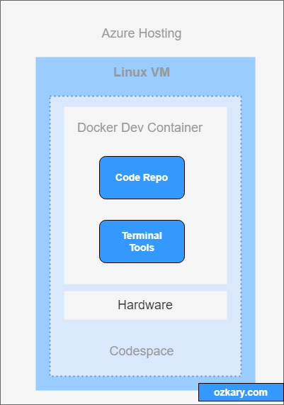

BLABLABLABLABLA
BLABLABLA.

### section

blablablablablabla

> 👍 blablabla

### Summary

blablabla

Thanks for reading.

Send question or comment at Twitter @ozkary
Originally published by [ozkary.com](https://www.ozkary.com)