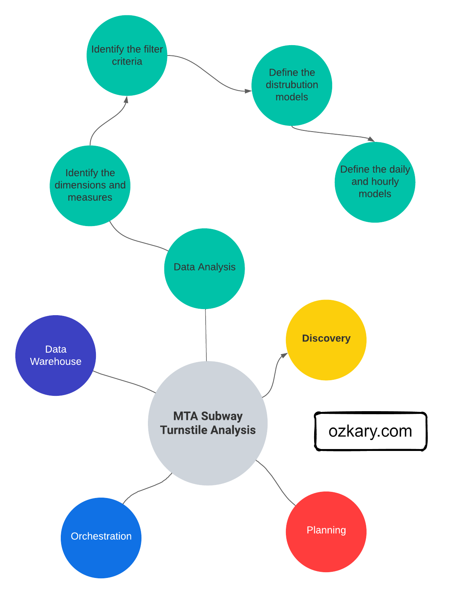
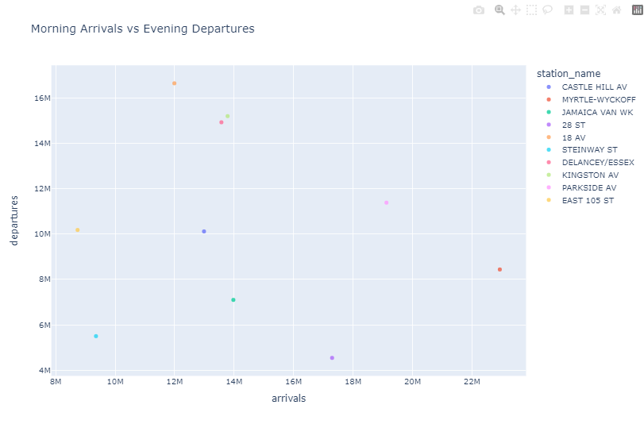

After completing our data warehouse design and implementation, our data pipeline should be fully operational.  We can move forward with the analysis and visualization step of our process. Data analysis entails exploring, comprehending, and reshaping data to yield insights, thereby enabling stakeholders to make informed business decisions. Conversely, data visualization employs these insights to adeptly convey information via visual elements, encompassing charts and dashboards.

> 👉 [Data Engineering Process Fundamentals - Data Warehouse and Transformation](https://www.ozkary.dev/data-engineering-process-fundamentals-data-warehouse-transformation/)

Data analysis entails utilizing guidelines and patterns to guide the selection of appropriate analyses tailored to the specific use case. For instance, a Business Analyst (BA) focuses on examining data summations and aggregations across categorical dimensions such as date or station name. Conversely, a Manufacturing Quality Engineer (MQE) prioritizes the examination of statistical data, encompassing metrics like the mean and standard deviation.

In data visualization, we follow guidelines and design patterns to determine the appropriate chart for our data. For instance, a Business Intelligence (BI) dashboard may employ bar and pie charts to monitor sales performance in specific regions, while a Quality Control (QA) dashboard might utilize box plots, bell curves, and control charts to assess manufacturing process quality.

Data analysis and visualization are fundamental to a data-driven decision-making process. To grasp the best strategy for our scenario, we now dive deeper into this process by using a sample dataset from our data warehouse to illustrate the approach with examples.



## Data Analysis

Data analysis is the practice of exploring data and understanding its meaning. It involves activities that can help us achieve a specific goal, such as identifying data dimensions and measures, as well as data analysis to identify outliers, trends, distributions, and hypothesis testing. We can accomplish these activities by writing code snippets using Python and Pandas, Visual Studio Code or Jupyter Notebooks. What's more, we can use libraries, such as Plotly, to generate some visuals to further analyze data and create prototypes.

For low-code tools, the analysis can be done using a smart and rich user interface that automatically discovers the meta-data to identify the dataset properties like dimensions and measures. With little to no-code, those tools can help us model the data, create charts and dashboards.

### Data Profiling

Data profiling is the process to identify the data types, dimensions, measures, and quantitative values, which allows the analyst to understand the characteristics of the data, so we can understand how to group the information. 

- Data Types: This is the type classification of the data fields. It enables us to identify categorical (text), numeric and date-time values. The date-time data type is specially important as it provides us with the ability to slice the numeric values with a date range, specific dates and times (e.g., hourly)
  
- Dimensions: Dimensions are textual, and categorical attributes that describe business entities. They are often discrete and used for grouping, filtering, and organizing data

- Measures: Measures are the quantitative values that are subject to calculations such as sum, average, minimum, maximum, etc. They represent the KPIs that the organization wants to track and analyze

As an example of data profiling, we can inspect the average of arrivals and departures at certain time slots. This can help us identify patterns at different times.

> 👉 <a href="https://github.com/ozkary/data-engineering-mta-turnstile/tree/main/Step5-Analysis" target="_repo">Clone this repo</a> or copy the files from this folder. Use Jupyter Notebook file.

```python

import pandas as pd

# use the sample dataset in this path Step5-Analysis/analysis_data.csv
df = pd.read_csv('./analysis_data.csv', iterator=False)
df.head(10)

# Define time (hr) slots
time_slots = {
    'morning': (8, 11),
    'afternoon': (12, 15),
    'night': (16, 20)
}
# cast the date column to datetime
df["created_dt"] = pd.to_datetime(df['created_dt'])
df["exits"] = df["exits"].astype(int)
df["entries"] = df["entries"].astype(int)

# Calculate average arrivals (exits) and departures (entries) for each time slot
for slot, (start_hour, end_hour) in time_slots.items():
    slot_data = df[(df['created_dt'].dt.hour >= start_hour) & (df['created_dt'].dt.hour < end_hour)]
    avg_arrivals = slot_data['exits'].mean()
    avg_departures = slot_data['entries'].mean()
    print(f"{slot.capitalize()} - Avg Arrivals: {avg_arrivals:.2f}, Avg Departures: {avg_departures:.2f}")

# output
Morning - Avg Arrivals: 30132528.64, Avg Departures: 37834954.08
Afternoon - Avg Arrivals: 30094161.08, Avg Departures: 37482421.78
Night - Avg Arrivals: 29513309.25, Avg Departures: 36829260.66
```

The code calculates the average arrivals and departures for each time slot. It prints out the results for each time slot, helping us identify the patterns of commuter activity during different times of the day.

### Data Cleaning and Preprocessing

Data cleaning and preprocessing is the process of finding bad data and outliers that can affect the results. Bad data could be null values or values that are not within the range of the average trend for that day. These kinds of data problems should have been identified during the data load process, but it is always a best practice to repeat this process, even when the data comes from a trusted resource.

> 👍Outliers are values that are notably different from the other data points in terms of magnitude or distribution. They can be either unusually high (positive outliers) or unusually low (negative outliers) in comparison to the majority of data points.

For example, we might want to look at stations where the average number of arrivals in the morning differs unusually from the average number of departures in the evening. A normal pattern is that both should be within the threshold value.

```python
# get the departures and arrivals for each station at the morning and night time slots
df_morning_arrivals =  df[(df['created_dt'].dt.hour >= time_slots['morning'][0]) & (df['created_dt'].dt.hour < time_slots['morning'][1])]
df_night_departures = df[(df['created_dt'].dt.hour >= time_slots['night'][0] ) & (df['created_dt'].dt.hour < time_slots['night'][1])]
# Calculate the mean arrivals and departures for each station
mean_arrivals_by_station = df_morning_arrivals.groupby('station_name')['exits'].mean()
mean_departures_by_station = df_night_departures.groupby('station_name')['entries'].mean()

# Calculate the z-scores for the differences between mean arrivals and departures
z_scores = (mean_arrivals_by_station - mean_departures_by_station) / np.sqrt(mean_arrivals_by_station.var() + mean_departures_by_station.var())

# Set a z-score threshold to identify outliers
z_score_threshold = 1.95  # You can adjust this value based on your needs

# Identify stations with outliers
outlier_stations = z_scores[abs(z_scores) > z_score_threshold]

print("Stations with outliers:")
print(outlier_stations)

# output
Stations with outliers:
station_name
183 ST          -3.170777
BAYCHESTER AV   -4.340479
JACKSON AV      -4.215668
NEW LOTS         3.124990
```

The output shows that there is a significant difference in the number of arrivals (morning) at these stations compared to departures later in the evening. This issue could be a result of some missing data or perhaps an event that caused the difference in commuters.

### Statistical Analysis

Statistical analysis focuses on applying statistical techniques in order to draw meaningful conclusions about a set of data. It involves mathematical computations, probability theory, correlation analysis, and hypothesis testing to make inferences and predictions based on the data. 

An example of statistical analysis is to describe the statistics for the numeric data and plot the relationships between two measures.

```python
# Summary statistics
measures = ['entries','exits']
dims = ['station_name']

# Filter rows for the month of July for morning and night time slots
df_morning_july = df_morning_arrivals[df_morning_arrivals['created_dt'].dt.month == 7][measures + dims]
df_night_july = df_night_departures[df_night_departures['created_dt'].dt.month == 7][measures + dims]

correlation_data = []
for station in df_morning_july['station_name'].unique():
    morning_arrival = df_morning_july[df_morning_july['station_name'] == station]['exits'].values[0]
    evening_departure = df_night_july[df_night_july['station_name'] == station]['entries'].values[0]
    correlation_data.append({'station_name': station, 'arrivals': morning_arrival, 'departures': evening_departure})

df_correlation = pd.DataFrame(correlation_data)

# Select top 10 stations with most morning arrivals
top_stations = df_correlation.groupby('station_name')['arrivals'].sum().nlargest(10).index
df_top_stations = df_correlation[df_correlation['station_name'].isin(top_stations)]

print("Summary Statistics:")
print(df_top_stations[measures].describe() / 10000)

#output
Summary Statistics:
             entries          exits
count      10.000000      10.000000
mean     3691.269728    2954.513148
std     20853.999335   18283.964419
min         0.000000       0.000000
25%        27.126200      19.537525
50%       135.898650     100.470600
75%       615.586650     445.015200
max    214717.057100  212147.622600


# Create a scatter matrix to visualize relationships between numeric columns
fig_scatter = plotly_x.scatter(df_top_stations, x='arrivals', y='departures', color='station_name',
                         title='Morning Arrivals vs Evening Departures')
fig_scatter.show()
```

- `df_top_stations.describe()` provides summary statistics for the numerical columns
- `plotly_x.scatter()` creates scatter plots to visualize relationships between numerical columns



These statistics can help us identify trends, correlations, and relationships in our data, allowing us to gain insights and make informed decisions about further analysis or modeling.

> 👍 Data correlation refers to the degree to which two or more variables change together. It indicates the strength and direction of the linear relationship between variables. The correlation coefficient is a value between -1 and 1. A 1 indicates a strong positive correlation, while a value close to -1 indicates a strong negative correlation. A correlation coefficient near 0 suggests a weak or no linear relationship between the variables.

#### Hypothesis Testing 

In hypothesis testing, we use statistical methods to validate assumptions and draw conclusions. On the previous scatter chart, we can see that there appears to **not be** a strong correlation between arrivals and departures for the top 10 stations with most arrivals. This fact could be an area of interest for the analysis, and we may want to take a deeper look by running a test.


```python
# Perform Pearson correlation test
def test_arrival_departure_correlation(df: pd.DataFrame, label: str) -> None:
   corr_coefficient, p_value = pearsonr(df['arrivals'], df['departures'])   
   p_value = round(p_value, 5)
   
   if p_value < 0.05:
      conclusion = f"The correlation {label} is statistically significant."
   else:
      conclusion = f"The correlation {label} is not statistically significant."
      
   print(f"Pearson Correlation {label} - Coefficient : {corr_coefficient} P-Value : {p_value}")    
   print(f"Conclusion: {conclusion}")

test_arrival_departure_correlation(df_top_stations, 'top-10 stations')
test_arrival_departure_correlation(df_correlation, 'all stations')

# output
Pearson Correlation top-10 stations - Coefficient : -0.14112 P-Value : 0.69738
Conclusion: The correlation top-10 stations is not statistically significant.
Pearson Correlation all stations - Coefficient : 0.73803 P-Value : 0.0
Conclusion: The correlation all stations is statistically significant.
```

Let's take a look at the output and explain what is going on. A correlation coefficient of -0.14 suggests a weak negative correlation between the variables being analyzed. The p-value of 0.69 is relatively high, which suggests that there is no real correlation between morning arrivals and night departures for the top stations. This means that the high number of arrivals in that morning is not reflecting a correlation of departures in the evening.

If we compare the entire data frame with all the stations, we can see a correlation .73 (close to 1) and a p-value of 0 which indicates that there is a statistically significant correlation for the entire dataset, which means that other stations had an increase in departures compared to its arrivals. By looking at the entire data sample, we can see there is in fact a correlation, and the increase in arrivals directly impacts departures later in the day.

### Business Intelligence and Reporting

Business intelligence (BI) is a strategic approach that involves the collection, analysis, and presentation of data to facilitate informed decision-making within an organization. In the context of business analytics, BI is a powerful tool for extracting meaningful insights from data and turning them into actionable strategies. 

A Business Analyst (BA) uses a systematic approach to uncover valuable insights from data. As example, by calculating the total number of passengers for arrivals and departures, we gain a comprehensive understanding of passenger flow dynamics. Furthermore, we can employ distribution analysis to investigate variations across stations, days of the week, and time slots. These analyses provide essential insights for business strategy and decision-making, allowing us to identify peak travel periods, station preferences, and time-specific trends that directly influence business operations.

```python
# Calculate total passengers for arrivals and departures
total_arrivals = df['exits'].sum() 
total_departures = df['entries'].sum() 

print(f"Total Arrivals: {total_arrivals} Total Departures: {total_departures}")

# output
Total Arrivals: 2954513147693 Total Departures: 3691269727684

# Create distribution analysis by station
df_by_station = df.groupby(["station_name"], as_index=False)[measures].sum()
print(df_by_station.head(5))

#output
 station_name      entries        exits
0         1 AV  41921835330   4723874242
1       103 ST   1701063755   1505114656
2       104 ST  60735889120  35317207533
3       111 ST   1856383672    840818137
4       116 ST   7419106031   8292936323
  
# Create distribution analysis by day of the week
df_by_date = df.groupby(["created_dt"], as_index=False)[measures].sum()
day_order = ['Sun', 'Mon', 'Tue', 'Wed', 'Thu', 'Fri', 'Sat']
df_by_date["weekday"] = pd.Categorical(df_by_date["created_dt"].dt.strftime('%a'), categories=day_order, ordered=True)
df_entries_by_date =  df_by_date.groupby(["weekday"], as_index=False)[measures].sum()
print(df_entries_by_date.head(5))

# output
weekday       entries         exits
0     Sun   83869272617   53997290047
1     Mon  839105447014  667971771875
2     Tue  723988041023  592238758942
3     Wed  728728461351  594670413050
4     Thu   80966812864   51232966458

# Create distribution analysis time slots
for slot, (start_hour, end_hour) in time_slots.items():
    slot_data = df[(df['created_dt'].dt.hour >= start_hour) & (df['created_dt'].dt.hour <= end_hour)]
    arrivals = slot_data['exits'].sum()
    departures = slot_data['entries'].sum()
    print(f"{slot.capitalize()} - Arrivals: {arrivals:.2f}, Departures: {departures:.2f}")
# output
Morning - Arrivals: 494601773970.00, Departures: 619832037915.00
Afternoon - Arrivals: 493029769709.00, Departures: 615375337214.00
Night - Arrivals: 814729184132.00, Departures: 1008230417627.00
```

BI analysis is important in helping us understand the data, which can then be communicated to stakeholders so that we can make decisions based on which information is more relevant to the organization.

## Data Visualization

Data visualization is a powerful tool that takes the insights derived from data analysis and presents them in a visual format. While tables with numbers on a report provide raw information, visualizations allow us to grasp complex relationships and trends at a glance. Dashboards, in particular, bring together various visual components like charts, graphs, and scorecards into a unified interface.

Imagine a scenario where we have analyzed passenger data using Python and determined that certain stations experience higher passenger volumes during specific times of the day. Translating this into a dashboard, we can use donut graphs to show the distribution of passenger counts on stations, bar graphs to visualize passenger trends over different times of the day, and scorecards to highlight key metrics like total passengers.

Such a dashboard offers a comprehensive view of the data, enabling quick comparisons, trend identification, and actionable insights. Instead of sifting through numbers, stakeholders can directly observe the patterns, correlations, and anomalies, leading to informed decision-making. This visualization approach enhances communication, collaboration, and comprehension among teams, making it an essential tool for data-driven organizations.

### Types of Data Visualizations

There are a few terms that are used interchangeably when it comes to data visualization, but in reality there are subtle differences and specific uses between the terms. Let's review them in more details.

- Chart: A chart is a visual representation that displays data points, trends, and patterns. It uses graphical elements such as bars, lines, or pie charts to depict data relationships. Charts are focused on illustrating specific data comparisons or distributions, making it easier for viewers to understand data at a glance. 

- Graph: A graph is a broader term that encompasses both charts and diagrams. It's used to represent data visually and can include a variety of visual elements, including nodes, edges, bars, lines, and more. Graphs are often used to showcase relationships and connections among various data points, allowing viewers to understand complex structures or networks

- Report: A report is a structured document that provides a comprehensive overview of data analysis, findings, and insights. It typically includes a mix of textual explanations, tables, charts, and graphs. Reports are designed to convey detailed information and can be several pages long. They often include an executive summary, methodology, results, and recommendations

- Dashboard: A dashboard is a visual display of key performance indicators (KPIs) and metrics that offers a real-time snapshot of business data. Dashboards consolidate multiple visual elements like charts, graphs, gauges, and tables onto a single screen. They are interactive and customizable, allowing users to monitor trends, and identify anomalies. Dashboards provide a quick and holistic view of business performance

In summary, a chart is a specific type of visual representation focusing on data points, a graph represents broader data relationships, a report is a structured document presenting detailed analysis, and a dashboard is an interactive screen displaying real-time KPIs and metrics. Each serves a unique purpose in effectively communicating information to different types of audiences.

### Dashboard Design Principles

Designing effective dashboards requires attention to several key principles to ensure clarity, usability, and the ability to convey insights. Here's a short list of essential Dashboard Design Principles:

- User-Centered Design: Understand our audience and their needs. Design the dashboard to provide relevant and actionable information to specific user roles, executives only want to see the big picture not details

- Clarity and Simplicity: Keep the design clean and uncluttered. Use a simple layout, meaningful titles, and avoid unnecessary decorations 

- Consistency: Maintain a consistent design across all dashboard components. Use the same color schemes, fonts, and visual styles to create a cohesive experience

- Master Filter: Include a master filter that allows users to select a date range, segment, or other criteria. This synchronizes data across all components, ensuring a unified view

- Data Context and Relationships: Clearly label components and provide context to explain data relationships. Help users understand the significance of each element

- Whitespace: Use whitespace effectively to separate components and enhance readability. Proper spacing reduces visual clutter

- Real-Time Updates: If applicable, ensure that the dashboard provides real-time or near-real-time data updates for accurate decision-making

- Mobile Responsiveness: Design the dashboard to be responsive across various devices and screen sizes, ensuring usability on both desktop and mobile

- Testing and Iteration: Test the dashboard with actual users and gather feedback. Iterate on the design based on user insights and preferences

Effective dashboard design not only delivers data but also tells a story. It guides users through insights, highlights trends, and supports data-driven decision-making. Applying these principles will help create dashboards that are intuitive, informative, and impactful.

### Data Visualization Tools

The data visualization tools can be divided into code-centric and low-code solutions. A code-centric solution involves writing programs to manage the data analysis and visuals. A low-code solution uses cloud-hosted tools that accelerate the data analysis and visualization. Instead of focusing on code, a low-code tool enables data professionals to focus on the data. Let's review some of these tools in more detail:

- Python, coupled with libraries like Plotly, offers a versatile platform for data visualization that comes with its own set of advantages and limitations. This code-centric approach enables data professionals to integrate data analysis and visualization seamlessly, and they are particularly suited for individual research, in-depth analysis, and presentations in a controlled setting
  
- [Looker Studio](https://lookerstudio.google.com/) is a powerful low-code, cloud-hosted business intelligence and data visualization platform that empowers organizations to explore, analyze, and share insights from their data. It offers a user-friendly interface that allows users to create interactive reports, dashboards, and visualizations  
- [Microsoft Power BI](https://powerbi.microsoft.com/) is a widely-used low-code, cloud-hosted data visualization and business intelligence tool. It seamlessly integrates with other Microsoft tools and services, making it a popular choice for organizations already in the Microsoft ecosystem. Power BI offers an intuitive drag-and-drop interface for building interactive reports and dashboards. Its extensive library of visuals and custom visuals allows users to create compelling data representations
- [Tableau](https://www.tableau.com/), acquired by Salesforce, is renowned for its cloud-hosted and low-code data visualization capabilities. It provides users with an array of options for creating dynamic and interactive visuals. Tableau's "drag-and-drop" approach simplifies the process of connecting to various data sources and creating insightful dashboards.

Each of these tools offers unique features and benefits, catering to different user preferences and organizational needs. Whether it's Looker's focus on data modeling, Power BI's integration with Microsoft products, or Tableau's flexibility and advanced analytics capabilities, these tools play a significant role in empowering users to unlock insights from their data.

## Summary

Data analysis involves meticulous exploration, transformation, and comprehension of raw data to identify meaningful insights. There are guidelines and design patterns to follow for each specific use case. A BA might focus on KPIs, while a QAE might focus on statistical analysis of process quality. These insights, however, find their true value through data visualization. A code-centric approach with Python, aided by Plotly, offers potent tools for crafting analyses and visuals, but a low-code cloud hosted solution is often the solution for broader sharing and enterprise solutions. 

In conclusion, the synergy between data analysis and visualization is pivotal for data-driven projects. Navigating data analysis with established principles and communicating insights through visually engaging dashboards empowers us to extract value from data. Whether opting for code-centric or low-code solutions, the choice of tooling and platform hinges on the balance between team expertise and target audience.

## Exercise - Data Analysis and Visualization

With a better understanding of the data analysis and visualization process, let's take the next step and put these concepts into action through a hands-on exercise. In this lab, we'll seamlessly continue our data engineering journey by crafting a dashboard that flawlessly fulfills the requirements defined in the discovery phase.