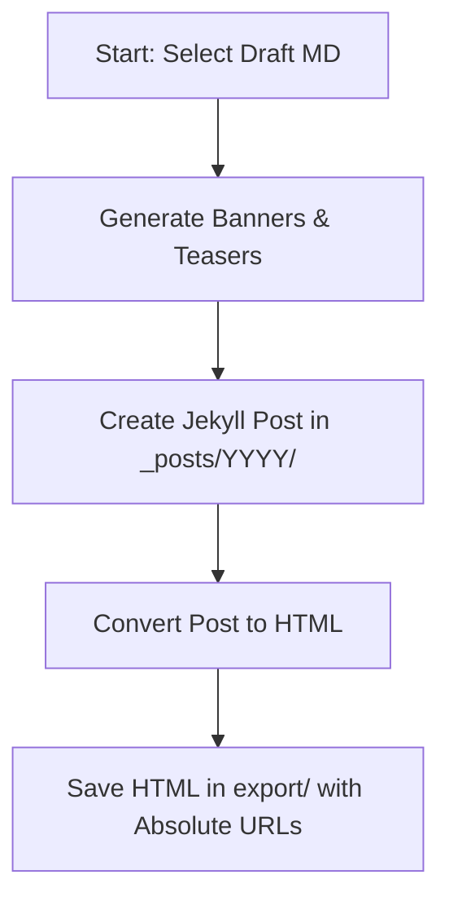

# Specification: Draft to Blog Post & HTML Export Process

This specification details the standardized workflow for transforming draft markdown files from the `_posts/drafts/` directory into published blog posts inside `_posts/` and clean HTML files in the `export/` directory.

---

## Workflow Overview



---

## Phase 1: Draft Selection & Preparation

1. **Locate Draft:** Locate the target draft file in the `_posts/drafts/` directory.
2. **Analyze Content:** Read the abstract, title, and key technical sections to synthesize the following metadata:
   - **Post Title:** Capitalized, search-optimized title.
   - **Post Excerpt:** A concise summary (150–250 words) focusing on the core problem and solution.
   - **Target Date:** The designated publication date (in `YYYY-MM-DD` format).
   - **Target Tags:** Relevant technical keywords (e.g., `code`, `cloud`, `ai`, `data`).
3. **Use the transcript section** to build a post the describes the main points of the presentation
   - This section provides information from the video reference.
   - It is segmented to follow the video agenda
   - Create sections for each agenda content

4. Always use the presentation/draft title for the post file name and title.


---

## Phase 2: Graphic Asset Creation

Every blog post requires two visual assets stored in `assets/YYYY/`:
1. **Standard Banner:** Aspect ratio `16:9` (Medium/Landscape). Name: `ozkary-<title-slug>.png`.
2. **Teaser Image:** Aspect ratio `1:1` (Small/Square). Name: `ozkary-<title-slug>-sm.png`.

### Asset Generation Guidelines
- Use generative styling that matches a modern, dark-mode, premium engineering aesthetic.
- Avoid text overlays, human faces, or noisy diagrams.
- Reference the Standard Banner when generating the Teaser (1:1 crop/zoom) to ensure color/style consistency.

---

## Phase 3: Creating the Published Blog Post

1. **Target File Name:** Save the post in `_posts/YYYY/` using the format:
   ```
   _posts/YYYY/YYYY-MM-DD-<title-slug>.md
   ```
2. **Front Matter Structure:** Populate the Jekyll front matter exactly as shown below:
   ```yaml
   ---
   title: "Complete Title of Post"
   excerpt: "Compelling summary of the post for search engine snippets and lists."
   last_modified_at: YYYY-MM-DDT13:00:00
   header:
     teaser: "../assets/YYYY/ozkary-<title-slug>-sm.png"
     teaserAlt: "Complete Title of Post"
   tags: 
     - code  
     - cloud
     - ai
   toc: true
   ---
   ```
3. **Overview Image Integration:** Under the `# Overview` heading, embed the standard 16:9 banner:
   ```markdown
   
   ```

---

## Phase 4: HTML Export Conversion

Export a clean HTML version of the article for syndication or static delivery:

1. **Content Scope:** Extract and convert content **exclusively** starting from the `# Overview` section. Omit Jekyll front matter.
2. **Image Path Replacement:** Search for relative image references (`../../`) and replace them with absolute URLs pointing to `https://www.ozkary.dev/`:
   - *Example:* `../../assets/2026/image.png` -> `https://www.ozkary.dev/assets/2026/image.png`
3. **Formatting Mapping:**
   - `# Overview` -> `<h1>Overview</h1>`
   - `## Section` -> `<h2>Section</h2>`
   - Bold text (`**text**`) -> `<strong>text</strong>`
   - Code blocks (` ``` `) -> `<pre><code>...</code></pre>`
   - Markdown Tables -> standard HTML `<table>` structures.
4. **Target Location:** Save the resulting file in the `export/` folder at the root:
   ```
   export/<title-slug>.html
   ```
