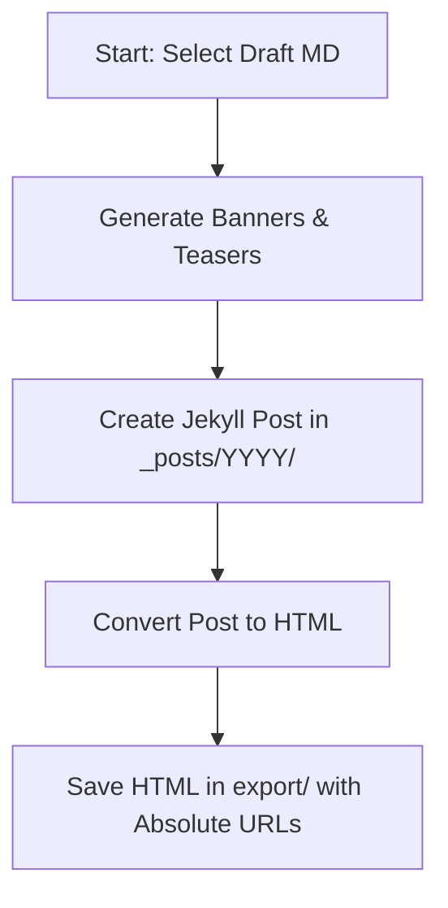

# Specification: Draft to Blog Post & HTML Export Process

This specification details the standardized workflow for transforming draft markdown files from the `_posts/drafts/` directory into published blog posts inside `_posts/` and clean HTML files in the `export/` directory.

---

## Workflow Overview


```mermaid
graph TD
    A[Start: Select Draft MD] --> B[Generate Banners & Teasers]
    B --> C[Create Jekyll Post in _posts/YYYY/]
    C --> D[Convert Post to HTML]
    D --> E[Save HTML in export/ with Absolute URLs]
```

---

## Phase 1: Source Materials & Preparation Pattern

When generating a published blog post from an event or presentation, we follow the established pattern combining three primary sources:

1. **Event Announcement / Agenda (`_events/YYYY/YYYY-MM-DD-<slug>.md`):**
   - Provides the foundational metadata: title, excerpt, date, featured tags, and YouTube embed/link.
   - Defines the structured **Agenda** that guides the top-level section headings of the post.

2. **Video Transcript (`_drafts/transcripts/<slug>.md`):**
   - Captures the actual spoken narrative, explanations, architectural decisions, and live demonstration dialogue.
   - Use the transcript to extract deep technical context, specific design patterns discussed, and the step-by-step flow of the demo.

3. **Presentation Slides (e.g., Google Slides):**
   - Establishes the visual and logical progression of topics and diagrams.
   - Aligns the post flow with the slide narrative so the written article closely mirrors what was presented live.

4. **Synthesize Metadata & Post Scope:**
   - **Target Date:** The designated post date (in `YYYY-MM-DD` format) **must match the `event_date`** defined in the front matter of the event post (e.g., if `event_date: 2026-09-30 ...`, the post date is `2026-09-30`).
   - **Post Title & File Name:** Always align the post title and file name with the presentation/event title (`YYYY-MM-DD-<title-slug>.md`), where `YYYY-MM-DD` uses the `event_date`.
   - **Post Excerpt:** A concise summary (150–250 words) focusing on the core engineering challenge and solution.
   - **Target Tags:** Relevant technical keywords (e.g., `code`, `cloud`, `ai`, `data`, `python`, `architecture`).
   - **Section Alignment:** Follow the event agenda, transcript narrative, and slide flow to build dedicated sections for each agenda topic.

---

## Phase 2: Graphic Asset Creation

Every blog post requires two visual assets stored in `assets/YYYY/`:
1. **Standard Banner:** Aspect ratio `16:9` (Medium/Landscape). Name: `ozkary-<title-slug>.png`.
2. **Teaser Image:** Aspect ratio `1:1` (Small/Square). Name: `ozkary-<title-slug>-sm.png`.

### Asset Generation Guidelines
- Use generative styling that matches a modern, dark-mode, premium engineering aesthetic.
- Avoid text overlays, human faces, or noisy diagrams.
- Reference the Standard Banner when generating the Teaser (1:1 crop/zoom) to ensure color/style consistency.

---

## Phase 3: Creating the Published Blog Post

1. **Target File Name:** Save the post in `_posts/YYYY/` using the format:
   ```
   _posts/YYYY/YYYY-MM-DD-<title-slug>.md
   ```
   The `YYYY-MM-DD` prefix must match the `event_date` from the event post.
2. **Front Matter Structure:** Populate the Jekyll front matter exactly as shown below:
   ```yaml
   ---
   title: "Complete Title of Post"
   excerpt: "Compelling summary of the post for search engine snippets and lists."
   last_modified_at: YYYY-MM-DDT13:00:00
   header:
     teaser: "../assets/YYYY/ozkary-<title-slug>-sm.png"
     teaserAlt: "Complete Title of Post"
   tags: 
     - code  
     - cloud
     - ai
   toc: true
   canonical_url: "https://ozkary.com/<title>"
   video_id: ""
   repo_url: ""
   ---
   ```
3. **Overview Image Integration:** Under the `# Overview` heading, embed the standard 16:9 banner:
   ```markdown
   
   ```

---

## Phase 4: HTML Export Conversion

Export a clean HTML version of the article for syndication or static delivery:

1. **Content Scope:** Extract and convert content **exclusively** starting from the `# Overview` section. Omit Jekyll front matter.
2. **Image Path Replacement:** Search for relative image references (`../../`) and replace them with absolute URLs pointing to `https://www.ozkary.dev/`:
   - *Example:* `../../assets/2026/image.png` -> `https://www.ozkary.dev/assets/2026/image.png`
3. **Formatting Mapping:**
   - `# Overview` -> `<h1>Overview</h1>`
   - `## Section` -> `<h2>Section</h2>`
   - Bold text (`**text**`) -> `<strong>text</strong>`
   - Code blocks (` ``` `) -> `<pre><code>...</code></pre>`
   - Markdown Tables -> standard HTML `<table>` structures.
4. **Target Location:** Save the resulting file in the `export/` folder at the root:
   ```
   export/<title-slug>.html
   ```

## Validate common errors on the HTML

- This markdown `- **ALLOW:**` should be a `<li> <strong>ALLOW:</strong>`
- The .jfif files are images. Use the `` tag 

## Phase 5: Email Communication

We share the new post with the community using an email template and the content of this presentation.
- Use the email/template.md file for the format
  - Replace the tags {EXAMPLE} with the post content like title, brief overview, post summary. video information, github repo
- For the link use the www.ozkary.com/YYYY/MM/{POST-HTML}.html with the extension
  -  Use the year and month of the post
- Use the youtube video link
- For the source code, use the relevant GitHub repository URL (e.g. `https://github.com/ozkary/<repo-name>`).